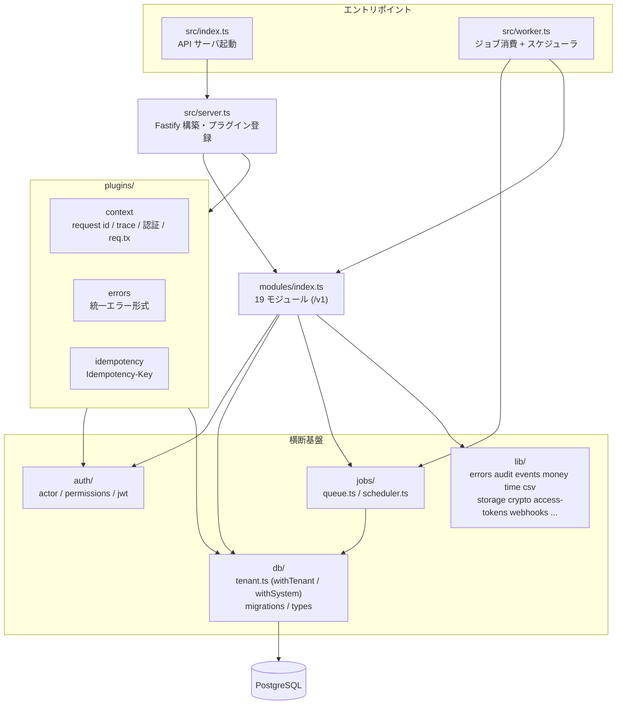
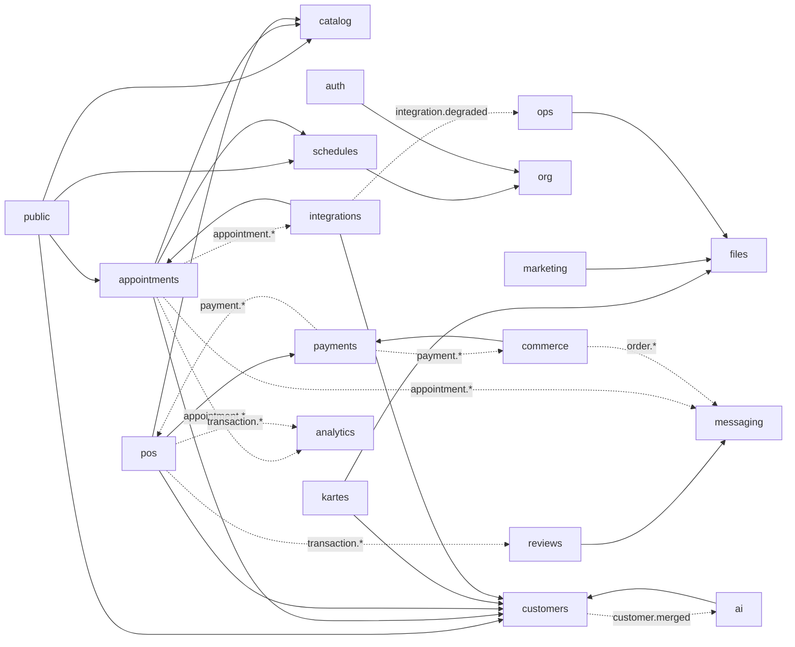
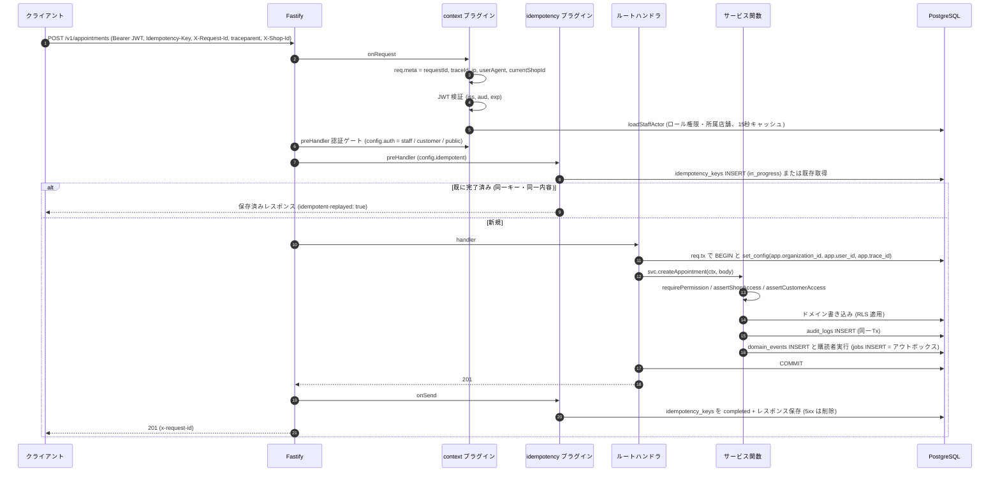
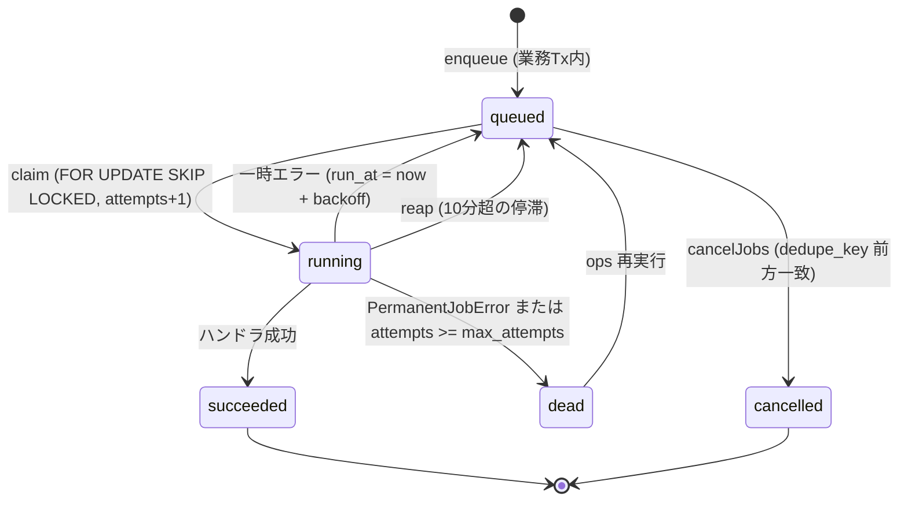
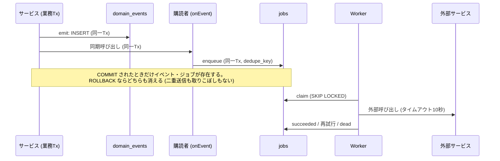
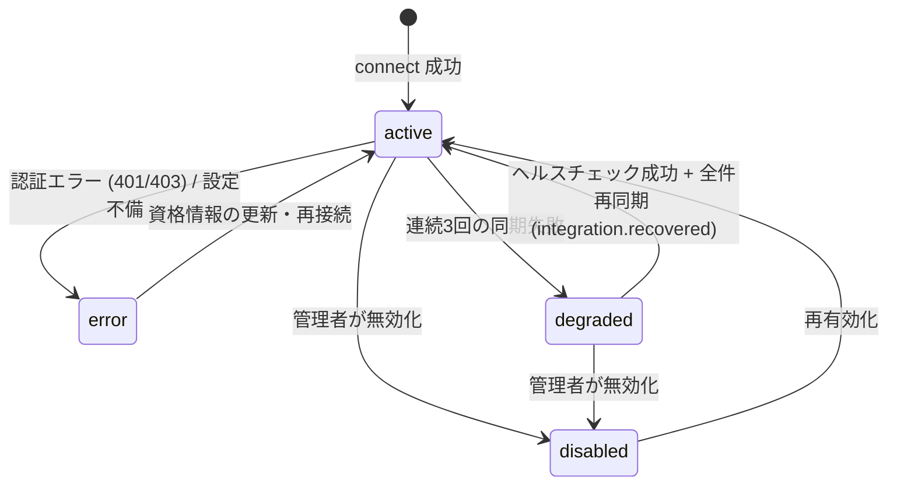
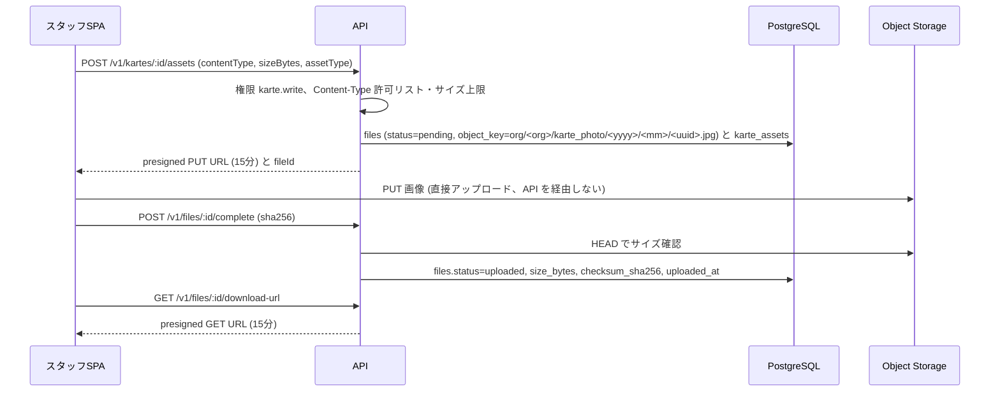
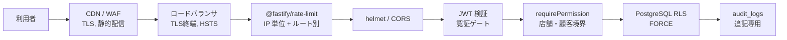
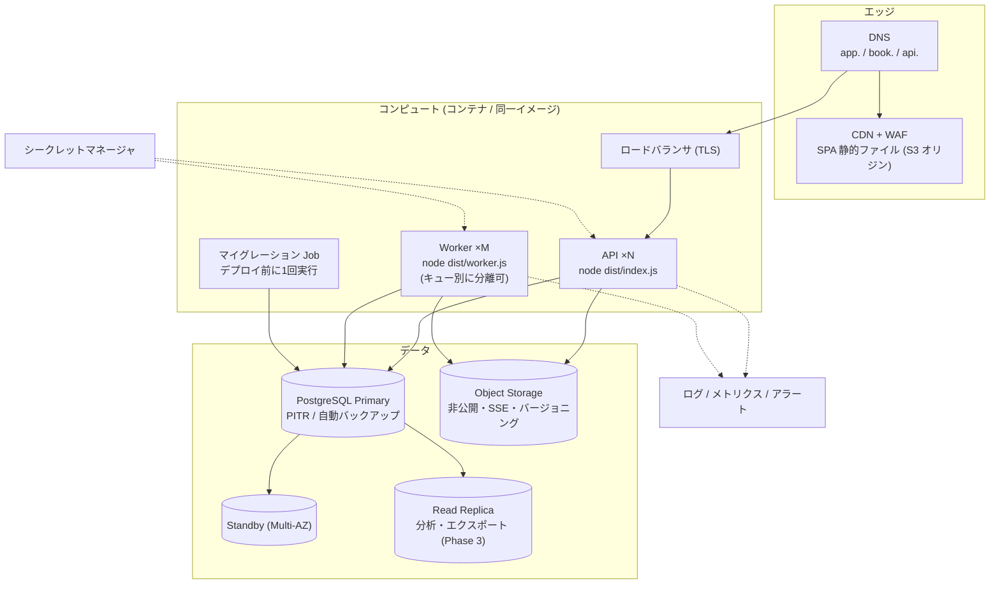

# Salon OS システムアーキテクチャ

- 対象: `apps/api`（API サーバ / Worker）、`apps/web`（SPA）、インフラ
- 関連: [requirements.md](./requirements.md)（要件定義書 v1.1）、[data-model.md](./data-model.md)、[operations.md](./operations.md)、[ADR](./adr/)、`apps/api/CONVENTIONS.md`
- 表記: 「実装済」は現行コードにあるもの、「設計」は並行実装中のモジュールの設計値

## 1. 設計原則

| 原則 | 具体化 |
|---|---|
| モジュラーモノリス | 1つのデプロイ単位・1つの DB。モジュール境界はコード上で強制（公開契約・イベント経由）し、後から切り出せる形を保つ（[ADR 0001](./adr/0001-modular-monolith.md)） |
| 整合性優先 | 顧客・予約・会計は単一 PostgreSQL トランザクションで更新。二重予約は DB 排他制約で物理的に防止（[ADR 0003](./adr/0003-double-booking-prevention.md)） |
| 多層防御 | 認証 → RBAC → 店舗/顧客境界 → RLS → 監査（[ADR 0002](./adr/0002-postgres-rls-multitenancy.md)） |
| 非同期の確実性 | ジョブとイベントを業務トランザクション内で永続化（トランザクショナル・アウトボックス）。外部呼び出しはジョブで行い、指数バックオフ → DLQ（[ADR 0004](./adr/0004-postgres-job-queue-outbox.md)） |
| 冪等性 | API の Idempotency-Key、ジョブの `dedupe_key`、Webhook の `(provider, event_id)`、決済の `idempotency_key`（[ADR 0006](./adr/0006-idempotency.md)） |
| Adapter 隔離 | 外部固有仕様は Adapter に閉じ、内部共通モデルへ正規化（[ADR 0008](./adr/0008-integration-adapters.md)） |
| 依存最小化 | API に npm 依存を追加しない（HTTP は `fetch`、暗号は `node:crypto`、S3 SigV4 も自前） |
| 人間中心の AI | AI 出力は提案として保存し、人間の承認なしに外部送信しない（[ADR 0009](./adr/0009-ai-human-in-the-loop.md)） |

## 2. モジュールマップと依存ルール

### 2.1 レイヤ構成



Worker も `modules/index.ts` を import する。これにより各モジュールの `index.ts` が副作用として登録するジョブハンドラ（`registerJob`）、イベント購読（`onEvent`）、定期タスク（`registerPeriodic`）、法人初期データ（`registerOrgSeeder`）、Webhook プロバイダ（`registerWebhookProvider`）が API と Worker の両方で同一になる。

### 2.2 モジュール依存関係

矢印は「呼び出し元 → 公開契約/サービス関数の提供元」。点線はドメインイベント購読（発行元 → 購読者）。



### 2.3 依存ルール

| ルール | 内容 |
|---|---|
| R1 公開契約 | 他モジュールの機能は `api.ts`（または規約で指定されたサービス関数）経由でのみ使う。例: 配信は `messaging/api.ts` の `queueMessage()` / `cancelQueuedMessages()`、決済は `payments/api.ts` の `startOnlinePayment()` / `settleOnlinePayment()` / `refundPayment()`、予約は `appointments/service.ts` の `createAppointment` / `updateAppointment` / `transitionAppointment`（外部・公開チャネルは `{ trusted: true }`）、名寄せは `customers/identity.ts` の `resolveCustomer()`、統計は `customers/stats.ts` の `recomputeCustomerStats()` |
| R2 テーブル所有 | 各テーブルの書き込みは所有モジュールのみ（例: `messages` は messaging、`payments` は payments）。読み取りは集計（analytics）・タイムライン（customers）など明示された用途に限る |
| R3 イベントで疎結合 | 「起きたこと」を発行し、購読側が自分の責務（通知・同期・集計）を行う。購読者はジョブ投入のみを行い、発行元トランザクションを重くしない |
| R4 循環禁止 | サービス関数呼び出しで循環依存を作らない。逆向きの通知が必要な場合はイベントを使う（例: payments → pos は `payment.succeeded`） |
| R5 横断基盤への依存のみ許可 | `auth/` `db/` `jobs/` `lib/` は全モジュールから利用可。逆に横断基盤はモジュールに依存しない（`lib/webhooks.ts` はレジストリのみ提供） |
| R6 公開ルート | 認証なしのルートは public モジュール（または `/webhooks/:provider`）に集約し、`publicTx()` / `withTenant()` でテナントを確定してからドメイン関数を呼ぶ |

## 3. リクエストライフサイクル



| 段階 | 実装 | ポイント |
|---|---|---|
| ID 付与 | `newRequestId()`（`X-Request-Id` を検証して採用、無ければ UUID）、`traceIdFrom()`（`traceparent` の trace-id、無ければ request id） | ログ・監査・ジョブ・イベントに伝播 |
| 認証 | `verifyToken()`（HS256、`iss=salon-os`、`aud=staff/customer`）→ スタッフは `loadStaffActor()`、顧客はクレームから `CustomerActor` | 権限はトークンに埋めず DB から解決（ロール変更が最大15秒で反映） |
| 認証ゲート | `preHandler`：`config.auth`（既定 `staff`） | 顧客トークンでスタッフ API は 403 |
| 冪等性 | `plugins/idempotency.ts` | スコープ = `<METHOD> <route>:<actor>`、24時間 |
| トランザクション | `req.tx(fn)` → `withTenant(orgId, fn, { userId, traceId })` | 1リクエスト=1トランザクション。`set_config(..., true)` はトランザクションローカル |
| 認可 | サービス冒頭 | 権限 → 店舗 → 顧客の順。不可視は 404 |
| 監査 | `audit(ctx, entry)` | 業務変更と同一トランザクション（片方だけ残ることがない） |
| イベント | `emit(ctx, event)` | `domain_events` 永続化 + 同期購読者（ジョブ投入） |
| エラー | `plugins/errors.ts` | `{ error: { code, category, message, details, requestId } }`。PG エラーは `fromPgError()` で業務エラーへ変換 |

## 4. マルチテナンシーと RLS

### 4.1 テナントコンテキスト

| 関数 | 設定する GUC | 用途 |
|---|---|---|
| `withTenant(orgId, fn, opts)` | `app.organization_id`、`app.user_id`、`app.trace_id` | すべての業務処理（API・ジョブ・公開API） |
| `withSystem(fn)` | `app.bypass_rls = on` | ログイン・リフレッシュ（`users` / `auth_sessions`）、公開スラッグ → テナント解決、署名付きトークン解決、Webhook ルーティング、ジョブの claim/finish、スケジューラ、マイグレーション |
| `publicTx(shop, meta, fn)` | `withTenant` + system actor（label `public`） | 匿名の公開リクエスト（スラッグで解決した法人に限定） |
| `jc.tx(fn)`（ジョブ） | `withTenant(job.organization_id)` + system actor（label `job:<type>`） | ジョブハンドラ。`organization_id` が NULL のジョブ（定期タスク）では使えない |

DB 関数 `app_current_org()` / `app_bypass_rls()` / `app_current_user()` が GUC を読む（`0001_foundation.sql`）。

### 4.2 ポリシー

`0090_row_level_security.sql` は `information_schema` から `organization_id` 列を持つ全テーブルを列挙し、以下を自動適用する。

| 種別 | 対象 | ポリシー |
|---|---|---|
| 通常 | `organization_id` を持つテーブル（下記以外） | `tenant_isolation`: `USING / WITH CHECK (app_bypass_rls() OR organization_id = app_current_org())` |
| システム既定行あり | `roles`, `role_permissions`, `feature_flags` | `tenant_read`（`organization_id IS NULL` の既定行も読める）+ `tenant_write`（自法人行のみ書ける） |
| 法人自身 | `organizations` | `id = app_current_org()` |
| 対象外 | `users`（グローバル認証ID）、`schema_migrations` | `withSystem` でのみアクセス |

- `ENABLE` に加えて `FORCE ROW LEVEL SECURITY` を設定し、テーブル所有者ロールにも適用する。
- `organization_id` が NULL になり得る `jobs` / `audit_logs` / `webhook_events` / `otp_challenges` は通常ポリシーのため、NULL 行はバイパス時のみ見える（グローバルジョブ・未解決 Webhook はシステム処理専用）。
- 新しいテーブルは各モジュールのマイグレーション内で同形式のポリシーを作成する（0090 は作成済みテーブルにのみ適用されるため）。

### 4.3 残課題と本番構成

- `app.bypass_rls` は通常の GUC であり、アプリと同じ DB ロールでは SQL 実行権限があれば設定できる。RLS は「アプリのクエリ条件漏れ」に対する防御であり、SQL インジェクション対策（パラメータ化の徹底）とは別に担保する。
- 本番推奨: (1) マイグレーション用ロール（DDL・所有者）とアプリ用ロール（DML のみ、`NOBYPASSRLS`、`TRUNCATE` なし）を分離、(2) `withSystem` を使う処理（認証・Webhook・ジョブ取得）を限定したコードパスに保ち、静的検査（lint ルール）で新規使用をレビュー必須にする、(3) 将来的にはシステム処理を `SECURITY DEFINER` 関数へ寄せてバイパス GUC を廃止する選択肢を残す（ADR 0002）。

## 5. ジョブキューとスケジューラ

### 5.1 ジョブ状態



### 5.2 実装要点（`jobs/queue.ts`）

| 機能 | 実装 |
|---|---|
| 投入 | `enqueue(ctxOrTrx, { type, payload, organizationId, runAt, dedupeKey, maxAttempts=8, priority=0, queue='default', traceId })`。`dedupe_key` は `queued`/`running` の間一意（`ON CONFLICT DO NOTHING`、重複時は `null` を返す） |
| 取得 | `UPDATE jobs SET state='running', locked_by=<host:pid>, locked_at=now(), attempts=attempts+1 WHERE id IN (SELECT id … WHERE state='queued' AND run_at<=now() AND queue=ANY(...) ORDER BY priority DESC, run_at LIMIT n FOR UPDATE SKIP LOCKED) RETURNING …`（`withSystem`） |
| 実行 | ハンドラに `JobContext { job, organizationId, tx }`。`tx` は system actor のテナントトランザクション（trace_id はジョブの trace_id） |
| 終了 | 成功 → `succeeded`。失敗 → `RetryLaterError` は指定遅延、その他は `backoffMs(attempts)`、`PermanentJobError` または上限到達で `dead` |
| 並行度 | `runWorker({ concurrency: WORKER_CONCURRENCY, pollMs: WORKER_POLL_MS })`。空きスロット数だけ claim、ジョブが無ければ `pollMs` 待機 |
| 停滞回収 | 60秒毎に `reapStaleJobs(10分)`（Worker クラッシュ時の `running` を `queued` に戻す）→ ハンドラは冪等であること |
| テスト | `drainJobs()`（テストヘルパー `runJobs()`）で同期的に全ジョブ処理 |
| キュー分離 | `queue` 列で論理分離（例: `default` / `messaging` / `sync` / `analytics`）。Worker 起動時に対象キューを指定して専用ワーカーを立てられる |

### 5.3 スケジューラ（`jobs/scheduler.ts`）

- Worker が30秒毎に `schedulerTick()` を実行。トランザクション内で `pg_advisory_xact_lock(727275)` を取り、複数 Worker でも同時に1つだけが投入判定する。
- タスクごとに `bucket(now)`（`everyMinutes(n)` = n分単位の通し番号、`dailyAt(h, m, tz='Asia/Tokyo')` = 指定時刻以降のその日の日付）を計算し、`dedupe_key = cron:<name>:<bucket>` のジョブが（状態を問わず）存在しなければ投入する。→ 各期間につきクラスタ全体で1回。
- 定期ジョブは `organization_id = NULL` で起動し、ハンドラが `withSystem` で対象法人（または連携アカウント）を列挙して法人ごとのジョブを `enqueue(trx, { organizationId })` で fan-out する。
- スケジュール一覧は [requirements.md 15.4](./requirements.md#154-定期スケジュール一覧)。

### 5.4 トランザクショナル・アウトボックス



## 6. Integration Hub と Webhook パイプライン

### 6.1 受信

1. `POST /v1/webhooks/:provider`（integrations モジュール、`config.auth = 'public'`）。`server.ts` の JSON パーサが `rawBody` を保持するため、署名検証は受信バイト列で行う。
2. `getWebhookProvider(provider).verify(req)` → `VerifiedWebhook { eventId, eventType, organizationId?, signatureValid, events? }`。署名不正でも例外にせず `signatureValid=false` を返す。
3. `withSystem` で `webhook_events` に INSERT（`(provider, event_id)` 一意、重複は無視）。LINE のように1配信に複数イベントがある場合は `events[]` ごとに保存。署名不正は `status='ignored'` で保存のみ。
4. 新規イベントごとに `webhook.process` ジョブを同一トランザクションで投入し、即座に 200 を返す（プロバイダのタイムアウト・再送を誘発しない）。
5. Worker が `withTenant(organization_id)` 内で `provider.process(ctx, event)` を呼び、`processed` / `ignored` を記録。例外は再試行 → 上限で `dead`。
6. 組織未確定（`organization_id` NULL）のイベントは `process` 前にプロバイダ固有の解決（例: Stripe の `metadata.organization_id`、PaymentIntent ID → `payments`）を行う。解決不能は `ignored` + 運用通知。

### 6.2 送信と同期

| 種別 | 経路 | 冪等性 |
|---|---|---|
| メッセージ配信 | `queueMessage()` → `messages(queued)` + `message.deliver` | `messages.dedupe_key`、LINE `X-Line-Retry-Key = messages.id` |
| 決済 | `startOnlinePayment()` → Adapter → PaymentIntent | `payments.idempotency_key` = Stripe `Idempotency-Key` |
| 予約媒体の取込 | `integration.sync` → `fetchChanges(cursor)` → 正規化 → `external_bookings` UPSERT → 予約サービス | `(integration_account_id, external_booking_id)` 一意、`payload_hash` |
| 内部予約の外部反映 | `appointment.*` → `integration.push` → `blockSlot` / `releaseSlot` | `external_slot_blocks (integration_account_id, appointment_id)` 一意、dedupe に version |
| 口コミ | `review.import` / `review.reply_sync` | `reviews (organization_id, source, external_review_id)` 一意 |

### 6.3 連携アカウントの状態



## 7. ストレージ



- `lib/storage.ts` の `StorageDriver`（`presignUpload` / `presignDownload` / `put` / `get` / `head` / `delete`）。`local` は API の `/v1/files/blob/:token`（HMAC 署名ペイロード）で実体を中継、`s3` は SigV4 presign（S3 / R2 / MinIO 互換）。
- DB には BLOB を保存しない（要件 21）。エクスポート CSV・SNS 素材・署名画像も同じ仕組み。

## 8. セキュリティアーキテクチャ

### 8.1 トークン・資格情報の種類

| 種類 | 形式 | 保存 | 有効期限 | 失効 |
|---|---|---|---|---|
| スタッフアクセストークン | JWT HS256（`aud=staff`, `sub=userId`, `org`, `stf`） | 保存しない | 15分 | 期限のみ（権限は毎回 DB 解決） |
| リフレッシュトークン | 48byte 乱数（base64url） | `auth_sessions.refresh_token_hash`（HMAC） | 30日 | 使用時ローテーション、再利用検知で全失効、ログアウト・パスワード変更 |
| 顧客トークン | JWT HS256（`aud=customer`, `sub=customerId`, `org`, `via`） | 保存しない | 7日 | 期限のみ（Phase 2 で見直し） |
| OTP | 6桁 | `otp_challenges.code_hash`（HMAC） | 10分 | 消費・試行5回 |
| アクセスリンク | 24byte 乱数 | `access_tokens.token_hash`（HMAC） | 用途別 | 回数制限・`revoked_at` |
| 招待 / ファイル署名 | HMAC 署名ペイロード（`body.sig`、`exp`） | 保存しない | 7日 / 15分 | 期限のみ |
| 外部資格情報 | AES-256-GCM（`v1.iv.tag.ct`） | `integration_accounts` / `line_channels` | — | 再接続で上書き |

### 8.2 鍵

| 鍵 | 用途 | ローテーション |
|---|---|---|
| `JWT_SECRET` | JWT 署名 | 変更で全アクセストークン無効（最大15分の影響）、リフレッシュは有効 |
| `TOKEN_SECRET` | トークン HMAC・署名付きURL・招待 | 変更でリフレッシュトークン・アクセスリンク・OTP が無効化される（計画停止またはデュアルキー対応後に実施） |
| `ENCRYPTION_KEY` | 外部資格情報の暗号化 | 版付き暗号文（`v1.`）で旧鍵復号 → 新鍵再暗号化のバッチ（[operations.md](./operations.md) 8章） |

### 8.3 防御の配置



## 9. デプロイ構成

### 9.1 開発環境（docker-compose 例）

`infra/` は v1.1 時点で未整備のため、以下を推奨構成とする（ローカルは Node をホストで実行し、依存サービスのみコンテナ化）。

```yaml
# infra/docker-compose.dev.yml（推奨）
services:
  postgres:
    image: postgres:16
    environment:
      POSTGRES_USER: salon
      POSTGRES_PASSWORD: salon
      POSTGRES_DB: salon
    ports: ["5432:5432"]
    volumes: ["pgdata:/var/lib/postgresql/data"]
  minio:            # STORAGE_DRIVER=s3 を試す場合
    image: minio/minio
    command: server /data --console-address ":9001"
    ports: ["9000:9000", "9001:9001"]
  mailpit:          # EMAIL_DRIVER=smtp を試す場合 (SMTP_URL=smtp://localhost:1025)
    image: axllent/mailpit
    ports: ["1025:1025", "8025:8025"]
volumes:
  pgdata: {}
```

起動: `pnpm install` → `cp apps/api/.env.example apps/api/.env` → `pnpm --filter @salon/api db:migrate` → `pnpm --filter @salon/api dev`（API :4000）と `pnpm --filter @salon/api dev:worker`、SPA は `pnpm --filter web dev`（:5173）。テスト DB は `salon_test`（`TEST_DATABASE_URL`）。

### 9.2 本番構成（推奨）



| 項目 | 推奨 |
|---|---|
| リージョン | 東京（ap-northeast-1）を主、DR 用に大阪へバックアップ複製 |
| API | 2台以上、CPU 使用率 / p95 レイテンシでオートスケール。`trustProxy: true` のためロードバランサの `X-Forwarded-For` を信頼 |
| Worker | 2台以上（`WORKER_CONCURRENCY` 4〜16）。メッセージ配信・同期・分析をキュー別ワーカーに分けられる |
| DB 接続 | `DATABASE_POOL_MAX`（既定20）× 台数が DB の上限を超えないよう、必要に応じ PgBouncer（transaction mode。`set_config(..., true)` はトランザクションローカルのため互換） |
| マイグレーション | デプロイパイプラインで `node dist/db/migrate.js`（アドバイザリロック付き）を API 更新前に1回。前方互換のみ |
| デプロイ | ローリング（API → Worker の順）。Worker は SIGTERM で新規 claim を止め、実行中ジョブを完了してから終了 |
| SPA | ビルド成果物を CDN へ。`/app` と顧客向けで別ホスト名にし、顧客向けは LINE 内ブラウザ互換（LIFF） |

## 10. スケーリングパス

要件 21（「予約同期・メッセージ・分析など高負荷領域を必要に応じて分離」）に基づき、以下の順で分離する。いずれもモジュール境界（公開契約・イベント・ジョブ）が既に存在するため、まずプロセス分離 → 必要時にサービス分離とする。

| 順序 | 対象 | 分離のトリガ（目安） | 方法 |
|---|---|---|---|
| 1 | メッセージ配信（messaging の `message.deliver` / `campaign.run`） | 一括配信で他ジョブの待ち時間 p95 > 1分、または配信 1万通/時超 | `queue='messaging'` の専用 Worker → 送信のみの配信サービス（`messages` を所有） |
| 2 | 外部同期（integrations の `integration.sync` / `push` / `webhook.process`） | 連携アカウント数 × 5分ポーリングが Worker 時間の30%超、外部遅延が他ジョブを阻害 | `queue='sync'` の専用 Worker → 同期サービス（`external_*` / `sync_*` を所有、予約作成は API 経由） |
| 3 | 分析（analytics の集計・エクスポート） | 集計クエリが OLTP の CPU 20%超、エクスポートが長時間化 | Read Replica へ読み取り移行 → CDC で DWH（BigQuery / Redshift 等）へ、集計テーブルは DWH で生成 |
| 4 | 公開予約 API（public） | 公開トラフィックがスタッフ API の SLO を阻害 | 同一コードの API を公開用・管理用に別デプロイ（ルーティングで分離） |
| 5 | DB | 書き込み性能の限界 | 大量追記テーブル（`audit_logs`, `domain_events`, `messages`, `jobs`）の月次パーティション → アーカイブ。テナント単位のシャーディングは最後の手段（`organization_id` 先頭の設計で可能性を残す） |

分離してはいけないもの: 予約・顧客・会計のコア（同一トランザクションでの整合性が要件の中心）。

## 11. 観測性

### 11.1 ログ

- pino の JSON 構造化ログ（開発は pino-pretty）。全リクエストログに `reqId`（= `x-request-id`）。`authorization` / `cookie` / `x-line-signature` は redact。
- 4xx は info（code・status）、5xx は error（スタック）。ジョブ失敗は `jobId` / `type` / `attempt` 付きで error。
- PII（氏名・電話・メール・本文）をログに出さない。調査は ID（customerId 等）で行う。

### 11.2 トレース相関

`traceparent`（W3C）または request id から `trace_id` を作り、以下に保存する: `audit_logs.trace_id`、`domain_events.trace_id`、`jobs.trace_id`（ジョブ実行時のテナントTxにも引き継ぎ）、業務テーブルの `trace_id` 列。1つの予約操作から通知送信・外部同期までを `trace_id` で追跡できる。OpenTelemetry エクスポータの組み込みは Phase 2。

### 11.3 メトリクスとアラート

| メトリクス | 取得元 | アラート閾値（初期値） |
|---|---|---|
| API リクエスト数・p95/p99・5xx 率 | ロードバランサ / アプリ | 5xx > 1%（5分）、p95 > 1秒（10分） |
| 空き枠・予約作成レイテンシ | アプリ（ルート別） | p95 が NFR 超過（15分） |
| ジョブ滞留（`queued` かつ `run_at < now()` の件数・最古待ち時間） | `jobs` | 最古待ち > 5分 |
| DLQ 件数（`dead`） | `jobs` | 前時間比で10件以上増加 |
| Webhook 失敗（`failed` / `dead`） | `webhook_events` | 1件以上の `dead` |
| 連携縮退 | `integration_accounts.status='degraded'` | 発生時に即時 |
| 配信失敗率 | `messages` | 1時間の failed / (sent+failed) > 5% |
| DB 接続数・CPU・レプリカ遅延・ストレージ | マネージド DB | 接続 > 80%、CPU > 80%（15分） |
| レジ差額 | `register_sessions.difference` | 店舗設定の閾値超過で店長へ通知 |

### 11.4 ヘルスチェック

`GET /healthz`（プロセス生存）、`GET /readyz`（`SELECT 1` で DB 疎通）。Worker はジョブ claim ループの最終実行時刻を外部監視（ハートビート）で確認する（Phase 1 で実装）。

## 12. 既知の課題（v1.1 時点）

| 区分 | 内容 | 対応方針 |
|---|---|---|
| セキュリティ | `audit_logs` の TRUNCATE が行トリガでは防げない | **解決済**: マイグレーション 0092 で `BEFORE TRUNCATE` トリガを追加 |
| 運用 | ジョブ dedupe が実行中ジョブにも効き、実行中に投入された再計算が失われる | **解決済**: マイグレーション 0091 で dedupe 対象を `queued` のみに変更 |
| バグ | `PATCH /customer-memos/:id` の入力スキーマが `memoSchema.partial()` で、`visibility` の `.default('shared')` が部分更新時にも適用される（zod 4 の仕様）。ピン留め等の更新でプライベートメモが共有に変わる | **解決済**: `updateMemoSchema`（default なし）に変更、回帰テスト `org/security-regressions.test.ts` |
| セキュリティ | 招待トークンは署名付き7日間で、受諾済み・既存パスワードありでも有効期間内は再利用でき、トークンだけでログインが成立する | **解決済**: `staffs.status='invited'` の場合のみ受諾可（単回利用）。既存アカウントは現行パスワードの照合を必須化 |
| セキュリティ | ゲスト予約の電話番号（未検証）で既存顧客へ自動紐付けされる | **解決済**: 未検証連絡先は「連絡先一致 かつ 氏名(漢字/カナ)一致」の場合のみ紐付け（`contactMatchRequiresName`）。不一致は新規作成し名寄せ候補へ |
| 性能 | `loginWithLine()` が LINE の ID トークン検証（外部 HTTP）をテナントトランザクション内で実行 | **解決済**: チャネル取得と検証を分離し、外部HTTPはトランザクション外で実行 |
| 運用 | `package.json` の `db:seed`（`src/db/seed.ts`）・`openapi`（`src/scripts/openapi.ts`）スクリプトの実体が未作成、`infra/` 未整備 | **解決済**: `src/db/seed.ts`・`src/scripts/openapi.ts`（`docs/openapi.json` 生成）・`infra/docker-compose.yml` を追加 |
| 運用 | 顧客 CSV は同期出力（最大10万件）で、要件の非同期エクスポート（`data_exports`）とは別経路 | 大規模法人向けに ops の非同期エクスポートへ誘導、同期版は上限を下げる |
| 規約差異 | `/appointments` 等のカレンダー系一覧は cursor pagination ではなく日付範囲 + 上限 | requirements 8.1.1 に例外として明記済み |
| バグ | `PATCH /roles/:id` の入力スキーマが `roleSchema.omit({ key: true }).partial()` で、`permissions` の `.default([])` が部分更新時にも適用される。名前だけを変更すると `permissions=[]` となり、`updateRole()` がロールの全権限を削除する（オーナーロールは `OWNER_ROLE_IMMUTABLE` で拒否されるが、店長等のシステムロール・カスタムロールは権限を失う） | **解決済**: `updateRoleSchema`（default なし）に変更、回帰テスト追加 |
| 設計 | `role_permissions.permission_key` は文字列で DB 制約がない | `createRole` / `updateRole` の `assertValidPermissions()` で検証済み。DB 側の CHECK は権限追加のたびにマイグレーションが必要になるため設けない |
| 設計 | アクター権限キャッシュはプロセスローカル（15秒）。複数台構成ではロール変更の反映が最大15秒遅れる | 許容（重要操作は監査で追跡）。即時性が必要になれば LISTEN/NOTIFY で無効化 |
