# Salon OS データモデル

- 対象: `apps/api/src/db/migrations/0001`〜`0012`、`0090_row_level_security.sql`（全 **88テーブル**、インデックス96）
- 関連: [requirements.md 7章](./requirements.md#7-データモデル)、[architecture.md 4章（RLS）](./architecture.md#4-マルチテナンシーと-rls)、[ADR 0002](./adr/0002-postgres-rls-multitenancy.md) / [0003](./adr/0003-double-booking-prevention.md) / [0005](./adr/0005-money-and-tax.md)
- 本書 2〜12章のテーブル定義・ER 図はマイグレーション SQL から機械的に抽出して作成している（カラム説明の多くは SQL コメント）。マイグレーションを追加・変更した場合は本書も更新すること。

## 1. 概要

### 1.1 拡張機能・DB 関数（0001）

| 名前 | 種別 | 用途 |
|---|---|---|
| `btree_gist` | 拡張 | `EXCLUDE USING gist (staff_id WITH =, tstzrange(...) WITH &&)` で uuid の等値と範囲の重なりを組み合わせる |
| `pg_trgm` | 拡張 | 顧客検索・重複候補の trigram 類似度（`customers_search_trgm`） |
| `citext` | 拡張 | 大文字小文字を区別しないメール・スラッグ |
| `app_current_org()` | 関数 | `current_setting('app.organization_id')` を uuid で返す（RLS ポリシーで使用） |
| `app_bypass_rls()` | 関数 | `app.bypass_rls = 'on'` のとき true（`withSystem`） |
| `app_current_user()` | 関数 | `app.user_id`（将来のポリシー拡張用） |
| `set_updated_at()` | トリガ関数 | `updated_at := now()` |
| `to_katakana(text)` | 関数 | ひらがな → カタカナ |
| `normalize_search_text(text)` | 関数 | NFKC → カタカナ化 → 空白除去 → 小文字化。`lib/normalize.ts` の `normalizeKana()` と同一規則（`customers.search_text`、重複候補） |
| `audit_logs_immutable()` | トリガ関数 | `audit_logs` の UPDATE / DELETE で例外 |

### 1.2 命名・型の規約

| 項目 | 規約 |
|---|---|
| 主キー | `id uuid DEFAULT gen_random_uuid()`。`audit_logs` / `domain_events` は `bigserial`。中間テーブルは複合主キー（`customer_tags`, `staff_menus`, `role_permissions` など）、集計テーブルは自然キー（店舗×日 等） |
| テナント列 | `organization_id`（`organizations(id)` 参照）。RLS の判定列 |
| 時刻 | `timestamptz`（UTC）。営業日など暦日は `date`、時刻のみは `time`（店舗TZで解釈） |
| 金額 | `int`（円・税込）、集計は `bigint`。税率は `tax_rate_bp`（basis points、1000 = 10.00%）、配分率は `share_bp`（10000 = 100%） |
| 状態 | `text` + `CHECK (... IN (...))` |
| 柔軟属性 | `jsonb`（`settings`, `attributes`, `config`, `payload`, `stats` など）はアプリ層の zod で検証 |
| 監査列 | `created_by` / `updated_by`（スタッフID、FK なし）、`trace_id`（リクエスト/ジョブのトレース）、`created_at` / `updated_at`（トリガ） |
| 論理削除 | `deleted_at`。部分一意インデックスは `WHERE deleted_at IS NULL` を付ける |
| NULL 不明値 | 「法人共通」を `shop_id IS NULL` で表すテーブルがある（`menus`, `menu_categories`, `coupons`, `products`, `karte_templates`, `form_templates`, `message_templates`, `line_channels`, `integration_accounts`, `custom_payment_methods`, `campaigns`, `automations`）。一意制約では `coalesce(shop_id, '0000…')` を使う |

### 1.3 RLS 適用状況

| 区分 | テーブル数 | ポリシー |
|---|:-:|---|
| `organization_id NOT NULL` の業務テーブル | 79 | `tenant_isolation`（`USING / WITH CHECK (app_bypass_rls() OR organization_id = app_current_org())`） |
| `organization_id` NULL 可（受信時未確定・グローバル） | 4（`jobs`, `audit_logs`, `webhook_events`, `otp_challenges`） | `tenant_isolation`（NULL 行はバイパス時のみ可視） |
| システム既定行を持つ | 3（`roles`, `role_permissions`, `feature_flags`） | `tenant_read` + `tenant_write` |
| 法人 | 1（`organizations`） | `id = app_current_org()` |
| 対象外 | 1（`users`）+ `schema_migrations` | `withSystem` のみ |

すべて `ENABLE` + `FORCE ROW LEVEL SECURITY`。モジュール追加マイグレーション（番号帯 0100〜0159）で作るテーブルは、同じマイグレーション内で同形式のポリシーを作成する。

### 1.4 マイグレーション

| ファイル | 内容 | テーブル数 |
|---|---|:-:|
| `0001_foundation.sql` | 拡張・DB 関数 | 0 |
| `0002_tenancy_identity.sql` | 法人・店舗・ユーザー・ロール・スタッフ・セッション・OTP | 9 |
| `0003_customers.sql` | 顧客・タグ・メモ・外部ID・店舗関係・配信設定・統合履歴 | 9 |
| `0004_catalog_schedules.sql` | メニュー・設備・営業時間・シフト・ブロック・クーポン | 12 |
| `0005_appointments.sql` | 予約（排他制約）・明細・設備・履歴・クーポン利用 | 5 |
| `0006_kartes_forms_files.sql` | ファイル・カルテ・フォーム・アクセストークン | 7 |
| `0007_commerce_pos_payments.sql` | 商品・在庫・注文・レジ・会計・決済・返金・領収書・ポイント・採番 | 16 |
| `0008_messaging.sql` | LINE チャネル・テンプレート・セグメント・配信・自動配信・メッセージ | 7 |
| `0009_integrations.sql` | 連携アカウント・外部予約・枠ブロック・同期履歴・競合・Webhook | 6 |
| `0010_reviews_marketing.sql` | 口コミ依頼・口コミ・紹介リンク・SNS 素材 | 5 |
| `0011_analytics_ai.sql` | 日次集計・AI スコア・AI 提案 | 6 |
| `0012_platform.sql` | 監査・冪等キー・ジョブ・ドメインイベント・機能フラグ・エクスポート | 6 |
| `0090_row_level_security.sql` | 全テナントテーブルへの RLS | 0 |

運用は前方専用（適用済みファイルはチェックサムで変更検知、`schema_migrations`）。番号帯: pos/payments 0100-0109、messaging 0110-0119、kartes/files 0120-0129、integrations/ops 0130-0139、reviews/marketing/commerce 0140-0149、analytics/ai 0150-0159。

### 1.5 ドメイン間の関係（概観）

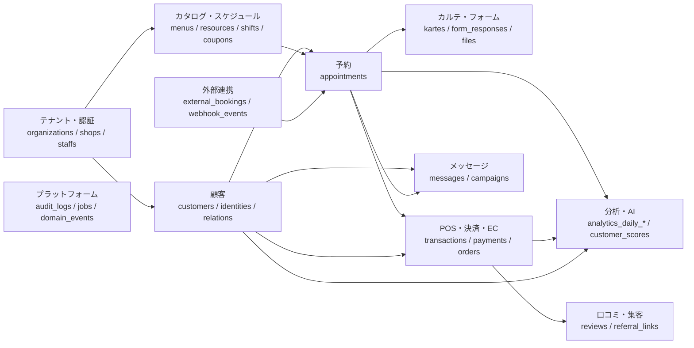

### 1.6 凡例（2〜12章のテーブル定義）

- **NULL** 列の「○」は NULL 許可。空欄は `NOT NULL`。
- **参照 / 制約**: PK・UNIQUE・FK（参照先と `ON DELETE`）・列 CHECK・生成列。複数列制約・排他制約は「テーブル制約」に記載。
- ER 図では可読性のため、全テーブルが持つ `organizations` への参照線を省略している（`shops` のみ表示）。他ドメインのテーブルは関係線のみ表示する。

## 2. テナント・認証（0002）

所有モジュール: org / auth。`users` は法人をまたぐグローバルな認証IDで、法人への所属は `staffs`（法人ごとに1レコード）で表す。権限キーはコード（`auth/permissions.ts`）で定義し、`role_permissions` にはキー文字列を保存する。

### ER 図

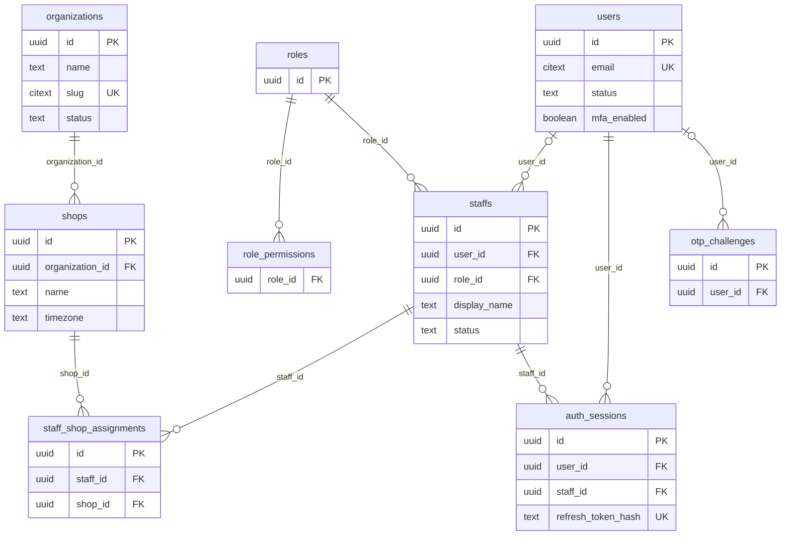

### テーブル定義

#### `organizations`

- **目的**: 法人（テナント）。契約プラン・状態・通貨・タイムゾーン・適格請求書発行事業者登録番号・法人設定を保持
- **補足**: `status` が `active` / `trial` 以外の法人のスタッフはログイン不可（`loadStaffActor`）。公開予約も停止
- **定義**: `0002_tenancy_identity.sql`
- **RLS**: `tenant_isolation`（`id = app_current_org()`）

| カラム | 型 | NULL | 既定値 | 参照 / 制約 | 説明 |
|---|---|:-:|---|---|---|
| `id` | uuid |  | `gen_random_uuid()` | PK |  |
| `name` | text |  |  |  |  |
| `slug` | citext |  |  | UNIQUE |  |
| `plan` | text |  | `'standard'` | CHECK plan IN ('solo','standard','pro','enterprise') |  |
| `status` | text |  | `'active'` | CHECK status IN ('trial','active','suspended','cancelled') |  |
| `currency` | char(3) |  | `'JPY'` |  |  |
| `timezone` | text |  | `'Asia/Tokyo'` |  |  |
| `invoice_registration_number` | text | ○ |  |  | 適格請求書発行事業者登録番号 (T+13桁) |
| `settings` | jsonb |  | `'{}'::jsonb` |  |  |
| `created_at` | timestamptz |  | `now()` |  |  |
| `updated_at` | timestamptz |  | `now()` |  |  |
| `deleted_at` | timestamptz | ○ |  |  |  |

**トリガ**: `organizations_updated (UPDATE → set_updated_at())`

#### `shops`

- **目的**: 店舗。所在地・タイムゾーン・公開予約可否と運用設定（`settings`: booking / reminders / pos / review、`lib/shop-settings.ts` で検証・既定値補完）
- **補足**: `slug` は公開予約URL（`/book/:shopSlug`）に使うため削除されていない店舗間でグローバル一意
- **定義**: `0002_tenancy_identity.sql`
- **RLS**: `tenant_isolation`（`organization_id = app_current_org()`、FORCE）

| カラム | 型 | NULL | 既定値 | 参照 / 制約 | 説明 |
|---|---|:-:|---|---|---|
| `id` | uuid |  | `gen_random_uuid()` | PK |  |
| `organization_id` | uuid |  |  | FK → organizations.id |  |
| `name` | text |  |  |  |  |
| `slug` | citext |  |  |  |  |
| `timezone` | text |  | `'Asia/Tokyo'` |  |  |
| `phone` | text | ○ |  |  |  |
| `email` | text | ○ |  |  |  |
| `postal_code` | text | ○ |  |  |  |
| `prefecture` | text | ○ |  |  |  |
| `city` | text | ○ |  |  |  |
| `address_line` | text | ○ |  |  |  |
| `description` | text | ○ |  |  |  |
| `status` | text |  | `'active'` | CHECK status IN ('active','inactive','closed') |  |
| `public_booking_enabled` | boolean |  | `true` |  |  |
| `settings` | jsonb |  | `'{}'::jsonb` |  |  |
| `created_at` | timestamptz |  | `now()` |  |  |
| `updated_at` | timestamptz |  | `now()` |  |  |
| `created_by` | uuid | ○ |  |  |  |
| `updated_by` | uuid | ○ |  |  |  |
| `trace_id` | text | ○ |  |  |  |
| `deleted_at` | timestamptz | ○ |  |  |  |

**テーブル制約**

- `UNIQUE (organization_id, slug)`

**インデックス**

- `shops_org_idx` (organization_id)
- UNIQUE `shops_public_slug_idx` (slug) WHERE deleted_at IS NULL

**トリガ**: `shops_updated (UPDATE → set_updated_at())`

#### `users`

- **目的**: 認証ユーザー（法人をまたぐグローバルID）。パスワードハッシュ（scrypt）・MFA・ロックアウト状態
- **補足**: `organization_id` を持たないため RLS 対象外。認証処理（`withSystem`）でのみ参照
- **定義**: `0002_tenancy_identity.sql`
- **RLS**: 対象外（`withSystem` 経由でのみアクセス）

| カラム | 型 | NULL | 既定値 | 参照 / 制約 | 説明 |
|---|---|:-:|---|---|---|
| `id` | uuid |  | `gen_random_uuid()` | PK |  |
| `email` | citext |  |  | UNIQUE |  |
| `password_hash` | text | ○ |  |  |  |
| `display_name` | text |  |  |  |  |
| `auth_provider` | text |  | `'password'` | CHECK auth_provider IN ('password','google','line') |  |
| `status` | text |  | `'active'` | CHECK status IN ('active','locked','disabled') |  |
| `mfa_enabled` | boolean |  | `false` |  |  |
| `failed_login_count` | int |  | `0` |  |  |
| `locked_until` | timestamptz | ○ |  |  |  |
| `last_login_at` | timestamptz | ○ |  |  |  |
| `created_at` | timestamptz |  | `now()` |  |  |
| `updated_at` | timestamptz |  | `now()` |  |  |

**トリガ**: `users_updated (UPDATE → set_updated_at())`

#### `roles`

- **目的**: ロール。法人作成時にシステムロール6種（owner / manager / stylist / assistant / reception / accountant）を生成し、法人はカスタムロールを追加できる
- **定義**: `0002_tenancy_identity.sql`
- **RLS**: `tenant_read`（自法人 + `organization_id IS NULL` のシステム既定行を読取）/ `tenant_write`（自法人のみ書込）

| カラム | 型 | NULL | 既定値 | 参照 / 制約 | 説明 |
|---|---|:-:|---|---|---|
| `id` | uuid |  | `gen_random_uuid()` | PK |  |
| `organization_id` | uuid | ○ |  | FK → organizations.id | NULL = system role template |
| `key` | text |  |  |  |  |
| `name` | text |  |  |  |  |
| `description` | text | ○ |  |  |  |
| `is_system` | boolean |  | `false` |  |  |
| `created_at` | timestamptz |  | `now()` |  |  |
| `updated_at` | timestamptz |  | `now()` |  |  |

**インデックス**

- UNIQUE `roles_org_key_idx` (coalesce(organization_id, '00000000-0000-0000-0000-000000000000'::uuid), key)

**トリガ**: `roles_updated (UPDATE → set_updated_at())`

#### `role_permissions`

- **目的**: ロールに付与された権限キー（`auth/permissions.ts` の41種）
- **定義**: `0002_tenancy_identity.sql`
- **RLS**: `tenant_read`（自法人 + `organization_id IS NULL` のシステム既定行を読取）/ `tenant_write`（自法人のみ書込）

| カラム | 型 | NULL | 既定値 | 参照 / 制約 | 説明 |
|---|---|:-:|---|---|---|
| `role_id` | uuid |  |  | FK → roles.id (ON DELETE CASCADE) |  |
| `organization_id` | uuid | ○ |  | FK → organizations.id |  |
| `permission_key` | text |  |  |  |  |

**テーブル制約**

- `PRIMARY KEY (role_id, permission_key)`

#### `staffs`

- **目的**: スタッフ（法人内の従業員）。ロール・雇用形態・予約可否・指名料・公開プロフィール
- **補足**: 招待中は `status='invited'`。1ユーザーは1法人につき1スタッフ（部分一意）
- **定義**: `0002_tenancy_identity.sql`
- **RLS**: `tenant_isolation`（`organization_id = app_current_org()`、FORCE）

| カラム | 型 | NULL | 既定値 | 参照 / 制約 | 説明 |
|---|---|:-:|---|---|---|
| `id` | uuid |  | `gen_random_uuid()` | PK |  |
| `organization_id` | uuid |  |  | FK → organizations.id |  |
| `user_id` | uuid | ○ |  | FK → users.id |  |
| `role_id` | uuid |  |  | FK → roles.id |  |
| `display_name` | text |  |  |  |  |
| `display_name_kana` | text | ○ |  |  |  |
| `email` | citext | ○ |  |  |  |
| `phone` | text | ○ |  |  |  |
| `employment_type` | text |  | `'full_time'` | CHECK employment_type IN ('full_time','part_time','contractor','owner') |  |
| `title` | text | ○ |  |  | 役職: スタイリスト/アシスタント等 |
| `color` | text |  | `'#7c3aed'` |  |  |
| `is_bookable` | boolean |  | `true` |  |  |
| `nomination_fee` | int |  | `0` | CHECK nomination_fee >= 0 |  |
| `public_profile` | jsonb |  | `'{}'::jsonb` |  | bio, specialties, instagram, photo_file_id |
| `public_slug` | citext | ○ |  |  |  |
| `sort_order` | int |  | `0` |  |  |
| `status` | text |  | `'active'` | CHECK status IN ('invited','active','inactive','retired') |  |
| `hired_on` | date | ○ |  |  |  |
| `retired_on` | date | ○ |  |  |  |
| `created_at` | timestamptz |  | `now()` |  |  |
| `updated_at` | timestamptz |  | `now()` |  |  |
| `created_by` | uuid | ○ |  |  |  |
| `updated_by` | uuid | ○ |  |  |  |
| `trace_id` | text | ○ |  |  |  |
| `deleted_at` | timestamptz | ○ |  |  |  |

**インデックス**

- `staffs_org_idx` (organization_id)
- UNIQUE `staffs_org_user_idx` (organization_id, user_id) WHERE user_id IS NOT NULL AND deleted_at IS NULL
- UNIQUE `staffs_org_public_slug_idx` (organization_id, public_slug) WHERE public_slug IS NOT NULL

**トリガ**: `staffs_updated (UPDATE → set_updated_at())`

#### `staff_shop_assignments`

- **目的**: スタッフの店舗所属（期間付き）。`ended_on IS NULL` が現所属で、店舗境界の認可に使う
- **補足**: 異動（`POST /staff/:id/transfer`）は旧所属を終了し新所属を作成
- **定義**: `0002_tenancy_identity.sql`
- **RLS**: `tenant_isolation`（`organization_id = app_current_org()`、FORCE）

| カラム | 型 | NULL | 既定値 | 参照 / 制約 | 説明 |
|---|---|:-:|---|---|---|
| `id` | uuid |  | `gen_random_uuid()` | PK |  |
| `organization_id` | uuid |  |  | FK → organizations.id |  |
| `staff_id` | uuid |  |  | FK → staffs.id |  |
| `shop_id` | uuid |  |  | FK → shops.id |  |
| `is_primary` | boolean |  | `false` |  |  |
| `started_on` | date |  | `current_date` |  |  |
| `ended_on` | date | ○ |  |  |  |
| `created_at` | timestamptz |  | `now()` |  |  |
| `updated_at` | timestamptz |  | `now()` |  |  |

**テーブル制約**

- `CHECK (ended_on IS NULL OR ended_on >= started_on)`

**インデックス**

- `ssa_staff_idx` (staff_id)
- `ssa_shop_idx` (shop_id)
- UNIQUE `ssa_active_unique` (staff_id, shop_id) WHERE ended_on IS NULL

**トリガ**: `ssa_updated (UPDATE → set_updated_at())`

#### `auth_sessions`

- **目的**: リフレッシュトークンのセッション（ローテーション・再利用検知）。トークンは HMAC ハッシュのみ保存
- **補足**: `rotated_from` で系譜を保持。失効済みトークンの再提示でユーザーの全セッションを失効
- **定義**: `0002_tenancy_identity.sql`
- **RLS**: `tenant_isolation`（`organization_id = app_current_org()`、FORCE）

| カラム | 型 | NULL | 既定値 | 参照 / 制約 | 説明 |
|---|---|:-:|---|---|---|
| `id` | uuid |  | `gen_random_uuid()` | PK |  |
| `user_id` | uuid |  |  | FK → users.id |  |
| `organization_id` | uuid |  |  | FK → organizations.id |  |
| `staff_id` | uuid |  |  | FK → staffs.id |  |
| `refresh_token_hash` | text |  |  | UNIQUE |  |
| `user_agent` | text | ○ |  |  |  |
| `ip` | inet | ○ |  |  |  |
| `expires_at` | timestamptz |  |  |  |  |
| `revoked_at` | timestamptz | ○ |  |  |  |
| `rotated_from` | uuid | ○ |  |  |  |
| `created_at` | timestamptz |  | `now()` |  |  |
| `last_used_at` | timestamptz | ○ |  |  |  |

**インデックス**

- `auth_sessions_user_idx` (user_id)

#### `otp_challenges`

- **目的**: OTP チャレンジ（スタッフ MFA・顧客ログイン/確認・パスワードリセット）。コードは HMAC ハッシュで保存し、試行回数・期限・消費を管理
- **定義**: `0002_tenancy_identity.sql`
- **RLS**: `tenant_isolation`（`organization_id = app_current_org()`、FORCE）。`organization_id` NULL の行はバイパス時のみ可視

| カラム | 型 | NULL | 既定値 | 参照 / 制約 | 説明 |
|---|---|:-:|---|---|---|
| `id` | uuid |  | `gen_random_uuid()` | PK |  |
| `organization_id` | uuid | ○ |  | FK → organizations.id |  |
| `user_id` | uuid | ○ |  | FK → users.id |  |
| `purpose` | text |  |  | CHECK purpose IN ('staff_mfa','customer_login','customer_verify','password_reset') |  |
| `channel` | text |  |  | CHECK channel IN ('email','sms','line') |  |
| `destination` | text |  |  |  |  |
| `code_hash` | text |  |  |  |  |
| `attempts` | int |  | `0` |  |  |
| `max_attempts` | int |  | `5` |  |  |
| `expires_at` | timestamptz |  |  |  |  |
| `consumed_at` | timestamptz | ○ |  |  |  |
| `created_at` | timestamptz |  | `now()` |  |  |

**インデックス**

- `otp_destination_idx` (destination, created_at DESC)

## 3. 顧客（0003）

所有モジュール: customers。顧客は法人単位の正規レコード。店舗・担当との関係は `customer_shop_relations`、外部ID（LINE userId 等）は `customer_identities`、名寄せ履歴は `customer_merge_logs`。来店統計列は `recomputeCustomerStats()` が維持する非正規化値。

### ER 図

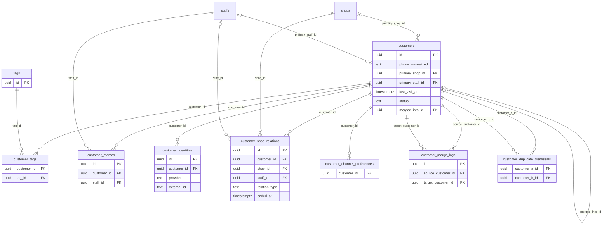

### テーブル定義

#### `customers`

- **目的**: 正規顧客。プロフィール、検索用生成列、来店統計（非正規化）、統合状態
- **補足**: `status='merged'` は統合済み（`merged_into_id` が統合先）。`search_text` は `normalize_search_text()` による正規化テキストで trigram 検索に使用
- **定義**: `0003_customers.sql`
- **RLS**: `tenant_isolation`（`organization_id = app_current_org()`、FORCE）

| カラム | 型 | NULL | 既定値 | 参照 / 制約 | 説明 |
|---|---|:-:|---|---|---|
| `id` | uuid |  | `gen_random_uuid()` | PK |  |
| `organization_id` | uuid |  |  | FK → organizations.id |  |
| `customer_number` | text | ○ |  |  | 店舗運用上の顧客番号(任意) |
| `last_name` | text |  | `''` |  |  |
| `first_name` | text |  | `''` |  |  |
| `last_name_kana` | text |  | `''` |  |  |
| `first_name_kana` | text |  | `''` |  |  |
| `gender` | text | ○ |  | CHECK gender IN ('female','male','other','unknown') |  |
| `birthday` | date | ○ |  |  |  |
| `phone` | text | ○ |  |  |  |
| `phone_normalized` | text | ○ |  |  | E.164 (+81...) |
| `email` | citext | ○ |  |  |  |
| `postal_code` | text | ○ |  |  |  |
| `address` | text | ○ |  |  |  |
| `occupation` | text | ○ |  |  |  |
| `acquisition_source` | text | ○ |  |  | 来店きっかけ |
| `primary_shop_id` | uuid | ○ |  | FK → shops.id |  |
| `primary_staff_id` | uuid | ○ |  | FK → staffs.id |  |
| `marketing_opt_in` | boolean |  | `true` |  |  |
| `first_visit_at` | timestamptz | ○ |  |  |  |
| `last_visit_at` | timestamptz | ○ |  |  |  |
| `visit_count` | int |  | `0` |  |  |
| `total_sales` | bigint |  | `0` |  |  |
| `avg_cycle_days` | numeric(8,2) | ○ |  |  |  |
| `next_appointment_at` | timestamptz | ○ |  |  |  |
| `point_balance` | int |  | `0` |  |  |
| `no_show_count` | int |  | `0` |  |  |
| `cancel_count` | int |  | `0` |  |  |
| `status` | text |  | `'active'` | CHECK status IN ('active','merged','blocked','deleted') |  |
| `merged_into_id` | uuid | ○ |  | FK → customers.id |  |
| `attributes` | jsonb |  | `'{}'::jsonb` |  | 髪質・アレルギー等の構造化属性 |
| `created_at` | timestamptz |  | `now()` |  |  |
| `updated_at` | timestamptz |  | `now()` |  |  |
| `created_by` | uuid | ○ |  |  |  |
| `updated_by` | uuid | ○ |  |  |  |
| `trace_id` | text | ○ |  |  |  |
| `deleted_at` | timestamptz | ○ |  |  |  |
| `search_text` | text | ○ |  | 生成列 (STORED) |  |

**インデックス**

- `customers_org_idx` (organization_id) WHERE deleted_at IS NULL
- `customers_phone_idx` (organization_id, phone_normalized) WHERE phone_normalized IS NOT NULL
- `customers_email_idx` (organization_id, email) WHERE email IS NOT NULL
- `customers_search_trgm` USING gin (search_text gin_trgm_ops)
- `customers_last_visit_idx` (organization_id, last_visit_at)
- `customers_birthday_month_idx` (organization_id, (extract(month FROM birthday)))
- UNIQUE `customers_number_idx` (organization_id, customer_number) WHERE customer_number IS NOT NULL AND deleted_at IS NULL

**トリガ**: `customers_updated (UPDATE → set_updated_at())`

#### `tags`

- **目的**: 顧客タグのマスタ（法人内で名称一意）
- **定義**: `0003_customers.sql`
- **RLS**: `tenant_isolation`（`organization_id = app_current_org()`、FORCE）

| カラム | 型 | NULL | 既定値 | 参照 / 制約 | 説明 |
|---|---|:-:|---|---|---|
| `id` | uuid |  | `gen_random_uuid()` | PK |  |
| `organization_id` | uuid |  |  | FK → organizations.id |  |
| `name` | text |  |  |  |  |
| `color` | text |  | `'#64748b'` |  |  |
| `created_at` | timestamptz |  | `now()` |  |  |

**テーブル制約**

- `UNIQUE (organization_id, name)`

#### `customer_tags`

- **目的**: 顧客とタグの対応
- **定義**: `0003_customers.sql`
- **RLS**: `tenant_isolation`（`organization_id = app_current_org()`、FORCE）

| カラム | 型 | NULL | 既定値 | 参照 / 制約 | 説明 |
|---|---|:-:|---|---|---|
| `customer_id` | uuid |  |  | FK → customers.id (ON DELETE CASCADE) |  |
| `tag_id` | uuid |  |  | FK → tags.id (ON DELETE CASCADE) |  |
| `organization_id` | uuid |  |  | FK → organizations.id |  |
| `created_at` | timestamptz |  | `now()` |  |  |

**テーブル制約**

- `PRIMARY KEY (customer_id, tag_id)`

**インデックス**

- `customer_tags_tag_idx` (tag_id)

#### `customer_memos`

- **目的**: 顧客メモ。`shared`（`customer.read` 保有者が閲覧）/ `private`（作成者本人のみ、オーナーも閲覧不可）
- **定義**: `0003_customers.sql`
- **RLS**: `tenant_isolation`（`organization_id = app_current_org()`、FORCE）

| カラム | 型 | NULL | 既定値 | 参照 / 制約 | 説明 |
|---|---|:-:|---|---|---|
| `id` | uuid |  | `gen_random_uuid()` | PK |  |
| `organization_id` | uuid |  |  | FK → organizations.id |  |
| `customer_id` | uuid |  |  | FK → customers.id |  |
| `staff_id` | uuid |  |  | FK → staffs.id |  |
| `body` | text |  |  |  |  |
| `visibility` | text |  | `'shared'` | CHECK visibility IN ('shared','private') |  |
| `pinned` | boolean |  | `false` |  |  |
| `created_at` | timestamptz |  | `now()` |  |  |
| `updated_at` | timestamptz |  | `now()` |  |  |
| `deleted_at` | timestamptz | ○ |  |  |  |

**インデックス**

- `customer_memos_customer_idx` (customer_id, created_at DESC)

**トリガ**: `customer_memos_updated (UPDATE → set_updated_at())`

#### `customer_identities`

- **目的**: 外部識別子（LINE userId、予約媒体会員ID 等）と顧客の対応。LINE はチャネルごとに userId が異なるため `provider_account_id` にチャネルIDを保持
- **補足**: `resolveCustomer()` の R-1 照合に使用。連携解除は `unlinked_at`
- **定義**: `0003_customers.sql`
- **RLS**: `tenant_isolation`（`organization_id = app_current_org()`、FORCE）

| カラム | 型 | NULL | 既定値 | 参照 / 制約 | 説明 |
|---|---|:-:|---|---|---|
| `id` | uuid |  | `gen_random_uuid()` | PK |  |
| `organization_id` | uuid |  |  | FK → organizations.id |  |
| `customer_id` | uuid |  |  | FK → customers.id |  |
| `provider` | text |  |  |  | line / mock_booking / hotpepper / google / web |
| `provider_account_id` | text |  | `''` |  | e.g. LINE channel id (userId is per provider) |
| `external_id` | text |  |  |  |  |
| `display_name` | text | ○ |  |  |  |
| `profile` | jsonb |  | `'{}'::jsonb` |  |  |
| `is_following` | boolean | ○ |  |  | LINE follow state |
| `linked_at` | timestamptz |  | `now()` |  |  |
| `unlinked_at` | timestamptz | ○ |  |  |  |
| `created_at` | timestamptz |  | `now()` |  |  |
| `updated_at` | timestamptz |  | `now()` |  |  |

**インデックス**

- UNIQUE `customer_identities_unique` (organization_id, provider, provider_account_id, external_id)
- `customer_identities_customer_idx` (customer_id)

**トリガ**: `customer_identities_updated (UPDATE → set_updated_at())`

#### `customer_shop_relations`

- **目的**: 顧客と店舗・担当スタッフの関係（`primary_staff` / `assigned` / `visited`）。期間付きで、異動・統合時の履歴を残す
- **補足**: 顧客可視性（所属店舗のスタッフのみ閲覧）の判定に使用
- **定義**: `0003_customers.sql`
- **RLS**: `tenant_isolation`（`organization_id = app_current_org()`、FORCE）

| カラム | 型 | NULL | 既定値 | 参照 / 制約 | 説明 |
|---|---|:-:|---|---|---|
| `id` | uuid |  | `gen_random_uuid()` | PK |  |
| `organization_id` | uuid |  |  | FK → organizations.id |  |
| `customer_id` | uuid |  |  | FK → customers.id |  |
| `shop_id` | uuid |  |  | FK → shops.id |  |
| `staff_id` | uuid | ○ |  | FK → staffs.id |  |
| `relation_type` | text |  |  | CHECK relation_type IN ('primary_staff','assigned','visited') |  |
| `started_at` | timestamptz |  | `now()` |  |  |
| `ended_at` | timestamptz | ○ |  |  |  |
| `end_reason` | text | ○ |  |  | transfer / retire / customer_request |
| `created_at` | timestamptz |  | `now()` |  |  |
| `updated_at` | timestamptz |  | `now()` |  |  |

**インデックス**

- `csr_customer_idx` (customer_id)
- `csr_staff_idx` (staff_id) WHERE ended_at IS NULL
- UNIQUE `csr_active_unique` (customer_id, shop_id, relation_type, coalesce(staff_id, '00000000-0000-0000-0000-000000000000'::uuid)) WHERE ended_at IS NULL

**トリガ**: `csr_updated (UPDATE → set_updated_at())`

#### `customer_channel_preferences`

- **目的**: チャネル別（LINE / メール / SMS）の配信許可（マーケティング / トランザクショナル）と変更元
- **定義**: `0003_customers.sql`
- **RLS**: `tenant_isolation`（`organization_id = app_current_org()`、FORCE）

| カラム | 型 | NULL | 既定値 | 参照 / 制約 | 説明 |
|---|---|:-:|---|---|---|
| `customer_id` | uuid |  |  | FK → customers.id |  |
| `organization_id` | uuid |  |  | FK → organizations.id |  |
| `channel` | text |  |  | CHECK channel IN ('line','email','sms') |  |
| `marketing_allowed` | boolean |  | `true` |  |  |
| `transactional_allowed` | boolean |  | `true` |  |  |
| `source` | text | ○ |  |  | unfollow / customer_request / staff |
| `updated_at` | timestamptz |  | `now()` |  |  |

**テーブル制約**

- `PRIMARY KEY (customer_id, channel)`

#### `customer_merge_logs`

- **目的**: 顧客統合の履歴。移動した行ID（`relinked`）と両顧客のスナップショットを保存し、Undo を可能にする
- **定義**: `0003_customers.sql`
- **RLS**: `tenant_isolation`（`organization_id = app_current_org()`、FORCE）

| カラム | 型 | NULL | 既定値 | 参照 / 制約 | 説明 |
|---|---|:-:|---|---|---|
| `id` | uuid |  | `gen_random_uuid()` | PK |  |
| `organization_id` | uuid |  |  | FK → organizations.id |  |
| `source_customer_id` | uuid |  |  | FK → customers.id |  |
| `target_customer_id` | uuid |  |  | FK → customers.id |  |
| `reason` | text | ○ |  |  |  |
| `match_rule` | text | ○ |  |  | exact_phone / exact_line / manual ... |
| `relinked` | jsonb |  | `'{}'::jsonb` |  |  |
| `source_snapshot` | jsonb |  |  |  |  |
| `target_snapshot` | jsonb |  |  |  |  |
| `merged_by` | uuid | ○ |  |  |  |
| `merged_at` | timestamptz |  | `now()` |  |  |
| `undone_at` | timestamptz | ○ |  |  |  |
| `undone_by` | uuid | ○ |  |  |  |

**インデックス**

- `cml_target_idx` (target_customer_id)

#### `customer_duplicate_dismissals`

- **目的**: 「重複ではない」と判定した顧客ペア（以後の重複候補から除外）
- **定義**: `0003_customers.sql`
- **RLS**: `tenant_isolation`（`organization_id = app_current_org()`、FORCE）

| カラム | 型 | NULL | 既定値 | 参照 / 制約 | 説明 |
|---|---|:-:|---|---|---|
| `organization_id` | uuid |  |  | FK → organizations.id |  |
| `customer_a_id` | uuid |  |  | FK → customers.id |  |
| `customer_b_id` | uuid |  |  | FK → customers.id |  |
| `dismissed_by` | uuid | ○ |  |  |  |
| `created_at` | timestamptz |  | `now()` |  |  |

**テーブル制約**

- `PRIMARY KEY (customer_a_id, customer_b_id)`
- `CHECK (customer_a_id < customer_b_id)`

## 4. カタログ・スケジュール（0004）

所有モジュール: catalog（メニュー・設備・クーポン）/ schedules（営業時間・勤務・ブロック）。`shop_id IS NULL` のメニュー/カテゴリ/クーポンは法人共通。空き枠計算はこれらを一括ロードして純関数で評価する（`schedules/calendar.ts`）。

### ER 図

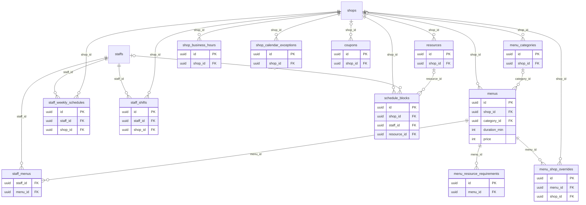

### テーブル定義

#### `menu_categories`

- **目的**: メニューカテゴリ（法人共通または店舗別）
- **定義**: `0004_catalog_schedules.sql`
- **RLS**: `tenant_isolation`（`organization_id = app_current_org()`、FORCE）

| カラム | 型 | NULL | 既定値 | 参照 / 制約 | 説明 |
|---|---|:-:|---|---|---|
| `id` | uuid |  | `gen_random_uuid()` | PK |  |
| `organization_id` | uuid |  |  | FK → organizations.id |  |
| `shop_id` | uuid | ○ |  | FK → shops.id |  |
| `name` | text |  |  |  |  |
| `sort_order` | int |  | `0` |  |  |
| `created_at` | timestamptz |  | `now()` |  |  |
| `updated_at` | timestamptz |  | `now()` |  |  |
| `deleted_at` | timestamptz | ○ |  |  |  |

**トリガ**: `menu_categories_updated (UPDATE → set_updated_at())`

#### `menus`

- **目的**: メニュー。所要時間・前後バッファ・税込価格・税率・Web 公開・相談予約・新規限定
- **補足**: `shop_id IS NULL` は法人共通メニュー
- **定義**: `0004_catalog_schedules.sql`
- **RLS**: `tenant_isolation`（`organization_id = app_current_org()`、FORCE）

| カラム | 型 | NULL | 既定値 | 参照 / 制約 | 説明 |
|---|---|:-:|---|---|---|
| `id` | uuid |  | `gen_random_uuid()` | PK |  |
| `organization_id` | uuid |  |  | FK → organizations.id |  |
| `shop_id` | uuid | ○ |  | FK → shops.id |  |
| `category_id` | uuid | ○ |  | FK → menu_categories.id |  |
| `name` | text |  |  |  |  |
| `description` | text | ○ |  |  |  |
| `duration_min` | int |  |  | CHECK duration_min > 0 AND duration_min <= 720 |  |
| `buffer_before_min` | int |  | `0` | CHECK buffer_before_min >= 0 |  |
| `buffer_after_min` | int |  | `0` | CHECK buffer_after_min >= 0 |  |
| `price` | int |  |  | CHECK price >= 0 |  |
| `price_tax_included` | boolean |  | `true` |  |  |
| `tax_rate_bp` | int |  | `1000` | CHECK tax_rate_bp >= 0 | basis points: 1000 = 10.00% |
| `is_public` | boolean |  | `true` |  | Web/LINE予約に表示 |
| `is_consultation` | boolean |  | `false` |  | 相談予約 |
| `new_customer_only` | boolean |  | `false` |  |  |
| `image_file_id` | uuid | ○ |  |  |  |
| `sort_order` | int |  | `0` |  |  |
| `status` | text |  | `'active'` | CHECK status IN ('active','inactive') |  |
| `created_at` | timestamptz |  | `now()` |  |  |
| `updated_at` | timestamptz |  | `now()` |  |  |
| `created_by` | uuid | ○ |  |  |  |
| `updated_by` | uuid | ○ |  |  |  |
| `trace_id` | text | ○ |  |  |  |
| `deleted_at` | timestamptz | ○ |  |  |  |

**インデックス**

- `menus_org_shop_idx` (organization_id, shop_id)

**トリガ**: `menus_updated (UPDATE → set_updated_at())`

#### `menu_shop_overrides`

- **目的**: 法人共通メニューの店舗別上書き（価格・時間・提供可否）
- **定義**: `0004_catalog_schedules.sql`
- **RLS**: `tenant_isolation`（`organization_id = app_current_org()`、FORCE）

| カラム | 型 | NULL | 既定値 | 参照 / 制約 | 説明 |
|---|---|:-:|---|---|---|
| `id` | uuid |  | `gen_random_uuid()` | PK |  |
| `organization_id` | uuid |  |  | FK → organizations.id |  |
| `menu_id` | uuid |  |  | FK → menus.id |  |
| `shop_id` | uuid |  |  | FK → shops.id |  |
| `price` | int | ○ |  | CHECK price >= 0 |  |
| `duration_min` | int | ○ |  | CHECK duration_min > 0 |  |
| `is_available` | boolean |  | `true` |  |  |
| `created_at` | timestamptz |  | `now()` |  |  |
| `updated_at` | timestamptz |  | `now()` |  |  |

**テーブル制約**

- `UNIQUE (menu_id, shop_id)`

**トリガ**: `mso_updated (UPDATE → set_updated_at())`

#### `staff_menus`

- **目的**: スタッフが担当可能なメニューと、スタッフ別の所要時間・料金（ランク別料金）
- **補足**: スタッフに1行もなければ全メニュー担当可
- **定義**: `0004_catalog_schedules.sql`
- **RLS**: `tenant_isolation`（`organization_id = app_current_org()`、FORCE）

| カラム | 型 | NULL | 既定値 | 参照 / 制約 | 説明 |
|---|---|:-:|---|---|---|
| `staff_id` | uuid |  |  | FK → staffs.id (ON DELETE CASCADE) |  |
| `menu_id` | uuid |  |  | FK → menus.id (ON DELETE CASCADE) |  |
| `organization_id` | uuid |  |  | FK → organizations.id |  |
| `duration_min` | int | ○ |  | CHECK duration_min > 0 | per-staff duration override |
| `price` | int | ○ |  | CHECK price >= 0 | per-staff price (ランク別料金) |

**テーブル制約**

- `PRIMARY KEY (staff_id, menu_id)`

#### `resources`

- **目的**: 席・シャンプー台・個室・設備。1行が1単位（容量1）
- **定義**: `0004_catalog_schedules.sql`
- **RLS**: `tenant_isolation`（`organization_id = app_current_org()`、FORCE）

| カラム | 型 | NULL | 既定値 | 参照 / 制約 | 説明 |
|---|---|:-:|---|---|---|
| `id` | uuid |  | `gen_random_uuid()` | PK |  |
| `organization_id` | uuid |  |  | FK → organizations.id |  |
| `shop_id` | uuid |  |  | FK → shops.id |  |
| `name` | text |  |  |  |  |
| `resource_type` | text |  |  |  | seat / shampoo / room / equipment |
| `sort_order` | int |  | `0` |  |  |
| `status` | text |  | `'active'` | CHECK status IN ('active','inactive') |  |
| `created_at` | timestamptz |  | `now()` |  |  |
| `updated_at` | timestamptz |  | `now()` |  |  |
| `deleted_at` | timestamptz | ○ |  |  |  |

**インデックス**

- `resources_shop_idx` (shop_id, resource_type)

**トリガ**: `resources_updated (UPDATE → set_updated_at())`

#### `menu_resource_requirements`

- **目的**: メニューが必要とする設備種別・開始オフセット・利用時間（NULL = メニュー全体）
- **定義**: `0004_catalog_schedules.sql`
- **RLS**: `tenant_isolation`（`organization_id = app_current_org()`、FORCE）

| カラム | 型 | NULL | 既定値 | 参照 / 制約 | 説明 |
|---|---|:-:|---|---|---|
| `id` | uuid |  | `gen_random_uuid()` | PK |  |
| `organization_id` | uuid |  |  | FK → organizations.id |  |
| `menu_id` | uuid |  |  | FK → menus.id (ON DELETE CASCADE) |  |
| `resource_type` | text |  |  |  |  |
| `offset_min` | int |  | `0` | CHECK offset_min >= 0 |  |
| `duration_min` | int | ○ |  | CHECK duration_min > 0 | NULL = whole menu duration |
| `created_at` | timestamptz |  | `now()` |  |  |

#### `shop_business_hours`

- **目的**: 曜日別の営業時間（同じ曜日に複数行で昼休み等を表現、0=日曜）
- **定義**: `0004_catalog_schedules.sql`
- **RLS**: `tenant_isolation`（`organization_id = app_current_org()`、FORCE）

| カラム | 型 | NULL | 既定値 | 参照 / 制約 | 説明 |
|---|---|:-:|---|---|---|
| `id` | uuid |  | `gen_random_uuid()` | PK |  |
| `organization_id` | uuid |  |  | FK → organizations.id |  |
| `shop_id` | uuid |  |  | FK → shops.id |  |
| `weekday` | smallint |  |  | CHECK weekday BETWEEN 0 AND 6 | 0=Sunday |
| `open_time` | time |  |  |  |  |
| `close_time` | time |  |  |  |  |

**テーブル制約**

- `CHECK (close_time > open_time)`

**インデックス**

- `sbh_shop_idx` (shop_id, weekday)

#### `shop_calendar_exceptions`

- **目的**: 休業日・特別営業（日付単位）
- **定義**: `0004_catalog_schedules.sql`
- **RLS**: `tenant_isolation`（`organization_id = app_current_org()`、FORCE）

| カラム | 型 | NULL | 既定値 | 参照 / 制約 | 説明 |
|---|---|:-:|---|---|---|
| `id` | uuid |  | `gen_random_uuid()` | PK |  |
| `organization_id` | uuid |  |  | FK → organizations.id |  |
| `shop_id` | uuid |  |  | FK → shops.id |  |
| `date` | date |  |  |  |  |
| `is_closed` | boolean |  | `true` |  |  |
| `open_time` | time | ○ |  |  |  |
| `close_time` | time | ○ |  |  |  |
| `note` | text | ○ |  |  |  |
| `created_at` | timestamptz |  | `now()` |  |  |

**テーブル制約**

- `UNIQUE (shop_id, date)`
- `CHECK (is_closed OR (open_time IS NOT NULL AND close_time IS NOT NULL AND close_time > open_time))`

#### `staff_weekly_schedules`

- **目的**: スタッフの店舗別・曜日別の基本勤務パターン
- **定義**: `0004_catalog_schedules.sql`
- **RLS**: `tenant_isolation`（`organization_id = app_current_org()`、FORCE）

| カラム | 型 | NULL | 既定値 | 参照 / 制約 | 説明 |
|---|---|:-:|---|---|---|
| `id` | uuid |  | `gen_random_uuid()` | PK |  |
| `organization_id` | uuid |  |  | FK → organizations.id |  |
| `staff_id` | uuid |  |  | FK → staffs.id |  |
| `shop_id` | uuid |  |  | FK → shops.id |  |
| `weekday` | smallint |  |  | CHECK weekday BETWEEN 0 AND 6 |  |
| `start_time` | time |  |  |  |  |
| `end_time` | time |  |  |  |  |

**テーブル制約**

- `CHECK (end_time > start_time)`

**インデックス**

- `sws_staff_idx` (staff_id, weekday)

#### `staff_shifts`

- **目的**: 日付指定のシフト（`work` / `off`）。その日の行があれば週パターンを置き換える
- **定義**: `0004_catalog_schedules.sql`
- **RLS**: `tenant_isolation`（`organization_id = app_current_org()`、FORCE）

| カラム | 型 | NULL | 既定値 | 参照 / 制約 | 説明 |
|---|---|:-:|---|---|---|
| `id` | uuid |  | `gen_random_uuid()` | PK |  |
| `organization_id` | uuid |  |  | FK → organizations.id |  |
| `staff_id` | uuid |  |  | FK → staffs.id |  |
| `shop_id` | uuid |  |  | FK → shops.id |  |
| `date` | date |  |  |  |  |
| `shift_type` | text |  | `'work'` | CHECK shift_type IN ('work','off') |  |
| `start_time` | time | ○ |  |  |  |
| `end_time` | time | ○ |  |  |  |
| `note` | text | ○ |  |  |  |
| `created_at` | timestamptz |  | `now()` |  |  |
| `updated_at` | timestamptz |  | `now()` |  |  |

**テーブル制約**

- `CHECK (shift_type = 'off' OR (start_time IS NOT NULL AND end_time IS NOT NULL AND end_time > start_time))`

**インデックス**

- `staff_shifts_staff_date_idx` (staff_id, date)

**トリガ**: `staff_shifts_updated (UPDATE → set_updated_at())`

#### `schedule_blocks`

- **目的**: 予約ブロック（会議・研修・休憩・設備停止、外部予約枠の反映）
- **定義**: `0004_catalog_schedules.sql`
- **RLS**: `tenant_isolation`（`organization_id = app_current_org()`、FORCE）

| カラム | 型 | NULL | 既定値 | 参照 / 制約 | 説明 |
|---|---|:-:|---|---|---|
| `id` | uuid |  | `gen_random_uuid()` | PK |  |
| `organization_id` | uuid |  |  | FK → organizations.id |  |
| `shop_id` | uuid |  |  | FK → shops.id |  |
| `staff_id` | uuid | ○ |  | FK → staffs.id |  |
| `resource_id` | uuid | ○ |  | FK → resources.id |  |
| `start_at` | timestamptz |  |  |  |  |
| `end_at` | timestamptz |  |  |  |  |
| `reason` | text | ○ |  |  |  |
| `source` | text |  | `'manual'` |  | manual / external |
| `created_by` | uuid | ○ |  |  |  |
| `created_at` | timestamptz |  | `now()` |  |  |

**テーブル制約**

- `CHECK (end_at > start_at)`
- `CHECK (staff_id IS NOT NULL OR resource_id IS NOT NULL)`

**インデックス**

- `schedule_blocks_staff_idx` USING gist (staff_id, tstzrange(start_at, end_at))

#### `coupons`

- **目的**: クーポン（定額 / 定率 / 固定価格、対象メニュー、期間、利用上限、新規限定、公開可否）
- **定義**: `0004_catalog_schedules.sql`
- **RLS**: `tenant_isolation`（`organization_id = app_current_org()`、FORCE）

| カラム | 型 | NULL | 既定値 | 参照 / 制約 | 説明 |
|---|---|:-:|---|---|---|
| `id` | uuid |  | `gen_random_uuid()` | PK |  |
| `organization_id` | uuid |  |  | FK → organizations.id |  |
| `shop_id` | uuid | ○ |  | FK → shops.id |  |
| `code` | citext | ○ |  |  |  |
| `name` | text |  |  |  |  |
| `description` | text | ○ |  |  |  |
| `discount_type` | text |  |  | CHECK discount_type IN ('amount','percent','fixed_price') |  |
| `discount_value` | int |  |  | CHECK discount_value >= 0 |  |
| `applicable_menu_ids` | uuid[] |  | `'{}'` |  |  |
| `min_amount` | int |  | `0` |  |  |
| `valid_from` | timestamptz | ○ |  |  |  |
| `valid_until` | timestamptz | ○ |  |  |  |
| `usage_limit` | int | ○ |  |  |  |
| `per_customer_limit` | int | ○ |  |  |  |
| `new_customer_only` | boolean |  | `false` |  |  |
| `is_public` | boolean |  | `true` |  |  |
| `status` | text |  | `'active'` | CHECK status IN ('active','inactive') |  |
| `created_at` | timestamptz |  | `now()` |  |  |
| `updated_at` | timestamptz |  | `now()` |  |  |
| `deleted_at` | timestamptz | ○ |  |  |  |

**テーブル制約**

- `CHECK (discount_type <> 'percent' OR discount_value <= 100)`

**インデックス**

- UNIQUE `coupons_code_idx` (organization_id, code) WHERE code IS NOT NULL AND deleted_at IS NULL

**トリガ**: `coupons_updated (UPDATE → set_updated_at())`

## 5. 予約（0005）

所有モジュール: appointments。二重予約は排他制約（EXCLUDE USING gist）で物理的に防止する（ADR 0003）。`appointment_events` は予約の変更履歴で、通知・外部同期・分析と同じイベントモデルを共有する。

### ER 図

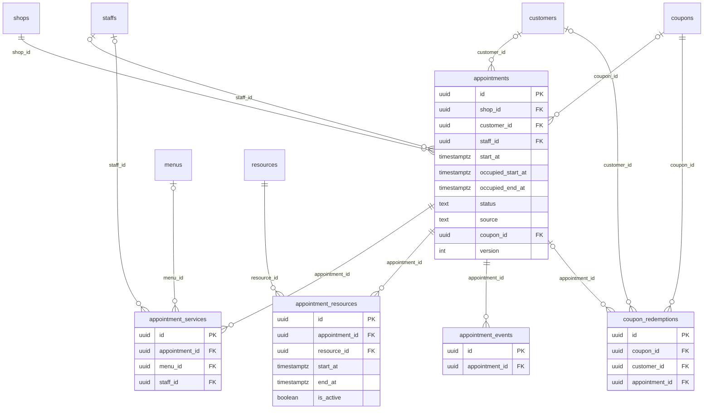

### テーブル定義

#### `appointments`

- **目的**: 予約。顧客・店舗・担当（指名/フリー）・施術時間・占有時間（バッファ込み）・状態・予約経路・楽観ロック
- **補足**: `booking_reference` は顧客提示用の予約番号（紛らわしい文字を除いた8文字）
- **定義**: `0005_appointments.sql`
- **RLS**: `tenant_isolation`（`organization_id = app_current_org()`、FORCE）

| カラム | 型 | NULL | 既定値 | 参照 / 制約 | 説明 |
|---|---|:-:|---|---|---|
| `id` | uuid |  | `gen_random_uuid()` | PK |  |
| `organization_id` | uuid |  |  | FK → organizations.id |  |
| `shop_id` | uuid |  |  | FK → shops.id |  |
| `customer_id` | uuid | ○ |  | FK → customers.id |  |
| `staff_id` | uuid | ○ |  | FK → staffs.id |  |
| `is_nominated` | boolean |  | `false` |  | 指名(true) / フリー(false) |
| `booking_reference` | text |  |  |  | 顧客提示用予約番号 |
| `start_at` | timestamptz |  |  |  | 施術開始 |
| `end_at` | timestamptz |  |  |  | 施術終了 |
| `occupied_start_at` | timestamptz |  |  |  | バッファ込み占有開始 |
| `occupied_end_at` | timestamptz |  |  |  | バッファ込み占有終了 |
| `status` | text |  | `'confirmed'` | CHECK status IN ('tentative','confirmed','checked_in','in_service','completed','cancelled','no_show') |  |
| `source` | text |  | `'staff'` | CHECK source IN ('web','line','external','phone','walk_in','staff') |  |
| `source_detail` | jsonb |  | `'{}'::jsonb` |  | provider, utm, referral_code ... |
| `coupon_id` | uuid | ○ |  | FK → coupons.id |  |
| `is_consultation` | boolean |  | `false` |  |  |
| `customer_note` | text | ○ |  |  |  |
| `staff_note` | text | ○ |  |  |  |
| `estimated_total` | int |  | `0` |  |  |
| `cancel_reason` | text | ○ |  |  |  |
| `cancelled_at` | timestamptz | ○ |  |  |  |
| `cancelled_by_type` | text | ○ |  | CHECK cancelled_by_type IN ('customer','staff','system','external') |  |
| `confirmed_at` | timestamptz | ○ |  |  |  |
| `checked_in_at` | timestamptz | ○ |  |  |  |
| `completed_at` | timestamptz | ○ |  |  |  |
| `no_show_at` | timestamptz | ○ |  |  |  |
| `version` | int |  | `1` |  | optimistic locking |
| `created_at` | timestamptz |  | `now()` |  |  |
| `updated_at` | timestamptz |  | `now()` |  |  |
| `created_by` | uuid | ○ |  |  |  |
| `updated_by` | uuid | ○ |  |  |  |
| `trace_id` | text | ○ |  |  |  |
| `deleted_at` | timestamptz | ○ |  |  |  |

**テーブル制約**

- `CHECK (end_at > start_at)`
- `CHECK (occupied_start_at <= start_at AND occupied_end_at >= end_at)`
- `CONSTRAINT appointments_no_staff_overlap EXCLUDE USING gist ( staff_id WITH =, tstzrange(occupied_start_at, occupied_end_at, '[)') WITH && ) WHERE (staff_id IS NOT NULL AND deleted_at IS NULL AND status IN ('tentative','confirmed','checked_in','in_service','completed'))`

**インデックス**

- UNIQUE `appointments_reference_idx` (organization_id, booking_reference)
- `appointments_shop_time_idx` (shop_id, start_at)
- `appointments_customer_idx` (customer_id, start_at DESC)
- `appointments_staff_time_idx` (staff_id, start_at)

**トリガ**: `appointments_updated (UPDATE → set_updated_at())`

#### `appointment_services`

- **目的**: 予約のメニュー明細（予約時点の名称・時間・価格・税率のスナップショット）
- **定義**: `0005_appointments.sql`
- **RLS**: `tenant_isolation`（`organization_id = app_current_org()`、FORCE）

| カラム | 型 | NULL | 既定値 | 参照 / 制約 | 説明 |
|---|---|:-:|---|---|---|
| `id` | uuid |  | `gen_random_uuid()` | PK |  |
| `organization_id` | uuid |  |  | FK → organizations.id |  |
| `appointment_id` | uuid |  |  | FK → appointments.id (ON DELETE CASCADE) |  |
| `menu_id` | uuid | ○ |  | FK → menus.id |  |
| `name` | text |  |  |  | snapshot |
| `duration_min` | int |  |  | CHECK duration_min > 0 |  |
| `price` | int |  |  | CHECK price >= 0 |  |
| `tax_rate_bp` | int |  | `1000` |  |  |
| `staff_id` | uuid | ○ |  | FK → staffs.id |  |
| `start_offset_min` | int |  | `0` |  |  |
| `sort_order` | int |  | `0` |  |  |
| `created_at` | timestamptz |  | `now()` |  |  |

**インデックス**

- `appointment_services_appt_idx` (appointment_id)

#### `appointment_resources`

- **目的**: 予約が占有する設備単位と時間。キャンセル時は `is_active=false` で解放
- **定義**: `0005_appointments.sql`
- **RLS**: `tenant_isolation`（`organization_id = app_current_org()`、FORCE）

| カラム | 型 | NULL | 既定値 | 参照 / 制約 | 説明 |
|---|---|:-:|---|---|---|
| `id` | uuid |  | `gen_random_uuid()` | PK |  |
| `organization_id` | uuid |  |  | FK → organizations.id |  |
| `appointment_id` | uuid |  |  | FK → appointments.id (ON DELETE CASCADE) |  |
| `resource_id` | uuid |  |  | FK → resources.id |  |
| `start_at` | timestamptz |  |  |  |  |
| `end_at` | timestamptz |  |  |  |  |
| `is_active` | boolean |  | `true` |  | false when appointment cancelled |

**テーブル制約**

- `CHECK (end_at > start_at)`
- `CONSTRAINT appointment_resources_no_overlap EXCLUDE USING gist ( resource_id WITH =, tstzrange(start_at, end_at, '[)') WITH && ) WHERE (is_active)`

**インデックス**

- `appointment_resources_appt_idx` (appointment_id)

#### `appointment_events`

- **目的**: 予約の変更履歴（created / rescheduled / updated / confirmed / checked_in / in_service / completed / cancelled / no_show / restored）
- **定義**: `0005_appointments.sql`
- **RLS**: `tenant_isolation`（`organization_id = app_current_org()`、FORCE）

| カラム | 型 | NULL | 既定値 | 参照 / 制約 | 説明 |
|---|---|:-:|---|---|---|
| `id` | uuid |  | `gen_random_uuid()` | PK |  |
| `organization_id` | uuid |  |  | FK → organizations.id |  |
| `appointment_id` | uuid |  |  | FK → appointments.id (ON DELETE CASCADE) |  |
| `event_type` | text |  |  |  | created / rescheduled / updated / cancelled / no_show / checked_in / completed / restored |
| `actor_type` | text |  |  | CHECK actor_type IN ('staff','customer','system','external') |  |
| `actor_id` | uuid | ○ |  |  |  |
| `payload` | jsonb |  | `'{}'::jsonb` |  |  |
| `trace_id` | text | ○ |  |  |  |
| `created_at` | timestamptz |  | `now()` |  |  |

**インデックス**

- `appointment_events_appt_idx` (appointment_id, created_at)

#### `coupon_redemptions`

- **目的**: クーポン利用（予約時 `reserved` → 会計確定で `redeemed` / キャンセルで `released`）
- **定義**: `0005_appointments.sql`
- **RLS**: `tenant_isolation`（`organization_id = app_current_org()`、FORCE）

| カラム | 型 | NULL | 既定値 | 参照 / 制約 | 説明 |
|---|---|:-:|---|---|---|
| `id` | uuid |  | `gen_random_uuid()` | PK |  |
| `organization_id` | uuid |  |  | FK → organizations.id |  |
| `coupon_id` | uuid |  |  | FK → coupons.id |  |
| `customer_id` | uuid | ○ |  | FK → customers.id |  |
| `appointment_id` | uuid | ○ |  | FK → appointments.id |  |
| `transaction_id` | uuid | ○ |  |  |  |
| `status` | text |  | `'reserved'` | CHECK status IN ('reserved','redeemed','released') |  |
| `created_at` | timestamptz |  | `now()` |  |  |
| `updated_at` | timestamptz |  | `now()` |  |  |

**テーブル制約**

- `coupon_redemptions_tx_fk: FOREIGN KEY (transaction_id) REFERENCES transactions(id)`

**インデックス**

- `coupon_redemptions_coupon_idx` (coupon_id, customer_id)

**トリガ**: `coupon_redemptions_updated (UPDATE → set_updated_at())`

## 6. ファイル・カルテ・フォーム（0006）

所有モジュール: files / kartes。ファイル実体は Object Storage に置き、DB はメタデータのみ。`access_tokens` は顧客向け単一目的リンク（事前問診・カルテ共有・口コミ依頼・LINE連携・予約管理・商品共有）の共通基盤（`lib/access-tokens.ts`）。

### ER 図

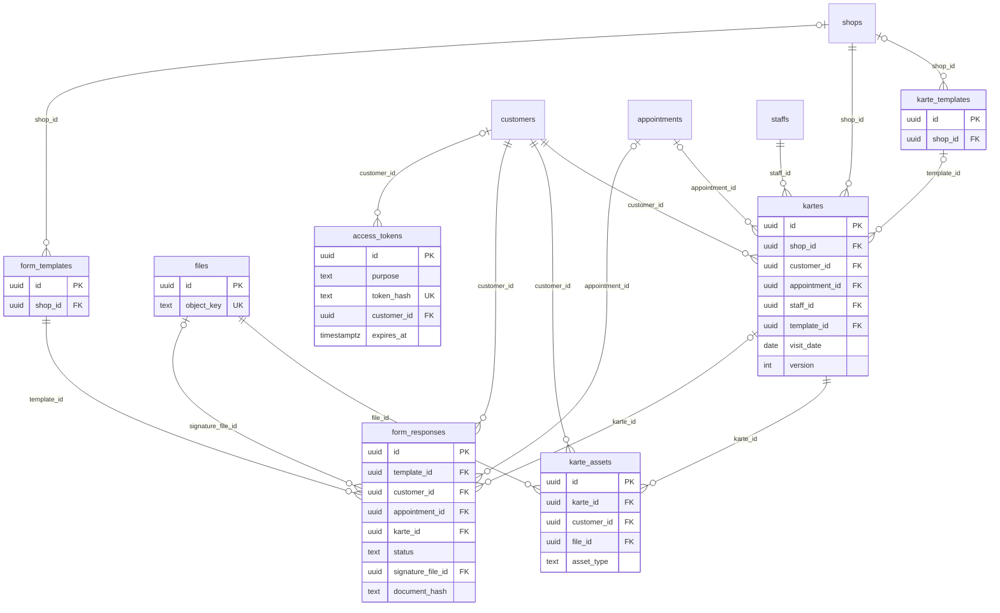

### テーブル定義

#### `files`

- **目的**: Object Storage 上のファイルのメタデータ（用途・Content-Type・サイズ・チェックサム・状態）
- **定義**: `0006_kartes_forms_files.sql`
- **RLS**: `tenant_isolation`（`organization_id = app_current_org()`、FORCE）

| カラム | 型 | NULL | 既定値 | 参照 / 制約 | 説明 |
|---|---|:-:|---|---|---|
| `id` | uuid |  | `gen_random_uuid()` | PK |  |
| `organization_id` | uuid |  |  | FK → organizations.id |  |
| `object_key` | text |  |  | UNIQUE |  |
| `purpose` | text |  |  |  | karte_photo / sketch / signature / product_image / staff_photo / export / sns_asset |
| `content_type` | text |  |  |  |  |
| `size_bytes` | bigint | ○ |  |  |  |
| `checksum_sha256` | text | ○ |  |  |  |
| `status` | text |  | `'pending'` | CHECK status IN ('pending','uploaded','deleted') |  |
| `uploaded_by` | uuid | ○ |  |  |  |
| `created_at` | timestamptz |  | `now()` |  |  |
| `uploaded_at` | timestamptz | ○ |  |  |  |
| `deleted_at` | timestamptz | ○ |  |  |  |

**インデックス**

- `files_org_idx` (organization_id, purpose)

#### `karte_templates`

- **目的**: カルテテンプレート（項目定義 `fields`、カテゴリ、既定）
- **定義**: `0006_kartes_forms_files.sql`
- **RLS**: `tenant_isolation`（`organization_id = app_current_org()`、FORCE）

| カラム | 型 | NULL | 既定値 | 参照 / 制約 | 説明 |
|---|---|:-:|---|---|---|
| `id` | uuid |  | `gen_random_uuid()` | PK |  |
| `organization_id` | uuid |  |  | FK → organizations.id |  |
| `shop_id` | uuid | ○ |  | FK → shops.id |  |
| `name` | text |  |  |  |  |
| `category` | text | ○ |  |  | cut / color / perm / eyelash / nail / esthe |
| `fields` | jsonb |  | `'[]'::jsonb` |  | [{key,label,type,options,required}] |
| `is_default` | boolean |  | `false` |  |  |
| `status` | text |  | `'active'` | CHECK status IN ('active','inactive') |  |
| `created_at` | timestamptz |  | `now()` |  |  |
| `updated_at` | timestamptz |  | `now()` |  |  |

**トリガ**: `karte_templates_updated (UPDATE → set_updated_at())`

#### `kartes`

- **目的**: 施術カルテ（テンプレート項目値・薬剤配合・メモ・ホームケア・顧客共有状態・楽観ロック）
- **定義**: `0006_kartes_forms_files.sql`
- **RLS**: `tenant_isolation`（`organization_id = app_current_org()`、FORCE）

| カラム | 型 | NULL | 既定値 | 参照 / 制約 | 説明 |
|---|---|:-:|---|---|---|
| `id` | uuid |  | `gen_random_uuid()` | PK |  |
| `organization_id` | uuid |  |  | FK → organizations.id |  |
| `shop_id` | uuid |  |  | FK → shops.id |  |
| `customer_id` | uuid |  |  | FK → customers.id |  |
| `appointment_id` | uuid | ○ |  | FK → appointments.id |  |
| `staff_id` | uuid |  |  | FK → staffs.id |  |
| `template_id` | uuid | ○ |  | FK → karte_templates.id |  |
| `visit_date` | date |  |  |  |  |
| `fields` | jsonb |  | `'{}'::jsonb` |  |  |
| `chemicals` | jsonb |  | `'[]'::jsonb` |  | [{name, brand, ratio, processing_min, note}] |
| `note` | text | ○ |  |  |  |
| `homecare` | jsonb |  | `'{}'::jsonb` |  | {advice, product_ids[]} |
| `shared_with_customer` | boolean |  | `false` |  |  |
| `shared_at` | timestamptz | ○ |  |  |  |
| `version` | int |  | `1` |  |  |
| `created_at` | timestamptz |  | `now()` |  |  |
| `updated_at` | timestamptz |  | `now()` |  |  |
| `created_by` | uuid | ○ |  |  |  |
| `updated_by` | uuid | ○ |  |  |  |
| `trace_id` | text | ○ |  |  |  |
| `deleted_at` | timestamptz | ○ |  |  |  |

**インデックス**

- `kartes_customer_idx` (customer_id, visit_date DESC)
- `kartes_appointment_idx` (appointment_id)

**トリガ**: `kartes_updated (UPDATE → set_updated_at())`

#### `karte_assets`

- **目的**: カルテの写真・スケッチ・文書（ビフォー/アフター、顧客共有可否）
- **定義**: `0006_kartes_forms_files.sql`
- **RLS**: `tenant_isolation`（`organization_id = app_current_org()`、FORCE）

| カラム | 型 | NULL | 既定値 | 参照 / 制約 | 説明 |
|---|---|:-:|---|---|---|
| `id` | uuid |  | `gen_random_uuid()` | PK |  |
| `organization_id` | uuid |  |  | FK → organizations.id |  |
| `karte_id` | uuid |  |  | FK → kartes.id |  |
| `customer_id` | uuid |  |  | FK → customers.id |  |
| `file_id` | uuid |  |  | FK → files.id |  |
| `object_key` | text |  |  |  |  |
| `asset_type` | text |  |  | CHECK asset_type IN ('photo_before','photo_after','photo','sketch','document') |  |
| `caption` | text | ○ |  |  |  |
| `share_with_customer` | boolean |  | `false` |  |  |
| `sort_order` | int |  | `0` |  |  |
| `created_at` | timestamptz |  | `now()` |  |  |
| `created_by` | uuid | ○ |  |  |  |
| `deleted_at` | timestamptz | ○ |  |  |  |

**インデックス**

- `karte_assets_karte_idx` (karte_id)
- `karte_assets_customer_idx` (customer_id)

#### `form_templates`

- **目的**: カウンセリングシート・同意書・事前問診のテンプレート（版管理、署名要否）
- **定義**: `0006_kartes_forms_files.sql`
- **RLS**: `tenant_isolation`（`organization_id = app_current_org()`、FORCE）

| カラム | 型 | NULL | 既定値 | 参照 / 制約 | 説明 |
|---|---|:-:|---|---|---|
| `id` | uuid |  | `gen_random_uuid()` | PK |  |
| `organization_id` | uuid |  |  | FK → organizations.id |  |
| `shop_id` | uuid | ○ |  | FK → shops.id |  |
| `kind` | text |  |  | CHECK kind IN ('counseling','consent','pre_visit') |  |
| `name` | text |  |  |  |  |
| `fields` | jsonb |  | `'[]'::jsonb` |  |  |
| `body_markdown` | text | ○ |  |  | consent text |
| `version` | int |  | `1` |  |  |
| `requires_signature` | boolean |  | `false` |  |  |
| `status` | text |  | `'active'` | CHECK status IN ('draft','active','archived') |  |
| `created_at` | timestamptz |  | `now()` |  |  |
| `updated_at` | timestamptz |  | `now()` |  |  |

**トリガ**: `form_templates_updated (UPDATE → set_updated_at())`

#### `form_responses`

- **目的**: フォーム回答。回答時のテンプレートスナップショット・回答・署名画像・`document_hash`（改ざん検知）・IP/UA
- **補足**: 署名後は不変（`voided` のみ可）
- **定義**: `0006_kartes_forms_files.sql`
- **RLS**: `tenant_isolation`（`organization_id = app_current_org()`、FORCE）

| カラム | 型 | NULL | 既定値 | 参照 / 制約 | 説明 |
|---|---|:-:|---|---|---|
| `id` | uuid |  | `gen_random_uuid()` | PK |  |
| `organization_id` | uuid |  |  | FK → organizations.id |  |
| `template_id` | uuid |  |  | FK → form_templates.id |  |
| `template_version` | int |  |  |  |  |
| `template_snapshot` | jsonb |  |  |  | fields + consent body at time of signing |
| `customer_id` | uuid |  |  | FK → customers.id |  |
| `appointment_id` | uuid | ○ |  | FK → appointments.id |  |
| `karte_id` | uuid | ○ |  | FK → kartes.id |  |
| `answers` | jsonb |  | `'{}'::jsonb` |  |  |
| `status` | text |  | `'pending'` | CHECK status IN ('pending','submitted','voided') |  |
| `submitted_via` | text | ○ |  | CHECK submitted_via IN ('staff','customer_link','line') |  |
| `signature_file_id` | uuid | ○ |  | FK → files.id |  |
| `signer_name` | text | ○ |  |  |  |
| `signed_at` | timestamptz | ○ |  |  |  |
| `document_hash` | text | ○ |  |  |  |
| `ip` | inet | ○ |  |  |  |
| `user_agent` | text | ○ |  |  |  |
| `created_at` | timestamptz |  | `now()` |  |  |
| `updated_at` | timestamptz |  | `now()` |  |  |
| `created_by` | uuid | ○ |  |  |  |

**インデックス**

- `form_responses_customer_idx` (customer_id, created_at DESC)

**トリガ**: `form_responses_updated (UPDATE → set_updated_at())`

#### `access_tokens`

- **目的**: 単一目的の署名付きリンク。トークンは HMAC のみ保存し、目的・対象リソース・顧客・期限・回数を制限
- **定義**: `0006_kartes_forms_files.sql`
- **RLS**: `tenant_isolation`（`organization_id = app_current_org()`、FORCE）

| カラム | 型 | NULL | 既定値 | 参照 / 制約 | 説明 |
|---|---|:-:|---|---|---|
| `id` | uuid |  | `gen_random_uuid()` | PK |  |
| `organization_id` | uuid |  |  | FK → organizations.id |  |
| `purpose` | text |  |  | CHECK purpose IN ('pre_visit_form','karte_share','review_request','line_link','booking_manage','product_share') |  |
| `token_hash` | text |  |  | UNIQUE |  |
| `resource_type` | text |  |  |  |  |
| `resource_id` | uuid |  |  |  |  |
| `customer_id` | uuid | ○ |  | FK → customers.id |  |
| `max_uses` | int | ○ |  |  |  |
| `use_count` | int |  | `0` |  |  |
| `expires_at` | timestamptz |  |  |  |  |
| `revoked_at` | timestamptz | ○ |  |  |  |
| `last_used_at` | timestamptz | ○ |  |  |  |
| `created_by` | uuid | ○ |  |  |  |
| `created_at` | timestamptz |  | `now()` |  |  |

**インデックス**

- `access_tokens_resource_idx` (resource_type, resource_id)

## 7. 商品・EC・POS・決済（0007）

所有モジュール: commerce（商品・在庫・注文）/ pos（会計・レジ・レシート・ポイント・採番）/ payments（決済・返金）。金額は税込の整数円、税率は basis points。会計確定後は明細を変更せず、取消・返金は状態と別レコードで表す（ADR 0005）。

### ER 図

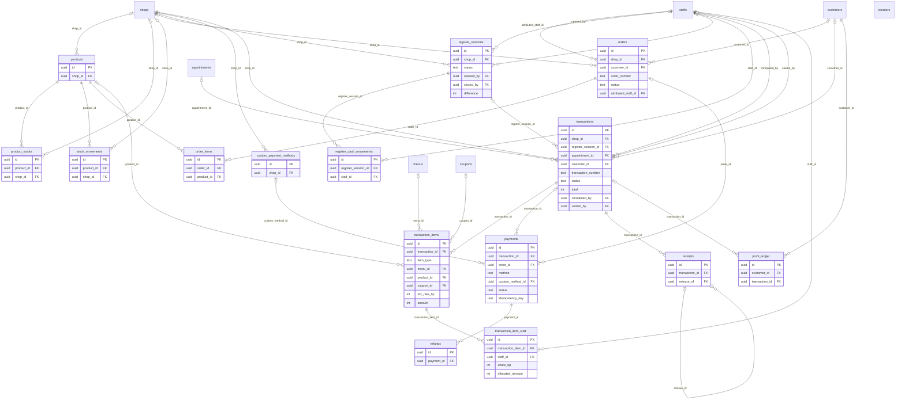

### テーブル定義

#### `products`

- **目的**: 商品マスタ（SKU・バーコード・税込価格・原価・税率・画像・EC 販売可否・在庫管理有無）
- **補足**: `shop_id IS NULL` は法人共通
- **定義**: `0007_commerce_pos_payments.sql`
- **RLS**: `tenant_isolation`（`organization_id = app_current_org()`、FORCE）

| カラム | 型 | NULL | 既定値 | 参照 / 制約 | 説明 |
|---|---|:-:|---|---|---|
| `id` | uuid |  | `gen_random_uuid()` | PK |  |
| `organization_id` | uuid |  |  | FK → organizations.id |  |
| `shop_id` | uuid | ○ |  | FK → shops.id | NULL = 法人共通 |
| `sku` | text | ○ |  |  |  |
| `barcode` | text | ○ |  |  |  |
| `name` | text |  |  |  |  |
| `brand` | text | ○ |  |  |  |
| `category` | text | ○ |  |  |  |
| `description` | text | ○ |  |  |  |
| `price` | int |  |  | CHECK price >= 0 |  |
| `price_tax_included` | boolean |  | `true` |  |  |
| `cost` | int | ○ |  | CHECK cost >= 0 |  |
| `tax_rate_bp` | int |  | `1000` |  |  |
| `image_file_ids` | uuid[] |  | `'{}'` |  |  |
| `is_online` | boolean |  | `false` |  | EC販売 |
| `stock_managed` | boolean |  | `true` |  |  |
| `status` | text |  | `'active'` | CHECK status IN ('active','inactive') |  |
| `created_at` | timestamptz |  | `now()` |  |  |
| `updated_at` | timestamptz |  | `now()` |  |  |
| `created_by` | uuid | ○ |  |  |  |
| `updated_by` | uuid | ○ |  |  |  |
| `trace_id` | text | ○ |  |  |  |
| `deleted_at` | timestamptz | ○ |  |  |  |

**インデックス**

- UNIQUE `products_sku_idx` (organization_id, sku) WHERE sku IS NOT NULL AND deleted_at IS NULL

**トリガ**: `products_updated (UPDATE → set_updated_at())`

#### `product_stocks`

- **目的**: 商品の在庫数（店舗別、`shop_id IS NULL` は EC 倉庫）と発注点
- **定義**: `0007_commerce_pos_payments.sql`
- **RLS**: `tenant_isolation`（`organization_id = app_current_org()`、FORCE）

| カラム | 型 | NULL | 既定値 | 参照 / 制約 | 説明 |
|---|---|:-:|---|---|---|
| `id` | uuid |  | `gen_random_uuid()` | PK |  |
| `organization_id` | uuid |  |  | FK → organizations.id |  |
| `product_id` | uuid |  |  | FK → products.id |  |
| `shop_id` | uuid | ○ |  | FK → shops.id |  |
| `quantity` | int |  | `0` |  |  |
| `reorder_point` | int | ○ |  |  |  |
| `updated_at` | timestamptz |  | `now()` |  |  |

**インデックス**

- UNIQUE `product_stocks_unique` (product_id, coalesce(shop_id, '00000000-0000-0000-0000-000000000000'::uuid))

**トリガ**: `product_stocks_updated (UPDATE → set_updated_at())`

#### `stock_movements`

- **目的**: 在庫移動履歴（販売・注文・調整・返品・入荷・キャンセル・移動）。在庫数は移動の合計と一致させる
- **定義**: `0007_commerce_pos_payments.sql`
- **RLS**: `tenant_isolation`（`organization_id = app_current_org()`、FORCE）

| カラム | 型 | NULL | 既定値 | 参照 / 制約 | 説明 |
|---|---|:-:|---|---|---|
| `id` | uuid |  | `gen_random_uuid()` | PK |  |
| `organization_id` | uuid |  |  | FK → organizations.id |  |
| `product_id` | uuid |  |  | FK → products.id |  |
| `shop_id` | uuid | ○ |  | FK → shops.id |  |
| `delta` | int |  |  |  |  |
| `reason` | text |  |  | CHECK reason IN ('sale','order','adjust','return','receive','cancel','transfer') |  |
| `transaction_id` | uuid | ○ |  |  |  |
| `order_id` | uuid | ○ |  |  |  |
| `note` | text | ○ |  |  |  |
| `created_by` | uuid | ○ |  |  |  |
| `created_at` | timestamptz |  | `now()` |  |  |

**インデックス**

- `stock_movements_product_idx` (product_id, created_at DESC)

#### `orders`

- **目的**: EC/LINE/スタッフ経由の注文。金額・配送先・紹介スタッフ・紹介リンク・配送状況
- **定義**: `0007_commerce_pos_payments.sql`
- **RLS**: `tenant_isolation`（`organization_id = app_current_org()`、FORCE）

| カラム | 型 | NULL | 既定値 | 参照 / 制約 | 説明 |
|---|---|:-:|---|---|---|
| `id` | uuid |  | `gen_random_uuid()` | PK |  |
| `organization_id` | uuid |  |  | FK → organizations.id |  |
| `shop_id` | uuid | ○ |  | FK → shops.id |  |
| `customer_id` | uuid | ○ |  | FK → customers.id |  |
| `order_number` | text |  |  |  |  |
| `channel` | text |  | `'online'` | CHECK channel IN ('online','line','staff') |  |
| `status` | text |  | `'pending'` | CHECK status IN ('pending','paid','processing','shipped','delivered','cancelled','refunded') |  |
| `subtotal` | int |  | `0` |  |  |
| `shipping_fee` | int |  | `0` |  |  |
| `discount_total` | int |  | `0` |  |  |
| `tax_total` | int |  | `0` |  |  |
| `total` | int |  | `0` |  |  |
| `shipping_address` | jsonb | ○ |  |  |  |
| `contact_email` | citext | ○ |  |  |  |
| `contact_phone` | text | ○ |  |  |  |
| `attributed_staff_id` | uuid | ○ |  | FK → staffs.id | 店販紹介スタッフ |
| `referral_link_id` | uuid | ○ |  |  |  |
| `is_subscription` | boolean |  | `false` |  | 定期購入(拡張余地) |
| `carrier` | text | ○ |  |  |  |
| `tracking_number` | text | ○ |  |  |  |
| `paid_at` | timestamptz | ○ |  |  |  |
| `shipped_at` | timestamptz | ○ |  |  |  |
| `delivered_at` | timestamptz | ○ |  |  |  |
| `cancelled_at` | timestamptz | ○ |  |  |  |
| `cancel_reason` | text | ○ |  |  |  |
| `note` | text | ○ |  |  |  |
| `created_at` | timestamptz |  | `now()` |  |  |
| `updated_at` | timestamptz |  | `now()` |  |  |
| `created_by` | uuid | ○ |  |  |  |
| `trace_id` | text | ○ |  |  |  |

**テーブル制約**

- `orders_referral_fk: FOREIGN KEY (referral_link_id) REFERENCES referral_links(id)`

**インデックス**

- UNIQUE `orders_number_idx` (organization_id, order_number)
- `orders_customer_idx` (customer_id, created_at DESC)

**トリガ**: `orders_updated (UPDATE → set_updated_at())`

#### `order_items`

- **目的**: 注文明細（注文時点の商品名・単価・税率・税額のスナップショット）
- **定義**: `0007_commerce_pos_payments.sql`
- **RLS**: `tenant_isolation`（`organization_id = app_current_org()`、FORCE）

| カラム | 型 | NULL | 既定値 | 参照 / 制約 | 説明 |
|---|---|:-:|---|---|---|
| `id` | uuid |  | `gen_random_uuid()` | PK |  |
| `organization_id` | uuid |  |  | FK → organizations.id |  |
| `order_id` | uuid |  |  | FK → orders.id (ON DELETE CASCADE) |  |
| `product_id` | uuid |  |  | FK → products.id |  |
| `name` | text |  |  |  |  |
| `unit_price` | int |  |  |  |  |
| `quantity` | int |  |  | CHECK quantity > 0 |  |
| `tax_rate_bp` | int |  |  |  |  |
| `tax_amount` | int |  | `0` |  |  |
| `amount` | int |  |  |  |  |

**インデックス**

- `order_items_order_idx` (order_id)

#### `register_sessions`

- **目的**: レジセッション（開局〜締め）。開局現金・理論現金・実査現金・差額・金種内訳・締め時の支払方法別集計
- **定義**: `0007_commerce_pos_payments.sql`
- **RLS**: `tenant_isolation`（`organization_id = app_current_org()`、FORCE）

| カラム | 型 | NULL | 既定値 | 参照 / 制約 | 説明 |
|---|---|:-:|---|---|---|
| `id` | uuid |  | `gen_random_uuid()` | PK |  |
| `organization_id` | uuid |  |  | FK → organizations.id |  |
| `shop_id` | uuid |  |  | FK → shops.id |  |
| `status` | text |  | `'open'` | CHECK status IN ('open','closed') |  |
| `opened_by` | uuid |  |  | FK → staffs.id |  |
| `opened_at` | timestamptz |  | `now()` |  |  |
| `opening_cash` | int |  | `0` |  |  |
| `closed_by` | uuid | ○ |  | FK → staffs.id |  |
| `closed_at` | timestamptz | ○ |  |  |  |
| `expected_cash` | int | ○ |  |  |  |
| `counted_cash` | int | ○ |  |  |  |
| `difference` | int | ○ |  |  |  |
| `cash_breakdown` | jsonb | ○ |  |  | {"10000":3,"5000":1,...} |
| `summary` | jsonb | ○ |  |  | method totals at close |
| `note` | text | ○ |  |  |  |
| `created_at` | timestamptz |  | `now()` |  |  |
| `updated_at` | timestamptz |  | `now()` |  |  |

**インデックス**

- UNIQUE `register_sessions_one_open` (shop_id) WHERE status = 'open'

**トリガ**: `register_sessions_updated (UPDATE → set_updated_at())`

#### `register_cash_movements`

- **目的**: レジの入金・出金（両替・小口支払等）
- **定義**: `0007_commerce_pos_payments.sql`
- **RLS**: `tenant_isolation`（`organization_id = app_current_org()`、FORCE）

| カラム | 型 | NULL | 既定値 | 参照 / 制約 | 説明 |
|---|---|:-:|---|---|---|
| `id` | uuid |  | `gen_random_uuid()` | PK |  |
| `organization_id` | uuid |  |  | FK → organizations.id |  |
| `register_session_id` | uuid |  |  | FK → register_sessions.id |  |
| `movement_type` | text |  |  | CHECK movement_type IN ('pay_in','pay_out') |  |
| `amount` | int |  |  | CHECK amount > 0 |  |
| `reason` | text |  |  |  |  |
| `staff_id` | uuid | ○ |  | FK → staffs.id |  |
| `created_at` | timestamptz |  | `now()` |  |  |

#### `custom_payment_methods`

- **目的**: 店舗独自の支払方法（回数券・商品券等）と売上計上可否
- **定義**: `0007_commerce_pos_payments.sql`
- **RLS**: `tenant_isolation`（`organization_id = app_current_org()`、FORCE）

| カラム | 型 | NULL | 既定値 | 参照 / 制約 | 説明 |
|---|---|:-:|---|---|---|
| `id` | uuid |  | `gen_random_uuid()` | PK |  |
| `organization_id` | uuid |  |  | FK → organizations.id |  |
| `shop_id` | uuid | ○ |  | FK → shops.id |  |
| `name` | text |  |  |  | 回数券 / 商品券 / 店舗独自決済 |
| `is_active` | boolean |  | `true` |  |  |
| `counts_as_sales` | boolean |  | `true` |  |  |
| `created_at` | timestamptz |  | `now()` |  |  |

#### `transactions`

- **目的**: 会計（下書き→確定→取消/返金）。税込小計・値引・内消費税・請求額・税率別内訳・支払/釣銭/返金・ポイント・新規客フラグ
- **補足**: `transaction_number` は確定時に `counters` で採番（欠番なし）
- **定義**: `0007_commerce_pos_payments.sql`
- **RLS**: `tenant_isolation`（`organization_id = app_current_org()`、FORCE）

| カラム | 型 | NULL | 既定値 | 参照 / 制約 | 説明 |
|---|---|:-:|---|---|---|
| `id` | uuid |  | `gen_random_uuid()` | PK |  |
| `organization_id` | uuid |  |  | FK → organizations.id |  |
| `shop_id` | uuid |  |  | FK → shops.id |  |
| `register_session_id` | uuid | ○ |  | FK → register_sessions.id |  |
| `appointment_id` | uuid | ○ |  | FK → appointments.id |  |
| `customer_id` | uuid | ○ |  | FK → customers.id |  |
| `transaction_number` | text | ○ |  |  | assigned on completion |
| `status` | text |  | `'draft'` | CHECK status IN ('draft','completed','voided','refunded','partially_refunded') |  |
| `subtotal` | int |  | `0` |  | 税込明細合計(値引前) |
| `discount_total` | int |  | `0` |  |  |
| `tax_total` | int |  | `0` |  | 内消費税 |
| `total` | int |  | `0` |  | 請求額(税込) |
| `tax_breakdown` | jsonb |  | `'{}'::jsonb` |  | {"1000": {"taxable":..,"tax":..}} |
| `paid_total` | int |  | `0` |  |  |
| `change_total` | int |  | `0` |  |  |
| `refunded_total` | int |  | `0` |  |  |
| `point_earned` | int |  | `0` |  |  |
| `point_used` | int |  | `0` |  |  |
| `is_new_customer` | boolean | ○ |  |  |  |
| `note` | text | ○ |  |  |  |
| `completed_at` | timestamptz | ○ |  |  |  |
| `completed_by` | uuid | ○ |  | FK → staffs.id |  |
| `voided_at` | timestamptz | ○ |  |  |  |
| `voided_by` | uuid | ○ |  | FK → staffs.id |  |
| `void_reason` | text | ○ |  |  |  |
| `version` | int |  | `1` |  |  |
| `created_at` | timestamptz |  | `now()` |  |  |
| `updated_at` | timestamptz |  | `now()` |  |  |
| `created_by` | uuid | ○ |  |  |  |
| `updated_by` | uuid | ○ |  |  |  |
| `trace_id` | text | ○ |  |  |  |

**インデックス**

- UNIQUE `transactions_number_idx` (shop_id, transaction_number) WHERE transaction_number IS NOT NULL
- UNIQUE `transactions_appointment_active_idx` (appointment_id) WHERE appointment_id IS NOT NULL AND status IN ('draft','completed','partially_refunded')
- `transactions_shop_completed_idx` (shop_id, completed_at)
- `transactions_customer_idx` (customer_id, completed_at DESC)

**トリガ**: `transactions_updated (UPDATE → set_updated_at())`

#### `transaction_items`

- **目的**: 会計明細（施術・商品・指名料・値引・クーポン・調整）。行別の按分税額を保持
- **定義**: `0007_commerce_pos_payments.sql`
- **RLS**: `tenant_isolation`（`organization_id = app_current_org()`、FORCE）

| カラム | 型 | NULL | 既定値 | 参照 / 制約 | 説明 |
|---|---|:-:|---|---|---|
| `id` | uuid |  | `gen_random_uuid()` | PK |  |
| `organization_id` | uuid |  |  | FK → organizations.id |  |
| `transaction_id` | uuid |  |  | FK → transactions.id (ON DELETE CASCADE) |  |
| `item_type` | text |  |  | CHECK item_type IN ('service','product','nomination_fee','discount','coupon','adjustment') |  |
| `menu_id` | uuid | ○ |  | FK → menus.id |  |
| `product_id` | uuid | ○ |  | FK → products.id |  |
| `coupon_id` | uuid | ○ |  | FK → coupons.id |  |
| `name` | text |  |  |  |  |
| `quantity` | int |  | `1` | CHECK quantity > 0 |  |
| `unit_price` | int |  |  |  | 税込単価 (discount rows: negative) |
| `line_discount` | int |  | `0` | CHECK line_discount >= 0 |  |
| `tax_rate_bp` | int |  | `1000` |  |  |
| `amount` | int |  |  |  | 税込行合計 = unit_price*qty - line_discount |
| `tax_amount` | int |  | `0` |  | allocated tax for this line |
| `sort_order` | int |  | `0` |  |  |
| `created_at` | timestamptz |  | `now()` |  |  |

**インデックス**

- `transaction_items_tx_idx` (transaction_id)
- `transaction_items_menu_idx` (menu_id)
- `transaction_items_product_idx` (product_id)

#### `transaction_item_staff`

- **目的**: 明細ごとのスタッフ売上配賦（主担当/アシスタント/紹介、配分率、指名、配賦額）
- **定義**: `0007_commerce_pos_payments.sql`
- **RLS**: `tenant_isolation`（`organization_id = app_current_org()`、FORCE）

| カラム | 型 | NULL | 既定値 | 参照 / 制約 | 説明 |
|---|---|:-:|---|---|---|
| `id` | uuid |  | `gen_random_uuid()` | PK |  |
| `organization_id` | uuid |  |  | FK → organizations.id |  |
| `transaction_item_id` | uuid |  |  | FK → transaction_items.id (ON DELETE CASCADE) |  |
| `staff_id` | uuid |  |  | FK → staffs.id |  |
| `role` | text |  | `'main'` | CHECK role IN ('main','assistant','referral') |  |
| `share_bp` | int |  |  | CHECK share_bp BETWEEN 0 AND 10000 |  |
| `is_nominated` | boolean |  | `false` |  |  |
| `allocated_amount` | int |  | `0` |  |  |

**テーブル制約**

- `UNIQUE (transaction_item_id, staff_id, role)`

**インデックス**

- `tis_staff_idx` (staff_id)

#### `payments`

- **目的**: 支払・決済（現金・カード・電子マネー・QR・独自・ポイント・オンライン）。会計か注文のどちらか一方に紐づく
- **定義**: `0007_commerce_pos_payments.sql`
- **RLS**: `tenant_isolation`（`organization_id = app_current_org()`、FORCE）

| カラム | 型 | NULL | 既定値 | 参照 / 制約 | 説明 |
|---|---|:-:|---|---|---|
| `id` | uuid |  | `gen_random_uuid()` | PK |  |
| `organization_id` | uuid |  |  | FK → organizations.id |  |
| `transaction_id` | uuid | ○ |  | FK → transactions.id |  |
| `order_id` | uuid | ○ |  | FK → orders.id |  |
| `method` | text |  |  | CHECK method IN ('cash','card','emoney','qr','custom','point','online') |  |
| `custom_method_id` | uuid | ○ |  | FK → custom_payment_methods.id |  |
| `provider` | text | ○ |  |  | stripe / square / mock / NULL(offline) |
| `provider_payment_id` | text | ○ |  |  |  |
| `amount` | int |  |  | CHECK amount > 0 |  |
| `tendered_amount` | int | ○ |  |  | 預り金 (cash) |
| `change_amount` | int |  | `0` |  |  |
| `refunded_amount` | int |  | `0` |  |  |
| `status` | text |  | `'pending'` | CHECK status IN ('pending','requires_action','succeeded','failed','cancelled','refunded','partially_refunded') |  |
| `idempotency_key` | text |  |  |  |  |
| `client_secret` | text | ○ |  |  | provider client secret (for online payments UI) |
| `failure_code` | text | ○ |  |  |  |
| `failure_reason` | text | ○ |  |  |  |
| `succeeded_at` | timestamptz | ○ |  |  |  |
| `metadata` | jsonb |  | `'{}'::jsonb` |  |  |
| `created_at` | timestamptz |  | `now()` |  |  |
| `updated_at` | timestamptz |  | `now()` |  |  |
| `created_by` | uuid | ○ |  |  |  |
| `trace_id` | text | ○ |  |  |  |

**テーブル制約**

- `CHECK ((transaction_id IS NOT NULL)::int + (order_id IS NOT NULL)::int = 1)`

**インデックス**

- UNIQUE `payments_idempotency_idx` (organization_id, idempotency_key)
- UNIQUE `payments_provider_id_idx` (provider, provider_payment_id) WHERE provider_payment_id IS NOT NULL
- `payments_tx_idx` (transaction_id)
- `payments_order_idx` (order_id)

**トリガ**: `payments_updated (UPDATE → set_updated_at())`

#### `refunds`

- **目的**: 返金（決済単位、プロバイダ返金ID、冪等キー）
- **定義**: `0007_commerce_pos_payments.sql`
- **RLS**: `tenant_isolation`（`organization_id = app_current_org()`、FORCE）

| カラム | 型 | NULL | 既定値 | 参照 / 制約 | 説明 |
|---|---|:-:|---|---|---|
| `id` | uuid |  | `gen_random_uuid()` | PK |  |
| `organization_id` | uuid |  |  | FK → organizations.id |  |
| `payment_id` | uuid |  |  | FK → payments.id |  |
| `amount` | int |  |  | CHECK amount > 0 |  |
| `reason` | text | ○ |  |  |  |
| `provider_refund_id` | text | ○ |  |  |  |
| `status` | text |  | `'pending'` | CHECK status IN ('pending','succeeded','failed') |  |
| `idempotency_key` | text |  |  |  |  |
| `created_by` | uuid | ○ |  |  |  |
| `created_at` | timestamptz |  | `now()` |  |  |
| `updated_at` | timestamptz |  | `now()` |  |  |

**インデックス**

- UNIQUE `refunds_idempotency_idx` (organization_id, idempotency_key)

**トリガ**: `refunds_updated (UPDATE → set_updated_at())`

#### `receipts`

- **目的**: レシート・領収書の発行記録（描画内容のスナップショット、宛名・但し書き、再発行元）
- **定義**: `0007_commerce_pos_payments.sql`
- **RLS**: `tenant_isolation`（`organization_id = app_current_org()`、FORCE）

| カラム | 型 | NULL | 既定値 | 参照 / 制約 | 説明 |
|---|---|:-:|---|---|---|
| `id` | uuid |  | `gen_random_uuid()` | PK |  |
| `organization_id` | uuid |  |  | FK → organizations.id |  |
| `transaction_id` | uuid |  |  | FK → transactions.id |  |
| `receipt_number` | text |  |  |  |  |
| `receipt_type` | text |  |  | CHECK receipt_type IN ('receipt','invoice') | レシート / 領収書 |
| `addressee` | text | ○ |  |  |  |
| `proviso` | text | ○ |  |  | 但し書き |
| `content` | jsonb |  |  |  | rendered snapshot |
| `reissue_of` | uuid | ○ |  | FK → receipts.id |  |
| `issued_by` | uuid | ○ |  |  |  |
| `issued_at` | timestamptz |  | `now()` |  |  |

**インデックス**

- `receipts_tx_idx` (transaction_id)

#### `point_ledger`

- **目的**: ポイント台帳（付与・利用・調整・失効・取消）と取引後残高
- **定義**: `0007_commerce_pos_payments.sql`
- **RLS**: `tenant_isolation`（`organization_id = app_current_org()`、FORCE）

| カラム | 型 | NULL | 既定値 | 参照 / 制約 | 説明 |
|---|---|:-:|---|---|---|
| `id` | uuid |  | `gen_random_uuid()` | PK |  |
| `organization_id` | uuid |  |  | FK → organizations.id |  |
| `customer_id` | uuid |  |  | FK → customers.id |  |
| `delta` | int |  |  |  |  |
| `reason` | text |  |  | CHECK reason IN ('earn','redeem','adjust','expire','revert') |  |
| `transaction_id` | uuid | ○ |  | FK → transactions.id |  |
| `balance_after` | int |  |  |  |  |
| `expires_at` | timestamptz | ○ |  |  |  |
| `note` | text | ○ |  |  |  |
| `created_by` | uuid | ○ |  |  |  |
| `created_at` | timestamptz |  | `now()` |  |  |

**インデックス**

- `point_ledger_customer_idx` (customer_id, created_at DESC)

#### `counters`

- **目的**: 欠番なし採番カウンタ（会計番号・レシート番号・注文番号）。`UPDATE … RETURNING` を会計確定トランザクション内で行い、ロールバック時は番号も戻る
- **定義**: `0007_commerce_pos_payments.sql`
- **RLS**: `tenant_isolation`（`organization_id = app_current_org()`、FORCE）

| カラム | 型 | NULL | 既定値 | 参照 / 制約 | 説明 |
|---|---|:-:|---|---|---|
| `organization_id` | uuid |  |  | FK → organizations.id |  |
| `scope` | text |  |  |  | e.g. 'tx:<shop_id>:2026', 'order:2026' |
| `value` | bigint |  | `0` |  |  |

**テーブル制約**

- `PRIMARY KEY (organization_id, scope)`

## 8. メッセージ・LINE CRM（0008）

所有モジュール: messaging。他モジュールは `messages` に直接書き込まず `messaging/api.ts` の `queueMessage()` を使う。チャネル秘密情報は暗号化して保存する。

### ER 図

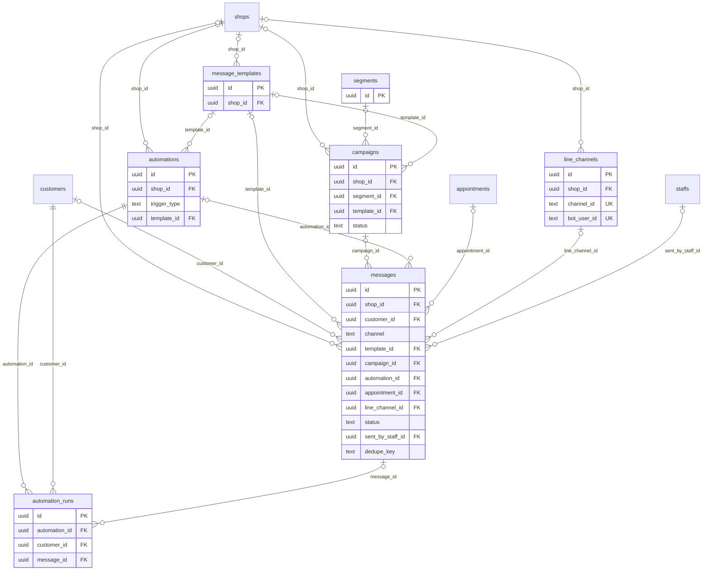

### テーブル定義

#### `line_channels`

- **目的**: LINE 公式アカウント（Messaging API チャネル）。法人単位（`shop_id IS NULL`）または店舗単位。シークレット・アクセストークンは暗号化
- **定義**: `0008_messaging.sql`
- **RLS**: `tenant_isolation`（`organization_id = app_current_org()`、FORCE）

| カラム | 型 | NULL | 既定値 | 参照 / 制約 | 説明 |
|---|---|:-:|---|---|---|
| `id` | uuid |  | `gen_random_uuid()` | PK |  |
| `organization_id` | uuid |  |  | FK → organizations.id |  |
| `shop_id` | uuid | ○ |  | FK → shops.id |  |
| `channel_id` | text |  |  | UNIQUE | Messaging API channel id (webhook "destination" maps via bot_user_id) |
| `bot_user_id` | text | ○ |  | UNIQUE | webhook destination |
| `name` | text |  |  |  |  |
| `basic_id` | text | ○ |  |  | @xxxx |
| `liff_id` | text | ○ |  |  |  |
| `login_channel_id` | text | ○ |  |  | LINE Login channel for LIFF id token verification |
| `encrypted_channel_secret` | text |  |  |  |  |
| `encrypted_access_token` | text |  |  |  |  |
| `status` | text |  | `'active'` | CHECK status IN ('active','disabled','error') |  |
| `webhook_verified_at` | timestamptz | ○ |  |  |  |
| `created_at` | timestamptz |  | `now()` |  |  |
| `updated_at` | timestamptz |  | `now()` |  |  |

**トリガ**: `line_channels_updated (UPDATE → set_updated_at())`

#### `message_templates`

- **目的**: メッセージテンプレート（システムキー付き/任意、チャネル、カテゴリ、本文変数、LINE Flex JSON）。店舗→法人の順で解決
- **定義**: `0008_messaging.sql`
- **RLS**: `tenant_isolation`（`organization_id = app_current_org()`、FORCE）

| カラム | 型 | NULL | 既定値 | 参照 / 制約 | 説明 |
|---|---|:-:|---|---|---|
| `id` | uuid |  | `gen_random_uuid()` | PK |  |
| `organization_id` | uuid |  |  | FK → organizations.id |  |
| `shop_id` | uuid | ○ |  | FK → shops.id |  |
| `key` | text | ○ |  |  | system templates: booking_confirmed / reminder_day_before ... |
| `name` | text |  |  |  |  |
| `channel` | text |  | `'line'` | CHECK channel IN ('line','email','sms') |  |
| `category` | text |  |  | CHECK category IN ('transactional','marketing','followup','review','other') |  |
| `subject` | text | ○ |  |  | email |
| `body` | text |  |  |  | supports {{customer.name}} style variables |
| `payload` | jsonb | ○ |  |  | optional LINE flex/template json |
| `status` | text |  | `'active'` | CHECK status IN ('active','inactive') |  |
| `created_at` | timestamptz |  | `now()` |  |  |
| `updated_at` | timestamptz |  | `now()` |  |  |

**インデックス**

- UNIQUE `message_templates_key_idx` (organization_id, coalesce(shop_id, '00000000-0000-0000-0000-000000000000'::uuid), key, channel) WHERE key IS NOT NULL

**トリガ**: `message_templates_updated (UPDATE → set_updated_at())`

#### `segments`

- **目的**: 保存済みセグメント（JSON DSL）
- **定義**: `0008_messaging.sql`
- **RLS**: `tenant_isolation`（`organization_id = app_current_org()`、FORCE）

| カラム | 型 | NULL | 既定値 | 参照 / 制約 | 説明 |
|---|---|:-:|---|---|---|
| `id` | uuid |  | `gen_random_uuid()` | PK |  |
| `organization_id` | uuid |  |  | FK → organizations.id |  |
| `name` | text |  |  |  |  |
| `description` | text | ○ |  |  |  |
| `rule` | jsonb |  |  |  | segment DSL (see messaging/segments.ts) |
| `created_by` | uuid | ○ |  |  |  |
| `created_at` | timestamptz |  | `now()` |  |  |
| `updated_at` | timestamptz |  | `now()` |  |  |

**トリガ**: `segments_updated (UPDATE → set_updated_at())`

#### `campaigns`

- **目的**: 一括配信（対象ルールのスナップショット、テンプレート、予約日時、承認、状態、統計）
- **定義**: `0008_messaging.sql`
- **RLS**: `tenant_isolation`（`organization_id = app_current_org()`、FORCE）

| カラム | 型 | NULL | 既定値 | 参照 / 制約 | 説明 |
|---|---|:-:|---|---|---|
| `id` | uuid |  | `gen_random_uuid()` | PK |  |
| `organization_id` | uuid |  |  | FK → organizations.id |  |
| `shop_id` | uuid | ○ |  | FK → shops.id |  |
| `name` | text |  |  |  |  |
| `channel` | text |  | `'line'` | CHECK channel IN ('line','email','sms') |  |
| `segment_id` | uuid | ○ |  | FK → segments.id |  |
| `segment_rule` | jsonb |  |  |  | snapshot of the rule used |
| `template_id` | uuid | ○ |  | FK → message_templates.id |  |
| `body` | text | ○ |  |  | inline body when no template |
| `scheduled_at` | timestamptz | ○ |  |  |  |
| `status` | text |  | `'draft'` | CHECK status IN ('draft','scheduled','running','completed','cancelled','failed') |  |
| `stats` | jsonb |  | `'{}'::jsonb` |  | {targets, queued, sent, failed, skipped} |
| `approved_by` | uuid | ○ |  |  |  |
| `approved_at` | timestamptz | ○ |  |  |  |
| `started_at` | timestamptz | ○ |  |  |  |
| `completed_at` | timestamptz | ○ |  |  |  |
| `created_by` | uuid | ○ |  |  |  |
| `created_at` | timestamptz |  | `now()` |  |  |
| `updated_at` | timestamptz |  | `now()` |  |  |

**トリガ**: `campaigns_updated (UPDATE → set_updated_at())`

#### `automations`

- **目的**: 自動配信（休眠・初回後未再来・来店周期・来店後・誕生月）の条件とテンプレート
- **定義**: `0008_messaging.sql`
- **RLS**: `tenant_isolation`（`organization_id = app_current_org()`、FORCE）

| カラム | 型 | NULL | 既定値 | 参照 / 制約 | 説明 |
|---|---|:-:|---|---|---|
| `id` | uuid |  | `gen_random_uuid()` | PK |  |
| `organization_id` | uuid |  |  | FK → organizations.id |  |
| `shop_id` | uuid | ○ |  | FK → shops.id |  |
| `name` | text |  |  |  |  |
| `trigger_type` | text |  |  | CHECK trigger_type IN ( 'days_since_last_visit', 'no_return_after_first_visit', 'visit_cycle_due', 'after_visit', 'birthday_month') |  |
| `config` | jsonb |  | `'{}'::jsonb` |  | {days: 45, require_no_future_appointment: true, send_hour: 11} |
| `channel` | text |  | `'line'` | CHECK channel IN ('line','email','sms') |  |
| `template_id` | uuid | ○ |  | FK → message_templates.id |  |
| `is_active` | boolean |  | `false` |  |  |
| `last_run_at` | timestamptz | ○ |  |  |  |
| `created_by` | uuid | ○ |  |  |  |
| `created_at` | timestamptz |  | `now()` |  |  |
| `updated_at` | timestamptz |  | `now()` |  |  |

**トリガ**: `automations_updated (UPDATE → set_updated_at())`

#### `messages`

- **目的**: 送受信メッセージと配信ログ（状態・スキップ理由・試行回数・プロバイダID・重複防止キー）
- **定義**: `0008_messaging.sql`
- **RLS**: `tenant_isolation`（`organization_id = app_current_org()`、FORCE）

| カラム | 型 | NULL | 既定値 | 参照 / 制約 | 説明 |
|---|---|:-:|---|---|---|
| `id` | uuid |  | `gen_random_uuid()` | PK |  |
| `organization_id` | uuid |  |  | FK → organizations.id |  |
| `shop_id` | uuid | ○ |  | FK → shops.id |  |
| `customer_id` | uuid | ○ |  | FK → customers.id |  |
| `channel` | text |  |  | CHECK channel IN ('line','email','sms') |  |
| `direction` | text |  |  | CHECK direction IN ('outbound','inbound') |  |
| `category` | text |  | `'transactional'` | CHECK category IN ('transactional','marketing','conversation','system') |  |
| `message_type` | text |  | `'text'` |  |  |
| `body` | text | ○ |  |  |  |
| `payload` | jsonb | ○ |  |  |  |
| `template_id` | uuid | ○ |  | FK → message_templates.id |  |
| `campaign_id` | uuid | ○ |  | FK → campaigns.id |  |
| `automation_id` | uuid | ○ |  | FK → automations.id |  |
| `appointment_id` | uuid | ○ |  | FK → appointments.id |  |
| `line_channel_id` | uuid | ○ |  | FK → line_channels.id |  |
| `recipient` | text | ○ |  |  | LINE userId / email / phone at send time |
| `status` | text |  | `'queued'` | CHECK status IN ('queued','sending','sent','failed','skipped','received','read','cancelled') |  |
| `skip_reason` | text | ○ |  |  | opted_out / no_identity / quiet_hours |
| `provider_message_id` | text | ○ |  |  |  |
| `error` | text | ○ |  |  |  |
| `attempts` | int |  | `0` |  |  |
| `next_attempt_at` | timestamptz | ○ |  |  |  |
| `scheduled_at` | timestamptz | ○ |  |  |  |
| `sent_at` | timestamptz | ○ |  |  |  |
| `read_at` | timestamptz | ○ |  |  |  |
| `sent_by_staff_id` | uuid | ○ |  | FK → staffs.id |  |
| `dedupe_key` | text | ○ |  |  |  |
| `created_at` | timestamptz |  | `now()` |  |  |
| `updated_at` | timestamptz |  | `now()` |  |  |

**インデックス**

- UNIQUE `messages_dedupe_idx` (organization_id, dedupe_key) WHERE dedupe_key IS NOT NULL
- `messages_customer_idx` (customer_id, created_at DESC)
- `messages_campaign_idx` (campaign_id)
- `messages_status_idx` (status, next_attempt_at) WHERE status IN ('queued','failed')

**トリガ**: `messages_updated (UPDATE → set_updated_at())`

#### `automation_runs`

- **目的**: 自動配信の実行記録（同じ来店サイクルでの重複送信を防ぐ）
- **定義**: `0008_messaging.sql`
- **RLS**: `tenant_isolation`（`organization_id = app_current_org()`、FORCE）

| カラム | 型 | NULL | 既定値 | 参照 / 制約 | 説明 |
|---|---|:-:|---|---|---|
| `id` | uuid |  | `gen_random_uuid()` | PK |  |
| `organization_id` | uuid |  |  | FK → organizations.id |  |
| `automation_id` | uuid |  |  | FK → automations.id |  |
| `customer_id` | uuid |  |  | FK → customers.id |  |
| `dedupe_key` | text |  |  |  | prevents duplicate sends for the same visit cycle |
| `message_id` | uuid | ○ |  | FK → messages.id |  |
| `created_at` | timestamptz |  | `now()` |  |  |

**テーブル制約**

- `UNIQUE (automation_id, dedupe_key)`

## 9. 外部連携（0009）

所有モジュール: integrations。外部固有ID・状態・raw payload を保存して追跡可能にし（要件 9.1）、Webhook は全プロバイダ共通で `webhook_events` に保存してから非同期処理する。

### ER 図

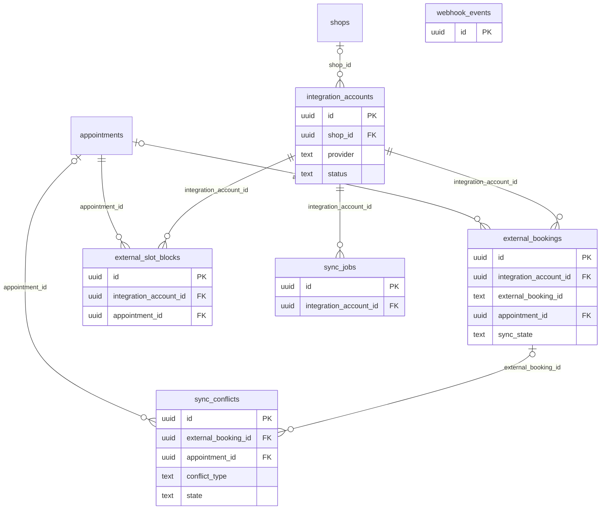

### テーブル定義

#### `integration_accounts`

- **目的**: 外部連携アカウント（予約媒体・決済・GBP 等）。暗号化資格情報、マッピング・競合ポリシー（`config`）、同期カーソル、健全性
- **定義**: `0009_integrations.sql`
- **RLS**: `tenant_isolation`（`organization_id = app_current_org()`、FORCE）

| カラム | 型 | NULL | 既定値 | 参照 / 制約 | 説明 |
|---|---|:-:|---|---|---|
| `id` | uuid |  | `gen_random_uuid()` | PK |  |
| `organization_id` | uuid |  |  | FK → organizations.id |  |
| `shop_id` | uuid | ○ |  | FK → shops.id |  |
| `provider` | text |  |  |  | mock_booking / stripe / square / google_business / ... |
| `display_name` | text |  |  |  |  |
| `status` | text |  | `'active'` | CHECK status IN ('active','error','disabled','degraded') |  |
| `encrypted_credentials` | text | ○ |  |  | AES-256-GCM (lib/crypto.ts) |
| `config` | jsonb |  | `'{}'::jsonb` |  | staff/menu mapping, priority rules |
| `sync_cursor` | text | ○ |  |  |  |
| `last_synced_at` | timestamptz | ○ |  |  |  |
| `last_success_at` | timestamptz | ○ |  |  |  |
| `last_error` | text | ○ |  |  |  |
| `last_error_at` | timestamptz | ○ |  |  |  |
| `consecutive_failures` | int |  | `0` |  |  |
| `created_by` | uuid | ○ |  |  |  |
| `created_at` | timestamptz |  | `now()` |  |  |
| `updated_at` | timestamptz |  | `now()` |  |  |

**インデックス**

- UNIQUE `integration_accounts_unique` (organization_id, provider, coalesce(shop_id, '00000000-0000-0000-0000-000000000000'::uuid))

**トリガ**: `integration_accounts_updated (UPDATE → set_updated_at())`

#### `external_bookings`

- **目的**: 外部予約（raw / 正規化ペイロード、ハッシュ、外部状態、内部予約との対応、同期状態）
- **定義**: `0009_integrations.sql`
- **RLS**: `tenant_isolation`（`organization_id = app_current_org()`、FORCE）

| カラム | 型 | NULL | 既定値 | 参照 / 制約 | 説明 |
|---|---|:-:|---|---|---|
| `id` | uuid |  | `gen_random_uuid()` | PK |  |
| `organization_id` | uuid |  |  | FK → organizations.id |  |
| `integration_account_id` | uuid |  |  | FK → integration_accounts.id |  |
| `provider` | text |  |  |  |  |
| `external_booking_id` | text |  |  |  |  |
| `appointment_id` | uuid | ○ |  | FK → appointments.id |  |
| `external_status` | text |  |  |  |  |
| `raw_payload` | jsonb |  |  |  |  |
| `normalized` | jsonb |  |  |  |  |
| `payload_hash` | text |  |  |  | skip unchanged payloads |
| `external_updated_at` | timestamptz | ○ |  |  |  |
| `sync_state` | text |  | `'pending'` | CHECK sync_state IN ('pending','synced','conflict','error','ignored') |  |
| `last_error` | text | ○ |  |  |  |
| `last_synced_at` | timestamptz | ○ |  |  |  |
| `created_at` | timestamptz |  | `now()` |  |  |
| `updated_at` | timestamptz |  | `now()` |  |  |

**テーブル制約**

- `UNIQUE (integration_account_id, external_booking_id)`

**インデックス**

- `external_bookings_appt_idx` (appointment_id)

**トリガ**: `external_bookings_updated (UPDATE → set_updated_at())`

#### `external_slot_blocks`

- **目的**: 内部予約を外部媒体の枠ブロックとして反映した記録
- **定義**: `0009_integrations.sql`
- **RLS**: `tenant_isolation`（`organization_id = app_current_org()`、FORCE）

| カラム | 型 | NULL | 既定値 | 参照 / 制約 | 説明 |
|---|---|:-:|---|---|---|
| `id` | uuid |  | `gen_random_uuid()` | PK |  |
| `organization_id` | uuid |  |  | FK → organizations.id |  |
| `integration_account_id` | uuid |  |  | FK → integration_accounts.id |  |
| `appointment_id` | uuid |  |  | FK → appointments.id |  |
| `external_block_id` | text | ○ |  |  |  |
| `state` | text |  | `'pending'` | CHECK state IN ('pending','pushed','removed','error') |  |
| `last_error` | text | ○ |  |  |  |
| `pushed_at` | timestamptz | ○ |  |  |  |
| `created_at` | timestamptz |  | `now()` |  |  |
| `updated_at` | timestamptz |  | `now()` |  |  |

**テーブル制約**

- `UNIQUE (integration_account_id, appointment_id)`

**トリガ**: `external_slot_blocks_updated (UPDATE → set_updated_at())`

#### `sync_jobs`

- **目的**: 同期の実行履歴（差分/全件/push、カーソル前後、統計、エラー、起動元）
- **定義**: `0009_integrations.sql`
- **RLS**: `tenant_isolation`（`organization_id = app_current_org()`、FORCE）

| カラム | 型 | NULL | 既定値 | 参照 / 制約 | 説明 |
|---|---|:-:|---|---|---|
| `id` | uuid |  | `gen_random_uuid()` | PK |  |
| `organization_id` | uuid |  |  | FK → organizations.id |  |
| `integration_account_id` | uuid |  |  | FK → integration_accounts.id |  |
| `provider` | text |  |  |  |  |
| `resource` | text |  |  |  | bookings / slots / reviews |
| `mode` | text |  |  | CHECK mode IN ('delta','full','push') |  |
| `state` | text |  | `'queued'` | CHECK state IN ('queued','running','succeeded','failed','dead') |  |
| `cursor_before` | text | ○ |  |  |  |
| `cursor_after` | text | ○ |  |  |  |
| `stats` | jsonb |  | `'{}'::jsonb` |  | {fetched, created, updated, cancelled, conflicts, skipped} |
| `error` | text | ○ |  |  |  |
| `retry_count` | int |  | `0` |  |  |
| `triggered_by` | text |  | `'schedule'` |  | schedule / manual / webhook |
| `started_at` | timestamptz | ○ |  |  |  |
| `finished_at` | timestamptz | ○ |  |  |  |
| `created_at` | timestamptz |  | `now()` |  |  |

**インデックス**

- `sync_jobs_account_idx` (integration_account_id, created_at DESC)

#### `sync_conflicts`

- **目的**: 同期競合の手動解決キュー（重複・時間重複・未マッピング・古い更新・push 失敗）
- **定義**: `0009_integrations.sql`
- **RLS**: `tenant_isolation`（`organization_id = app_current_org()`、FORCE）

| カラム | 型 | NULL | 既定値 | 参照 / 制約 | 説明 |
|---|---|:-:|---|---|---|
| `id` | uuid |  | `gen_random_uuid()` | PK |  |
| `organization_id` | uuid |  |  | FK → organizations.id |  |
| `external_booking_id` | uuid | ○ |  | FK → external_bookings.id |  |
| `appointment_id` | uuid | ○ |  | FK → appointments.id |  |
| `conflict_type` | text |  |  | CHECK conflict_type IN ('overlap','duplicate','unknown_staff','unknown_menu','unknown_customer','stale_update','push_failed') |  |
| `details` | jsonb |  | `'{}'::jsonb` |  |  |
| `state` | text |  | `'open'` | CHECK state IN ('open','resolved','ignored') |  |
| `resolution` | text | ○ |  |  | keep_internal / accept_external / merged / manual |
| `resolved_by` | uuid | ○ |  |  |  |
| `resolved_at` | timestamptz | ○ |  |  |  |
| `created_at` | timestamptz |  | `now()` |  |  |

**インデックス**

- `sync_conflicts_open_idx` (organization_id, state)

#### `webhook_events`

- **目的**: 受信 Webhook（全プロバイダ）。署名検証結果・ヘッダ・ペイロード・処理状態。受信時点では法人未確定の場合がある
- **定義**: `0009_integrations.sql`
- **RLS**: `tenant_isolation`（`organization_id = app_current_org()`、FORCE）。`organization_id` NULL の行はバイパス時のみ可視

| カラム | 型 | NULL | 既定値 | 参照 / 制約 | 説明 |
|---|---|:-:|---|---|---|
| `id` | uuid |  | `gen_random_uuid()` | PK |  |
| `organization_id` | uuid | ○ |  | FK → organizations.id |  |
| `provider` | text |  |  |  |  |
| `event_id` | text |  |  |  | provider event id (or payload hash) |
| `event_type` | text | ○ |  |  |  |
| `signature_valid` | boolean |  |  |  |  |
| `headers` | jsonb |  | `'{}'::jsonb` |  |  |
| `payload` | jsonb |  |  |  |  |
| `status` | text |  | `'received'` | CHECK status IN ('received','processing','processed','failed','ignored','dead') |  |
| `attempts` | int |  | `0` |  |  |
| `last_error` | text | ○ |  |  |  |
| `received_at` | timestamptz |  | `now()` |  |  |
| `processed_at` | timestamptz | ○ |  |  |  |

**テーブル制約**

- `UNIQUE (provider, event_id)`

**インデックス**

- `webhook_events_status_idx` (status, received_at)

## 10. 口コミ・集客（0010）

所有モジュール: reviews（依頼・口コミ）/ marketing（紹介リンク・SNS素材）。

### ER 図

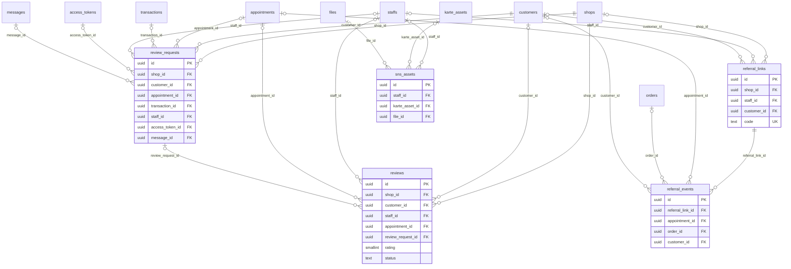

### テーブル定義

#### `review_requests`

- **目的**: 口コミ依頼（会計1件につき1件、送信・開封・投稿状態）
- **定義**: `0010_reviews_marketing.sql`
- **RLS**: `tenant_isolation`（`organization_id = app_current_org()`、FORCE）

| カラム | 型 | NULL | 既定値 | 参照 / 制約 | 説明 |
|---|---|:-:|---|---|---|
| `id` | uuid |  | `gen_random_uuid()` | PK |  |
| `organization_id` | uuid |  |  | FK → organizations.id |  |
| `shop_id` | uuid |  |  | FK → shops.id |  |
| `customer_id` | uuid |  |  | FK → customers.id |  |
| `appointment_id` | uuid | ○ |  | FK → appointments.id |  |
| `transaction_id` | uuid | ○ |  | FK → transactions.id |  |
| `staff_id` | uuid | ○ |  | FK → staffs.id |  |
| `access_token_id` | uuid | ○ |  | FK → access_tokens.id |  |
| `message_id` | uuid | ○ |  | FK → messages.id |  |
| `status` | text |  | `'created'` | CHECK status IN ('created','sent','opened','submitted','expired') |  |
| `opened_at` | timestamptz | ○ |  |  |  |
| `submitted_at` | timestamptz | ○ |  |  |  |
| `created_by` | uuid | ○ |  |  |  |
| `created_at` | timestamptz |  | `now()` |  |  |
| `updated_at` | timestamptz |  | `now()` |  |  |

**インデックス**

- UNIQUE `review_requests_tx_idx` (transaction_id) WHERE transaction_id IS NOT NULL

**トリガ**: `review_requests_updated (UPDATE → set_updated_at())`

#### `reviews`

- **目的**: 口コミ（内部投稿 / Google / 外部）。評価・本文・公開状態・返信・GBP 反映時刻
- **定義**: `0010_reviews_marketing.sql`
- **RLS**: `tenant_isolation`（`organization_id = app_current_org()`、FORCE）

| カラム | 型 | NULL | 既定値 | 参照 / 制約 | 説明 |
|---|---|:-:|---|---|---|
| `id` | uuid |  | `gen_random_uuid()` | PK |  |
| `organization_id` | uuid |  |  | FK → organizations.id |  |
| `shop_id` | uuid |  |  | FK → shops.id |  |
| `customer_id` | uuid | ○ |  | FK → customers.id |  |
| `staff_id` | uuid | ○ |  | FK → staffs.id |  |
| `appointment_id` | uuid | ○ |  | FK → appointments.id |  |
| `review_request_id` | uuid | ○ |  | FK → review_requests.id |  |
| `source` | text |  | `'internal'` | CHECK source IN ('internal','google','external') |  |
| `external_review_id` | text | ○ |  |  |  |
| `rating` | smallint |  |  | CHECK rating BETWEEN 1 AND 5 |  |
| `title` | text | ○ |  |  |  |
| `body` | text | ○ |  |  |  |
| `reviewer_name` | text | ○ |  |  | display name (nickname) |
| `status` | text |  | `'pending'` | CHECK status IN ('pending','published','hidden') |  |
| `reply_body` | text | ○ |  |  |  |
| `replied_at` | timestamptz | ○ |  |  |  |
| `replied_by` | uuid | ○ |  |  |  |
| `reply_synced_at` | timestamptz | ○ |  |  | pushed to Google |
| `posted_at` | timestamptz |  | `now()` |  |  |
| `created_at` | timestamptz |  | `now()` |  |  |
| `updated_at` | timestamptz |  | `now()` |  |  |

**インデックス**

- UNIQUE `reviews_external_idx` (organization_id, source, external_review_id) WHERE external_review_id IS NOT NULL
- `reviews_shop_idx` (shop_id, posted_at DESC)
- `reviews_staff_idx` (staff_id, posted_at DESC)

**トリガ**: `reviews_updated (UPDATE → set_updated_at())`

#### `referral_links`

- **目的**: 紹介・計測リンク（短縮コード、対象、UTM、クリック数）。スタッフ紹介・お客様紹介
- **定義**: `0010_reviews_marketing.sql`
- **RLS**: `tenant_isolation`（`organization_id = app_current_org()`、FORCE）

| カラム | 型 | NULL | 既定値 | 参照 / 制約 | 説明 |
|---|---|:-:|---|---|---|
| `id` | uuid |  | `gen_random_uuid()` | PK |  |
| `organization_id` | uuid |  |  | FK → organizations.id |  |
| `shop_id` | uuid | ○ |  | FK → shops.id |  |
| `staff_id` | uuid | ○ |  | FK → staffs.id |  |
| `customer_id` | uuid | ○ |  | FK → customers.id | お客様紹介 |
| `code` | text |  |  | UNIQUE |  |
| `name` | text |  |  |  |  |
| `target` | text |  | `'booking'` | CHECK target IN ('booking','product','profile','review') |  |
| `target_id` | uuid | ○ |  |  |  |
| `utm` | jsonb |  | `'{}'::jsonb` |  | {source, medium, campaign} |
| `is_active` | boolean |  | `true` |  |  |
| `click_count` | int |  | `0` |  |  |
| `created_by` | uuid | ○ |  |  |  |
| `created_at` | timestamptz |  | `now()` |  |  |

#### `referral_events`

- **目的**: 紹介リンクのイベント（クリック・予約・購入・登録）と帰属金額
- **定義**: `0010_reviews_marketing.sql`
- **RLS**: `tenant_isolation`（`organization_id = app_current_org()`、FORCE）

| カラム | 型 | NULL | 既定値 | 参照 / 制約 | 説明 |
|---|---|:-:|---|---|---|
| `id` | uuid |  | `gen_random_uuid()` | PK |  |
| `organization_id` | uuid |  |  | FK → organizations.id |  |
| `referral_link_id` | uuid |  |  | FK → referral_links.id |  |
| `event_type` | text |  |  | CHECK event_type IN ('click','booking','purchase','signup') |  |
| `appointment_id` | uuid | ○ |  | FK → appointments.id |  |
| `order_id` | uuid | ○ |  | FK → orders.id |  |
| `customer_id` | uuid | ○ |  | FK → customers.id |  |
| `amount` | int | ○ |  |  |  |
| `metadata` | jsonb |  | `'{}'::jsonb` |  |  |
| `created_at` | timestamptz |  | `now()` |  |  |

**インデックス**

- `referral_events_link_idx` (referral_link_id, created_at DESC)

#### `sns_assets`

- **目的**: SNS 共有素材（テンプレート、キャプション、ハッシュタグ、生成ファイル、写真掲載同意）
- **定義**: `0010_reviews_marketing.sql`
- **RLS**: `tenant_isolation`（`organization_id = app_current_org()`、FORCE）

| カラム | 型 | NULL | 既定値 | 参照 / 制約 | 説明 |
|---|---|:-:|---|---|---|
| `id` | uuid |  | `gen_random_uuid()` | PK |  |
| `organization_id` | uuid |  |  | FK → organizations.id |  |
| `staff_id` | uuid | ○ |  | FK → staffs.id |  |
| `karte_asset_id` | uuid | ○ |  | FK → karte_assets.id |  |
| `template` | text |  |  |  | square_style / before_after / review_quote |
| `caption` | text | ○ |  |  |  |
| `hashtags` | text[] |  | `'{}'` |  |  |
| `file_id` | uuid | ○ |  | FK → files.id |  |
| `content` | jsonb |  | `'{}'::jsonb` |  |  |
| `customer_consent` | boolean |  | `false` |  | 写真掲載同意 |
| `created_by` | uuid | ○ |  |  |  |
| `created_at` | timestamptz |  | `now()` |  |  |

## 11. 分析・AI（0011）

所有モジュール: analytics（日次集計、ジョブで冪等に再構築）/ ai（スコア・提案）。集計テーブルは店舗×日（×スタッフ/メニュー/経路）を主キーとし、再集計は DELETE→INSERT で行う。

### ER 図

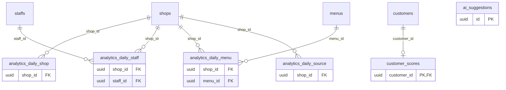

### テーブル定義

#### `analytics_daily_shop`

- **目的**: 店舗×日の集計（売上・施術/店販・値引・税・会計数・客数・新規/再来・指名・予約/キャンセル/無断）
- **定義**: `0011_analytics_ai.sql`
- **RLS**: `tenant_isolation`（`organization_id = app_current_org()`、FORCE）

| カラム | 型 | NULL | 既定値 | 参照 / 制約 | 説明 |
|---|---|:-:|---|---|---|
| `organization_id` | uuid |  |  | FK → organizations.id |  |
| `shop_id` | uuid |  |  | FK → shops.id |  |
| `date` | date |  |  |  |  |
| `sales_total` | bigint |  | `0` |  |  |
| `service_sales` | bigint |  | `0` |  |  |
| `product_sales` | bigint |  | `0` |  |  |
| `discount_total` | bigint |  | `0` |  |  |
| `tax_total` | bigint |  | `0` |  |  |
| `transaction_count` | int |  | `0` |  |  |
| `customer_count` | int |  | `0` |  |  |
| `new_customer_count` | int |  | `0` |  |  |
| `repeat_customer_count` | int |  | `0` |  |  |
| `nominated_count` | int |  | `0` |  |  |
| `appointment_count` | int |  | `0` |  |  |
| `cancel_count` | int |  | `0` |  |  |
| `no_show_count` | int |  | `0` |  |  |
| `computed_at` | timestamptz |  | `now()` |  |  |

**テーブル制約**

- `PRIMARY KEY (shop_id, date)`

#### `analytics_daily_staff`

- **目的**: 店舗×スタッフ×日の集計（配賦売上・客数・新規・指名・勤務分・予約占有分）
- **定義**: `0011_analytics_ai.sql`
- **RLS**: `tenant_isolation`（`organization_id = app_current_org()`、FORCE）

| カラム | 型 | NULL | 既定値 | 参照 / 制約 | 説明 |
|---|---|:-:|---|---|---|
| `organization_id` | uuid |  |  | FK → organizations.id |  |
| `shop_id` | uuid |  |  | FK → shops.id |  |
| `staff_id` | uuid |  |  | FK → staffs.id |  |
| `date` | date |  |  |  |  |
| `sales_total` | bigint |  | `0` |  |  |
| `service_sales` | bigint |  | `0` |  |  |
| `product_sales` | bigint |  | `0` |  |  |
| `customer_count` | int |  | `0` |  |  |
| `new_customer_count` | int |  | `0` |  |  |
| `nominated_count` | int |  | `0` |  |  |
| `scheduled_minutes` | int |  | `0` |  |  |
| `booked_minutes` | int |  | `0` |  |  |
| `computed_at` | timestamptz |  | `now()` |  |  |

**テーブル制約**

- `PRIMARY KEY (shop_id, staff_id, date)`

#### `analytics_daily_menu`

- **目的**: 店舗×メニュー×日の件数・売上
- **定義**: `0011_analytics_ai.sql`
- **RLS**: `tenant_isolation`（`organization_id = app_current_org()`、FORCE）

| カラム | 型 | NULL | 既定値 | 参照 / 制約 | 説明 |
|---|---|:-:|---|---|---|
| `organization_id` | uuid |  |  | FK → organizations.id |  |
| `shop_id` | uuid |  |  | FK → shops.id |  |
| `menu_id` | uuid |  |  | FK → menus.id |  |
| `date` | date |  |  |  |  |
| `count` | int |  | `0` |  |  |
| `sales` | bigint |  | `0` |  |  |
| `computed_at` | timestamptz |  | `now()` |  |  |

**テーブル制約**

- `PRIMARY KEY (shop_id, menu_id, date)`

#### `analytics_daily_source`

- **目的**: 店舗×予約経路×日の予約数・完了数・売上
- **定義**: `0011_analytics_ai.sql`
- **RLS**: `tenant_isolation`（`organization_id = app_current_org()`、FORCE）

| カラム | 型 | NULL | 既定値 | 参照 / 制約 | 説明 |
|---|---|:-:|---|---|---|
| `organization_id` | uuid |  |  | FK → organizations.id |  |
| `shop_id` | uuid |  |  | FK → shops.id |  |
| `source` | text |  |  |  |  |
| `date` | date |  |  |  |  |
| `appointment_count` | int |  | `0` |  |  |
| `completed_count` | int |  | `0` |  |  |
| `sales` | bigint |  | `0` |  |  |
| `computed_at` | timestamptz |  | `now()` |  |  |

**テーブル制約**

- `PRIMARY KEY (shop_id, source, date)`

#### `customer_scores`

- **目的**: 顧客ごとの AI スコア（離脱リスク・区分・予測来店日・予測LTV・推奨アクション・特徴量・モデル版）
- **定義**: `0011_analytics_ai.sql`
- **RLS**: `tenant_isolation`（`organization_id = app_current_org()`、FORCE）

| カラム | 型 | NULL | 既定値 | 参照 / 制約 | 説明 |
|---|---|:-:|---|---|---|
| `customer_id` | uuid |  |  | PK FK → customers.id |  |
| `organization_id` | uuid |  |  | FK → organizations.id |  |
| `churn_risk` | numeric(5,4) |  |  |  | 0..1 |
| `churn_risk_level` | text |  |  | CHECK churn_risk_level IN ('low','medium','high') |  |
| `predicted_next_visit` | date | ○ |  |  |  |
| `expected_ltv_12m` | int | ○ |  |  |  |
| `recommended_action` | text | ○ |  |  |  |
| `features` | jsonb |  | `'{}'::jsonb` |  |  |
| `model_version` | text |  |  |  |  |
| `computed_at` | timestamptz |  | `now()` |  |  |

**インデックス**

- `customer_scores_risk_idx` (organization_id, churn_risk DESC)

#### `ai_suggestions`

- **目的**: AI 提案（下書き・返信案・要約・売上予測・次のアクション）。人間の承認なしに外部送信しない
- **定義**: `0011_analytics_ai.sql`
- **RLS**: `tenant_isolation`（`organization_id = app_current_org()`、FORCE）

| カラム | 型 | NULL | 既定値 | 参照 / 制約 | 説明 |
|---|---|:-:|---|---|---|
| `id` | uuid |  | `gen_random_uuid()` | PK |  |
| `organization_id` | uuid |  |  | FK → organizations.id |  |
| `kind` | text |  |  | CHECK kind IN ('message_draft','review_reply','karte_summary','sales_forecast','next_action') |  |
| `subject_type` | text |  |  |  |  |
| `subject_id` | uuid | ○ |  |  |  |
| `input` | jsonb |  | `'{}'::jsonb` |  |  |
| `output` | jsonb |  | `'{}'::jsonb` |  |  |
| `provider` | text |  |  |  | heuristic / anthropic |
| `model` | text | ○ |  |  |  |
| `status` | text |  | `'proposed'` | CHECK status IN ('proposed','accepted','rejected','applied') |  |
| `decided_by` | uuid | ○ |  |  |  |
| `decided_at` | timestamptz | ○ |  |  |  |
| `created_by` | uuid | ○ |  |  |  |
| `created_at` | timestamptz |  | `now()` |  |  |

**インデックス**

- `ai_suggestions_subject_idx` (subject_type, subject_id)

## 12. プラットフォーム（0012）

所有: 横断基盤（`lib/audit.ts`、`plugins/idempotency.ts`、`jobs/queue.ts`、`lib/events.ts`）/ ops。

### ER 図

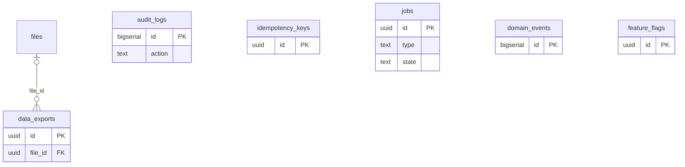

### テーブル定義

#### `audit_logs`

- **目的**: 監査ログ（誰が・いつ・何を・どのリソースに、before/after 差分、IP/UA、request_id/trace_id）
- **補足**: UPDATE/DELETE をトリガで禁止（追記専用）
- **定義**: `0012_platform.sql`
- **RLS**: `tenant_isolation`（`organization_id = app_current_org()`、FORCE）。`organization_id` NULL の行はバイパス時のみ可視

| カラム | 型 | NULL | 既定値 | 参照 / 制約 | 説明 |
|---|---|:-:|---|---|---|
| `id` | bigserial |  |  | PK |  |
| `organization_id` | uuid | ○ |  | FK → organizations.id |  |
| `actor_type` | text |  |  | CHECK actor_type IN ('staff','customer','system','api','anonymous') |  |
| `actor_id` | uuid | ○ |  |  | staff id / customer id |
| `actor_user_id` | uuid | ○ |  |  |  |
| `action` | text |  |  |  | customer.view / sales.view / export.csv / role.change / customer.merge ... |
| `resource_type` | text |  |  |  |  |
| `resource_id` | text | ○ |  |  |  |
| `shop_id` | uuid | ○ |  |  |  |
| `before` | jsonb | ○ |  |  |  |
| `after` | jsonb | ○ |  |  |  |
| `metadata` | jsonb |  | `'{}'::jsonb` |  |  |
| `ip` | inet | ○ |  |  |  |
| `user_agent` | text | ○ |  |  |  |
| `request_id` | text | ○ |  |  |  |
| `trace_id` | text | ○ |  |  |  |
| `created_at` | timestamptz |  | `now()` |  |  |

**インデックス**

- `audit_logs_org_time_idx` (organization_id, created_at DESC)
- `audit_logs_resource_idx` (resource_type, resource_id)
- `audit_logs_actor_idx` (actor_id, created_at DESC)

**トリガ**: `audit_logs_no_update (UPDATE OR DELETE → audit_logs_immutable())`

#### `idempotency_keys`

- **目的**: API の Idempotency-Key 記録（スコープ、リクエストハッシュ、状態、保存レスポンス、24時間有効）
- **定義**: `0012_platform.sql`
- **RLS**: `tenant_isolation`（`organization_id = app_current_org()`、FORCE）

| カラム | 型 | NULL | 既定値 | 参照 / 制約 | 説明 |
|---|---|:-:|---|---|---|
| `id` | uuid |  | `gen_random_uuid()` | PK |  |
| `organization_id` | uuid |  |  | FK → organizations.id |  |
| `key` | text |  |  |  |  |
| `scope` | text |  |  |  | "<METHOD> <route>:<actor>" |
| `request_hash` | text |  |  |  |  |
| `state` | text |  | `'in_progress'` | CHECK state IN ('in_progress','completed') |  |
| `response_status` | int | ○ |  |  |  |
| `response_body` | jsonb | ○ |  |  |  |
| `created_at` | timestamptz |  | `now()` |  |  |
| `expires_at` | timestamptz |  | `now() + interval '24 hours'` |  |  |

**テーブル制約**

- `UNIQUE (organization_id, scope, key)`

#### `jobs`

- **目的**: 永続ジョブキュー（種別・ペイロード・状態・優先度・実行予定・試行回数・ロック・重複防止キー・trace_id）
- **定義**: `0012_platform.sql`
- **RLS**: `tenant_isolation`（`organization_id = app_current_org()`、FORCE）。`organization_id` NULL の行はバイパス時のみ可視

| カラム | 型 | NULL | 既定値 | 参照 / 制約 | 説明 |
|---|---|:-:|---|---|---|
| `id` | uuid |  | `gen_random_uuid()` | PK |  |
| `organization_id` | uuid | ○ |  | FK → organizations.id |  |
| `queue` | text |  | `'default'` |  |  |
| `type` | text |  |  |  |  |
| `payload` | jsonb |  | `'{}'::jsonb` |  |  |
| `state` | text |  | `'queued'` | CHECK state IN ('queued','running','succeeded','failed','dead','cancelled') |  |
| `priority` | int |  | `0` |  |  |
| `run_at` | timestamptz |  | `now()` |  |  |
| `attempts` | int |  | `0` |  |  |
| `max_attempts` | int |  | `8` |  |  |
| `last_error` | text | ○ |  |  |  |
| `locked_by` | text | ○ |  |  |  |
| `locked_at` | timestamptz | ○ |  |  |  |
| `dedupe_key` | text | ○ |  |  |  |
| `trace_id` | text | ○ |  |  |  |
| `created_at` | timestamptz |  | `now()` |  |  |
| `finished_at` | timestamptz | ○ |  |  |  |

**インデックス**

- `jobs_ready_idx` (queue, priority DESC, run_at) WHERE state = 'queued'
- UNIQUE `jobs_dedupe_idx` (dedupe_key) WHERE dedupe_key IS NOT NULL AND state IN ('queued','running')
- `jobs_dead_idx` (organization_id, state) WHERE state IN ('dead','failed')

#### `domain_events`

- **目的**: ドメインイベントの永続ログ（集約・ペイロード・actor・trace_id）
- **定義**: `0012_platform.sql`
- **RLS**: `tenant_isolation`（`organization_id = app_current_org()`、FORCE）

| カラム | 型 | NULL | 既定値 | 参照 / 制約 | 説明 |
|---|---|:-:|---|---|---|
| `id` | bigserial |  |  | PK |  |
| `organization_id` | uuid |  |  | FK → organizations.id |  |
| `event_type` | text |  |  |  | appointment.created / transaction.completed / customer.merged ... |
| `aggregate_type` | text |  |  |  |  |
| `aggregate_id` | uuid |  |  |  |  |
| `payload` | jsonb |  | `'{}'::jsonb` |  |  |
| `actor_id` | uuid | ○ |  |  |  |
| `trace_id` | text | ○ |  |  |  |
| `created_at` | timestamptz |  | `now()` |  |  |

**インデックス**

- `domain_events_aggregate_idx` (aggregate_type, aggregate_id)
- `domain_events_org_time_idx` (organization_id, created_at DESC)

#### `feature_flags`

- **目的**: 機能フラグ（`organization_id IS NULL` は全体既定、法人行で上書き、段階リリース条件）
- **定義**: `0012_platform.sql`
- **RLS**: `tenant_read`（自法人 + `organization_id IS NULL` のシステム既定行を読取）/ `tenant_write`（自法人のみ書込）

| カラム | 型 | NULL | 既定値 | 参照 / 制約 | 説明 |
|---|---|:-:|---|---|---|
| `id` | uuid |  | `gen_random_uuid()` | PK |  |
| `organization_id` | uuid | ○ |  | FK → organizations.id | NULL = global default |
| `key` | text |  |  |  |  |
| `enabled` | boolean |  | `false` |  |  |
| `rollout` | jsonb |  | `'{}'::jsonb` |  |  |
| `description` | text | ○ |  |  |  |
| `updated_at` | timestamptz |  | `now()` |  |  |

**インデックス**

- UNIQUE `feature_flags_unique` (coalesce(organization_id, '00000000-0000-0000-0000-000000000000'::uuid), key)

**トリガ**: `feature_flags_updated (UPDATE → set_updated_at())`

#### `data_exports`

- **目的**: 非同期データエクスポート（種別・条件・状態・生成ファイル・件数・依頼者・有効期限）
- **定義**: `0012_platform.sql`
- **RLS**: `tenant_isolation`（`organization_id = app_current_org()`、FORCE）

| カラム | 型 | NULL | 既定値 | 参照 / 制約 | 説明 |
|---|---|:-:|---|---|---|
| `id` | uuid |  | `gen_random_uuid()` | PK |  |
| `organization_id` | uuid |  |  | FK → organizations.id |  |
| `kind` | text |  |  | CHECK kind IN ('customers','appointments','transactions','transaction_items','staff_sales') |  |
| `params` | jsonb |  | `'{}'::jsonb` |  |  |
| `status` | text |  | `'queued'` | CHECK status IN ('queued','running','completed','failed','expired') |  |
| `file_id` | uuid | ○ |  | FK → files.id |  |
| `row_count` | int | ○ |  |  |  |
| `error` | text | ○ |  |  |  |
| `requested_by` | uuid |  |  |  |  |
| `created_at` | timestamptz |  | `now()` |  |  |
| `completed_at` | timestamptz | ○ |  |  |  |
| `expires_at` | timestamptz | ○ |  |  |  |

## 13. 状態値とライフサイクル

| テーブル.列 | 値 | 遷移・意味 |
|---|---|---|
| `organizations.status` | trial / active / suspended / cancelled | 新規は `trial`。suspended / cancelled はログイン・公開予約不可 |
| `staffs.status` | invited / active / inactive / retired | 招待 → 受諾で active |
| `customers.status` | active / merged / blocked / deleted | merged は `merged_into_id` 必須（アプリ保証）。deleted は匿名化済み |
| `appointments.status` | tentative / confirmed / checked_in / in_service / completed / cancelled / no_show | [requirements.md 12.3](./requirements.md#123-予約の状態遷移) の状態遷移図 |
| `coupon_redemptions.status` | reserved / redeemed / released | 予約時 reserved → 会計確定 redeemed / 取消 released |
| `files.status` | pending / uploaded / deleted | 署名URL発行時 pending → 完了確認 uploaded |
| `form_responses.status` | pending / submitted / voided | submitted 後は不変、無効化のみ |
| `transactions.status` | draft / completed / voided / refunded / partially_refunded | 確定で採番、取消・返金は別レコード（refunds）と状態で表す |
| `payments.status` | pending / requires_action / succeeded / failed / cancelled / refunded / partially_refunded | 終端状態からの再遷移は無視（`settleOnlinePayment`） |
| `orders.status` | pending / paid / processing / shipped / delivered / cancelled / refunded | 未払いは一定時間で cancelled（在庫戻し） |
| `register_sessions.status` | open / closed | 店舗ごとに open は1件 |
| `messages.status` | queued / sending / sent / failed / skipped / received / read / cancelled | outbound は queued → sending → sent / failed / skipped、inbound は received → read |
| `campaigns.status` | draft / scheduled / running / completed / cancelled / failed | 承認で scheduled、実行で running |
| `integration_accounts.status` | active / error / degraded / disabled | [architecture.md 6.3](./architecture.md#63-連携アカウントの状態) |
| `external_bookings.sync_state` | pending / synced / conflict / error / ignored | conflict は `sync_conflicts` に対応行 |
| `sync_jobs.state` | queued / running / succeeded / failed / dead | |
| `sync_conflicts.state` | open / resolved / ignored | `resolution`: keep_internal / accept_external / merged / manual |
| `webhook_events.status` | received / processing / processed / failed / ignored / dead | 署名不正は ignored |
| `review_requests.status` | created / sent / opened / submitted / expired | |
| `reviews.status` | pending / published / hidden | モデレーション |
| `ai_suggestions.status` | proposed / accepted / rejected / applied | applied はスタッフが通常 API で実行した時点 |
| `jobs.state` | queued / running / succeeded / failed / dead / cancelled | [architecture.md 5.1](./architecture.md#51-ジョブ状態) |
| `data_exports.status` | queued / running / completed / failed / expired | 24時間で expired |

## 14. 拡張・保守の方針

| 項目 | 方針 |
|---|---|
| 列追加 | NULL 可または既定値付きで追加 → アプリ対応 → 必要なら NOT NULL 化（2段階）。既存マイグレーションは編集しない |
| 列削除・改名 | アプリから参照を外したリリースの後に削除（前方互換） |
| enum 追加 | `CHECK` 制約を `DROP CONSTRAINT` → `ADD CONSTRAINT`（同一マイグレーション内） |
| 大量追記テーブル | `audit_logs` / `domain_events` / `messages` / `jobs` / `webhook_events` は月次パーティション化とアーカイブを Phase 4 で検討（保持期間は requirements 10.13） |
| 型生成 | マイグレーション適用後に `pnpm db:codegen` で `src/db/types.ts` を再生成（手編集禁止） |
| 本書の更新 | テーブル定義を追加・変更したら、2〜12章の該当テーブル（カラム表・制約・インデックス）と ER 図を更新する |
