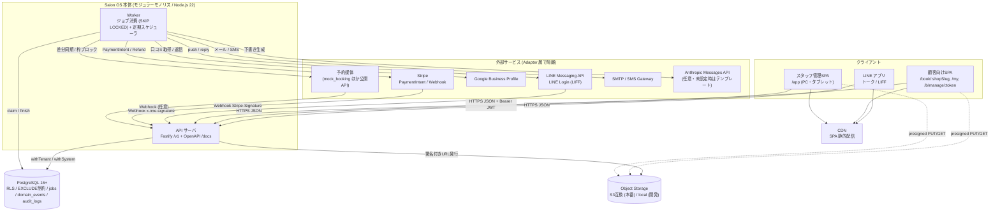
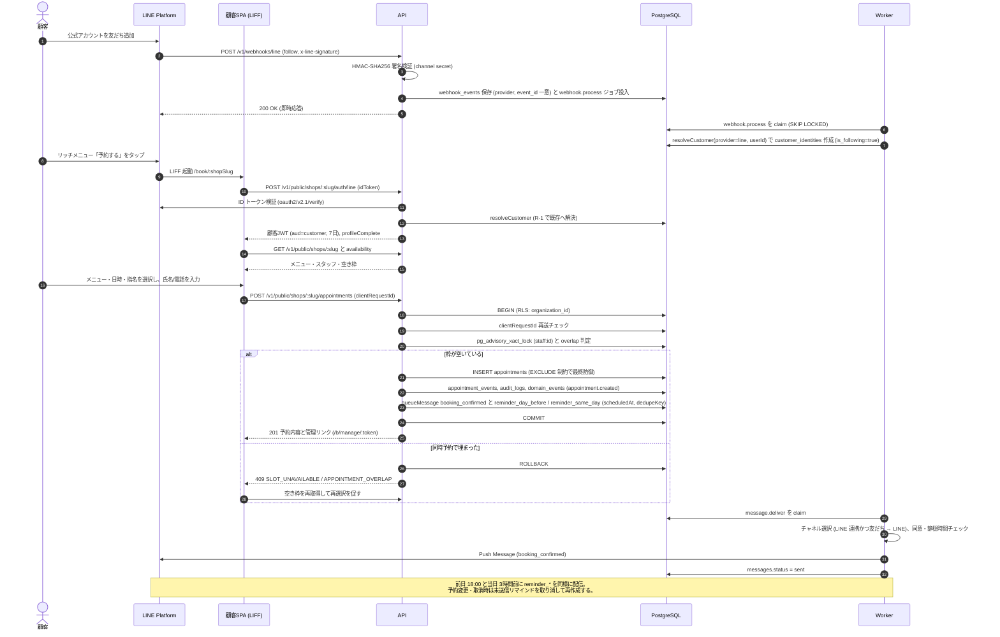
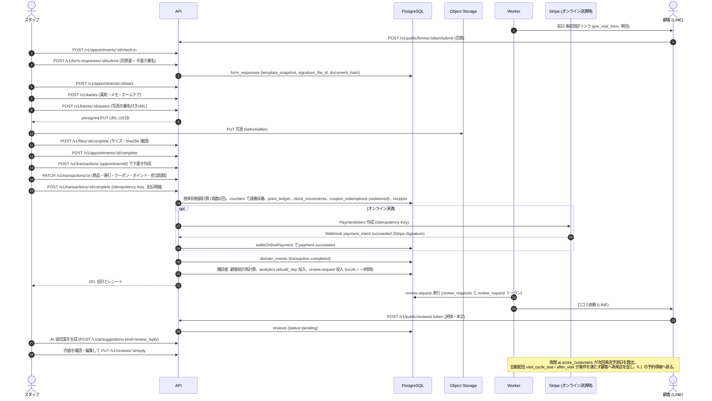
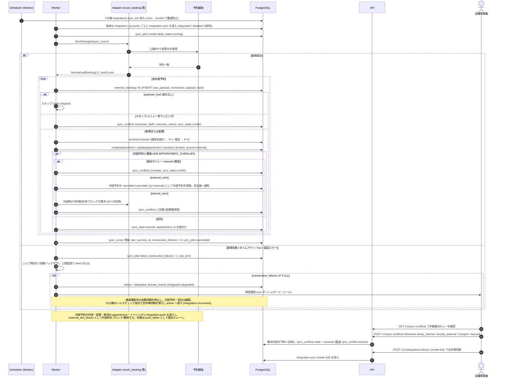
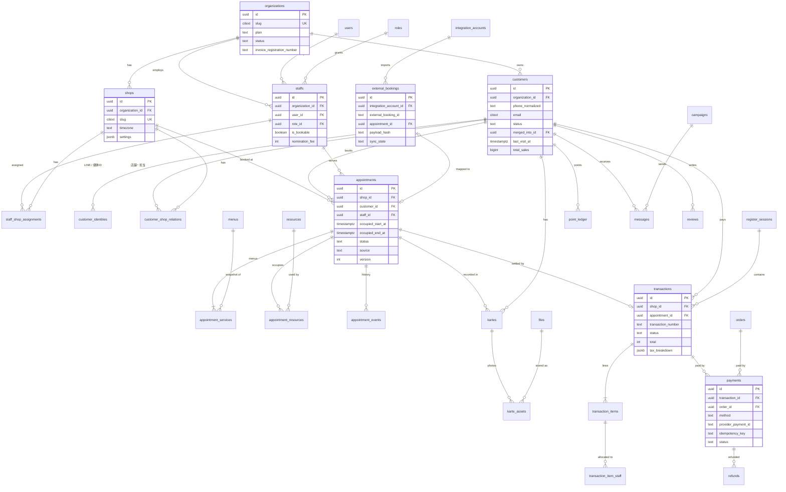
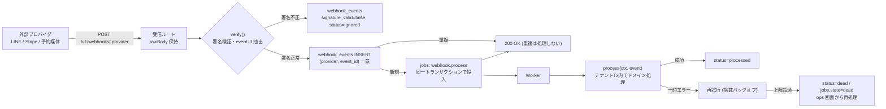
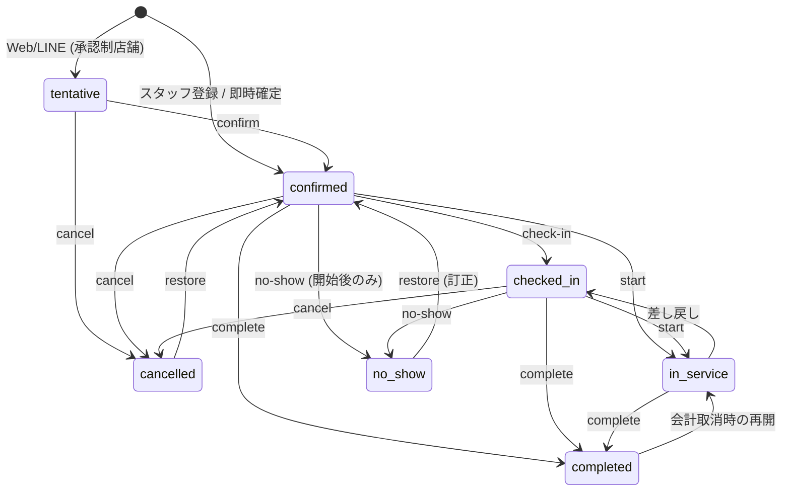

# LiME型 美容サロンOS 要件定義書

公開情報分析を基にした機能・構造・データ・API・外部連携・非機能要件の統合仕様

- バージョン: v1.1
- 作成日: 2026-10-01（v1.0） / 改訂日: 2026-10-01（v1.1）
- 前提: LiME公開情報を基に、内部実装は論理設計として再構成
- 対象リポジトリ: `salon-os`（`apps/api` = API/Worker、`apps/web` = SPA）

CONFIDENTIAL / DEVELOPMENT USE

### 改訂履歴

| 版 | 日付 | 内容 |
|---|---|---|
| v1.0 | 2026-10-01 | 初版（機能要件・主要エンティティ・主要API・未確定事項。多数の章は見出しのみ） |
| v1.1 | 2026-10-01 | 実装（`apps/api`）と整合させ全章を記述。アーキテクチャ、権限マトリクス、画面一覧、業務フロー、データモデル、APIカタログ、外部連携、セキュリティ、非機能、KPI、AI、ジョブ/イベント、テスト、受入基準、フェーズ、規模、引き渡し、トレーサビリティを追加 |

### 関連文書

| 文書 | 内容 |
|---|---|
| [architecture.md](./architecture.md) | システムアーキテクチャ詳細（モジュール境界、リクエストライフサイクル、RLS、ジョブ、Integration Hub、デプロイ） |
| [data-model.md](./data-model.md) | 全88テーブルのカタログとドメイン別ER図 |
| [operations.md](./operations.md) | 運用手順書（環境変数、マイグレーション、DLQ、再同期、障害対応、鍵ローテーション、開示・削除請求） |
| [adr/](./adr/) | アーキテクチャ決定記録（ADR 0001〜0009） |
| [kpi-definitions.md](./kpi-definitions.md) | KPIの詳細定義（分析モジュール担当が保守。13.2 はその要約） |
| `apps/api/CONVENTIONS.md` | API実装規約（本書 22 章の詳細版） |

### 表記ルール

- **実装済**: `apps/api` の現行コードに実装され、統合テストが存在するもの。
- **設計**: スキーマ（マイグレーション 0001〜0012）と公開契約（`api.ts`）は確定済みで、モジュール実装が並行開発中のもの。本書の記述が実装の仕様となる。
- 権限キーは `auth/permissions.ts` の値（例: `customer.read`）、テーブル名・カラム名・ジョブ種別・イベント種別はコード上の識別子をそのまま記載する。
- APIパスはすべて `/v1` 配下（本書では `/v1` を省略して記載する場合がある）。

## 0. 文書の位置づけ・前提

### 0.1 目的

- 美容サロン業務を「集客→予約→顧客→施術→カルテ→会計→口コミ→再来店」まで一気通貫で管理する。
- LINEを顧客接点として活用し、顧客に専用アプリのインストールを強制しない。
- 個人美容師から多店舗法人まで同一基盤で運用できるマルチテナントSaaSとする。
- 将来的にAIエージェント、自動CRM、売上予測、離脱予測へ拡張可能なデータ基盤を構築する。

### 0.2 非目的

- 既存サービスのUI・ブランド・著作物をそのまま複製すること。
- 特定外部予約媒体の非公開APIへの依存。
- 初期版から全機能を同時実装すること。

### 0.3 用語

| 用語 | 定義 |
|---|---|
| 法人（organization / テナント） | 契約・課金・データ分離の単位。全業務テーブルは `organization_id` を持つ |
| 店舗（shop） | 法人配下の営業拠点。タイムゾーン・営業時間・設定（`shops.settings`）を持つ |
| スタッフ（staff） | 法人に所属する従業員。認証ユーザー（`users`）と法人ごとに1対1で紐づく |
| 顧客（customer） | 法人単位の正規顧客レコード。店舗横断で1人1レコード（名寄せ対象） |
| 指名 / フリー | 指名 = 顧客がスタッフを選択（`is_nominated = true`）、フリー = 店舗が割当（自動割当可） |
| 占有時間 | 施術時間に前後バッファを加えた、スタッフ・設備が拘束される時間（`occupied_start_at`〜`occupied_end_at`） |
| Actor | リクエスト主体。`staff` / `customer` / `system` の3種（`auth/actor.ts`） |
| Ctx | サービス関数の第1引数 `{ actor, trx, meta }`。テナントRLS付きトランザクションとリクエストメタを保持 |
| DLQ | Dead Letter Queue。最大試行回数を超えたジョブ（`jobs.state = 'dead'`）や Webhook（`webhook_events.status = 'dead'`） |
| 縮退運転 | 外部予約連携が連続失敗した際に同期を一時停止し、内部予約のみで運用を継続する状態（`integration_accounts.status = 'degraded'`） |

## 1. システム全体像

### 1.1 推奨アーキテクチャ

**モジュラーモノリス + PostgreSQL 単一データベース + Postgres ジョブキュー** を採用する（ADR [0001](./adr/0001-modular-monolith.md) / [0002](./adr/0002-postgres-rls-multitenancy.md) / [0004](./adr/0004-postgres-job-queue-outbox.md)）。API サーバと Worker は同一コードベース・同一イメージから起動し、役割（`src/index.ts` / `src/worker.ts`）のみ異なる。顧客・予約・会計の整合性を最優先し、DBはサービスごとに分割しない（要件 21）。



#### 1.1.1 コンポーネント一覧

| コンポーネント | 技術 | 責務 | スケール方針 |
|---|---|---|---|
| スタッフ管理SPA | React + TypeScript（Vite） | 予約台帳、顧客、カルテ、POS、配信、分析、設定、運用 | CDN配信。API は Bearer JWT |
| 顧客向けSPA | React（LINE LIFF 互換） | 店舗ページ、空き枠、予約、マイページ、予約管理リンク、事前問診、口コミ投稿 | CDN配信。LIFF 内では ID トークンでログイン |
| API サーバ | Node.js 22 / Fastify 5 / zod / Kysely | `/v1` REST、認証・認可、RLS トランザクション、監査、イベント発行、Webhook 受信 | ステートレス。水平スケール（ロードバランサ配下に N 台） |
| Worker | 同一コード `src/worker.ts` | ジョブ実行（`jobs` テーブル）、定期タスク投入（`schedulerTick` 30秒毎）、停滞ジョブ回収 | `WORKER_CONCURRENCY` と台数で調整。キュー単位での分離可 |
| PostgreSQL | 16 以上（`btree_gist` / `pg_trgm` / `citext`） | 業務データ、RLS、排他制約、ジョブキュー、ドメインイベント、監査ログ、冪等キー | マネージド（PITR 有効）。読み取りレプリカは分析用に後付け |
| Object Storage | S3 互換（SigV4 presign、依存ライブラリなし） / local | カルテ写真・スケッチ・署名画像・エクスポートCSV・SNS素材 | ライフサイクルルールで期限切れエクスポートを削除 |
| 外部 Adapter | `fetch` + `node:crypto` | LINE / Stripe / GBP / 予約媒体 / メール / SMS / LLM | プロバイダごとに mock ドライバを持ち、テストは mock で実行 |

### 1.2 モジュール構成（モジュラーモノリス）

`apps/api/src/modules/<name>/` に19モジュールを配置する（`modules/index.ts`）。モジュール間は **サービス関数・公開契約（`api.ts`）・ドメインイベント** でのみ連携する。

| モジュール | 主な責務 | 関連FR | 状態 |
|---|---|---|---|
| auth | ログイン、MFA(OTP)、リフレッシュローテーション、招待受諾、法人切替、`/me` | 2, 10 | 実装済 |
| org | 法人・店舗・スタッフ・ロール・異動 | FR-09 | 実装済 |
| customers | 顧客CRUD・検索・タグ・メモ・名寄せ（重複検知/マージ/Undo）・タイムライン・CSV | FR-01, FR-09 | 実装済 |
| catalog | メニュー（共通/店舗独自/上書き）・カテゴリ・担当可能メニュー・設備・クーポン | FR-02, FR-09 | 実装済 |
| schedules | 営業時間・休業日・基本勤務・シフト・予約ブロック | FR-02 | 実装済 |
| appointments | 空き枠計算・予約作成/変更/状態遷移・二重予約防止・履歴 | FR-02 | 実装済 |
| public | 公開店舗情報・Web/LINE予約・顧客認証(LIFF/OTP)・セルフキャンセル/変更・予約管理リンク | FR-02, FR-03 | 実装済 |
| files | 署名付きアップロード/ダウンロード、ファイルメタデータ | FR-01 | 設計 |
| kartes | カルテテンプレート・カルテ・写真/スケッチ・顧客共有・カウンセリング/同意書/事前問診・電子署名 | FR-01 | 設計 |
| pos | レジ開局/締め、会計（下書き→確定→取消/返金）、税計算、担当者配賦、レシート/領収書、ポイント、日報、CSV | FR-04 | 設計 |
| payments | 決済（現金/カード/電子マネー/QR/独自/ポイント/オンライン）、Stripe/mock Adapter、返金、Webhook | FR-05 | 設計（公開契約 `payments/api.ts` 実装済） |
| messaging | LINEチャネル、Webhook、ID連携、配信ジョブ、テンプレート、リマインド、セグメント、一括配信、自動配信、オプトアウト | FR-03 | 設計（公開契約 `messaging/api.ts` 実装済） |
| integrations | Integration Hub、予約媒体 Adapter、差分/全件同期、競合キュー、縮退運転、汎用 Webhook 受信 | FR-06 | 設計 |
| reviews | 口コミ依頼・投稿・モデレーション・返信・GBP連携・公開プロフィール | FR-07 | 設計 |
| marketing | 紹介/計測リンク、クリック・予約・購入アトリビューション、SNS素材生成 | FR-07 | 設計 |
| commerce | 商品・在庫・EC注文・配送・キャンセル/返金・商品URL共有 | FR-08 | 設計 |
| analytics | 日次集計テーブル、KPI API、期間比較、CSV | FR-10 | 設計 |
| ai | 離脱スコア・次回来店予測・売上予測・生成下書き（人間承認必須） | 14 | 設計 |
| ops | 障害ダッシュボード、DLQ再実行、Webhook再処理、監査ログ検索、データエクスポート、Feature Flag、保持期間処理 | 16 | 設計 |

### 1.3 技術スタック

| 層 | 採用技術 | 備考 |
|---|---|---|
| 言語/ランタイム | TypeScript 6 / Node.js 22（ESM） | `pnpm` ワークスペース（`apps/*`） |
| Web フレームワーク | Fastify 5、`fastify-type-provider-zod`、`@fastify/helmet` / `cors` / `rate-limit` / `swagger` | OpenAPI 3.1 を zod スキーマから生成、`/docs` で閲覧 |
| DB アクセス | Kysely 0.29（型は `kysely-codegen` 生成の `db/types.ts`） | 生SQLは `sql` タグでパラメータ化 |
| 入力検証 | zod 4 | PATCH スキーマに `.default()` を置かない規約 |
| 認証 | `jose`（HS256 JWT）、scrypt パスワードハッシュ、HMAC トークン | 外部 IdP 依存なし |
| 日時 | luxon（UTC保存・店舗TZ計算） | `lib/time.ts` |
| テスト | Vitest + 実 PostgreSQL、Playwright（E2E）、k6（負荷） | 外部サービスは mock ドライバ |
| 依存方針 | API に npm 依存を追加しない（HTTP は `fetch`、暗号は `node:crypto`） | S3 SigV4・Stripe・LINE も自前 Adapter |

## 2. ユーザー・権限モデル

### 2.1 権限制御方針

- RBAC（Role Based Access Control）に加え、店舗・担当者・顧客単位のResource Authorizationを行う。
- すべての主要テーブルにorganization_idを持たせ、テナント境界を強制する。
- 顧客情報閲覧、売上閲覧、CSV出力、権限変更は監査ログ対象。
- オーナー権限でも、プライベートメモ等を個別に非公開化できる設計余地を残す。

**実装上の多層防御（v1.1 追記）**

1. **認証**: Bearer JWT（スタッフ: `aud=staff`、顧客: `aud=customer`）。ルート単位で `config.auth`（`staff` 既定 / `customer` / `public`）を宣言し、`preHandler` で判定する。
2. **RBAC**: サービス関数冒頭で `requirePermission(ctx.actor, '<key>')`。権限キーは `auth/permissions.ts` の41種。
3. **Resource Authorization**: 店舗境界 `assertShopAccess()` / `accessibleShopIds()`、顧客境界 `assertCustomerAccess()`（不可視は 404 で存在を秘匿）、作成者境界（プライベートメモ・自分の売上）。
4. **RLS**: `organization_id = app_current_org()` を全テナントテーブルに FORCE 適用（[ADR 0002](./adr/0002-postgres-rls-multitenancy.md)）。アプリのバグで WHERE 句が漏れても他テナント行は物理的に見えない。
5. **監査**: 重要な閲覧・変更・出力を同一トランザクションで `audit_logs`（追記専用）へ記録。

### 2.2 利用者種別とシステムロール

システムロールは法人作成時に `seedSystemRoles()` で法人ごとに生成される（`roles.is_system = true`）。法人は権限キーを組み合わせてカスタムロールを作成できる（`POST /roles`、`role.manage` 必須）。

| ロール key | 名称 | 想定利用者 | 店舗スコープ | 概要 |
|---|---|---|---|---|
| `owner` | オーナー | 法人代表・個人サロンオーナー | 全店舗（`scope.all_shops`） | 全権限。最後のオーナーは降格不可（`LAST_OWNER`） |
| `manager` | 店長 | 店舗責任者 | 所属店舗のみ | `org.manage` / `role.manage` / `customer.delete` / `customer.read_all_shops` 以外の全権限。顧客は所属店舗に関係する顧客のみ閲覧（店舗横断閲覧はカスタムロールで付与） |
| `stylist` | スタイリスト | 施術者 | 所属店舗のみ | 予約・顧客・カルテ・会計操作・メッセージ・自分の売上/分析・AIアシスト |
| `assistant` | アシスタント | 補助スタッフ | 所属店舗のみ | 予約/顧客/シフト閲覧、カルテ閲覧・記入、会計閲覧 |
| `reception` | 受付 | フロント | 所属店舗のみ | 予約・顧客編集・会計操作・レジ開閉・メッセージ |
| `accountant` | 経理 | 本部経理・税理士 | 全店舗（`scope.all_shops`） | 売上・分析・エクスポート・監査ログ閲覧（顧客個人情報の閲覧権限なし） |
| （customer actor） | 顧客 | エンドユーザー | 本人のデータのみ | 権限キーを持たない。`/public/me*` 等の専用関数で本人確認（LIFF / OTP / 管理リンク） |
| （system actor） | システム | ジョブ・Webhook・公開API内部処理 | 当該テナント全体 | `can()` が常に true。RLS は当該法人に限定されたまま |

### 2.3 権限マトリクス（システムロール既定値）

○ = 付与、－ = なし。`scope.all_shops` は「全店舗ロール」に自動付与される（`systemRolePermissions()`）。

| 権限キー | 説明 | owner | manager | stylist | assistant | reception | accountant |
|---|---|:-:|:-:|:-:|:-:|:-:|:-:|
| `org.manage` | 法人設定の管理 | ○ | － | － | － | － | － |
| `shop.manage` | 店舗の作成・設定 | ○ | ○ | － | － | － | － |
| `staff.read` | スタッフ閲覧 | ○ | ○ | ○ | ○ | ○ | ○ |
| `staff.manage` | スタッフ管理・招待・異動 | ○ | ○ | － | － | － | － |
| `role.manage` | 権限ロールの変更 | ○ | － | － | － | － | － |
| `customer.read` | 顧客閲覧（所属店舗） | ○ | ○ | ○ | ○ | ○ | － |
| `customer.read_all_shops` | 店舗横断の顧客閲覧 | ○ | － | － | － | － | － |
| `customer.write` | 顧客作成・編集・メモ・タグ | ○ | ○ | ○ | － | ○ | － |
| `customer.delete` | 顧客削除（論理削除） | ○ | － | － | － | － | － |
| `customer.merge` | 顧客統合・重複候補管理 | ○ | ○ | － | － | － | － |
| `appointment.read` | 予約閲覧・空き枠 | ○ | ○ | ○ | ○ | ○ | － |
| `appointment.write` | 予約作成・変更・取消・ブロック | ○ | ○ | ○ | － | ○ | － |
| `schedule.read` | シフト・営業時間閲覧 | ○ | ○ | ○ | ○ | ○ | － |
| `schedule.manage` | シフト・営業時間管理 | ○ | ○ | － | － | － | － |
| `menu.manage` | メニュー・クーポン・設備管理 | ○ | ○ | － | － | － | － |
| `karte.read` | カルテ閲覧 | ○ | ○ | ○ | ○ | － | － |
| `karte.write` | カルテ作成・編集・共有 | ○ | ○ | ○ | ○ | － | － |
| `form.manage` | カウンセリング/同意書テンプレート管理 | ○ | ○ | － | － | － | － |
| `pos.read` | 会計閲覧 | ○ | ○ | ○ | ○ | ○ | ○ |
| `pos.operate` | 会計操作（下書き・確定） | ○ | ○ | ○ | － | ○ | － |
| `pos.void` | 会計取消 | ○ | ○ | － | － | － | － |
| `pos.refund` | 返金 | ○ | ○ | － | － | － | － |
| `register.manage` | レジ開局・締め | ○ | ○ | － | － | ○ | － |
| `sales.read` | 売上閲覧（全体） | ○ | ○ | － | － | － | ○ |
| `sales.read_own` | 自分の売上閲覧 | ○ | ○ | ○ | － | － | － |
| `message.read` | メッセージ閲覧 | ○ | ○ | ○ | － | ○ | － |
| `message.send` | 個別メッセージ送信 | ○ | ○ | ○ | － | ○ | － |
| `campaign.manage` | 一括配信・自動配信・セグメント | ○ | ○ | － | － | － | － |
| `template.manage` | メッセージテンプレート管理 | ○ | ○ | － | － | － | － |
| `review.manage` | 口コミ管理・返信 | ○ | ○ | － | － | － | － |
| `marketing.manage` | 紹介リンク・SNS素材 | ○ | ○ | － | － | － | － |
| `product.manage` | 商品・在庫管理 | ○ | ○ | － | － | － | － |
| `order.manage` | EC注文管理 | ○ | ○ | － | － | － | － |
| `analytics.read` | 分析閲覧（全体） | ○ | ○ | － | － | － | ○ |
| `analytics.read_own` | 自分の分析閲覧 | ○ | ○ | ○ | － | － | － |
| `integration.manage` | 外部連携設定・再同期・競合解決 | ○ | ○ | － | － | － | － |
| `audit.read` | 監査ログ閲覧 | ○ | ○ | － | － | － | ○ |
| `ops.manage` | 運用管理（DLQ/Webhook再処理/フラグ） | ○ | ○ | － | － | － | － |
| `export.data` | データエクスポート | ○ | ○ | － | － | － | ○ |
| `ai.use` | AIアシスト利用 | ○ | ○ | ○ | － | － | － |
| `scope.all_shops` | 全店舗へのアクセス | ○ | － | － | － | － | ○ |

> 注: 顧客CSVの出力には `customer.read` と `export.data` の **両方** が必要（`exportCustomersCsv`）。経理ロールは顧客個人情報を閲覧できないため顧客CSVは出力できず、売上系CSVのみ出力できる。

### 2.4 Resource Authorization ルール

| 対象 | ルール | 実装 |
|---|---|---|
| テナント | すべての行は `organization_id` で分離。RLS で強制 | `withTenant()` が `app.organization_id` を設定 |
| 店舗 | `scope.all_shops` を持たないスタッフは `staff_shop_assignments`（`ended_on IS NULL`）の店舗のみ操作可。`shop_id IS NULL` の法人共通リソース（共通メニュー等）は全員閲覧可 | `assertShopAccess()` / `accessibleShopIds()` |
| 店舗選択 | `X-Shop-Id` ヘッダは UI 上の選択店舗であり、**認可の根拠にはならない** | `RequestMeta.currentShopId` |
| 顧客 | 顧客は法人レベルのレコード。`scope.all_shops` または `customer.read_all_shops` を持つ場合は全顧客、それ以外は `primary_shop_id` が所属店舗、または `customer_shop_relations` に所属店舗の関係がある顧客のみ可視。不可視の顧客は **404**（存在を漏らさない） | `visibleCustomerFilter()` / `assertCustomerAccess()` |
| 統合済み顧客 | `status = 'merged'` の顧客への書き込みは `CUSTOMER_MERGED`（422）で拒否し、`mergedIntoId` を返す。閲覧は可 | `assertCustomerAccess({ allowMerged })` |
| プライベートメモ | `customer_memos.visibility = 'private'` は **作成者本人のみ** 閲覧・編集・削除可（オーナーも不可） | `listMemos()` / `updateMemo()` |
| 自分のデータ | `sales.read_own` / `analytics.read_own` は自分に配賦された売上（`transaction_item_staff.staff_id`）のみ | analytics / pos（設計） |
| スタッフ自己編集 | 本人は `publicProfile` / `displayNameKana` / `phone` / `color` のみ `staff.manage` なしで更新可。自分の基本勤務も更新可 | `updateStaff()` / `replaceWeeklySchedule()` |
| オーナー権限付与 | `owner` ロールの付与（スタッフ作成時含む）は `role.manage` 必須 | `createStaff()` |
| 顧客本人 | customer actor は自分の `customer_id` のデータのみ。他人の予約 ID は 404 | `ownAppointment()` |
| 署名付きリンク | `access_tokens`（HMAC保存・目的/リソース/期限/回数制限）で、ログインなしに特定リソースだけを操作可能にする | `lib/access-tokens.ts` |

### 2.5 監査対象

監査ログは `audit(ctx, {...})` により業務変更と **同一トランザクション** で `audit_logs` に記録する。更新は `diff(before, after)` で変更キーのみ保存し、`password_hash` / `encrypted_*` / `token_hash` / `client_secret` 等は `[REDACTED]` に置換する。`audit_logs` は更新・削除をトリガで禁止（追記専用）。

| 区分 | action（例） | 状態 |
|---|---|---|
| 顧客閲覧 | `customer.view`（顧客詳細表示ごと） | 実装済 |
| 顧客変更 | `customer.create` / `customer.update` / `customer.delete` / `customer.tags_update` / `customer.identity_link` / `customer.identity_unlink` | 実装済 |
| 名寄せ | `customer.merge` / `customer.merge_undo` | 実装済 |
| データ出力 | `export.csv`（種別・件数・条件・スコープを metadata に保存）、`data_export.request` / `data_export.download` | 実装済（顧客CSV）/ 設計 |
| 権限変更 | `role.change` / `role.create` / `role.permissions_change` / `role.delete` / `staff.shops_update` | 実装済 |
| 組織・スタッフ | `organization.create` / `organization.update` / `shop.create` / `shop.update` / `staff.create` / `staff.update` / `staff.transfer` | 実装済 |
| マスタ | `menu.create` / `menu.update` / `menu.delete` / `menu.override` / `staff.menus_update` / `coupon.create` / `coupon.update` | 実装済 |
| 予約 | `appointment.create` / `appointment.<status>`（confirmed, checked_in, in_service, completed, cancelled, no_show） / `schedule_block.create` / `shift.bulk_update` / `shop.business_hours_update` / `shop.calendar_exception` | 実装済 |
| 売上閲覧 | `sales.view`（売上・分析・日報・会計CSVの閲覧） | 設計 |
| 会計 | `transaction.complete` / `transaction.void` / `transaction.refund` / `register.open` / `register.close` / `receipt.issue` / `point.adjust` | 設計 |
| カルテ・同意書 | `karte.view` / `karte.update` / `karte.share` / `form.sign` / `form.void` | 設計 |
| 配信 | `message.send` / `campaign.approve` / `campaign.cancel` / `automation.update` / `customer.opt_out` | 設計 |
| 連携・運用 | `integration.connect` / `integration.resync` / `sync_conflict.resolve` / `webhook.reprocess` / `job.retry` / `feature_flag.update` / `retention.anonymize` | 設計 |
| AI | `ai.suggestion.accept` / `ai.suggestion.reject` | 設計 |

## 3. 機能要件

各FRは v1.0 の要件リストを維持し、その下に「実装方針・受入メモ」を追記する。受入メモの詳細な判定条件は 18 章（AC-xx）を参照。

### FR-01 顧客CRM・カルテ

- 顧客プロフィール作成・編集・検索・タグ管理
- 来店履歴・担当履歴・累計売上・来店周期表示
- 施術カルテ：写真、薬剤、メモ、スケッチ、テンプレート
- カウンセリングシート・同意書・電子署名
- 顧客自身による事前情報入力
- 施術写真・ホームケア情報の顧客共有
- 顧客統合（重複候補提示＋手動マージ）

| 要件 | 実装方針 | 受入メモ | 状態 |
|---|---|---|---|
| プロフィール・検索・タグ | `customers` は法人単位。氏名/カナ/電話/メール/顧客番号から生成列 `search_text`（NFKC・ひらがな→カタカナ・小文字・空白除去）を作り、`LIKE` + `pg_trgm` 類似度 + 正規化電話番号一致で検索。タグは `tags` / `customer_tags` | ひらがな・カタカナ・全角/半角・ハイフン有無の違いで同一顧客がヒットする。一覧は cursor pagination（最終来店/作成日/カナ/累計売上） | 実装済 |
| 来店履歴・担当・累計・周期 | `recomputeCustomerStats()` が会計確定（無ければ完了予約）から `first_visit_at` / `last_visit_at` / `visit_count` / `total_sales`（純額）/ `avg_cycle_days` / `next_appointment_at` / `no_show_count` / `cancel_count` を再計算（非正規化） | 会計確定・取消・返金、予約状態変更、マージ後に値が整合する | 実装済（会計連動は設計） |
| タイムライン | 予約・会計・カルテ・メッセージ・口コミ・フォームを時系列 UNION（`GET /customers/:id/timeline`） | 1画面で顧客接点の全履歴が確認できる | 実装済 |
| カルテ | `kartes`（テンプレート由来の `fields`、`chemicals` 薬剤配合、`note`、`homecare`、楽観ロック `version`）、`karte_templates`（カット/カラー/パーマ/まつ毛/ネイル/エステ） | 予約から1クリックでカルテ作成。前回カルテの複写ができる | 設計 |
| 写真・スケッチ | `karte_assets`（`photo_before` / `photo_after` / `photo` / `sketch` / `document`）。実体は Object Storage、DB はメタデータのみ（`files`） | DB に BLOB を保存しない。署名付きURLは15分で失効 | 設計 |
| カウンセリング/同意書/電子署名 | `form_templates`（`counseling` / `consent` / `pre_visit`、版管理）、`form_responses`（`template_snapshot`、署名画像 `signature_file_id`、`document_hash = sha256(snapshot‖answers‖signature)`、IP/UA） | 署名後は回答・署名を変更不可（`voided` のみ可）。ハッシュ再計算で改ざん検知できる | 設計 |
| 顧客による事前入力 | `access_tokens(purpose='pre_visit_form', max_uses=1)` の単回リンクを LINE/メールで送付し、ログイン不要で回答 | 2回目のアクセスは `INVALID_LINK`。期限切れも同様 | 設計 |
| 写真・ホームケアの顧客共有 | `access_tokens(purpose='karte_share')`。共有ページは `share_with_customer = true` の写真とホームケア情報のみ表示（薬剤・内部メモ・スタッフメモは表示しない） | 共有停止（トークン失効）後は閲覧不可 | 設計 |
| 顧客統合 | 4章のルールで重複候補を提示し、`POST /customers/:id/merge` で手動マージ、`POST /customer-merges/:id/undo` で取消 | 関連17テーブルが再リンクされ、Undo で元に戻る | 実装済 |

### FR-02 予約管理

- スタッフ別/店舗別カレンダー
- メニュー所要時間、バッファ、営業時間、休日、席/設備リソース
- Web/LINE/外部媒体/電話/店頭の予約ソース管理
- 予約変更、キャンセル、無断キャンセル
- ダブルブッキング防止・競合時トランザクション制御
- 相談予約、クーポン、指名/フリー
- 予約確定・前日・当日リマインド

| 要件 | 実装方針 | 受入メモ | 状態 |
|---|---|---|---|
| カレンダー | `GET /appointments`（`shopId` + `date` または `from`/`to`、`staffId` で絞込）、`GET /shops/:id/staff-schedule?date`（スタッフ別稼働時間） | 店舗日表示で全スタッフの予約・ブロック・稼働時間が取得できる | 実装済 |
| 所要時間・バッファ | `menus.duration_min` / `buffer_before_min` / `buffer_after_min`、スタッフ別時間・料金 `staff_menus`、店舗別上書き `menu_shop_overrides`。占有時間 = 先頭メニュー前バッファ + 施術 + 末尾メニュー後バッファ | バッファ時間帯に他予約が入らない | 実装済 |
| 営業時間・休日 | `shop_business_hours`（曜日×複数行で昼休み対応）、`shop_calendar_exceptions`（休業/特別営業）、`staff_weekly_schedules`、`staff_shifts`（日付指定が週パターンを置換）、`schedule_blocks` | 勤務パターン未設定のスタッフは店舗営業時間に従う | 実装済 |
| 席/設備 | `resources`（1行=1単位）、`menu_resource_requirements`（種別・開始オフセット・時間）、`appointment_resources`（EXCLUDE 制約） | 必要設備が全て埋まっている時間は空き枠に出ない | 実装済 |
| 予約ソース | `appointments.source`：`web` / `line` / `external` / `phone` / `walk_in` / `staff`、`source_detail` に UTM・紹介コード・プロバイダ | 経路別売上（FR-10）に利用 | 実装済 |
| 変更・キャンセル・無断キャンセル | 変更は楽観ロック（`version` 必須、不一致は `VERSION_CONFLICT`）。状態遷移はステートマシン（12章）。無断キャンセルは開始時刻後のみ | 不正遷移は `INVALID_TRANSITION`。履歴 `appointment_events` に全操作が残る | 実装済 |
| ダブルブッキング防止 | 3層防御（アドバイザリロック + overlap 判定 + EXCLUDE 制約）。12章 | 同一枠への並行リクエストで成立は1件のみ（他は 409） | 実装済 |
| 相談予約・クーポン・指名/フリー | `menus.is_consultation`、`coupons`（定額/定率/固定価格、対象メニュー、期間、利用上限、新規限定）と `coupon_redemptions`（reserved→redeemed/released）、`is_nominated`。フリーは当日予約分数が最少のスタッフへ自動割当（`autoAssignFree`） | クーポン条件不一致は `COUPON_INVALID`。キャンセルで予約済みクーポンが解放される | 実装済 |
| リマインド | messaging が `appointment.*` イベントを購読し、確定通知・前日（`dayBeforeHour`、既定18時）・当日（`sameDayHoursBefore`、既定3時間前）を `queueMessage({ scheduledAt, dedupeKey })` で予約。変更・取消時は `cancelQueuedMessages()` で取り消し再作成 | 取消済み予約にリマインドが届かない。日時変更後は新日時で1通のみ | 設計 |

### FR-03 LINE CRM

- LINE公式アカウント連携
- LINEからの予約導線
- LINEユーザー識別子とCustomer IDの紐付け
- 予約完了/変更/キャンセル/リマインド通知
- 1対1メッセージ、テンプレート
- セグメント一括配信
- 来店周期・休眠期間に応じた自動配信
- 配信ログ・失敗再送・オプトアウト

| 要件 | 実装方針 | 受入メモ | 状態 |
|---|---|---|---|
| 公式アカウント連携 | `line_channels`（法人単位 `shop_id IS NULL` / 店舗単位）。チャネルシークレット・アクセストークンは AES-256-GCM 暗号化保存。店舗チャネルが法人チャネルより優先 | 秘密情報は API レスポンス・ログ・監査に出ない | 一部実装済（LIFF ログインのチャネル解決） |
| LINE予約導線 | リッチメニュー → LIFF（`/book/:shopSlug`）→ `POST /public/shops/:slug/auth/line`（ID トークン検証）→ 予約 | 顧客はアプリ追加インストール不要で予約完了まで到達 | 実装済 |
| userId ↔ Customer ID | `customer_identities(provider='line', provider_account_id=チャネルID, external_id=userId)` を `resolveCustomer()` で解決。既存顧客との明示連携は `line_link` トークン | 同じ userId は同一チャネル内で1顧客にのみ紐づく（一意制約） | 実装済（連携トークンは設計） |
| 予約通知 | システムテンプレート `booking_confirmed` / `booking_changed` / `booking_cancelled` / `reminder_day_before` / `reminder_same_day` | トランザクショナル通知はマーケティング拒否でも送信（ただしトランザクショナル拒否は尊重） | 設計 |
| 1対1・テンプレート | `POST /messages/send`（`message.send`）、受信は Webhook → `messages(direction='inbound')`、テンプレート変数 `{{customer.name}}` 等 | 受信メッセージは顧客タイムラインに表示 | 設計 |
| セグメント一括配信 | `segments.rule`（JSON DSL、13.1）→ `campaigns`（承認必須、配信対象スナップショット、`dedupe_key = campaign:<id>:<customerId>`） | 承認前は送信されない。同一顧客に重複送信しない | 設計 |
| 自動配信 | `automations.trigger_type`：休眠 `days_since_last_visit` / 初回後未再来 `no_return_after_first_visit` / 来店周期 `visit_cycle_due` / 来店後 `after_visit` / 誕生月 `birthday_month`。日次評価、`automation_runs(automation_id, dedupe_key)` で重複防止 | 同じ来店サイクルで同じ自動配信は1回のみ | 設計 |
| ログ・再送・オプトアウト | `messages.status`（queued→sending→sent/failed/skipped/cancelled）、`skip_reason`（`opted_out` / `no_identity` / `quiet_hours`）、ジョブ再試行→DLQ、`customer_channel_preferences`、ブロック（unfollow）で LINE 配信停止 | 失敗は ops 画面から再送できる。オプトアウト済み顧客にマーケティング配信されない | 設計 |

### FR-04 POS・会計

- 会計作成、下書き、確定
- 施術・商品・値引き・税・クーポン・ポイント
- 現金、カード、電子決済、店舗独自決済
- 指名/フリー・担当者別売上配賦
- レジ開局・レジ締め・差額確認
- レシート/領収書
- CSV出力・会計システム連携余地

| 要件 | 実装方針 | 受入メモ | 状態 |
|---|---|---|---|
| 下書き→確定 | `transactions.status`：`draft` → `completed` → `voided` / `refunded` / `partially_refunded`。予約から下書き生成（予約メニュー・指名料を明細化）。1予約に有効な会計は1件（部分一意インデックス）。確定は `Idempotency-Key` 必須 | 確定済み会計の明細は変更不可。二重確定されない | 設計 |
| 明細種別 | `transaction_items.item_type`：`service` / `product` / `nomination_fee` / `discount` / `coupon` / `adjustment`。単価は税込、値引行は負数 | 商品明細確定で在庫が減る（`stock_movements.reason='sale'`） | 設計 |
| 税計算 | 内税。値引按分後の **税率ごとの合計に対して1回だけ** 端数処理（インボイス制度、既定は切り捨て `pos.roundingMode`）。`tax_breakdown = {"1000": {taxable, tax}}`、行別税額は `allocate()` で按分（ADR [0005](./adr/0005-money-and-tax.md)） | 10%・8%混在時、税率別の対象額と税額がレシートに表示され、合計と一致する | 設計 |
| ポイント | `point_ledger`（earn / redeem / adjust / expire / revert、`balance_after`）、付与率 `pos.pointRateBp`（既定1%）、有効期限 `pointExpiryDays`（既定365日） | 取消時に付与・利用ポイントが `revert` で戻る | 設計 |
| 支払方法 | `payments.method`：`cash` / `card` / `emoney` / `qr` / `custom`（`custom_payment_methods`：回数券・商品券等、`counts_as_sales`）/ `point` / `online`。現金は預り金・釣銭 | 支払合計 ≥ 請求額で確定可能、釣銭は現金のみ | 設計 |
| 担当者別配賦 | `transaction_item_staff`（`role` main/assistant/referral、`share_bp` 合計10000、`is_nominated`、`allocated_amount`）。行金額を `allocate()` で按分し端数ずれなし | スタッフ別売上の合計が会計合計と一致する | 設計 |
| レジ | `register_sessions`（店舗ごとに open は1件）、`opening_cash`、入出金 `register_cash_movements`、締め時に `expected_cash`（開局現金+現金売上-釣銭+入金-出金-現金返金）と `counted_cash`（金種 `cash_breakdown`）の差額 `difference` | 差額が記録され、締め後の会計は新しいセッションに属する | 設計 |
| レシート/領収書 | `receipts`（`receipt`/`invoice`、宛名・但し書き、`content` スナップショット、再発行は `reissue_of`）。適格請求書発行事業者登録番号（`organizations.invoice_registration_number`、`T`+13桁）を記載 | 再発行は「再発行」表示付きで別番号 | 設計 |
| CSV・会計連携 | 会計・明細・スタッフ売上CSV（UTF-8 BOM、CSVインジェクション対策）、`data_exports` 非同期出力 | 出力は監査ログに残る | 設計 |

### FR-05 決済

- Stripe/Square等との連携
- 決済成功/失敗/取消/返金
- Webhookによる非同期状態反映
- 決済IDと会計IDの一意紐付け
- 二重課金防止・Idempotency Key

| 要件 | 実装方針 | 受入メモ | 状態 |
|---|---|---|---|
| プロバイダ連携 | Adapter `mock` / `stripe`（`PAYMENT_PROVIDER`）。Square 等は同一インタフェースで追加（ADR [0008](./adr/0008-integration-adapters.md)） | mock でE2Eが完結する | 設計（公開契約実装済） |
| 状態 | `payments.status`：`pending` / `requires_action` / `succeeded` / `failed` / `cancelled` / `refunded` / `partially_refunded`。返金は `refunds` | 終端状態からの再遷移は無視（冪等） | 実装済（`settleOnlinePayment` / `refundPayment`） |
| Webhook | `POST /v1/webhooks/stripe` → `Stripe-Signature` 検証 → `webhook_events` 保存（`(provider, event_id)` 一意）→ `webhook.process` ジョブ | 同一イベント再送で二重反映しない | 設計 |
| 一意紐付け | `payments` は `transaction_id` か `order_id` のどちらか一方（CHECK）、`(provider, provider_payment_id)` 一意 | 1プロバイダ決済IDが2会計に紐づかない | 実装済（スキーマ） |
| 二重課金防止 | `payments(organization_id, idempotency_key)` 一意、Stripe 呼び出しにも同じ `Idempotency-Key`。API 層でも Idempotency-Key（ADR [0006](./adr/0006-idempotency.md)） | 同じキーで金額・対象が異なると `IDEMPOTENCY_KEY_REUSED` | 実装済（公開契約） |

### FR-06 外部予約連携

- 外部予約の取り込み
- 内部予約の外部枠への反映
- external_booking_id管理
- 差分同期・全件再同期
- 同期失敗の再試行/DLQ
- 競合/重複検知
- プロバイダ障害時の縮退運転

| 要件 | 実装方針 | 受入メモ | 状態 |
|---|---|---|---|
| 取り込み | Adapter が外部予約を内部共通モデル（NormalizedBooking）へ正規化 → `external_bookings`（`raw_payload` / `normalized` / `payload_hash`）→ `createAppointment(..., { trusted: true })`（`source='external'`） | 同じペイロードは `payload_hash` 一致でスキップ | 設計 |
| 内部→外部反映 | 内部予約イベントを購読し、`external_slot_blocks` として外部の枠をブロック（push） | 内部で予約された枠が外部媒体で販売停止になる | 設計 |
| ID 管理 | `external_bookings(integration_account_id, external_booking_id)` 一意、`appointment_id` で内部予約と紐付け | 外部IDから内部予約を一意に特定できる | 設計（スキーマ済） |
| 差分・全件 | 5分毎の差分同期（`sync_cursor`）、手動/日次の全件再同期（取りこぼし検出）。履歴 `sync_jobs` | 店舗画面に最終成功時刻と再同期ボタン | 設計 |
| 再試行/DLQ | ジョブ指数バックオフ（5秒基点・最大1時間・±20%ジッタ）、上限超過で `dead` | DLQ から手動再実行できる | 設計（キュー基盤実装済） |
| 競合/重複 | 競合ポリシー `manual`（既定）/ `external_wins` / `internal_wins`。`sync_conflicts`（overlap / duplicate / unknown_staff / unknown_menu / unknown_customer / stale_update / push_failed） | 手動キューで「内部優先 / 外部採用 / 統合 / 手動」を選べる | 設計 |
| 縮退運転 | 連続3回失敗で `status='degraded'`、`integration.degraded` イベント、自動同期停止・通知。復旧確認後 `integration.recovered` | 縮退中も内部予約・会計は通常どおり動作 | 設計 |

### FR-07 口コミ・集客

- 口コミ依頼URL発行
- 口コミ投稿・返信管理
- 顧客公開プロフィール/スタイリストプロフィール
- SNS共有用素材生成
- Google Business Profile連携
- 紹介リンク・計測パラメータ

| 要件 | 実装方針 | 受入メモ | 状態 |
|---|---|---|---|
| 依頼URL | `transaction.completed` 後 `review.requestDelayHours`（既定3時間）で `review_requests` 作成 + `access_tokens(purpose='review_request', max_uses=1)` + `review_request` テンプレート送信。会計1件につき依頼1件（一意） | 同じ会計で依頼が重複しない | 設計 |
| 投稿・返信 | 公開投稿 `POST /public/reviews/:token`（単回）。`reviews.status` pending→published/hidden（モデレーション）、返信 `reply_body` | 非公開化した口コミは公開ページに出ない | 設計 |
| 公開プロフィール | `staffs.public_profile` / `public_slug`、公開口コミ・平均評価。店舗ページ（`/public/shops/:slug`） | 個人情報（顧客氏名）は表示名（ニックネーム）のみ | 一部実装済（店舗公開情報） |
| SNS素材 | ビフォーアフター/スタイル/口コミ引用の SVG を生成（`sns_assets`、`files.purpose='sns_asset'`）。顧客の写真掲載同意（`customer_consent`）がない写真は使用不可 | 同意なしは `CONSENT_REQUIRED` | 設計 |
| GBP連携 | Adapter で口コミ取込（`source='google'`、`external_review_id` 一意）、返信を GBP へ反映（`reply_synced_at`） | 公式APIのみ使用 | 設計 |
| 紹介・計測 | `referral_links`（`code` 一意、UTM、対象: booking/product/profile/review）、`referral_events`（click / booking / purchase / signup） | 予約・購入に紹介リンクが帰属される | 設計 |

### FR-08 EC・店販

- 商品マスタ
- 店頭販売・EC販売
- 顧客への商品URL共有
- 注文・配送・キャンセル
- 定期購入拡張余地
- 商品別/スタッフ別売上

| 要件 | 実装方針 | 受入メモ | 状態 |
|---|---|---|---|
| 商品マスタ | `products`（法人共通/店舗、SKU一意、税率、原価、EC可否 `is_online`、在庫管理有無） | SKU 重複は 409 | 設計 |
| 店頭・EC在庫 | `product_stocks`（店舗別 + `shop_id IS NULL` = EC倉庫）、`stock_movements`（sale / order / adjust / return / receive / cancel / transfer） | 在庫数は移動履歴の合計と一致 | 設計 |
| 商品URL共有 | `access_tokens(purpose='product_share')` または紹介リンク（`target='product'`）。注文の `attributed_staff_id` に帰属 | 共有経由の注文がスタッフ売上に計上 | 設計 |
| 注文・配送・キャンセル | `orders.status`：pending→paid→processing→shipped→delivered / cancelled / refunded。オンライン決済は `startOnlinePayment()`、未払いは一定時間で自動キャンセル（在庫戻し） | キャンセル・返金で在庫が戻る | 設計 |
| 定期購入 | `orders.is_subscription` のみ予約（19.1 で MVP 対象外） | — | 拡張余地 |
| 商品別/スタッフ別売上 | POS 商品明細 + EC 注文を分析で集計 | 期間・店舗で絞り込める | 設計 |

### FR-09 多店舗管理

- 法人→店舗→スタッフ階層
- 店舗横断顧客検索（権限内）
- 店舗切替
- 全店/店舗/スタッフ別売上
- 共通メニューと店舗独自メニュー
- 異動時の顧客担当関係管理

| 要件 | 実装方針 | 受入メモ | 状態 |
|---|---|---|---|
| 階層 | `organizations` → `shops` → `staff_shop_assignments` → `staffs`（1スタッフ複数店舗所属可）。1ユーザーが複数法人に所属可（`POST /auth/switch-organization`） | 法人切替で新しいトークンが発行される | 実装済 |
| 店舗横断検索 | `customer.read_all_shops` / `scope.all_shops` 保有者のみ全店舗の顧客を検索可 | 権限のないスタッフには他店舗顧客が 404 | 実装済 |
| 店舗切替 | UI は `X-Shop-Id` ヘッダで選択店舗を送る（認可には使わない）。`GET /shops` はアクセス可能な店舗のみ返す | 未所属店舗のデータ操作は 403 `SHOP_FORBIDDEN` | 実装済 |
| 全店/店舗/スタッフ別売上 | `analytics_daily_shop` / `analytics_daily_staff` を集計 | 全店合計 = 店舗合計の和 | 設計 |
| 共通/独自メニュー | `menus.shop_id IS NULL` = 法人共通、`menu_shop_overrides` で店舗別価格/時間/提供可否、店舗独自メニューは `shop_id` 指定 | 店舗指定のメニュー一覧は「共通（上書き適用）+ 独自」 | 実装済 |
| 異動 | `POST /staff/:id/transfer`：`customerPolicy` = `keep`（担当維持）/ `reassign`（後任へ付替）/ `unassign`（担当解除）。`customer_shop_relations` を終了・作成し履歴を保持 | 影響顧客数が返り、監査ログに残る | 実装済 |

### FR-10 分析・LTV

- 新規/再来/失客
- 来店周期
- リピート率
- 客単価
- LTV
- メニュー構成比
- スタッフ生産性
- 予約経路別売上
- 期間比較
- CSVエクスポート

| 要件 | 実装方針 | 受入メモ | 状態 |
|---|---|---|---|
| 集計基盤 | 日次集計テーブル `analytics_daily_shop` / `_staff` / `_menu` / `_source` を **冪等に再構築**（店舗×日を DELETE→INSERT）。会計・予約イベントで当日分を再集計、夜間に前日・過去7日分を再集計 | OLTP に重い集計を直接かけない（要件 21） | 設計 |
| KPI | 13.2 の定義（客単価・新規/再来/失客・来店周期・リピート率・LTV・構成比・指名率・生産性・経路別） | 定義どおりの値がテストデータで再現する | 設計 |
| 権限 | `analytics.read`（全体）/ `analytics.read_own`（自分の数値のみ）。売上閲覧は `sales.view` で監査 | スタイリストは他人の売上を見られない | 設計 |
| 期間比較・CSV | 前期間/前年同期間比較、各レポートの CSV 出力（監査対象） | 比較値と増減率が表示される | 設計 |

## 4. 顧客ID・名寄せ設計

### 4.1 重複処理

- 完全一致ルールと類似候補ルールを分離する。
- 自動マージは強い一意性がある場合に限定し、それ以外はスタッフ確認。
- マージ時は予約、カルテ、会計、口コミ、メッセージ履歴を新しい正規Customer IDへ再リンク。
- マージ履歴は監査ログに保存し、可能な範囲でUndoを許可。

詳細は [ADR 0007](./adr/0007-customer-identity-resolution.md)。実装は `modules/customers/identity.ts`（取込時の解決）、`duplicates.ts`（候補検出）、`merge.ts`（マージ/Undo）。

### 4.2 正規化ルール

| 項目 | 正規化 | 実装 |
|---|---|---|
| 電話番号 | 全角数字→半角、記号除去、国内番号（0始まり10/11桁）を E.164（`+81…`）へ。`81` 始まりも `+` 付与 | `normalizePhone()` → `customers.phone_normalized` |
| メール | 前後空白除去・小文字化（`citext` で大小無視比較） | `normalizeEmail()` |
| 氏名 | NFKC 正規化、空白（半角/全角）除去、小文字化 | `normalizeName()` |
| フリガナ | NFKC（半角カナ→全角）、ひらがな→カタカナ、空白除去、小文字化 | `normalizeKana()`（DB 関数 `normalize_search_text()` と同一規則） |
| 検索テキスト | 氏名・カナ・正規化電話・メール・顧客番号を連結した生成列 | `customers.search_text`（GIN trigram インデックス） |

### 4.3 照合ルール

| ID | 区分 | 条件 | スコア | 用途 |
|---|---|---|---|---|
| R-1 | 完全一致（強） | `customer_identities` の `(provider, provider_account_id, external_id)` 一致（LINE userId、媒体会員ID 等）。統合済みなら統合先へ解決 | — | 取込時の自動紐付け |
| R-2 | 完全一致（強） | `phone_normalized` 一致 | 1.0 | 取込時の自動紐付け（該当が **ちょうど1件** の場合のみ）/ 重複候補 `phone_exact` |
| R-3 | 完全一致（強） | `email` 一致（大小無視） | 1.0 | 取込時の自動紐付け（該当がちょうど1件の場合のみ）/ 重複候補 `email_exact` |
| S-1 | 類似（弱） | 正規化氏名が完全一致 かつ 生年月日一致 | 0.95 | 重複候補（スタッフ確認） |
| S-2 | 類似（弱） | カナまたは氏名の Levenshtein 類似度 ≥ 0.85 かつ（生年月日一致 または 電話番号下4桁一致） | 類似度×0.7 + 生年月日0.2 + 下4桁0.1 | 重複候補（スタッフ確認） |

- 候補抽出の前段フィルタ: 顧客単位では「電話/メール/生年月日/電話下4桁一致、または trigram 類似度 > 0.3」で最大200件を取得し、上位20件を返す。法人全体のペア一覧では「電話一致、メール一致、または生年月日一致かつ trigram 類似度 > 0.4」。
- 「重複ではない」と判定したペアは `customer_duplicate_dismissals`（`customer_a_id < customer_b_id`）に記録し、以後候補に出さない。
- 統合済み（`merged`）・削除済み顧客は候補対象外。

### 4.4 自動紐付け・自動マージの条件

| 場面 | 処理 | 条件 |
|---|---|---|
| LINE ログイン（LIFF） | `resolveCustomer()` で既存顧客に **自動紐付け** し `customer_identities` を作成 | R-1、または R-2/R-3 で該当がちょうど1件の有効顧客。複数該当・該当なしは **新規顧客を作成**（後で重複候補に出る） |
| Web予約（ゲスト） / OTP 認証 / 外部予約取込 | 同上（OTP は検証済みの電話/メールで照合） | 同上。紐付け先の空欄の電話・メールのみ補完し、既存値は上書きしない |
| 既存顧客同士 | **自動マージは行わない**。`customer.merge` 権限者が候補を確認して手動マージ | 将来の自動マージは「R-1 かつ R-2 が同時成立し、かつ双方に検証済み連絡先がある」場合のみ Feature Flag で有効化する余地を残す（既定 OFF） |
| LINE アカウント明示連携 | 顧客ごとに発行した `line_link` 単回トークンを LIFF で開き、ID トークンの userId を既存顧客へ紐付け（`linkIdentity()`） | トークンの顧客IDに対してのみ紐付け。他顧客に紐づいていた userId は付け替え（監査 `customer.identity_link`） |

> 注意（v1.1 時点の既知事項）: ゲスト予約で入力された電話番号は未検証のため、R-2 による自動紐付けはなりすまし入力でも既存顧客に予約が付く可能性がある（顧客情報は応答に含めない）。運用で「ゲスト予約の新規/既存判定はスタッフ確認」を推奨し、Phase 2 で「ゲスト予約は OTP 検証済みの場合のみ自動紐付け」に変更するかを判断する（23.1）。

### 4.5 マージ時の再リンク対象

マージは `POST /customers/:id/merge`（`:id` = 統合先 target、body `sourceCustomerId`）。両顧客を ID 昇順で `FOR UPDATE` ロックしてから以下を **1トランザクション** で実行する。

| 対象 | 処理 |
|---|---|
| `appointments`, `kartes`, `karte_assets`, `form_responses`, `transactions`, `point_ledger`, `messages`, `reviews`, `review_requests`, `orders`, `customer_identities`, `customer_memos`, `coupon_redemptions`, `access_tokens`, `referral_links`, `referral_events`, `automation_runs`（17テーブル） | `customer_id` を target に付け替え、移動した行IDを `customer_merge_logs.relinked.tables` に記録 |
| `customer_tags` | 和集合（target に無いタグのみ追加）、source 側は削除 |
| `customer_shop_relations` | 競合しない有効関係は付け替え、同一（店舗・種別・担当）の関係は source 側を `end_reason='merged'` で終了 |
| `customer_channel_preferences` | **拒否が優先**（`marketing_allowed` / `transactional_allowed` を AND）。拒否した人への配信を再開しない |
| `customer_scores` | source 分を削除（夜間ジョブで再計算） |
| プロフィール | target が空欄の項目のみ source から補完（電話・メール・生年月日・性別・住所・職業・来店きっかけ・顧客番号・担当スタッフ・主店舗）。`marketing_opt_in` はどちらかが false なら false |
| ポイント・統計 | `point_balance` を台帳から再計算、`recomputeCustomerStats()` |
| source 顧客 | `status='merged'`, `merged_into_id=target`, `point_balance=0` |
| 履歴 | `customer_merge_logs`（両者スナップショット・移動行ID・理由・ルール）、監査 `customer.merge`、イベント `customer.merged` |

### 4.6 Undo（統合の取消）の制約

| 制約 | 内容 |
|---|---|
| 二重取消不可 | `undone_at` 設定済みは `MERGE_ALREADY_UNDONE` |
| 順序依存 | 当該マージ以降に source/target のいずれかを含む未取消のマージがある場合は `MERGE_UNDO_BLOCKED`（後のマージから順に取り消す） |
| 戻す範囲 | 記録した行IDのうち、現在も target に属する行のみ source へ戻す。**マージ後に新規作成された行（新しい予約・会計等）は target に残る** |
| プロフィール | 補完した項目は target のマージ前スナップショット値へ戻す（マージ後にその項目を編集していた場合、その編集は失われる） |
| 配信設定 | 両者のマージ前の `customer_channel_preferences` を復元 |
| 送信済みメッセージ等の外部作用 | 取り消せない（履歴としては source 側へ戻る） |
| 記録 | 監査 `customer.merge_undo`、イベント `customer.merge_undone`、両者の統計・ポイント再計算 |

## 5. 画面一覧

SPA は `apps/web`（React）。スタッフ管理画面は `/app` 配下、顧客向け画面は LINE LIFF 互換で `/book`・`/my`・`/b`・`/f`・`/k`・`/r` 等の配下。関連APIの `/v1` は省略。

### 5.1 スタッフ管理画面（/app）

| ID | 画面名 | 利用者（主な権限） | 主な機能 | 関連API |
|---|---|---|---|---|
| S-01 | ログイン / MFA / 法人選択 | 全スタッフ | パスワードログイン、メールOTP、複数法人時の選択 | `POST /auth/login`, `POST /auth/otp/verify`, `POST /auth/refresh` |
| S-02 | 招待受諾 | 招待スタッフ | パスワード設定、初回ログイン | `POST /auth/accept-invite` |
| S-03 | 新規法人登録 | 新規契約者 | 法人・初期店舗・オーナー作成（既定ロール/営業時間を生成） | `POST /auth/signup` |
| S-04 | ホーム（本日） | 全スタッフ | 本日の予約、要対応、売上速報（権限内）、障害通知（管理者） | `GET /appointments`, `GET /appointments/attention`, `GET /analytics/sales`, `GET /ops/dashboard` |
| S-10 | 予約台帳 | appointment.read | 日/週表示、スタッフ別・設備別レーン、ブロック表示、ドラッグで変更 | `GET /appointments`, `GET /shops/:id/staff-schedule`, `GET /schedule-blocks`, `PATCH /appointments/:id` |
| S-11 | 予約作成・変更 | appointment.write | 顧客検索/新規、メニュー複数選択、空き枠、指名/フリー、クーポン、時間外受付（スタッフ上書き） | `GET /availability`, `POST /appointments`, `PATCH /appointments/:id`, `POST /coupons/evaluate` |
| S-12 | 予約詳細 | appointment.read | 状態操作（確定/受付/開始/完了/取消/無断/復元）、変更履歴、会計・カルテへの導線 | `GET /appointments/:id`, `POST /appointments/:id/{confirm,check-in,start,complete,cancel,no-show,restore}`, `GET /appointments/:id/history` |
| S-13 | 要対応予約 | appointment.read | 仮予約の承認待ち、無断キャンセル候補 | `GET /appointments/attention` |
| S-14 | シフト管理 | schedule.manage | 週パターン、日別シフト一括登録、休み | `GET/PUT /shifts`, `GET/PUT /staff/:id/weekly-schedule` |
| S-15 | 営業時間・休業日 | schedule.manage | 曜日別営業時間（複数枠）、休業日・特別営業、予約ブロック | `GET/PUT /shops/:id/business-hours`, `GET/PUT/DELETE /shops/:id/calendar-exceptions/:date`, `POST /schedule-blocks` |
| S-20 | 顧客一覧・検索 | customer.read | カナ/電話/タグ/担当/最終来店/誕生月/次回予約有無で検索、並び替え、CSV | `GET /customers`, `GET /customers/export.csv` |
| S-21 | 顧客詳細 | customer.read | プロフィール、タグ、来店履歴、タイムライン、メモ（共有/プライベート）、外部ID、離脱スコア | `GET /customers/:id`, `GET /customers/:id/visits`, `GET /customers/:id/timeline`, `GET/POST /customers/:id/memos` |
| S-22 | 顧客登録・編集 | customer.write | 入力時に重複候補を提示、タグ設定 | `POST /customers`, `PATCH /customers/:id`, `PUT /customers/:id/tags`, `GET /customers/:id/duplicates` |
| S-23 | 名寄せ | customer.merge | 重複候補ペア、比較表示、マージ、除外、統合履歴・取消 | `GET /customers/duplicates`, `POST /customers/duplicates/dismiss`, `POST /customers/:id/merge`, `GET /customers/:id/merge-logs`, `POST /customer-merges/:id/undo` |
| S-24 | タグ管理 | customer.write | タグ作成・色・削除 | `GET/POST/PATCH/DELETE /tags` |
| S-30 | カルテ | karte.read / karte.write | テンプレート入力、薬剤、写真（ビフォー/アフター）、スケッチ、ホームケア、前回複写 | `GET/POST /kartes`, `PATCH /kartes/:id`, `POST /kartes/:id/assets`, `POST /files/:id/complete` |
| S-31 | カルテテンプレート | form.manage | 項目定義（テキスト/選択/数値/チェック）、カテゴリ別既定 | `GET/POST/PATCH /karte-templates` |
| S-32 | カウンセリング・同意書 | karte.write | タブレットでの回答・手書き署名、事前問診リンク送付 | `POST /form-responses`, `POST /form-responses/:id/submit`, `POST /form-responses/:id/link` |
| S-33 | フォームテンプレート | form.manage | カウンセリング/同意書/事前問診の版管理 | `GET/POST /form-templates`, `POST /form-templates/:id/versions` |
| S-34 | カルテ共有 | karte.write | 共有する写真の選択、共有リンク発行・停止 | `POST /kartes/:id/share`, `DELETE /kartes/:id/share` |
| S-40 | 会計（POS） | pos.operate | 予約から会計、商品追加、値引/クーポン/ポイント、担当配賦、支払（複数方法）、確定、レシート | `POST /transactions`, `PATCH /transactions/:id`, `POST /transactions/:id/complete`, `POST /payments` |
| S-41 | 会計一覧・詳細 | pos.read | 検索、取消、返金、領収書発行/再発行 | `GET /transactions`, `POST /transactions/:id/void`, `POST /transactions/:id/refund`, `POST /transactions/:id/receipts` |
| S-42 | レジ開局・締め | register.manage | 開局現金、入出金、締め（金種入力・差額確認） | `GET /register-sessions/current`, `POST /register-sessions/open`, `POST /register-sessions/:id/cash-movements`, `POST /register-sessions/:id/close` |
| S-43 | 日報 | sales.read | 日別の売上・支払方法別・税率別・客数・新規/再来 | `GET /pos/daily-report` |
| S-44 | 支払方法設定 | shop.manage | 店舗独自決済（回数券・商品券）、売上計上可否 | `GET/POST/PATCH /custom-payment-methods` |
| S-50 | メッセージ受信箱 | message.read / message.send | 顧客別スレッド、1対1送信、テンプレート挿入、AI下書き | `GET /conversations`, `GET /messages`, `POST /messages/send`, `POST /ai/suggestions` |
| S-51 | テンプレート管理 | template.manage | システム/独自テンプレート、変数プレビュー | `GET/POST/PATCH/DELETE /message-templates`, `POST /message-templates/:id/preview` |
| S-52 | セグメント | campaign.manage | 条件ビルダー（13.1）、対象件数・サンプルのプレビュー | `GET/POST/PATCH /segments`, `POST /segments/preview` |
| S-53 | 一括配信 | campaign.manage | 作成→承認→予約/即時、進捗・結果 | `GET/POST/PATCH /campaigns`, `POST /campaigns/:id/approve`, `POST /campaigns/:id/cancel` |
| S-54 | 自動配信 | campaign.manage | 休眠/初回後未再来/来店周期/来店後/誕生月の条件・テンプレート・有効化 | `GET/POST/PATCH /automations`, `POST /automations/:id/preview` |
| S-55 | 配信ログ | message.read | 状態/スキップ理由/エラー、失敗の再送 | `GET /messages`, `POST /messages/:id/retry` |
| S-56 | LINE連携設定 | integration.manage | チャネル登録（法人/店舗）、Webhook URL表示・疎通確認、LIFF ID | `GET/POST/PATCH /line-channels`, `POST /line-channels/:id/verify` |
| S-60 | 口コミ管理 | review.manage | 一覧、公開/非公開、返信（AI返信案→承認）、GBP同期状態 | `GET /reviews`, `PATCH /reviews/:id`, `PUT /reviews/:id/reply`, `POST /ai/suggestions` |
| S-61 | 紹介・計測リンク | marketing.manage | 発行、UTM、クリック/予約/購入数 | `GET/POST/PATCH /referral-links`, `GET /referral-links/:id/stats` |
| S-62 | SNS素材 | marketing.manage | テンプレート選択、写真（掲載同意必須）、キャプション/ハッシュタグ、SVGダウンロード | `GET/POST /sns-assets` |
| S-63 | 公開プロフィール | 本人 / staff.manage | 自己紹介・得意メニュー・写真・SNS | `PATCH /staff/:id` |
| S-70 | 商品マスタ | product.manage | 商品・SKU・税率・原価・EC公開 | `GET/POST/PATCH/DELETE /products` |
| S-71 | 在庫 | product.manage | 店舗/EC倉庫在庫、入荷・調整・移動、発注点 | `GET /products/:id/stocks`, `GET/POST /stock-movements` |
| S-72 | EC注文 | order.manage | 注文一覧、発送（配送業者・追跡番号）、キャンセル・返金 | `GET /orders`, `POST /orders/:id/ship`, `POST /orders/:id/cancel`, `POST /orders/:id/refund` |
| S-80 | 売上分析 | analytics.read / read_own | 期間・店舗・スタッフ別売上、期間比較、CSV | `GET /analytics/sales`, `GET /analytics/export.csv` |
| S-81 | 顧客分析 | analytics.read | 新規/再来/失客、リピート率（コホート）、LTV、来店周期 | `GET /analytics/customers`, `GET /analytics/repeat-rate`, `GET /analytics/ltv`, `GET /analytics/visit-cycle` |
| S-82 | メニュー・経路・商品分析 | analytics.read | メニュー構成比、予約経路別売上、商品別売上 | `GET /analytics/menus`, `GET /analytics/sources`, `GET /analytics/products` |
| S-83 | スタッフ生産性 | analytics.read / read_own | 指名率、時間当たり売上、稼働率 | `GET /analytics/staff` |
| S-84 | AIインサイト | ai.use | 離脱リスク顧客、次回来店予測、売上予測、推奨アクション（承認後に配信作成） | `GET /ai/customer-scores`, `GET /ai/forecast`, `GET/POST /ai/suggestions` |
| S-90 | 法人設定 | org.manage | 法人名、インボイス登録番号、タイムゾーン | `GET/PATCH /organization` |
| S-91 | 店舗設定 | shop.manage | 基本情報、公開予約、予約/リマインド/POS/口コミ設定（`shops.settings`） | `GET/POST/PATCH /shops`, `GET /shops/:id` |
| S-92 | スタッフ管理 | staff.manage | 招待、所属店舗、異動（顧客担当の引継ぎ）、担当メニュー・スタッフ別料金 | `GET/POST/PATCH /staff`, `PUT /staff/:id/shops`, `POST /staff/:id/transfer`, `PUT /staff/:id/menus` |
| S-93 | ロール・権限 | role.manage | システム/カスタムロール、権限キー選択、ロール変更 | `GET/POST/PATCH/DELETE /roles`, `GET /permissions`, `PUT /staff/:id/role` |
| S-94 | メニュー・設備・クーポン | menu.manage | 共通/店舗メニュー、店舗別上書き、カテゴリ、設備と必要設備、クーポン | `/menus`, `/menu-categories`, `PUT /menus/:id/shops/:shopId`, `/resources`, `/coupons` |
| S-95 | 外部連携 | integration.manage | 予約媒体/Stripe/GBP 接続、スタッフ/メニューのマッピング、競合ポリシー、同期状態・再同期 | `GET /integrations`, `POST /integrations/:provider/connect`, `PATCH /integrations/:id`, `POST /integrations/:id/sync` |
| S-96 | 個人設定 | 本人 | パスワード変更、MFA、所属法人 | `GET /me`, `POST /auth/password`, `PUT /auth/mfa`, `POST /auth/switch-organization` |
| O-01 | 障害ダッシュボード | ops.manage | 失敗Webhook、DLQ件数、連携エラー/縮退、配信失敗の集計 | `GET /ops/dashboard` |
| O-02 | ジョブ / DLQ | ops.manage | 状態別ジョブ一覧、エラー、再実行、キャンセル | `GET /ops/jobs`, `POST /ops/jobs/:id/retry`, `POST /ops/jobs/:id/cancel` |
| O-03 | Webhook イベント | ops.manage | 受信イベント、署名検証結果、再処理 | `GET /ops/webhook-events`, `POST /ops/webhook-events/:id/reprocess` |
| O-04 | 同期ステータス・競合キュー | integration.manage | 最終成功時刻、同期履歴、競合の解決 | `GET /integrations/:id/status`, `GET /integrations/:id/sync-jobs`, `GET /sync-conflicts`, `POST /sync-conflicts/:id/resolve` |
| O-05 | 監査ログ検索 | audit.read | 期間・操作者・操作種別・リソースで検索 | `GET /audit-logs` |
| O-06 | データエクスポート | export.data | 顧客/予約/会計/明細/スタッフ売上の非同期出力、期限付きDL | `GET/POST /data-exports`, `GET /data-exports/:id` |
| O-07 | Feature Flag | ops.manage | 法人別の機能有効化・段階リリース | `GET /feature-flags`, `PUT /feature-flags/:key` |

### 5.2 顧客向け画面（LINE LIFF / Web）

| ID | 画面名 | パス | 主な機能 | 関連API |
|---|---|---|---|---|
| C-01 | 店舗トップ | `/book/:shopSlug` | 店舗情報、メニュー、スタッフ、クーポン、口コミ | `GET /public/shops/:slug`, `GET /public/shops/:slug/reviews` |
| C-02 | メニュー・スタッフ選択 | `/book/:shopSlug/menu` | 複数メニュー選択、指名/フリー | `GET /public/shops/:slug` |
| C-03 | 日時選択 | `/book/:shopSlug/slots` | 空き枠カレンダー（リードタイム・受付期間を適用） | `GET /public/shops/:slug/availability` |
| C-04 | お客様情報・認証 | `/book/:shopSlug/info` | LIFF 自動ログイン、SMS/メールOTP、ゲスト入力 | `POST /public/shops/:slug/auth/line`, `POST /public/shops/:slug/auth/otp/request`, `POST /public/auth/otp/verify` |
| C-05 | 予約確認・完了 | `/book/:shopSlug/confirm` | 内容確認、予約確定、管理リンク表示 | `POST /public/shops/:slug/appointments` |
| C-06 | マイページ | `/my` | 予約一覧（今後/過去）、プロフィール、ポイント、配信設定 | `GET/PATCH /public/me`, `GET /public/me/appointments` |
| C-07 | 予約変更・キャンセル | `/my/appointments/:id` | 期限内の日時変更・キャンセル | `PATCH /public/me/appointments/:id`, `POST /public/me/appointments/:id/cancel` |
| C-08 | 予約管理リンク | `/b/manage/:token` | ログイン不要の予約確認・キャンセル | `GET /public/bookings/:token`, `POST /public/bookings/:token/cancel` |
| C-09 | 事前問診・同意書 | `/f/:token` | 回答入力、同意・署名（単回） | `GET /public/forms/:token`, `POST /public/forms/:token/submit` |
| C-10 | カルテ共有 | `/k/:token` | 施術写真・ホームケア情報の閲覧 | `GET /public/kartes/:token` |
| C-11 | 口コミ投稿 | `/r/:token` | 評価・コメント投稿（単回）、Google 口コミへの導線 | `GET /public/reviews/:token`, `POST /public/reviews/:token` |
| C-12 | スタイリストプロフィール | `/book/:shopSlug/staff/:staffSlug` | 自己紹介、得意メニュー、口コミ、指名予約 | `GET /public/shops/:slug/staff/:staffSlug` |
| C-13 | 商品・EC購入 | `/store/:shopSlug`, `/p/:token` | 商品一覧/共有商品、カート、オンライン決済、注文履歴 | `GET /public/shops/:slug/products`, `GET /public/products/:token`, `POST /public/shops/:slug/orders`, `GET /public/me/orders` |
| C-14 | LINE アカウント連携 | `/link/:token` | 店舗発行の連携リンクから既存顧客へ LINE を紐付け | `POST /public/line-link/:token` |
| C-15 | 配信停止 | `/unsubscribe/:token` | マーケティング配信の停止/再開 | `GET/POST /public/opt-out/:token` |

## 6. 主要業務フロー

### 6.1 新規顧客：LINE予約



### 6.2 来店～再来店



### 6.3 外部予約同期



## 7. データモデル

PostgreSQL 単一スキーマに **88テーブル**（マイグレーション `0002`〜`0012`）を定義し、`0090_row_level_security.sql` で `organization_id` を持つ全テーブルに RLS を適用する。全カラム・制約・インデックスの詳細は [data-model.md](./data-model.md) を参照。

### 7.0 共通規約

| 規約 | 内容 |
|---|---|
| 主キー | `uuid DEFAULT gen_random_uuid()`。追記専用の大量ログ（`audit_logs` / `domain_events`）のみ `bigserial` |
| テナント | 業務テーブルはすべて `organization_id uuid NOT NULL REFERENCES organizations(id)`（`roles` / `role_permissions` / `feature_flags` はシステム既定行のため NULL 可、`jobs` / `audit_logs` / `webhook_events` / `otp_challenges` は受信時点で未確定のため NULL 可） |
| 監査列 | 重要テーブルは `created_by` / `updated_by`（スタッフID）/ `trace_id`、`created_at` / `updated_at`（`set_updated_at()` トリガ） |
| 論理削除 | `deleted_at`。決済・監査・会計は物理削除しない（16章・10章） |
| 金額 | 整数円（`int` / 集計は `bigint`）。税率は basis points（`tax_rate_bp`、1000 = 10%） |
| 日時 | `timestamptz`（UTC保存）。日付境界は店舗TZで計算し `date` 型で保持（`visit_date`、集計 `date`） |
| 状態 | `text + CHECK (status IN (...))`（enum 型は使わず、追加マイグレーションを容易にする） |
| 柔軟属性 | `jsonb`（`settings` / `attributes` / `payload` 等）。アプリ層で zod 検証 |
| 楽観ロック | `appointments.version` / `kartes.version` / `transactions.version` |
| 一意性 | 部分一意インデックスで業務一意性を表現（例: 店舗の open レジは1件、予約の有効会計は1件） |

### 7.0.1 ドメイン別テーブル一覧

| ドメイン（マイグレーション） | テーブル | 件数 |
|---|---|:-:|
| テナント・認証（0002） | `organizations`, `shops`, `users`, `roles`, `role_permissions`, `staffs`, `staff_shop_assignments`, `auth_sessions`, `otp_challenges` | 9 |
| 顧客（0003） | `customers`, `tags`, `customer_tags`, `customer_memos`, `customer_identities`, `customer_shop_relations`, `customer_channel_preferences`, `customer_merge_logs`, `customer_duplicate_dismissals` | 9 |
| カタログ・スケジュール（0004） | `menu_categories`, `menus`, `menu_shop_overrides`, `staff_menus`, `resources`, `menu_resource_requirements`, `shop_business_hours`, `shop_calendar_exceptions`, `staff_weekly_schedules`, `staff_shifts`, `schedule_blocks`, `coupons` | 12 |
| 予約（0005） | `appointments`, `appointment_services`, `appointment_resources`, `appointment_events`, `coupon_redemptions` | 5 |
| ファイル・カルテ・フォーム（0006） | `files`, `karte_templates`, `kartes`, `karte_assets`, `form_templates`, `form_responses`, `access_tokens` | 7 |
| 商品・EC・POS・決済（0007） | `products`, `product_stocks`, `stock_movements`, `orders`, `order_items`, `register_sessions`, `register_cash_movements`, `custom_payment_methods`, `transactions`, `transaction_items`, `transaction_item_staff`, `payments`, `refunds`, `receipts`, `point_ledger`, `counters` | 16 |
| メッセージ・LINE CRM（0008） | `line_channels`, `message_templates`, `segments`, `campaigns`, `automations`, `messages`, `automation_runs` | 7 |
| 外部連携（0009） | `integration_accounts`, `external_bookings`, `external_slot_blocks`, `sync_jobs`, `sync_conflicts`, `webhook_events` | 6 |
| 口コミ・集客（0010） | `review_requests`, `reviews`, `referral_links`, `referral_events`, `sns_assets` | 5 |
| 分析・AI（0011） | `analytics_daily_shop`, `analytics_daily_staff`, `analytics_daily_menu`, `analytics_daily_source`, `customer_scores`, `ai_suggestions` | 6 |
| プラットフォーム（0012） | `audit_logs`, `idempotency_keys`, `jobs`, `domain_events`, `feature_flags`, `data_exports` | 6 |
| **合計** | | **88** |

> v1.0 主要エンティティとの対応: `transaction_items` = 会計明細、`register_sessions` = レジ締め、`campaigns.segment_rule` = 配信条件スナップショット、`sync_jobs` = 同期履歴、`integration_accounts.encrypted_credentials` = 暗号化資格情報。`roles/permissions` は `roles` + `role_permissions`（権限キーはコード定義）。

### 7.1 主要リレーション



**主要な整合性ルール（DB 制約）**

| ルール | 制約 |
|---|---|
| スタッフの予約重複禁止 | `appointments_no_staff_overlap EXCLUDE USING gist (staff_id WITH =, tstzrange(occupied_start_at, occupied_end_at, '[)') WITH &&)`（有効状態のみ） |
| 設備の重複禁止 | `appointment_resources_no_overlap EXCLUDE USING gist (resource_id WITH =, tstzrange(start_at, end_at) WITH &&) WHERE is_active` |
| 予約に有効な会計は1件 | `transactions_appointment_active_idx`（`status IN ('draft','completed','partially_refunded')`） |
| 会計番号の一意 | `transactions_number_idx (shop_id, transaction_number)`。採番は `counters` で欠番なし |
| 決済の冪等 | `payments_idempotency_idx (organization_id, idempotency_key)` / `payments_provider_id_idx (provider, provider_payment_id)` |
| 決済の紐付け先 | `CHECK (transaction_id と order_id のどちらか一方)` |
| 店舗の open レジは1件 | `register_sessions_one_open (shop_id) WHERE status='open'` |
| 外部IDの一意 | `customer_identities_unique (organization_id, provider, provider_account_id, external_id)` / `external_bookings (integration_account_id, external_booking_id)` |
| Webhook 重複排除 | `webhook_events (provider, event_id)` |
| 配信の重複防止 | `messages_dedupe_idx (organization_id, dedupe_key)` / `automation_runs (automation_id, dedupe_key)` / `jobs_dedupe_idx (dedupe_key) WHERE state IN ('queued','running')` |
| 監査ログ不変 | `audit_logs_no_update` トリガ（UPDATE/DELETE で例外） |

## 8. API要件

### 8.1 API共通仕様

- JSON over HTTPS。バージョニングは /v1。
- 書き込み系はrequest_idを受け付け、重要操作はIdempotency-Key対応。
- 認可はJWT/Session + サーバ側Resource Authorization。
- 一覧APIはcursor pagination。
- 日付時刻はUTC保存、店舗タイムゾーンで表示。
- エラーコードを業務エラー/認証/権限/外部障害に分類。

#### 8.1.1 リクエスト/レスポンス規約（v1.1 詳細化）

| 項目 | 仕様 |
|---|---|
| ベースURL | `${API_BASE_URL}/v1`。ヘルスチェック `GET /healthz`（死活）、`GET /readyz`（DB 疎通） |
| OpenAPI | zod スキーマから OpenAPI 3.1 を生成し `GET /docs` で公開（`bearerAuth`） |
| 認証ヘッダ | `Authorization: Bearer <JWT>`。スタッフ: アクセストークン15分（`JWT_ACCESS_TTL_SEC`）+ リフレッシュ30日（ローテーション）。顧客: 7日（`CUSTOMER_JWT_TTL_SEC`） |
| ルート認証区分 | `config.auth`: `staff`（既定）/ `customer` / `public`。公開ルートは個別レート制限 |
| リクエストID | `X-Request-Id`（8〜128文字の英数・`-`・`_`）を受け付け、無ければ UUID を採番。レスポンスヘッダ `x-request-id`、エラー本文 `requestId`、監査 `request_id` に記録 |
| トレース | W3C `traceparent` の trace-id を `trace_id` として DB（`created_by`/`trace_id` 列、`jobs.trace_id`、`domain_events.trace_id`、`audit_logs.trace_id`）へ伝播。無い場合は request id から生成 |
| 店舗コンテキスト | `X-Shop-Id`（UUID）。UI の選択店舗で、既定値の決定にのみ使用（認可には使わない） |
| 冪等性 | 重要な書き込みは `Idempotency-Key`（最大255文字）。スコープは「メソッド + ルート + Actor」、保持24時間。同一キー同一内容 → 保存済みレスポンスを `idempotent-replayed: true` で返す / 同一キー別内容 → 422 `IDEMPOTENCY_KEY_REUSED` / 処理中 → 409 `IDEMPOTENCY_IN_PROGRESS` / 5xx → 記録削除（再試行可）。`'required'` 指定のルートはキー必須（[ADR 0006](./adr/0006-idempotency.md)） |
| 公開予約の冪等性 | テナント未確定の公開ルートは `clientRequestId`（24時間内の同一店舗で再送判定、再送時は 200 + `replayed: true`） |
| ページング | `?cursor=&limit=`（1〜200、既定50）→ `{ items, nextCursor }`。カーソルは並び順キーと ID の base64url JSON（不透明値）。例外: カレンダー系（`/appointments`、`/shifts`、`/schedule-blocks`、`/availability`）は日付範囲で上限付き配列を返す |
| 日時 | 入力は ISO8601（オフセット必須 `2026-10-01T10:00:00+09:00`）、日付は `YYYY-MM-DD`（店舗TZの暦日）、時刻 `HH:mm`。出力は UTC ISO8601 |
| 金額 | 整数円。税込が既定 |
| 入力検証 | zod。PATCH は部分更新（未指定項目は変更しない） |
| 文字コード | UTF-8。CSV は UTF-8 BOM 付き（Excel 互換）、`=+-@` 始まりのセルは `'` を前置（CSVインジェクション対策） |
| ボディ上限 | 5MB（ファイル本体は Object Storage へ直接アップロード） |
| CORS | `CORS_ORIGINS` で許可オリジンを列挙。`x-request-id` / `idempotent-replayed` を expose |
| セキュリティヘッダ | `@fastify/helmet`（CSP は SPA 側で設定） |

#### 8.1.2 エラー形式と分類

```json
{ "error": { "code": "SLOT_UNAVAILABLE", "category": "conflict", "message": "この時間帯は既に予約が入っています", "details": { "reason": "staff_busy" }, "requestId": "..." } }
```

| category | HTTP | 分類（要件 8.1） | 主な code |
|---|:-:|---|---|
| `validation` | 400 | 業務エラー（入力） | `VALIDATION_ERROR`（`details.issues[]`） |
| `business` | 422 | 業務エラー | `INVALID_TRANSITION`, `COUPON_INVALID`, `CANCEL_DEADLINE_PASSED`, `CUSTOMER_MERGED`, `MERGE_UNDO_BLOCKED`, `LAST_OWNER`, `IDEMPOTENCY_KEY_REUSED`, `STAFF_NOT_AVAILABLE`, `NO_SHOW_BEFORE_START`, `PAYMENT_NOT_REFUNDABLE`, `REFUND_EXCEEDS_PAYMENT` |
| `authentication` | 401 | 認証 | `UNAUTHENTICATED`, `INVALID_CREDENTIALS`, `ACCOUNT_LOCKED`, `ACCOUNT_DISABLED`, `INVALID_OTP`, `INVALID_REFRESH_TOKEN`, `REFRESH_TOKEN_REUSED`, `INVALID_LINK`, `INVALID_INVITE`, `LINE_AUTH_FAILED` |
| `authorization` | 403 | 権限 | `FORBIDDEN`（`details.permission`）, `SHOP_FORBIDDEN`, `NO_MEMBERSHIP` |
| `not_found` | 404 | 業務エラー | `NOT_FOUND`, `ROUTE_NOT_FOUND`（不可視リソースも 404） |
| `conflict` | 409 | 業務エラー（競合） | `SLOT_UNAVAILABLE`, `APPOINTMENT_OVERLAP`, `RESOURCE_OVERLAP`, `VERSION_CONFLICT`, `CONCURRENT_UPDATE`, `UNIQUE_VIOLATION`, `IDEMPOTENCY_IN_PROGRESS`, `EMAIL_TAKEN` |
| `external` | 502 | 外部障害 | `EXTERNAL_SERVICE_ERROR`（`details.provider`） |
| `rate_limit` | 429 | — | `RATE_LIMITED` |
| `system` | 500 | — | `INTERNAL_ERROR`, `RESPONSE_SERIALIZATION_ERROR` |

PostgreSQL エラーは `fromPgError()` で変換する（`23P01` 排他制約 → 409 `APPOINTMENT_OVERLAP`/`RESOURCE_OVERLAP`、`23505` → 409 `UNIQUE_VIOLATION`、`23503`/`23514`/`22P02` → 400、`40001`/`40P01` → 409 `CONCURRENT_UPDATE`）。

#### 8.1.3 レート制限

| 対象 | 上限 | 備考 |
|---|---|---|
| 全体（IP単位） | `RATE_LIMIT_MAX`（既定300回/分） | `@fastify/rate-limit` |
| 認証系（signup / login / otp / refresh / accept-invite / password） | 20回/分 | ブルートフォース対策。加えてアカウントロック（10回失敗で15分） |
| 公開API（店舗情報・空き枠・LINEログイン・管理リンク） | 60回/分 | |
| 公開予約作成 | 20回/分 | `clientRequestId` で再送吸収 |
| 顧客OTP送信 | 10回/分（IP）+ 宛先ごと5回/時 | SMS 費用・爆撃対策 |
| 顧客OTP確認 | 20回/分 + チャレンジごと5回 | |

### 8.2 エンドポイントカタログ

凡例: **冪等** = `Idempotency-Key` 対応（「必須」はキー必須）。権限が「認証のみ」はスタッフ認証済みであれば可（データは RLS と店舗境界で制限）。パスはすべて `/v1` 配下。

#### 8.2.1 auth（実装済）

| メソッド | パス | 概要 | 権限 | 冪等 |
|---|---|---|---|---|
| POST | `/auth/signup` | 新規法人登録（法人・店舗・オーナー・既定ロール・営業時間）→ ログイン済みトークン | public | － |
| POST | `/auth/login` | ログイン（`authenticated` / `organization_required` / `mfa_required`） | public | － |
| POST | `/auth/otp/verify` | MFA OTP 確認 → トークン | public | － |
| POST | `/auth/refresh` | リフレッシュトークンのローテーション（再利用検知で全セッション失効） | public | － |
| POST | `/auth/logout` | リフレッシュトークン失効 | public | － |
| POST | `/auth/accept-invite` | 招待受諾・パスワード設定 | public | － |
| POST | `/auth/switch-organization` | 所属法人の切替 | 認証のみ | － |
| POST | `/auth/password` | パスワード変更（他セッション失効） | 認証のみ | － |
| PUT | `/auth/mfa` | MFA 有効/無効 | 認証のみ | － |
| GET | `/me` | 自分のユーザー・法人・スタッフ・ロール・権限・所属店舗 | 認証のみ | － |

#### 8.2.2 org（実装済）

| メソッド | パス | 概要 | 権限 | 冪等 |
|---|---|---|---|---|
| GET | `/organization` | 自法人情報 | 認証のみ | － |
| PATCH | `/organization` | 法人設定更新（インボイス登録番号等） | `org.manage` | － |
| GET | `/shops` | アクセス可能な店舗一覧 | 認証のみ | － |
| POST | `/shops` | 店舗作成 | `shop.manage` | － |
| GET | `/shops/:id` | 店舗詳細 | 店舗アクセス | － |
| PATCH | `/shops/:id` | 店舗更新（`settings` は部分マージ・検証） | `shop.manage` | － |
| GET | `/staff` | スタッフ一覧（`shopId` / `includeInactive` / `bookableOnly`） | `staff.read` | － |
| POST | `/staff` | スタッフ作成・招待（招待URL返却） | `staff.manage`（owner 付与は `role.manage`） | － |
| GET | `/staff/:id` | スタッフ詳細 | `staff.read` | － |
| PATCH | `/staff/:id` | スタッフ更新（本人は公開プロフィール等のみ） | `staff.manage` | － |
| PUT | `/staff/:id/role` | ロール変更（監査 `role.change`） | `role.manage` | － |
| PUT | `/staff/:id/shops` | 所属店舗設定 | `staff.manage` | － |
| POST | `/staff/:id/transfer` | 異動（`customerPolicy`: keep / reassign / unassign） | `staff.manage` | － |
| GET | `/roles` | ロール一覧 | `staff.read` | － |
| GET | `/permissions` | 権限キー一覧 | 認証のみ | － |
| POST | `/roles` | カスタムロール作成 | `role.manage` | － |
| PATCH | `/roles/:id` | ロール更新（権限キー変更） | `role.manage` | － |
| DELETE | `/roles/:id` | カスタムロール削除 | `role.manage` | － |

#### 8.2.3 customers（実装済）

| メソッド | パス | 概要 | 権限 | 冪等 |
|---|---|---|---|---|
| GET | `/customers` | 顧客検索（q / tagId / shopId / staffId / lastVisitBefore/After / hasFutureAppointment / birthdayMonth / sort） | `customer.read` | － |
| POST | `/customers` | 顧客作成（重複候補を返却） | `customer.write` | ○ |
| GET | `/customers/export.csv` | 顧客CSV（監査 `export.csv`） | `customer.read` + `export.data` | － |
| GET | `/customers/duplicates` | 法人全体の重複候補ペア | `customer.merge` | － |
| POST | `/customers/duplicates/dismiss` | 重複候補の除外 | `customer.merge` | － |
| GET | `/customers/:id` | 顧客詳細（監査 `customer.view`） | `customer.read` | － |
| PATCH | `/customers/:id` | 顧客更新 | `customer.write` | － |
| DELETE | `/customers/:id` | 顧客削除（論理） | `customer.delete` | － |
| GET | `/customers/:id/duplicates` | この顧客の重複候補 | `customer.read` | － |
| POST | `/customers/:id/merge` | 顧客マージ（source → `:id`） | `customer.merge` | ○ |
| GET | `/customers/:id/merge-logs` | 統合履歴 | `customer.read` | － |
| POST | `/customer-merges/:id/undo` | 統合の取消 | `customer.merge` | － |
| GET | `/customers/:id/visits` | 来店履歴（メニュー・会計付き） | `customer.read` | － |
| GET | `/customers/:id/timeline` | 顧客タイムライン | `customer.read` | － |
| PUT | `/customers/:id/tags` | タグ設定 | `customer.write` | － |
| DELETE | `/customers/:id/identities/:identityId` | 外部ID連携解除 | `customer.write` | － |
| GET | `/customers/:id/memos` | メモ一覧（プライベートは作成者のみ） | `customer.read` | － |
| POST | `/customers/:id/memos` | メモ作成 | `customer.write` | － |
| PATCH | `/customer-memos/:id` | メモ更新 | 作成者本人 | － |
| DELETE | `/customer-memos/:id` | メモ削除 | 作成者本人 | － |
| GET | `/tags` | タグ一覧 | `customer.read` | － |
| POST | `/tags` | タグ作成 | `customer.write` | － |
| PATCH | `/tags/:id` | タグ更新 | `customer.write` | － |
| DELETE | `/tags/:id` | タグ削除 | `customer.write` | － |

#### 8.2.4 catalog（実装済）

| メソッド | パス | 概要 | 権限 | 冪等 |
|---|---|---|---|---|
| GET | `/menu-categories` | カテゴリ一覧（`shopId`） | 認証のみ | － |
| POST | `/menu-categories` | カテゴリ作成 | `menu.manage` | － |
| PATCH | `/menu-categories/:id` | カテゴリ更新 | `menu.manage` | － |
| DELETE | `/menu-categories/:id` | カテゴリ削除 | `menu.manage` | － |
| GET | `/menus` | `shopId` 指定時は有効メニュー（共通+独自、上書き適用）、未指定は全メニュー | 店舗アクセス / 未指定時 `menu.manage` | － |
| POST | `/menus` | メニュー作成 | `menu.manage` | － |
| GET | `/menus/:id` | メニュー詳細 | 認証のみ | － |
| PATCH | `/menus/:id` | メニュー更新 | `menu.manage` | － |
| DELETE | `/menus/:id` | メニュー削除（論理） | `menu.manage` | － |
| PUT | `/menus/:id/shops/:shopId` | 店舗別上書き（価格/時間/提供可否） | `menu.manage` | － |
| DELETE | `/menus/:id/shops/:shopId` | 店舗別上書き削除 | `menu.manage` | － |
| PUT | `/staff/:id/menus` | 担当可能メニュー・スタッフ別時間/料金 | `menu.manage` | － |
| GET | `/resources` | 席/設備一覧（`shopId`） | 店舗アクセス | － |
| POST | `/resources` | 設備作成 | `menu.manage` | － |
| PATCH | `/resources/:id` | 設備更新 | `menu.manage` | － |
| DELETE | `/resources/:id` | 設備削除 | `menu.manage` | － |
| GET | `/coupons` | クーポン一覧 | 認証のみ | － |
| POST | `/coupons` | クーポン作成 | `menu.manage` | － |
| PATCH | `/coupons/:id` | クーポン更新 | `menu.manage` | － |
| DELETE | `/coupons/:id` | クーポン削除 | `menu.manage` | － |
| POST | `/coupons/evaluate` | クーポン適用可否・割引額の試算 | 認証のみ | － |

#### 8.2.5 schedules（実装済）

| メソッド | パス | 概要 | 権限 | 冪等 |
|---|---|---|---|---|
| GET | `/shops/:id/business-hours` | 営業時間 | 店舗アクセス | － |
| PUT | `/shops/:id/business-hours` | 営業時間の一括設定 | `schedule.manage` | － |
| GET | `/shops/:id/calendar-exceptions` | 休業日/特別営業（`from`〜`to`） | 店舗アクセス | － |
| PUT | `/shops/:id/calendar-exceptions/:date` | 休業日/特別営業の登録 | `schedule.manage` | － |
| DELETE | `/shops/:id/calendar-exceptions/:date` | 同削除 | `schedule.manage` | － |
| GET | `/staff/:id/weekly-schedule` | 基本勤務パターン | 店舗アクセス | － |
| PUT | `/staff/:id/weekly-schedule` | 基本勤務パターン設定 | `schedule.manage`（本人は可） | － |
| GET | `/shifts` | シフト表（`shopId`, `from`, `to`） | `schedule.read` | － |
| PUT | `/shifts` | シフト一括登録（スタッフ×日付で置換、最大1000件） | `schedule.manage` | － |
| GET | `/schedule-blocks` | 予約ブロック一覧 | 店舗アクセス | － |
| POST | `/schedule-blocks` | 予約ブロック作成（会議・休憩・設備停止） | `appointment.write` | － |
| DELETE | `/schedule-blocks/:id` | 予約ブロック削除 | `appointment.write` | － |
| GET | `/shops/:id/staff-schedule` | 日別スタッフ稼働時間（算出値） | `staff.read` | － |

#### 8.2.6 appointments（実装済）

| メソッド | パス | 概要 | 権限 | 冪等 |
|---|---|---|---|---|
| GET | `/availability` | 空き枠計算（`shopId`, `menuIds`, `staffId?`, `from`, `to`） | `appointment.read` | － |
| GET | `/appointments` | 予約一覧（カレンダー、最大1000件） | `appointment.read` | － |
| POST | `/appointments` | 予約作成（指名/フリー自動割当、時間外受付は `allowOutsideSchedule`） | `appointment.write` | ○ |
| GET | `/appointments/attention` | 要対応予約（仮予約・無断キャンセル候補） | `appointment.read` | － |
| GET | `/appointments/:id` | 予約詳細 | `appointment.read` | － |
| PATCH | `/appointments/:id` | 予約変更（`version` 必須） | `appointment.write` | ○ |
| GET | `/appointments/:id/history` | 変更履歴（`appointment_events`） | `appointment.read` | － |
| POST | `/appointments/:id/confirm` | 仮予約の確定 | `appointment.write` | ○ |
| POST | `/appointments/:id/check-in` | 来店受付 | `appointment.write` | ○ |
| POST | `/appointments/:id/start` | 施術開始 | `appointment.write` | ○ |
| POST | `/appointments/:id/complete` | 施術完了 | `appointment.write` | ○ |
| POST | `/appointments/:id/cancel` | キャンセル（`reason`） | `appointment.write` | ○ |
| POST | `/appointments/:id/no-show` | 無断キャンセル（開始時刻後のみ） | `appointment.write` | ○ |
| POST | `/appointments/:id/restore` | キャンセル/無断キャンセルの取消 | `appointment.write` | ○ |

#### 8.2.7 public（実装済）

| メソッド | パス | 概要 | 認証 | 冪等 |
|---|---|---|---|---|
| GET | `/public/shops/:slug` | 店舗公開情報（公開メニュー/スタッフ/営業時間/休業日/公開クーポン/予約設定） | public | － |
| GET | `/public/shops/:slug/availability` | 空き枠（リードタイム・受付期間適用） | public | － |
| POST | `/public/shops/:slug/auth/line` | LIFF ID トークン → 顧客トークン | public | － |
| POST | `/public/shops/:slug/auth/otp/request` | SMS/メール OTP 送信 | public | － |
| POST | `/public/auth/otp/verify` | OTP 確認 → 顧客トークン | public | － |
| POST | `/public/shops/:slug/appointments` | Web/LINE 予約（ゲスト or 顧客トークン）→ 管理リンク | public / customer | `clientRequestId` |
| GET | `/public/me` | 顧客プロフィール | customer | － |
| PATCH | `/public/me` | 顧客プロフィール更新（配信許可含む） | customer | － |
| GET | `/public/me/appointments` | 自分の予約（upcoming / past） | customer | － |
| POST | `/public/me/appointments/:id/cancel` | セルフキャンセル（期限内） | customer | － |
| PATCH | `/public/me/appointments/:id` | セルフ日時変更（期限内・`version`） | customer | － |
| GET | `/public/bookings/:token` | 予約管理リンクで確認 | 署名付きリンク | － |
| POST | `/public/bookings/:token/cancel` | 予約管理リンクでキャンセル | 署名付きリンク | － |

#### 8.2.8 files / kartes / forms（設計）

| メソッド | パス | 概要 | 権限 | 冪等 |
|---|---|---|---|---|
| POST | `/files/uploads` | アップロード用署名付きURL発行（`purpose`, `contentType`, `sizeBytes`）→ `files(status=pending)` | 用途別（カルテ写真は `karte.write`、商品画像は `product.manage` 等） | － |
| POST | `/files/:id/complete` | アップロード完了確認（HEAD でサイズ確認、`checksum_sha256`）→ `uploaded` | 同上 | － |
| GET | `/files/:id/download-url` | 署名付きダウンロードURL（15分） | 用途別閲覧権限 | － |
| PUT / GET | `/files/blob/:token` | local ドライバ用の署名付き実体アップロード/取得 | 署名付きトークン | － |
| GET | `/karte-templates` | カルテテンプレート一覧 | `karte.read` | － |
| POST / PATCH | `/karte-templates`, `/karte-templates/:id` | カルテテンプレート作成・更新 | `form.manage` | － |
| GET | `/kartes` | カルテ一覧（`customerId` / `appointmentId`） | `karte.read` | － |
| POST | `/kartes` | カルテ作成（予約・前回複写） | `karte.write` | ○ |
| GET | `/kartes/:id` | カルテ詳細（監査 `karte.view`） | `karte.read` | － |
| PATCH | `/kartes/:id` | カルテ更新（`version` 必須） | `karte.write` | ○ |
| DELETE | `/kartes/:id` | カルテ削除（論理） | `karte.write` | － |
| POST | `/kartes/:id/assets` | 写真/スケッチの署名付きURL発行と `karte_assets` 登録 | `karte.write` | ○ |
| PATCH / DELETE | `/karte-assets/:id` | キャプション・共有可否更新 / 削除 | `karte.write` | － |
| POST | `/kartes/:id/share` | 顧客共有リンク発行（`karte_share`、監査 `karte.share`） | `karte.write` | － |
| DELETE | `/kartes/:id/share` | 共有停止（トークン失効） | `karte.write` | － |
| GET | `/form-templates` | フォームテンプレート一覧 | `karte.read` | － |
| POST | `/form-templates` | テンプレート作成 | `form.manage` | － |
| POST | `/form-templates/:id/versions` | 新しい版を作成（旧版は `archived`） | `form.manage` | － |
| POST | `/form-responses` | 回答枠作成（顧客・予約・テンプレート版） | `karte.write` | ○ |
| POST | `/form-responses/:id/link` | 顧客入力用の単回リンク発行（`pre_visit_form`） | `karte.write` | － |
| POST | `/form-responses/:id/submit` | 店頭での回答・署名確定（`document_hash` 生成） | `karte.write` | ○ |
| POST | `/form-responses/:id/void` | 無効化（署名済みは変更不可、無効化のみ） | `karte.write` | － |
| GET | `/form-responses/:id` | 回答詳細（ハッシュ検証結果付き） | `karte.read` | － |
| GET | `/public/forms/:token` | 顧客向けフォーム表示 | 署名付きリンク | － |
| POST | `/public/forms/:token/submit` | 顧客回答・署名（単回） | 署名付きリンク | － |
| GET | `/public/kartes/:token` | 共有カルテ（安全な項目のみ） | 署名付きリンク | － |

#### 8.2.9 pos（設計）

| メソッド | パス | 概要 | 権限 | 冪等 |
|---|---|---|---|---|
| GET | `/register-sessions/current` | 店舗の open レジ | `pos.read` | － |
| GET | `/register-sessions` | レジ履歴 | `pos.read` | － |
| POST | `/register-sessions/open` | レジ開局（開局現金） | `register.manage` | ○ |
| POST | `/register-sessions/:id/cash-movements` | 入金/出金 | `register.manage` | ○ |
| POST | `/register-sessions/:id/close` | レジ締め（金種・実査額 → 差額） | `register.manage` | ○ |
| GET | `/transactions` | 会計一覧（期間・店舗・状態・顧客） | `pos.read` | － |
| POST | `/transactions` | 会計下書き作成（`appointmentId` から明細生成可） | `pos.operate` | ○ |
| GET | `/transactions/:id` | 会計詳細（明細・配賦・支払・税内訳） | `pos.read` | － |
| PATCH | `/transactions/:id` | 下書き更新（明細・値引・クーポン・ポイント・配賦、`version`） | `pos.operate` | ○ |
| DELETE | `/transactions/:id` | 下書き破棄 | `pos.operate` | － |
| POST | `/transactions/:id/complete` | 会計確定（支払明細、採番、税確定、ポイント、在庫、レシート） | `pos.operate` | 必須 |
| POST | `/transactions/:id/void` | 会計取消（当日・未締めレジ、理由必須） | `pos.void` | ○ |
| POST | `/transactions/:id/refund` | 返金（全額/一部、支払方法別） | `pos.refund` | 必須 |
| POST | `/transactions/:id/receipts` | レシート/領収書発行・再発行 | `pos.operate` | － |
| GET | `/receipts/:id` | レシート/領収書取得（印刷用） | `pos.read` | － |
| GET | `/pos/daily-report` | 日報（監査 `sales.view`） | `sales.read` | － |
| GET | `/transactions/export.csv` | 会計/明細/スタッフ売上CSV（監査） | `sales.read` + `export.data` | － |
| GET | `/custom-payment-methods` | 店舗独自決済一覧 | `pos.read` | － |
| POST / PATCH | `/custom-payment-methods`, `/custom-payment-methods/:id` | 店舗独自決済の登録・更新 | `shop.manage` | － |
| GET | `/customers/:id/points` | ポイント残高・履歴 | `customer.read` | － |
| POST | `/customers/:id/points/adjust` | ポイント手動調整（監査 `point.adjust`） | `pos.void` | ○ |

#### 8.2.10 payments（設計、公開契約は実装済）

| メソッド | パス | 概要 | 権限 | 冪等 |
|---|---|---|---|---|
| POST | `/payments` | オンライン決済開始（`transactionId` または `orderId`、`startOnlinePayment()`） | `pos.operate` | 必須 |
| GET | `/payments/:id` | 決済状態 | `pos.read` | － |
| POST | `/payments/:id/refund` | 返金（`refundPayment()`） | `pos.refund` | 必須 |
| POST | `/payments/:id/cancel` | 未確定決済の取消 | `pos.void` | ○ |
| POST | `/payments/:id/mock-confirm` | mock プロバイダでの成功/失敗シミュレーション（`PAYMENT_PROVIDER=mock` 時のみ） | `pos.operate` | － |
| POST | `/webhooks/stripe` | Stripe Webhook（`Stripe-Signature` 検証） | 署名 | イベントID |

#### 8.2.11 messaging（設計、公開契約は実装済）

| メソッド | パス | 概要 | 権限 | 冪等 |
|---|---|---|---|---|
| GET | `/line-channels` | LINE チャネル一覧（秘密情報は返さない） | `integration.manage` | － |
| POST | `/line-channels` | チャネル登録（法人/店舗、シークレット暗号化） | `integration.manage` | － |
| PATCH | `/line-channels/:id` | チャネル更新・無効化 | `integration.manage` | － |
| POST | `/line-channels/:id/verify` | Webhook 疎通・トークン検証（`webhook_verified_at`） | `integration.manage` | － |
| GET | `/conversations` | 顧客別スレッド一覧（未読・最終メッセージ） | `message.read` | － |
| GET | `/messages` | メッセージ一覧（`customerId` / `status` / `campaignId`） | `message.read` | － |
| POST | `/messages/send` | 1対1送信（`queueMessage()`、`category=conversation`） | `message.send` | ○ |
| POST | `/messages/:id/retry` | 失敗メッセージの再送 | `message.send` | － |
| GET | `/message-templates` | テンプレート一覧 | `message.read` | － |
| POST / PATCH / DELETE | `/message-templates`, `/message-templates/:id` | テンプレート管理 | `template.manage` | － |
| POST | `/message-templates/:id/preview` | 変数を埋めたプレビュー | `template.manage` | － |
| GET / POST / PATCH / DELETE | `/segments`, `/segments/:id` | セグメント管理 | `campaign.manage` | － |
| POST | `/segments/preview` | 条件の対象件数・サンプル | `campaign.manage` | － |
| GET / POST / PATCH | `/campaigns`, `/campaigns/:id` | 一括配信の作成・編集（draft のみ編集可） | `campaign.manage` | － |
| POST | `/campaigns/:id/approve` | 承認（対象スナップショット確定、予約/即時配信） | `campaign.manage` | ○ |
| POST | `/campaigns/:id/cancel` | 配信中止（未送信分を cancelled） | `campaign.manage` | － |
| GET / POST / PATCH | `/automations`, `/automations/:id` | 自動配信設定 | `campaign.manage` | － |
| POST | `/automations/:id/preview` | 本日の対象者プレビュー | `campaign.manage` | － |
| PUT | `/customers/:id/channel-preferences` | チャネル別配信許可（監査 `customer.opt_out`） | `customer.write` | － |
| POST | `/customers/:id/line-link` | LINE 連携用単回リンク発行（`line_link`） | `customer.write` | － |
| POST | `/public/line-link/:token` | LIFF ID トークンで既存顧客に LINE を紐付け | 署名付きリンク | － |
| GET / POST | `/public/opt-out/:token` | 配信停止ページ（署名付き・期限付き） | 署名付きリンク | － |
| POST | `/webhooks/line` | LINE Webhook（`x-line-signature`、`destination` → `line_channels.bot_user_id`） | 署名 | イベントID |

#### 8.2.12 integrations / ops（設計）

| メソッド | パス | 概要 | 権限 | 冪等 |
|---|---|---|---|---|
| GET | `/integrations` | 連携アカウント一覧（状態・最終成功時刻） | `integration.manage` | － |
| POST | `/integrations/:provider/connect` | 連携接続（資格情報を暗号化保存、疎通確認） | `integration.manage` | ○ |
| PATCH | `/integrations/:id` | 設定（スタッフ/メニューマッピング、競合ポリシー、店舗） | `integration.manage` | － |
| DELETE | `/integrations/:id` | 連携無効化（`disabled`） | `integration.manage` | － |
| GET | `/integrations/:id/status` | 同期ステータス（最終成功・連続失敗・縮退状態） | `integration.manage` | － |
| GET | `/integrations/:id/sync-jobs` | 同期履歴 | `integration.manage` | － |
| POST | `/integrations/:id/sync` | 手動同期（`mode`: delta / full / push、`resource`: bookings / reviews） | `integration.manage` | ○ |
| GET | `/external-bookings` | 外部予約一覧（`sync_state`） | `integration.manage` | － |
| GET | `/sync-conflicts` | 競合キュー（open） | `integration.manage` | － |
| POST | `/sync-conflicts/:id/resolve` | 競合解決（keep_internal / accept_external / merged / manual） | `integration.manage` | ○ |
| POST | `/webhooks/:provider` | 汎用 Webhook 受信（保存→即時応答→非同期処理） | 署名（プロバイダ別） | イベントID |
| GET | `/ops/dashboard` | 障害ダッシュボード集計 | `ops.manage` | － |
| GET | `/ops/jobs` | ジョブ一覧（`state` / `type`） | `ops.manage` | － |
| POST | `/ops/jobs/:id/retry` | DLQ/失敗ジョブの再実行（監査 `job.retry`） | `ops.manage` | － |
| POST | `/ops/jobs/:id/cancel` | 待機ジョブのキャンセル | `ops.manage` | － |
| GET | `/ops/webhook-events` | Webhook イベント一覧 | `ops.manage` | － |
| POST | `/ops/webhook-events/:id/reprocess` | Webhook 再処理（監査 `webhook.reprocess`） | `ops.manage` | － |
| GET | `/ops/failed-messages` | 配信失敗一覧 | `ops.manage` | － |
| GET | `/audit-logs` | 監査ログ検索（期間・actor・action・resource） | `audit.read` | － |
| GET | `/data-exports` | エクスポート履歴 | `export.data` | － |
| POST | `/data-exports` | 非同期エクスポート依頼（kind: customers / appointments / transactions / transaction_items / staff_sales） | `export.data` | ○ |
| GET | `/data-exports/:id` | 状態と期限付きダウンロードURL（監査 `data_export.download`） | `export.data`（依頼者本人） | － |
| GET | `/feature-flags` | 機能フラグ一覧（グローバル既定 + 法人上書き） | `ops.manage` | － |
| PUT | `/feature-flags/:key` | 法人の機能フラグ更新 | `ops.manage` | － |

#### 8.2.13 reviews / marketing / commerce（設計）

| メソッド | パス | 概要 | 権限 | 冪等 |
|---|---|---|---|---|
| GET | `/reviews` | 口コミ一覧（店舗・スタッフ・評価・状態・ソース） | `review.manage` | － |
| PATCH | `/reviews/:id` | モデレーション（published / hidden） | `review.manage` | － |
| PUT | `/reviews/:id/reply` | 返信（Google 口コミは GBP へ反映） | `review.manage` | ○ |
| GET / POST | `/review-requests` | 口コミ依頼の一覧・手動発行 | `review.manage` | － |
| GET | `/public/reviews/:token` | 口コミ投稿フォーム（店舗・担当表示） | 署名付きリンク | － |
| POST | `/public/reviews/:token` | 口コミ投稿（単回） | 署名付きリンク | － |
| GET | `/public/shops/:slug/reviews` | 公開口コミ一覧・平均評価 | public | － |
| GET | `/public/shops/:slug/staff/:staffSlug` | スタイリスト公開プロフィール・口コミ | public | － |
| GET / POST / PATCH | `/referral-links`, `/referral-links/:id` | 紹介・計測リンク管理 | `marketing.manage` | － |
| GET | `/referral-links/:id/stats` | クリック/予約/購入/売上 | `marketing.manage` | － |
| GET | `/public/r/:code` | 短縮リンク（クリック記録 → 302 リダイレクト） | public | － |
| GET / POST | `/sns-assets` | SNS素材の一覧・生成（SVG、掲載同意必須） | `marketing.manage` | ○ |
| GET | `/sns-assets/:id` | SNS素材取得（ダウンロードURL） | `marketing.manage` | － |
| GET | `/products` | 商品一覧 | `pos.read` | － |
| POST / PATCH / DELETE | `/products`, `/products/:id` | 商品管理 | `product.manage` | － |
| GET | `/products/:id/stocks` | 店舗/EC倉庫在庫 | `product.manage` | － |
| GET / POST | `/stock-movements` | 在庫移動履歴・入荷/調整/移動 | `product.manage` | ○ |
| POST | `/products/:id/share` | 顧客向け商品URL発行（`product_share`、スタッフ帰属） | `message.send` | － |
| GET | `/orders` | EC注文一覧 | `order.manage` | － |
| GET | `/orders/:id` | 注文詳細 | `order.manage` | － |
| POST | `/orders/:id/ship` | 発送（配送業者・追跡番号） | `order.manage` | ○ |
| POST | `/orders/:id/cancel` | キャンセル（在庫戻し、決済取消/返金） | `order.manage` | ○ |
| POST | `/orders/:id/refund` | 返金 | `order.manage` | 必須 |
| GET | `/public/shops/:slug/products` | 公開商品一覧 | public | － |
| GET | `/public/products/:token` | 共有商品ページ | 署名付きリンク | － |
| POST | `/public/shops/:slug/orders` | EC注文作成 → オンライン決済開始 | public / customer | `clientRequestId` |
| GET | `/public/me/orders` | 自分の注文履歴 | customer | － |

#### 8.2.14 analytics / ai（設計）

| メソッド | パス | 概要 | 権限 | 冪等 |
|---|---|---|---|---|
| GET | `/analytics/sales` | 売上推移（日/週/月、店舗/スタッフ別、`compare=previous_period/previous_year`）（監査 `sales.view`） | `analytics.read` / `analytics.read_own` | － |
| GET | `/analytics/customers` | 新規/再来/失客 | `analytics.read` | － |
| GET | `/analytics/repeat-rate` | 新規リピート率（30/60/90日コホート） | `analytics.read` | － |
| GET | `/analytics/ltv` | LTV（全体・獲得経路別・初回メニュー別） | `analytics.read` | － |
| GET | `/analytics/visit-cycle` | 来店周期分布 | `analytics.read` | － |
| GET | `/analytics/menus` | メニュー構成比 | `analytics.read` | － |
| GET | `/analytics/sources` | 予約経路別の予約数・完了数・売上 | `analytics.read` | － |
| GET | `/analytics/products` | 商品別売上（店販 + EC） | `analytics.read` | － |
| GET | `/analytics/staff` | スタッフ生産性（指名率・時間当たり売上・稼働率） | `analytics.read` / `analytics.read_own` | － |
| GET | `/analytics/export.csv` | 各レポートの CSV（監査 `export.csv`） | `analytics.read` + `export.data` | － |
| POST | `/analytics/rebuild` | 指定期間の集計再構築 | `ops.manage` | ○ |
| GET | `/ai/customer-scores` | 離脱リスク顧客一覧（リスク・予測来店日・推奨アクション・根拠特徴量） | `ai.use` + `customer.read` | － |
| GET | `/ai/forecast` | 売上予測（店舗・期間） | `ai.use` + `analytics.read` | － |
| POST | `/ai/suggestions` | 生成下書き（kind: message_draft / review_reply / karte_summary / next_action） | `ai.use` | ○ |
| GET | `/ai/suggestions` | 提案一覧（対象・状態） | `ai.use` | － |
| POST | `/ai/suggestions/:id/accept` | 採用（編集後の内容を返す。送信は別操作） | `ai.use` | － |
| POST | `/ai/suggestions/:id/reject` | 却下 | `ai.use` | － |

## 9. 外部連携要件

### 9.1 Integration Hub設計

- 内部共通モデルへNormalizeしてからドメイン層へ渡す。
- 外部固有ID・状態・raw payloadを保存して追跡可能にする。
- Retryは指数バックオフ。上限超過はDLQへ。
- 再同期画面を管理者へ提供し、障害復旧を運用で補えるようにする。

**受信（Webhook）パイプライン**: すべてのプロバイダの Webhook は汎用ルート `POST /v1/webhooks/:provider` で受け、`lib/webhooks.ts` に登録されたプロバイダ（`registerWebhookProvider(name, { verify, process })`）が署名検証と ID 抽出を行う。受信処理は「保存して即時 200」に限定し、ドメイン処理は `webhook.process` ジョブで非同期に行う（詳細は [architecture.md](./architecture.md) 6章、[ADR 0008](./adr/0008-integration-adapters.md)）。



**送信（外向き呼び出し）**: 外部 API 呼び出しは必ずジョブ内で行い、業務トランザクション内では行わない（外部遅延で DB ロックを保持しないため）。例外は、利用者が応答を待つ対話的処理で DB トランザクション外に置けるもの（LIFF ID トークン検証、AI 下書き生成: 生成完了後に短いトランザクションで `ai_suggestions` を保存）。なお現行の `loginWithLine()` は LIFF 検証をテナントトランザクション内で行っているため、検証をトランザクション開始前へ移すことを推奨する（23.1 既知事項）。

### 9.2 共通ルール

| 項目 | ルール |
|---|---|
| Adapter 隔離 | プロバイダ固有の型・エラー・ID 体系は `modules/<module>/providers/<provider>.ts` に閉じ、ドメイン層には内部共通モデル（例: NormalizedBooking、NormalizedReview、PaymentResult）のみを渡す |
| mock ドライバ | すべてのプロバイダに mock を用意（`LINE_DRIVER` / `EMAIL_DRIVER` / `SMS_DRIVER` / `PAYMENT_PROVIDER` / `mock_booking`）。開発・テスト・デモは mock で完結 |
| 資格情報 | `integration_accounts.encrypted_credentials` / `line_channels.encrypted_*` に AES-256-GCM で暗号化保存（`lib/crypto.ts`、`ENCRYPTION_KEY`）。API 応答・ログ・監査には出さない |
| 追跡性 | 外部ID（`external_booking_id`、`provider_payment_id`、`external_review_id`、`provider_message_id`）、外部状態、`raw_payload` を保存。`payload_hash` で無変更をスキップ |
| タイムアウト | 外部 HTTP は 10秒（LLM は 30秒）。`AbortSignal.timeout()` |
| 再試行 | ジョブの指数バックオフ: `min(5秒 × 2^(試行-1), 1時間) × (0.8〜1.2 ジッタ)`、既定 `max_attempts = 8`（約10分で DLQ）。同期・配信は用途に応じて上限を設定 |
| エラー分類 | 5xx・タイムアウト・接続断 → 再試行 / 429 → `RetryLaterError`（`Retry-After` 尊重）/ 400・404・422 等の恒久エラー → `PermanentJobError`（即 DLQ）/ 401・403 → 恒久エラー + 連携状態 `error` |
| DLQ | `jobs.state = 'dead'`、`webhook_events.status = 'dead'`。ops 画面（O-02 / O-03）から再実行・再処理（監査対象） |
| 縮退 | 予約媒体連携は連続3回失敗で `degraded`（6.3）。メッセージは LINE 失敗時にトランザクショナル通知のみ次チャネルへフォールバック |
| 正規化 | 電話は E.164、メールは小文字、日時は UTC（外部のローカル時刻は店舗TZで解釈）、金額は整数円（税込/税抜はプロバイダ設定に従い税込へ変換）、状態は内部状態へマッピング |
| 非公開API禁止 | 公式に提供・契約された API のみ使用する（0.2）。スクレイピングは行わない |

### 9.3 プロバイダ別要件

#### 9.3.1 LINE（Messaging API / LINE Login・LIFF）

| 項目 | 要件 |
|---|---|
| チャネル | `line_channels`（法人単位または店舗単位）。`channel_id`、`bot_user_id`（Webhook `destination`）、`basic_id`、`liff_id`、`login_channel_id`（LIFF ID トークン検証用）、暗号化 `channel_secret` / `access_token` |
| 解決順序 | 店舗チャネル → 法人チャネル（店舗が優先、`lineChannelFor()`） |
| Webhook 検証 | `x-line-signature` = base64(HMAC-SHA256(channel secret, rawBody)) をタイミングセーフ比較。`destination` で `line_channels` → `organization_id` を解決。1配信に複数イベントがあるため `webhookEventId` 単位で `webhook_events` に分割保存 |
| follow | `resolveCustomer(provider='line', provider_account_id=channel_id, external_id=userId)`、`is_following=true`、LINE の配信許可を再有効化（`source` が `unfollow` の場合のみ） |
| unfollow（ブロック） | `is_following=false`、`customer_channel_preferences(line)` の marketing/transactional を false（`source='unfollow'`）。以後 LINE には送らずメール/SMS へフォールバック（トランザクショナルのみ） |
| message / postback | `messages(direction='inbound')` に保存、受信箱へ表示。キーワード「配信停止」でマーケティング配信停止を受け付ける |
| 送信 | Push API。再送時の二重送信防止に `X-Line-Retry-Key`（= `messages.id`）を付与。月間通数上限（429）は `RetryLaterError` とし、上限継続時は failed（`error='quota'`） |
| LIFF ログイン | ID トークンを `POST https://api.line.me/oauth2/v2.1/verify`（`client_id = login_channel_id`）で検証し、`aud` と `exp` を確認。mock ドライバでは `mock:<userId>[:<displayName>]` |
| アカウント連携 | 店舗が発行する `line_link` 単回リンク（LIFF）で既存顧客へ userId を紐付け |
| 静穏時間 | マーケティング配信は 21:00〜翌9:00（店舗TZ）に送らず、翌9:00 へ再スケジュール（`skip_reason='quiet_hours'` を記録して遅延）。トランザクショナルは対象外 |

#### 9.3.2 Stripe（決済）

| 項目 | 要件 |
|---|---|
| 方式 | PaymentIntent（オンライン決済: EC 注文、事前決済）。店頭カード端末決済は外部端末で処理し、POS では `method='card'`・`provider=NULL` の支払記録として扱う |
| 作成 | `POST /v1/payment_intents`（amount=円、currency=jpy、`metadata.payment_id` / `organization_id`）。HTTP ヘッダ `Idempotency-Key` に `payments.idempotency_key` を使用し、ネットワーク再送でも二重課金しない |
| Webhook 検証 | `Stripe-Signature: t=<ts>,v1=<sig>`。`HMAC-SHA256(STRIPE_WEBHOOK_SECRET, t + "." + rawBody)` をタイミングセーフ比較し、許容時刻差 5分 |
| イベント | `payment_intent.succeeded` → `settleOnlinePayment(success)`、`payment_intent.payment_failed` → failed、`payment_intent.canceled` → cancelled、`charge.refunded` / `refund.updated` → `refunds` 状態更新。`event.id` で重複排除 |
| 紐付け | `payments(provider='stripe', provider_payment_id=PaymentIntent ID)` 一意。決済は会計か注文のどちらか一方にのみ紐づく |
| 返金 | `refundPayment()` → Stripe Refund API（`Idempotency-Key` = `refunds.idempotency_key`）。返金累計が決済額を超えない |
| 秘密情報 | `STRIPE_SECRET_KEY` / `STRIPE_WEBHOOK_SECRET` は環境変数（法人別アカウント運用時は `integration_accounts` に暗号化保存） |
| カード情報 | 自社サーバでカード番号を扱わない（Stripe Elements / Checkout）。PCI DSS SAQ-A 相当の範囲に留める |

#### 9.3.3 Google Business Profile（口コミ）

| 項目 | 要件 |
|---|---|
| 接続 | OAuth 2.0（オフラインアクセス）。リフレッシュトークンを `integration_accounts(provider='google_business', shop_id)` に暗号化保存、`config` にアカウント/ロケーションID |
| 取込 | 6時間毎に口コミ一覧を取得し `reviews(source='google', external_review_id)` に UPSERT（一意）。評価は 1〜5 に変換 |
| 返信 | `PUT /v1/reviews/:id/reply` で保存後、ジョブで GBP の返信 API へ反映し `reply_synced_at` を設定。失敗は再試行→DLQ |
| 口コミ導線 | 内部口コミ投稿後に `review.googleReviewUrl`（店舗設定）への導線を表示（評価による誘導の出し分けはしない＝口コミガイドライン遵守） |

#### 9.3.4 予約媒体（Booking Media Adapter）

| 項目 | 要件 |
|---|---|
| インタフェース | `connect(credentials)`、`healthCheck()`、`fetchChanges(cursor)`（差分）、`fetchRange(from, to)`（全件）、`blockSlot(appointment)` / `releaseSlot(blockId)`（内部予約の枠反映）、任意で `cancelBooking(externalId)` |
| 初期実装 | `mock_booking`（公開API仕様を模した Adapter。結合テスト・デモ用）。実媒体は正式API/契約確定後に追加（23.1） |
| 正規化 | NormalizedBooking: `externalId`、`status`（booked / changed / cancelled）、`startAt` / `endAt`（UTC）、`staffExternalId`、`menuExternalIds[]`、`customer`（氏名・カナ・電話・メール・媒体会員ID）、`price`、`couponName`、`externalUpdatedAt` |
| マッピング | `integration_accounts.config.staffMap` / `menuMap`（外部ID → 内部ID）。未マッピングは `sync_conflicts(unknown_staff / unknown_menu)` |
| 同期 | 差分: 5分毎（`sync_cursor`）。全件: 毎日 04:00（直近60日）と手動。push: 内部予約イベント毎 |
| 競合 | ポリシー `config.conflictPolicy` = `manual`（既定）/ `external_wins` / `internal_wins`。古い更新（`external_updated_at` が既知より古い）は `stale_update` |
| 重複検知 | 同一顧客（電話一致）・同一開始時刻・同一スタッフの内部予約が既に存在 → `duplicate`（媒体からの二重登録を防ぐ） |
| 縮退 | 連続3回失敗で `degraded` → 自動同期停止、15分毎ヘルスチェック、成功時に全件再同期して `active` |

#### 9.3.5 Object Storage

| 項目 | 要件 |
|---|---|
| ドライバ | `STORAGE_DRIVER=local`（開発: API が署名付き `/v1/files/blob/:token` で中継）/ `s3`（本番: S3 互換、SigV4 presign を自前実装、R2/MinIO 互換） |
| キー | `org/<organizationId>/<purpose>/<yyyy>/<mm>/<uuid>.<ext>`（推測不能、テナント別プレフィックス） |
| 署名付きURL | アップロード/ダウンロードとも既定15分。エクスポートCSVのダウンロードは最大24時間（`data_exports.expires_at`） |
| 検証 | Content-Type 許可リスト（JPEG/PNG/WebP/HEIC/PDF/CSV）、用途別サイズ上限（写真20MB）、完了時に HEAD でサイズ確認・`checksum_sha256` 記録 |
| 保護 | バケット非公開、サーバサイド暗号化、ライフサイクル（期限切れエクスポート・24時間超の `pending` を削除）。local ドライバはパストラバーサル防止（`safeLocalPath()`） |

#### 9.3.6 メール / SMS

| 項目 | 要件 |
|---|---|
| メール | `EMAIL_DRIVER=smtp`（`SMTP_URL`、`MAIL_FROM`）/ `mock`（メモリ outbox）。SPF/DKIM/DMARC 設定済みドメインから送信。マーケティングメールは特定電子メール法に従い送信者表示・配信停止リンクを必須 |
| SMS | `SMS_DRIVER=live`（`SMS_GATEWAY_URL` / `SMS_GATEWAY_TOKEN` の HTTP ゲートウェイ）/ `mock`。OTP と、LINE・メールが使えない顧客へのトランザクショナル通知に限定（費用管理） |
| チャネル選択 | 自動選択: LINE（連携済み・友だち・許可）→ メール（アドレスあり・許可）→ SMS（電話あり・許可・トランザクショナルのみ） |

#### 9.3.7 生成AI（Anthropic Messages API）

| 項目 | 要件 |
|---|---|
| 接続 | `ANTHROPIC_API_KEY` 設定時のみ `POST https://api.anthropic.com/v1/messages`（`x-api-key`、`anthropic-version`）。モデルは `ANTHROPIC_MODEL`（既定 `claude-sonnet-5-5`） |
| フォールバック | 未設定・障害・タイムアウト時は決定的テンプレート（`provider='heuristic'`）で下書きを返す |
| 制約 | 出力は `ai_suggestions` に保存し、人間の承認なしに外部送信しない（14章、[ADR 0009](./adr/0009-ai-human-in-the-loop.md)） |

## 10. セキュリティ・プライバシー要件

### 10.1 法令・ガイドライン遵守

| 法令等 | 対応 |
|---|---|
| 個人情報保護法（APPI） | 利用目的の特定・公表（予約画面・LINE 友だち追加時にプライバシーポリシーを提示）、目的外利用の禁止、安全管理措置（10.3〜10.12）、委託先（クラウド・LINE・Stripe・SMS 事業者・AI 事業者）の監督、保有個人データの開示・訂正・利用停止・消去請求への対応（[operations.md](./operations.md) 9章） |
| 要配慮個人情報 | カウンセリングシートのアレルギー・皮膚疾患・妊娠等の健康情報は要配慮個人情報に該当し得るため、同意書テンプレートで **明示的同意** を取得してから記録する。マーケティング（セグメント条件・AI プロンプト）には使用しない |
| 第三者提供・越境移転 | 法人間で顧客データを共有しない（テナント分離）。外国にある第三者（例: AI プロバイダ）へ送る場合は、移転先の国・保護措置を公表し、送信データを最小化（10.12） |
| 漏えい等の報告 | 要配慮個人情報・不正目的・1,000人超等の報告対象事態は、個人情報保護委員会へ速報（概ね3〜5日以内）・確報（30日以内、不正目的は60日以内）、本人へ通知（10.14） |
| 特定電子メール法 | マーケティングメールは事前同意（オプトイン）、送信者情報表示、配信停止リンク必須 |
| 電子帳簿保存法・インボイス制度 | 会計・領収書は改ざん防止（確定後不変、取消は別レコード）、7年保存、適格請求書の記載事項（登録番号、税率別対価・税額） |

### 10.2 同意管理

| 同意 | 保持場所 | ルール |
|---|---|---|
| マーケティング配信 | `customers.marketing_opt_in`（全体）＋ `customer_channel_preferences.marketing_allowed`（チャネル別） | どちらかが false なら送らない。顧客はマイページ・配信停止リンク・LINE キーワードで撤回可能。統合時は拒否優先 |
| トランザクショナル通知 | `customer_channel_preferences.transactional_allowed` | 予約確認・リマインド等。拒否されたチャネルには送らない（次チャネルへ） |
| 施術・薬剤・要配慮情報 | `form_responses`（`consent` テンプレート、署名・`document_hash`） | 署名後は不変。撤回は新たな回答（撤回書）で記録 |
| 写真の SNS 掲載 | `sns_assets.customer_consent` / 同意書 | 同意なしの写真は SNS 素材に使用不可 |
| AI 利用 | 法人設定（Feature Flag `ai.generative`） | 法人が無効化可能。顧客個人の識別情報は送らない |

### 10.3 データ最小化

- 顧客の必須項目は「氏名またはフリガナ」と予約に必要な連絡先のみ。住所・職業・生年月日は任意。
- 公開API・顧客向け応答は `sanitizeAppointment()` 等で内部メモ・スタッフメモ・他顧客情報を除外。カルテ共有は共有許可済み写真とホームケア情報のみ。
- 顧客詳細の LINE userId は先頭4文字・末尾4文字以外をマスクして返す。
- ログには PII を出さない（`authorization` / `cookie` / `x-line-signature` ヘッダは pino の redact 対象）。
- 監査ログの before/after は差分のみ・秘密項目は `[REDACTED]`。
- 分析・AI は集計値・特徴量を用い、氏名・連絡先を含めない。

### 10.4 認証

| 項目 | 仕様 |
|---|---|
| パスワード | scrypt（N=16384, r=8, p=1, 64byte, 16byte salt、`scrypt$N$r$p$salt$hash`）。新規・変更時は10文字以上。存在しないユーザーでもダミー検証で応答時間を均一化 |
| ロックアウト | 連続10回失敗で15分ロック（`users.failed_login_count` / `locked_until`）。認証系エンドポイントは 20回/分/IP |
| MFA | メール OTP（6桁、10分有効、最大5回試行、`otp_challenges` にハッシュ保存）。`PUT /auth/mfa` で有効化。オーナー・経理・`ops.manage` 保有者は MFA 必須化を推奨（Feature Flag `auth.require_mfa_for_privileged`） |
| アクセストークン | HS256 JWT（`iss=salon-os`、`aud=staff`、15分）。クレームは user/org/staff ID のみ、権限は毎リクエスト DB から解決（15秒キャッシュ） |
| リフレッシュトークン | 384bit 乱数、HMAC ハッシュで `auth_sessions` に保存、30日。**使用ごとにローテーション**（旧トークンを失効し `rotated_from` で系譜を保持）。失効済みトークンの再提示（再利用）を検知した場合はそのユーザーの全セッションを失効（`REFRESH_TOKEN_REUSED`） |
| パスワード変更 | 他の全セッションを失効 |
| 招待 | 署名付きトークン（7日）。受諾でスタッフを `active` 化 |
| 顧客認証 | LIFF ID トークン検証 / SMS・メール OTP（宛先ごと5回/時）/ 予約管理リンク（`booking_manage`）。顧客 JWT は `aud=customer`・7日 |
| 法人切替 | 所属確認後に新しいトークンペアを発行（旧法人の権限は引き継がない） |

### 10.5 認可

2.3〜2.4 のとおり（RBAC + 店舗境界 + 顧客境界 + 作成者境界 + RLS）。不可視リソースは 404 を返し存在を秘匿する。

### 10.6 テナント分離（RLS）

- `withTenant(orgId)` がトランザクション開始時に `set_config('app.organization_id', orgId, true)`（トランザクションローカル）を設定し、全テナントテーブルのポリシー `organization_id = app_current_org() OR app_bypass_rls()` で行を制限する。`FORCE ROW LEVEL SECURITY` によりテーブル所有者（アプリのロール）にも適用。
- `withSystem()`（`app.bypass_rls = on`）は認証・公開スラッグ解決・Webhook ルーティング・ジョブ取得・マイグレーションに限定し、リクエストハンドラから直接使わない（規約・レビューで担保）。
- 本番では **DB ロールを分離** する: アプリ用ロール（テーブル所有者ではない、`NOBYPASSRLS`）とマイグレーション用ロールを分け、`app.bypass_rls` の使用箇所を最小化する（[ADR 0002](./adr/0002-postgres-rls-multitenancy.md) の残課題）。

### 10.7 暗号化

| 対象 | 方式 |
|---|---|
| 通信 | TLS 1.2 以上（ロードバランサ終端）、HSTS |
| 保存（DB・ストレージ・バックアップ） | マネージドサービスの保存時暗号化（AES-256） |
| 外部連携の資格情報 | アプリ層 AES-256-GCM（`v1.<iv>.<tag>.<ciphertext>`、鍵 `ENCRYPTION_KEY` 32byte）。鍵ローテーションは版プレフィックスで旧鍵復号→新鍵再暗号化（[operations.md](./operations.md) 8章） |
| 不透明トークン | リフレッシュトークン・アクセスリンク・OTP は `HMAC-SHA256(TOKEN_SECRET, token)` のみ保存（DB 漏えい単独では利用不可） |
| 署名付きURL | `HMAC-SHA256(TOKEN_SECRET)` の期限付きペイロード（local）/ S3 SigV4（s3） |

### 10.8 入出力の安全性

| 脅威 | 対策 |
|---|---|
| SQL インジェクション | Kysely のパラメータ化、生 SQL も `sql` タグのバインド。動的テーブル名は許可リスト（`RELINK_TABLES`）のみ |
| XSS | SPA は React のエスケープ、メッセージテンプレートはプレーンテキスト描画（`renderTemplate` はコード実行なし）、CSP を SPA 配信側で設定 |
| CSV インジェクション | `toCsv()` が `= + - @ タブ CR` 始まりのセルに `'` を前置（数値の負数は除く） |
| CSRF | Cookie を使わない Bearer トークン方式 |
| SSRF | 外向き通信は既知ホスト（LINE / Stripe / Google / Anthropic / 設定済みゲートウェイ）のみ。ユーザー入力 URL へサーバからアクセスしない |
| ファイル | 署名付き直接アップロード、Content-Type・サイズ検証、パストラバーサル防止 |
| 列挙攻撃 | 不可視リソースは 404、ログイン失敗は同一メッセージ、OTP 試行回数制限 |
| リプレイ | Idempotency-Key、Webhook のイベントID一意、Stripe 署名の時刻検証 |

### 10.9 レート制限・不正利用対策

8.1.3 のとおり。加えて公開予約は `clientRequestId` による再送吸収、OTP 宛先ごとの送信上限、無断キャンセル回数（`customers.no_show_count`）による Web 予約制限（店舗設定、Phase 2）を行う。

### 10.10 監査ログの不変性

- `audit_logs` は `BEFORE UPDATE OR DELETE` トリガで例外を送出（追記専用）。
- 本番ではアプリロールから `TRUNCATE` / `ALTER TABLE` 権限を剥奪し、トリガ無効化を防ぐ。長期保管は月次でオブジェクトストレージ（WORM / Object Lock）へアーカイブ。
- 閲覧は `audit.read` のみ（`GET /audit-logs`）。監査ログの閲覧自体も記録対象とする。

### 10.11 署名付きURL・アクセストークン

| 用途 | 目的（`access_tokens.purpose`） | 有効期限 | 回数 |
|---|---|---|---|
| 予約管理 | `booking_manage` | 予約終了 + 24時間（最低1時間） | 無制限 |
| 事前問診・同意書 | `pre_visit_form` | 7日 | 1回 |
| カルテ共有 | `karte_share` | 90日（共有停止で即失効） | 無制限 |
| 口コミ依頼 | `review_request` | 30日 | 1回 |
| LINE 連携 | `line_link` | 24時間 | 1回 |
| 商品共有 | `product_share` | 90日 | 無制限 |
| ファイル | （署名ペイロード / SigV4） | 15分 | — |

### 10.12 AI プロンプトにおける PII

- 送信前に氏名・電話・メール・住所・LINE ID・生年月日を除去またはプレースホルダ化（`{{customer.name}}` のまま生成させ、送信時にテンプレート描画）。
- 要配慮個人情報（健康情報）はプロンプトに含めない。カルテ要約はスタッフが閲覧権限を持つカルテのみを対象とし、結果も同じ権限で閲覧。
- `ai_suggestions.input` には送信したプロンプト（マスキング後）を保存し、監査可能にする。
- API キー未設定時は外部送信しない（テンプレートフォールバック）。法人単位で生成AIを無効化できる。

### 10.13 保持期間・匿名化

| データ | 保持 | 処理 |
|---|---|---|
| 顧客（論理削除） | 削除後30日 | `retention.run` ジョブで氏名・連絡先・住所・属性を匿名化（`status='deleted'`）。会計・予約は統計用に匿名顧客へ紐づいたまま残す |
| 最終来店から長期間経過した顧客 | 法人設定（既定: 5年） | 匿名化候補として管理者へ提示し、承認後に匿名化 |
| 会計・決済・領収書 | 7年 | 物理削除しない |
| 監査ログ | 7年（DB は2年、以降アーカイブ） | 追記専用 |
| メッセージ本文 | 3年 | 本文を削除しメタデータのみ保持 |
| `idempotency_keys` / `access_tokens` / `otp_challenges` / `auth_sessions` | 期限切れ後 7〜30日 | 日次パージ |
| `jobs`（succeeded / cancelled） | 14日 | 日次パージ（dead は解決まで保持） |
| `webhook_events`（processed / ignored） | 90日 | 日次パージ（payload 削除） |
| `data_exports` ファイル | 24時間 | 期限切れで `expired`、オブジェクト削除 |
| `domain_events` | 1年 | パーティション/アーカイブ |

### 10.14 インシデント対応

1. 検知（監視アラート・ops ダッシュボード・外部通報）→ 2. 初動（影響範囲の特定、秘密情報の失効・ローテーション、該当機能の Feature Flag 停止）→ 3. 証跡保全（監査ログ・アプリログ・DB スナップショット）→ 4. 報告（社内責任者、該当法人、報告対象事態は個人情報保護委員会・本人へ）→ 5. 復旧（PITR・再同期・再処理）→ 6. 再発防止（ポストモーテム、テスト追加）。手順詳細は [operations.md](./operations.md) 7章。

### 10.15 シークレット管理

- `JWT_SECRET`（32文字以上）、`TOKEN_SECRET`、`ENCRYPTION_KEY`、`STRIPE_*`、`ANTHROPIC_API_KEY`、SMTP/SMS 資格情報はシークレットマネージャから環境変数として注入。
- 本番起動時に dev 既定値（`dev-only` 始まり）や `DEV_EXPOSE_OTP=true` を検出すると起動失敗する（`config.ts`）。
- `.env` はリポジトリに含めない（`.gitignore`）。

## 11. 非機能要件

| 区分 | ID | 要件 | 目標値・方式 |
|---|---|---|---|
| 性能 | NFR-P01 | 空き枠計算 API（`GET /availability`、`GET /public/shops/:slug/availability`） | 60日 × スタッフ10名 × メニュー3件の照会で p95 < 300ms（スケジュールデータを一括ロードし純関数で計算） |
| 性能 | NFR-P02 | 予約作成（`POST /appointments` / 公開予約） | p95 < 500ms（アドバイザリロック待ちを含む） |
| 性能 | NFR-P03 | 一般的な読み取り API（一覧・詳細） | p95 < 200ms、p99 < 800ms |
| 性能 | NFR-P04 | 会計確定 | p95 < 800ms（外部決済を除く） |
| 性能 | NFR-P05 | 顧客検索（10万顧客/法人） | p95 < 300ms（trigram GIN インデックス） |
| 性能 | NFR-P06 | Webhook 受信応答 | p95 < 200ms（保存のみ・処理は非同期） |
| 性能 | NFR-P07 | 通知配信遅延 | 予約確定通知はイベントから 1分以内に送信開始（p95） |
| 可用性 | NFR-A01 | サービス稼働率 | 99.9%/月（計画停止除く） |
| 可用性 | NFR-A02 | 外部障害時の継続 | 外部連携停止中も予約・会計・カルテは利用可能（縮退運転、ジョブ再試行） |
| 可用性 | NFR-A03 | ゼロダウンタイムデプロイ | ローリング更新、前方互換マイグレーション（列追加→デプロイ→旧列削除の2段階） |
| データ保全 | NFR-D01 | RPO | 5分（PostgreSQL PITR: 継続的 WAL アーカイブ） |
| データ保全 | NFR-D02 | RTO | 1時間（PITR リストア手順を四半期ごとに訓練） |
| データ保全 | NFR-D03 | バックアップ | 日次スナップショット35日保持、オブジェクトストレージはバージョニング |
| 拡張性 | NFR-S01 | 規模想定（初期） | 1,000法人 / 3,000店舗 / 30,000スタッフ / 1,000万顧客 / 予約 50万件/月 |
| 拡張性 | NFR-S02 | 水平スケール | API・Worker はステートレスで台数追加。DB は垂直スケール + 分析用リードレプリカ |
| 拡張性 | NFR-S03 | 分離の段階 | メッセージ配信・外部同期・分析をキュー/ワーカー単位で分離 → 必要に応じサービス化（21章、architecture.md 10章） |
| 観測性 | NFR-O01 | ログ | JSON 構造化ログ（pino）、全行に `reqId`。ジョブログに `jobId` / `type` / `attempt` |
| 観測性 | NFR-O02 | トレース | `x-request-id` / W3C `traceparent` → `trace_id` を DB・ジョブ・イベント・監査へ伝播。OpenTelemetry エクスポートは Phase 2 |
| 観測性 | NFR-O03 | メトリクス・アラート | API レイテンシ/エラー率、ジョブ滞留数・DLQ 件数、Webhook 失敗、連携縮退、配信失敗率。DLQ 増加・縮退発生で通知 |
| 観測性 | NFR-O04 | ヘルスチェック | `/healthz`（死活）、`/readyz`（DB 接続） |
| セキュリティ | NFR-SEC | 10章のとおり | 年1回の第三者脆弱性診断、依存パッケージ監査（CI） |
| 国際化 | NFR-I01 | 言語 | UI・エラーメッセージは日本語（メッセージキー化して将来の多言語化に備える） |
| 国際化 | NFR-I02 | タイムゾーン | UTC 保存、店舗TZ（既定 `Asia/Tokyo`）で日付境界・表示・リマインド時刻を計算。DST のあるTZでも luxon で正しく計算 |
| 国際化 | NFR-I03 | 通貨・税 | JPY・日本の消費税（10%/8%）。多通貨・海外税制は MVP 対象外（19.1） |
| アクセシビリティ | NFR-AC01 | 顧客向け画面 | WCAG 2.1 AA 相当（コントラスト、キーボード操作、スクリーンリーダーラベル、フォーカス表示） |
| アクセシビリティ | NFR-AC02 | スタッフ画面 | タブレット操作（タップ領域 44px 以上）、予約台帳の色だけに依存しない状態表示 |
| 互換性 | NFR-C01 | ブラウザ | 最新2版の Chrome / Edge / Safari / Firefox、iOS Safari 16+、Android Chrome、LINE 内ブラウザ（LIFF） |
| 互換性 | NFR-C02 | 画面幅 | 顧客向け 360px〜、スタッフ向け 768px（タブレット）〜 |
| 保守性 | NFR-M01 | 型安全 | TypeScript strict、DB 型は自動生成、API スキーマは zod 単一定義 |
| 保守性 | NFR-M02 | テスト | 17章の基準を CI で強制 |
| 運用 | NFR-OP01 | 監査 | 2.5 の操作を 100% 記録 |

## 12. 予約競合・整合性設計

- DBの一意制約/排他制御だけに依存せず、業務時間帯のoverlapチェックを実装。
- 外部媒体との競合時は優先順位ルールを設け、手動解決キューへ出せる。
- 変更/キャンセルも同じ同期イベントモデルを使用。

詳細は [ADR 0003](./adr/0003-double-booking-prevention.md)。

### 12.1 3層の二重予約防止

| 層 | 仕組み | 目的 |
|---|---|---|
| 1. 直列化 | 候補スタッフ ID を昇順に `pg_advisory_xact_lock(hashtextextended('staff:<id>', 0))`、使用設備も同様に `resource:<id>`。トランザクション終了で自動解放 | 同一スタッフ/設備への並行予約を直列化し、デッドロックを防ぐ（安定順序） |
| 2. 業務 overlap 判定 | `checkSlot()`: 営業時間・休業日・シフト・ブロック・既存予約（占有時間）・設備空き・リードタイム・受付期間を評価。フリー予約は空いている候補から当日予約分数最少のスタッフを選択 | 業務ルール上の可否判定と、ユーザーに分かる理由（`outside_schedule` / `staff_busy` / `resource_unavailable` / `lead_time` / `horizon`）の提示 |
| 3. DB 排他制約 | `appointments_no_staff_overlap`（スタッフ × 占有時間）、`appointment_resources_no_overlap`（設備 × 時間）。`tstzrange(..., '[)')` の半開区間 | アプリのバグ・別経路（外部同期・手作業）でも重複を物理的に不可能にする最終防御。違反は 409 `APPOINTMENT_OVERLAP` / `RESOURCE_OVERLAP` |

- 排他制約の対象状態は `tentative` / `confirmed` / `checked_in` / `in_service` / `completed`（キャンセル・無断キャンセルは枠を解放）。キャンセル/無断時は `appointment_resources.is_active = false` で設備も解放。
- 復元（restore）時は枠が埋まっていれば排他制約で 409 となる。
- スタッフ上書き（`allowOutsideSchedule`）は営業時間外受付のみ許可し、重複は許可しない。

### 12.2 バッファ・設備

- 占有時間 = 開始 −（先頭メニューの前バッファ）〜 終了 +（末尾メニューの後バッファ）。施術時間はスタッフ別時間（`staff_menus.duration_min`）→ 店舗上書き → メニュー既定の順で決定。
- 設備は 1行=1単位。メニューごとに必要設備種別・開始オフセット・利用時間を定義し（例: カラー放置中はシャンプー台不要）、予約時に空いている単位を自動選択して `appointment_resources` に保存。
- 予約ブロック（`schedule_blocks`）はスタッフまたは設備を時間指定で塞ぐ（会議・研修・設備故障）。外部媒体の予約枠反映にも使用（`source='external'`）。

### 12.3 予約の状態遷移



### 12.4 同時更新・同期イベントモデル

- 予約変更は楽観ロック（`version` 必須、不一致は 409 `VERSION_CONFLICT`）。状態遷移・変更は対象行を `FOR UPDATE` でロック。
- すべての作成・変更・状態遷移は `appointment_events`（予約の変更履歴）と `domain_events`（`appointment.created` / `rescheduled` / `updated` / `<status>` / `restored`）に記録し、**リマインド再作成・外部枠反映・分析再集計・顧客統計更新は同じイベントを購読** する（要件12 第3項）。
- 外部媒体との競合は 6.3 / 9.3.4 のポリシーで処理し、`sync_conflicts` の手動解決キューに出す。
- 1予約に有効な会計は1件（部分一意インデックス）、会計確定は `Idempotency-Key` 必須で二重確定を防ぐ。

## 13. CRM・分析ロジック

### 13.1 セグメント例

- 最終来店から45日超かつ次回予約なし
- 初回来店から60日以内に再来店なし
- LTV上位20%
- 特定メニュー利用者
- 誕生月
- 担当スタッフ別
- 口コミ未投稿

#### 13.1.1 セグメント DSL（`segments.rule` / `campaigns.segment_rule`）

条件は JSON で表現し、`all`（AND）/ `any`（OR）/ `not` を入れ子にできる。評価はパラメータ化 SQL に変換して実行し（任意 SQL は受け付けない）、**配信可否（同意・チャネル到達性・統合済み/削除済み除外）は DSL に関係なく常に強制** する。キャンペーン承認時に評価結果の顧客IDをスナップショットし、以後の顧客データ変更で対象が変わらないようにする。

```json
{
  "all": [
    { "field": "days_since_last_visit", "op": "gt", "value": 45 },
    { "field": "has_future_appointment", "op": "eq", "value": false },
    { "field": "visited_shop_id", "op": "in", "value": ["<shopId>"] }
  ]
}
```

| field | 型 / op | 意味（算出元） |
|---|---|---|
| `days_since_last_visit` | number / `gt` `gte` `lt` `lte` `between` | 店舗TZの今日 − `last_visit_at` |
| `days_since_first_visit` | number / 同上 | 今日 − `first_visit_at` |
| `visit_count` | number / 同上 | `visit_count` |
| `total_sales` | number / 同上 | `total_sales`（純累計） |
| `ltv_percentile` | number(0-100) / `gte` `lte` | 法人内の `total_sales` パーセンタイル（上位20% = `gte 80`） |
| `has_future_appointment` | boolean / `eq` | `next_appointment_at IS NOT NULL` |
| `menu_used` | `{ menuIds[], withinDays? }` / `any` `none` | 会計明細（`transaction_items.menu_id`）または完了予約の `appointment_services` |
| `birthday_month` | `"current"` / 1-12 / `eq` | `extract(month FROM birthday)` |
| `primary_staff_id` / `served_by_staff_id` | uuid[] / `in` | 担当スタッフ / 期間内に施術したスタッフ |
| `primary_shop_id` / `visited_shop_id` | uuid[] / `in` | 主店舗 / `customer_shop_relations` |
| `tag_ids` | uuid[] / `any` `all` `none` | `customer_tags` |
| `review_submitted` | boolean / `eq`（`withinDays?`） | `reviews` の有無 |
| `churn_risk_level` | `low`/`medium`/`high` / `in` | `customer_scores` |
| `gender` / `age` / `acquisition_source` | enum / number / text | 顧客属性 |
| `reachable_channel` | `line`/`email`/`sms` / `in` | 連携・連絡先・許可の有無 |

| 13.1 の例 | DSL |
|---|---|
| 最終来店から45日超かつ次回予約なし | `all: [days_since_last_visit gt 45, has_future_appointment eq false]` |
| 初回来店から60日以内に再来店なし | `all: [visit_count eq 1, days_since_first_visit gt 60]`（自動配信 `no_return_after_first_visit` と同等） |
| LTV上位20% | `ltv_percentile gte 80` |
| 特定メニュー利用者 | `menu_used any { menuIds: [...], withinDays: 365 }` |
| 誕生月 | `birthday_month eq "current"` |
| 担当スタッフ別 | `primary_staff_id in [...]` |
| 口コミ未投稿 | `all: [review_submitted eq false, visit_count gte 1]` |

#### 13.1.2 自動配信トリガ（`automations.trigger_type`）

| trigger_type | 既定 config | 対象 | 重複防止キー（`automation_runs.dedupe_key`） |
|---|---|---|---|
| `days_since_last_visit`（休眠） | `{ days: 45, require_no_future_appointment: true, send_hour: 11 }` | 最終来店から `days` 日経過・次回予約なし | `<customerId>:<last_visit_at の日付>`（同じ来店サイクルで1回） |
| `no_return_after_first_visit`（初回後未再来） | `{ days: 60 }` | 来店1回・初回から `days` 日経過 | `<customerId>:first` |
| `visit_cycle_due`（来店周期） | `{ offset_days: 0 }` | 今日 ≥ `last_visit_at + avg_cycle_days + offset`（周期不明は予測来店日 `predicted_next_visit`） | `<customerId>:<last_visit_at の日付>` |
| `after_visit`（来店後フォロー） | `{ days_after: 3 }` | 来店日 + `days_after` が今日 | `<customerId>:<transaction_id>` |
| `birthday_month`（誕生月） | `{ day_of_month: 1 }` | 当月が誕生月 | `<customerId>:<YYYY>` |

### 13.2 KPI定義

KPI はすべて **店舗タイムゾーンの暦日** で集計し、金額は税込・整数円。「会計」は確定済み会計（`status IN ('completed','partially_refunded')`、取消・全額返金を除く）を指し、売上は返金控除後の純額とする。詳細な境界条件・SQL・テストケースは [kpi-definitions.md](./kpi-definitions.md) を正とする。

| KPI | 定義 | 計算式 | 集計元 |
|---|---|---|---|
| 純売上 | 期間内に確定した会計の請求額から返金額を控除した合計 | Σ(`total` − `refunded_total`)（`completed_at` の店舗日付で期間判定） | `transactions` → `analytics_daily_shop.sales_total` |
| 施術売上 / 店販売上 | 明細種別別の純売上（値引按分後） | Σ `amount`（`service` + `nomination_fee` / `product`） | `transaction_items` → `service_sales` / `product_sales` |
| 会計件数 | 期間内の確定会計数 | count(確定会計) | `transaction_count` |
| 客単価 | 会計1件あたりの純売上 | 純売上 ÷ 会計件数 | `analytics_daily_shop` |
| 客数 | 期間内に会計した顧客のユニーク数（顧客未登録の会計は1件=1人） | count(distinct `customer_id`) | `customer_count` |
| 新規客数 | 期間内に **初回来店** した顧客数 | count(顧客: `first_visit_at` ∈ 期間) | `new_customer_count`（`transactions.is_new_customer`） |
| 再来客数 | 期間内に来店し、かつ期間開始前に来店実績がある顧客数 | count(顧客: 期間内来店 ∧ 過去来店あり) | `repeat_customer_count` |
| 失客数 | 最終来店から **90日超** 経過し、再来がない顧客数（基準日 = 期間末日） | count(顧客: 基準日 − `last_visit_at` > 90日 ∧ 次回予約なし)。期間内の新規失客 = `last_visit_at + 90日` ∈ 期間 | `customers` |
| 失客率 | 期首にアクティブ（90日以内来店）だった顧客のうち期間中に失客化した割合 | 期間内新規失客数 ÷ 期首アクティブ顧客数 | `customers` |
| 来店周期 | 2回以上来店した顧客の平均来店間隔 | 顧客別 (`last_visit_at` − `first_visit_at`) ÷ (`visit_count` − 1) の平均（中央値も併記） | `customers.avg_cycle_days` |
| 新規リピート率（N日） | 初回来店コホートのうち、初回から N日以内（30/60/90）に再来店した割合 | 再来店者数 ÷ コホート人数（N日経過したコホートのみ確定値） | `transactions`（コホート集計） |
| リピート率（全体） | 期間内来店客のうち再来客の割合 | 再来客数 ÷ 客数 | `analytics_daily_shop` |
| LTV | 顧客あたり累計純売上の平均 | Σ `total_sales` ÷ 来店実績のある顧客数（獲得経路・初回メニュー・初回月コホート別にも算出） | `customers` |
| 予測LTV（12か月） | 今後12か月の期待売上 | 客単価 × 期待来店回数（365 ÷ 来店周期）× (1 − 離脱リスク) | `customer_scores.expected_ltv_12m` |
| メニュー構成比 | メニュー別の売上（件数）が施術売上（件数）に占める割合 | メニュー売上 ÷ 施術売上 | `analytics_daily_menu` |
| 指名率 | 全会計に占める指名会計の割合 | 指名会計数 ÷ 全会計数（指名会計 = 指名配賦 `is_nominated` を含む会計） | `nominated_count` ÷ `transaction_count` |
| スタッフ売上 | スタッフに配賦された売上 | Σ `transaction_item_staff.allocated_amount` | `analytics_daily_staff.sales_total` |
| 生産性（時間当たり売上） | 稼働1時間あたりのスタッフ売上 | スタッフ売上 ÷ 稼働時間（`scheduled_minutes` ÷ 60） | `analytics_daily_staff` |
| 稼働率 | 勤務時間に占める予約占有時間の割合 | `booked_minutes` ÷ `scheduled_minutes` | `analytics_daily_staff` |
| 予約経路別売上 | 予約ソース別の予約数・完了数・売上 | `appointments.source` 別に完了予約の会計純売上を集計 | `analytics_daily_source` |
| キャンセル率 / 無断キャンセル率 | 予約に占めるキャンセル/無断の割合 | `cancel_count` ÷ `appointment_count` / `no_show_count` ÷ `appointment_count` | `analytics_daily_shop` |
| 店販比率 | 純売上に占める店販売上 | `product_sales` ÷ `sales_total` | `analytics_daily_shop` |
| 期間比較 | 比較期間（前期間 / 前年同期間）に対する増減率 | (当期 − 比較期) ÷ 比較期 | 各集計 |

## 14. AI拡張要件（独自機能）

### 14.1 方針

- AI は **スタッフの判断を補助する提案** に限定し、外部（顧客・Google 等）への送信は必ず人間が内容を確認して通常の業務API（自分の権限）で実行する（[ADR 0009](./adr/0009-ai-human-in-the-loop.md)）。
- 予測系は **説明可能なヒューリスティック** から始め、根拠となる特徴量を画面に表示する。データが蓄積した段階で機械学習モデルに置き換えられるよう、`model_version` と特徴量を保存する。
- 生成系はプロバイダを抽象化し、API キー未設定時・障害時は決定的テンプレートで代替する。

### 14.2 機能一覧

| 機能 | 入力データ | 出力 / 保存先 | 実行タイミング | 方式 |
|---|---|---|---|---|
| 離脱スコア | 来店回数、最終来店からの日数、平均来店周期、次回予約有無、キャンセル/無断回数、指名有無、口コミ有無 | `customer_scores.churn_risk`（0〜1）/ `churn_risk_level`（low/medium/high）/ `features` / `recommended_action` | 夜間（`ai.score_customers`）、顧客統合後 | ヒューリスティック `heuristic-v1`（下記） |
| 次回来店予測 | 来店履歴、平均来店周期、主要メニューの標準周期、店舗の初回→2回目中央値 | `customer_scores.predicted_next_visit` | 夜間 | 最終来店 + 周期（初回客はメニュー標準周期 → 店舗中央値） |
| 予測LTV | 客単価、来店周期、離脱リスク | `customer_scores.expected_ltv_12m` | 夜間 | 13.2 の式 |
| 売上予測 | 既予約の見込額（`appointments.estimated_total`）、過去8週の同曜日実績、前年同月比 | `ai_suggestions(kind='sales_forecast', subject_type='shop')` | 夜間（`ai.forecast`）、画面表示時に当日分を再計算 | 曜日別季節移動平均 + 既予約（下記） |
| メッセージ下書き | 目的（休眠フォロー等）、店舗名、顧客の来店傾向（集計値）、テンプレート | `ai_suggestions(kind='message_draft')` | スタッフ操作時 | Anthropic / テンプレート |
| 口コミ返信下書き | 口コミ本文・評価、店舗の返信方針 | `ai_suggestions(kind='review_reply')` | スタッフ操作時 | Anthropic / テンプレート |
| カルテ要約 | 当該顧客の直近カルテ（施術内容・薬剤・メモ、要配慮情報は除外） | `ai_suggestions(kind='karte_summary')` | スタッフ操作時 | Anthropic / テンプレート（項目の箇条書き） |
| 次のアクション | 離脱スコア、予測来店日、未対応事項 | `ai_suggestions(kind='next_action')` | 夜間 | ルールベース |

**離脱スコア（heuristic-v1）**: 再来遅延比 r = 最終来店からの日数 ÷ 基準周期（平均来店周期、無ければメニュー標準周期、無ければ45日）。基礎スコア = 1 ÷ (1 + e^(−3(r − 1.2)))。次回予約ありは 0.05 上限、初回客（来店1回）は +0.1、無断キャンセル歴は +0.05×回数（上限0.15）、指名客は −0.05。区分: < 0.4 low、< 0.7 medium、それ以上 high。`features` に r・各補正値を保存し、画面に「最終来店から62日（平均周期35日の1.8倍）」のように根拠を表示する。

**売上予測**: 予測(d) = 既予約見込額(d) + 追加予約見込(d)。追加予約見込(d) = 過去8週の同曜日について「最終実績 − 同じリードタイム時点の既予約額」の平均（負値は0）× 季節係数（前年同月実績 ÷ 前年年間月平均、データ不足時は1.0）。日次で予測と実績を保存し誤差（MAPE）を評価する。

### 14.3 Human-in-the-loop

| 段階 | 状態（`ai_suggestions.status`） | ルール |
|---|---|---|
| 生成 | `proposed` | `ai.use` 権限者のみ。対象リソースの閲覧権限も必要（例: カルテ要約は `karte.read`） |
| 判断 | `accepted` / `rejected` | `decided_by` / `decided_at` を記録（監査 `ai.suggestion.accept` / `reject`）。採用時もスタッフが編集可能 |
| 適用 | `applied` | スタッフが通常 API（`POST /messages/send`、`PUT /reviews/:id/reply`、キャンペーン作成→承認）で実行した時点で紐付けて更新。**AI モジュールから messaging / reviews の送信関数は呼ばない** |

### 14.4 PII ポリシー

10.12 のとおり。プロンプトには顧客の識別情報・連絡先・要配慮個人情報を含めず、変数プレースホルダで生成する。送信内容（マスキング後）は `ai_suggestions.input` に保存して監査可能にする。

### 14.5 モデル・プロバイダ抽象化

- インタフェース `AiProvider.generate(kind, input) → { output, provider, model }`。実装は `heuristic`（テンプレート/ルール）と `anthropic`（Messages API、`ANTHROPIC_MODEL`）。
- プロンプトは `kind` ごとにバージョン管理し、`ai_suggestions.model` / 出力にプロンプト版を記録。
- 予測ロジックは `model_version`（例: `heuristic-v1`）単位で切替・A/B 比較できる。

### 14.6 評価

| 対象 | 指標 | 目標（Phase 3 終了時） |
|---|---|---|
| 離脱スコア | 月次バックテスト: high 判定者の90日内非来店率、上位20%の適合率、AUC | AUC ≥ 0.70 |
| 次回来店予測 | 実来店日との平均絶対誤差（日） | MAE ≤ 14日（リピーター） |
| 売上予測 | 週次 MAPE | ≤ 20% |
| 生成下書き | 採用率、採用時の編集量、却下理由、禁止表現・PII 混入の自動検査 | 採用率 ≥ 50%、PII 混入 0件 |

### 14.7 MVP から除外する AI 機能

- AI による顧客・外部サービスへの **自動送信**（19.1）
- 自律エージェント（複数操作の自動実行）、音声対応
- 施術写真の画像解析・似合わせ提案
- 学習パイプライン・特徴量ストア・個別法人向けファインチューニング

## 15. 非同期ジョブ・イベント

### 15.1 方式

- **ジョブキュー**: PostgreSQL の `jobs` テーブル（`SELECT … FOR UPDATE SKIP LOCKED`）。業務トランザクション内で `enqueue()` するため「業務変更がコミットされたときだけジョブが存在する」（トランザクショナル・アウトボックス、[ADR 0004](./adr/0004-postgres-job-queue-outbox.md)）。
- **ドメインイベント**: `emit()` が `domain_events` に永続化し、同一トランザクション内で購読者（`onEvent()`）を同期実行。購読者は原則ジョブ投入のみ（重い処理・外部呼び出しはしない）。
- **定期実行**: Worker が30秒毎に `schedulerTick()` を実行し、タスクごとの時間バケット（`everyMinutes(n)` / `dailyAt(h, m)`、既定 JST）につき1ジョブだけを投入（アドバイザリロック + `dedupe_key = cron:<name>:<bucket>`）。定期ジョブは `organization_id = NULL` のグローバルジョブとして起動し、ハンドラが法人ごとに fan-out する。
- **停滞回収**: Worker は60秒毎に `running` のまま10分を超えたジョブを `queued` に戻す（`reapStaleJobs`）。そのためハンドラは **冪等** に実装する。

### 15.2 再試行ポリシー

| 項目 | 値 |
|---|---|
| 既定最大試行 | `max_attempts = 8`（ジョブ投入時に変更可） |
| バックオフ | `min(5秒 × 2^(attempt−1), 1時間) × (0.8〜1.2)` → 5秒, 10秒, 20秒, 40秒, 80秒, 160秒, 320秒（約10分で DLQ） |
| `RetryLaterError(delayMs)` | 指定遅延で再試行（レート制限・静穏時間・依存未完了）。試行回数は消費する |
| `PermanentJobError` | 即 `dead`（恒久エラー、ハンドラ未登録） |
| DLQ | `state='dead'`、`last_error` 保存。ops 画面で再実行（`attempts` リセット）/ キャンセル |
| 重複防止 | `dedupe_key` は `queued` / `running` の間一意（`jobs_dedupe_idx`）。終了後は同じキーで再投入可能 |
| 取消 | `cancelJobs(trx, dedupeKeyPrefix)`（例: 取消予約のリマインド） |

### 15.3 ジョブカタログ

| type | 投入契機 | 処理 | dedupe_key | 所有 | 状態 |
|---|---|---|---|---|---|
| `message.deliver` | `queueMessage()`（`runAt = scheduledAt`） | チャネル選択（LINE→メール→SMS）、同意・静穏時間・到達性チェック、テンプレート描画、送信、`messages` 更新、`message.sent` / `message.failed` | `message:<messageId>` | messaging | 投入側実装済 / ハンドラ設計 |
| `webhook.process` | Webhook 受信 | `getWebhookProvider(provider).process()` をテナントTxで実行、`webhook_events.status` 更新 | `webhook:<webhookEventId>` | integrations | 設計 |
| `campaign.run` | キャンペーン承認（`runAt = scheduled_at`） | 対象スナップショットを 500件単位で `queueMessage(category='marketing', dedupeKey='campaign:<id>:<customerId>')`、`stats` 更新 | `campaign:<campaignId>` | messaging | 設計 |
| `automations.daily` → `automation.run` | 定期（毎日 06:00） → 法人ごと | 有効な自動配信の対象抽出、`automation_runs` で重複除外、`send_hour` に配信予約 | `automation:<orgId>:<date>` | messaging | 設計 |
| `integrations.sync_tick` → `integration.sync` | 定期（5分毎） → 連携アカウントごと / 手動 | 差分/全件同期（6.3） | `sync:<accountId>:<mode>:<bucket>` | integrations | 設計 |
| `integration.push` | `appointment.*` イベント | 外部枠ブロック/解除（`external_slot_blocks`） | `push:<accountId>:<appointmentId>:<version>` | integrations | 設計 |
| `integrations.health_tick` → `integration.health_check` | 定期（15分毎、`degraded` のみ） | ヘルスチェック成功で全件再同期 → `active`、`integration.recovered` | `health:<accountId>:<bucket>` | integrations | 設計 |
| `integrations.full_resync_tick` | 定期（毎日 04:00） | 全連携アカウントで `integration.sync(mode=full)` を投入 | `cron:…` | integrations | 設計 |
| `review.request` | `transaction.completed`（`runAt = +requestDelayHours`） | `review_requests` 作成、`review_request` トークン発行、テンプレート送信 | `review_request:<transactionId>` | reviews | 設計 |
| `reviews.import_tick` → `review.import` | 定期（6時間毎） | GBP 口コミ取込 | `review_import:<accountId>:<bucket>` | reviews | 設計 |
| `review.reply_sync` | 返信保存（Google 口コミ） | GBP へ返信反映 | `review_reply:<reviewId>` | reviews | 設計 |
| `analytics.rebuild_day` | `transaction.*` / `appointment.*` イベント（`runAt = +1分` で集約） | 店舗×日の集計を DELETE→INSERT で再構築 | `analytics:<shopId>:<date>` | analytics | 設計 |
| `analytics.nightly` | 定期（毎日 02:00） | 法人ごとに前日〜7日前を再構築（遅延データ・返金の反映） | `cron:…` | analytics | 設計 |
| `ai.nightly` → `ai.score_customers` / `ai.forecast` | 定期（毎日 03:00） → 法人ごと | 離脱スコア・次回来店・予測LTV・売上予測 | `ai_score:<orgId>:<date>` | ai | 設計 |
| `data_export.generate` | `POST /data-exports` | CSV 生成（UTF-8 BOM、インジェクション対策）→ Object Storage → `data_exports.completed`、`expires_at = +24時間` | `export:<exportId>` | ops | 設計 |
| `data_exports.expire` | 定期（毎時） | 期限切れを `expired`、オブジェクト削除 | `cron:…` | ops | 設計 |
| `orders.expire_unpaid` | 定期（15分毎） | 30分以上未払いの EC 注文をキャンセル、在庫戻し | `cron:…` | commerce | 設計 |
| `points.expire` | 定期（毎日 01:00） | 期限切れポイントを `expire` で失効 | `cron:…` | pos | 設計 |
| `retention.run` | 定期（毎日 04:30） | 論理削除顧客の匿名化、期限切れトークン/冪等キー/ジョブ/Webhook のパージ、`pending` ファイル削除 | `cron:…` | ops | 設計 |
| `ops.notify` | `integration.degraded`、DLQ 急増、レジ差額大 | 管理者へメール/画面通知 | `notify:<kind>:<key>` | ops | 設計 |

### 15.4 定期スケジュール一覧

| name | jobType | bucket | 時刻（JST） |
|---|---|---|---|
| integrations-sync | `integrations.sync_tick` | `everyMinutes(5)` | 5分毎 |
| integrations-health | `integrations.health_tick` | `everyMinutes(15)` | 15分毎 |
| orders-expire | `orders.expire_unpaid` | `everyMinutes(15)` | 15分毎 |
| exports-expire | `data_exports.expire` | `everyMinutes(60)` | 毎時 |
| reviews-import | `reviews.import_tick` | `everyMinutes(360)` | 6時間毎 |
| points-expire | `points.expire` | `dailyAt(1)` | 01:00 |
| analytics-nightly | `analytics.nightly` | `dailyAt(2)` | 02:00 |
| ai-nightly | `ai.nightly` | `dailyAt(3)` | 03:00 |
| integrations-full-resync | `integrations.full_resync_tick` | `dailyAt(4)` | 04:00 |
| retention | `retention.run` | `dailyAt(4, 30)` | 04:30 |
| automations-daily | `automations.daily` | `dailyAt(6)` | 06:00（配信は各設定の `send_hour`、静穏時間外） |

> 店舗タイムゾーンが JST 以外の場合、fan-out 時に店舗TZの暦日で対象を判定する（バケットは JST 基準のまま）。

### 15.5 ドメインイベントカタログ

`apps/api/CONVENTIONS.md` のイベントカタログを正とし、追加時は同表へ追記する。

| type | payload | 発行元 | 主な購読者 → 処理 |
|---|---|---|---|
| `organization.created` | `{ shopId }` | org | （初期データは同期 seeder で投入） |
| `shop.created` | `{}` | org | messaging: 店舗用テンプレート初期化（任意） |
| `staff.created` / `staff.transferred` | `{ shopIds }` / 異動入力 + `affectedCustomers` | org | integrations: スタッフマッピング確認通知 |
| `customer.created` / `updated` / `deleted` | `{ shopId? }` | customers | ops: 削除顧客の匿名化予約（30日後） |
| `customer.merged` / `merge_undone` | `{ sourceId, targetId, mergeLogId }` | customers | ai: 再スコア、analytics: 影響日再集計 |
| `appointment.created` | `{ shopId, customerId, staffId, startAt, source, status }` | appointments | messaging: `booking_confirmed` + リマインド予約 / integrations: `integration.push` / analytics: `rebuild_day` / marketing: 紹介 `booking` 帰属 |
| `appointment.rescheduled` / `updated` | `{ …, previousStartAt, previousStaffId }` | appointments | messaging: `booking_changed`、リマインド取消→再作成 / integrations: push / analytics |
| `appointment.confirmed` | `{ …, from, to }` | appointments | messaging: 仮予約確定通知 |
| `appointment.cancelled` / `no_show` | `{ …, reason, cancelledBy }` | appointments | messaging: リマインド取消・`booking_cancelled` / integrations: 枠解除 / analytics |
| `appointment.restored` | 同上 | appointments | messaging: リマインド再作成 / integrations: push |
| `appointment.checked_in` / `in_service` / `completed` | 同上 | appointments | analytics |
| `transaction.completed` | `{ transactionId, shopId, customerId, appointmentId, total, completedAt }` | pos | reviews: `review.request`（遅延）/ analytics / ai |
| `transaction.voided` / `refunded` | 同上 | pos | analytics / reviews: 未送信依頼の取消 |
| `payment.succeeded` / `failed` / `refunded` | `{ paymentId, transactionId, orderId, amount, refundedAmount? }` | payments | pos: オンライン決済待ち会計の確定/失敗 / commerce: 注文 `paid` / キャンセル |
| `message.sent` / `message.failed` | `{ messageId, customerId, channel }` | messaging | reviews: 依頼状態 `sent` / ops: 失敗集計 |
| `karte.created` / `karte.shared` | `{ karteId, customerId, shopId }` | kartes | messaging: 共有通知 |
| `review.submitted` | `{ reviewId, shopId, staffId, rating }` | reviews | ops: 低評価通知（任意） |
| `order.paid` / `order.shipped` / `order.cancelled` | `{ orderId, customerId, total }` | commerce | messaging: 注文通知 / marketing: 紹介 `purchase` 帰属 / analytics |
| `integration.degraded` / `integration.recovered` | `{ integrationAccountId, provider }` | integrations | ops: `ops.notify` |

## 16. 運用・管理機能

- 管理者向け障害ダッシュボード：失敗Webhook、DLQ、外部連携エラー。
- 店舗向け同期ステータス：最終成功時刻、再同期ボタン。
- 監査ログ検索：誰がいつ何を閲覧・変更したか。
- データエクスポート：顧客/予約/売上。権限・監査必須。
- 論理削除と保持期間。決済・監査等は法令/契約要件に従い別管理。
- Feature Flagで段階リリース。

| 機能 | 画面 | API / データ | 詳細 |
|---|---|---|---|
| 障害ダッシュボード | O-01 | `GET /ops/dashboard`：`webhook_events`（failed/dead）、`jobs`（dead/failed、滞留数・最古の待機時間）、`integration_accounts`（error/degraded、連続失敗）、`messages`（failed、24時間の失敗率） | 法人管理者は自法人分のみ。プラットフォーム運用者はシステム横断ビュー（運用者専用ツール、RLS バイパスを伴うため監査必須） |
| 同期ステータス | S-95 / O-04 | `last_success_at`、`consecutive_failures`、`status`、`sync_jobs` 履歴、再同期ボタン（`POST /integrations/:id/sync`） | 縮退中はバナー表示 |
| DLQ 再実行 | O-02 | `POST /ops/jobs/:id/retry`（`state='queued'`, `attempts=0`, `run_at=now()`） | 監査 `job.retry`。冪等ハンドラ前提 |
| Webhook 再処理 | O-03 | `POST /ops/webhook-events/:id/reprocess`（新しい `webhook.process` を投入） | 署名不正イベントは再処理不可 |
| 監査ログ検索 | O-05 | `GET /audit-logs?from&to&actorId&action&resourceType&resourceId`（cursor） | 監査ログの閲覧も記録 |
| データエクスポート | O-06 | `data_exports`（非同期、ファイルは24時間で失効）、監査 `data_export.request` / `download` | 顧客CSVの同期版 `GET /customers/export.csv` は最大10万件。大規模は非同期を使用 |
| 論理削除・保持期間 | — | `deleted_at`、`retention.run`（10.13） | 会計・決済・監査は物理削除しない |
| Feature Flag | O-07 | `feature_flags`（`organization_id NULL` = 全体既定、法人行で上書き、`rollout` に段階条件） | 例: `ai.generative`、`integrations.mock_booking`、`auth.require_mfa_for_privileged`、`customers.auto_merge` |

## 17. テスト要件

### 17.1 テスト戦略

| レベル | ツール | 対象・方針 | 合格基準 |
|---|---|---|---|
| 単体 | Vitest | 純関数: `money`（`includedTax` / `allocate` の総和一致）、`normalize`、`time`（範囲演算・TZ）、`schedules/calendar`、`duplicates.scorePair`、`csv`、`template`、`crypto`（暗号化往復・改ざん検知・署名期限）、`backoffMs`、KPI 計算、セグメント DSL → SQL 変換 | `lib/` 分岐網羅 90% 以上 |
| 統合（API + 実 DB） | Vitest + `app.inject` + 実 PostgreSQL（`TEST_DATABASE_URL`） | 各テストで新規テナント作成（`createTenant()`）。RLS 有効のまま実行。ジョブは `runJobs()`（`drainJobs`）で同期実行。外部は mock ドライバ | 全 API の正常系・主要異常系、権限拒否、監査記録 |
| RLS / テナント分離 | Vitest | `information_schema` を走査し `organization_id` を持つ全テーブルに RLS 有効・FORCE・ポリシーが存在することを検証。別テナントのトークンで全リソース API が 404/403 を返すこと | 漏れ 0 件 |
| 同時実行 | Vitest（`Promise.all`） | 同一枠への並行予約で成立1件（実装済）、同一 Idempotency-Key の並行会計確定、並行マージ、同時レジ開局、`counters` 採番の欠番・重複なし、ジョブ二重実行なし（SKIP LOCKED） | 不整合 0 件 |
| 契約テスト（Adapter） | Vitest | プロバイダ共通テストスイートを各 Adapter（`mock_booking`・LINE・Stripe・GBP・S3・SMTP/SMS）に適用。署名検証は公式仕様の既知ベクタ、Stripe はテストモードの記録済みフィクスチャ | 全 Adapter がスイート合格 |
| E2E | Playwright | 主要動線: LINE（mock LIFF）/ゲスト予約→管理リンク取消、スタッフ予約→受付→カルテ写真→会計→レシート、セグメント→承認→配信ログ、外部同期競合の解決、権限別メニュー表示 | 主要シナリオ 100% 合格、axe で重大違反 0 |
| 負荷 | k6 | 空き枠: 50 rps で p95 < 300ms（60日×10名）、予約作成: 同一枠集中 20 rps で p95 < 500ms かつ重複0、Webhook: 100 rps バースト時の受信 p95 < 200ms、ジョブ: 1万件の配信を15分以内 | 11章の目標達成 |
| セキュリティ | Vitest / OWASP ZAP / 依存監査 | 権限マトリクス（全保護エンドポイント × ロール）、IDOR（他店舗・他顧客 ID）、JWT 改ざん/期限切れ/aud 違い、リフレッシュ再利用検知、ロックアウト、レート制限、CSV インジェクション、署名付きリンクの期限・回数・目的違い、Webhook 署名不正、秘密情報の応答/ログ非出力 | 重大・高リスク 0 件 |
| マイグレーション | CI | 空 DB へ全マイグレーション適用、適用済みファイルのチェックサム不変、`db:codegen` 差分なし | 差分 0 |

### 17.2 CI ゲート

`pnpm typecheck` → `pnpm lint` → `pnpm format:check` → `pnpm test`（PostgreSQL サービスコンテナ）→ `pnpm build`。PR ごとに実行し、全て成功しなければマージ不可。E2E・負荷・ZAP はステージングで日次/リリース前に実行。

### 17.3 既存の統合テスト（v1.1 時点）

| ファイル | 検証内容 |
|---|---|
| `src/modules/org/org.test.ts` | 法人登録（オーナー・店舗・ロール・既定営業時間）、ログイン失敗とロック、リフレッシュローテーションと再利用検知、MFA（メールOTP）、テナント分離（RLS + Resource Authorization）、全店舗でないロールの店舗制限、ロール変更の監査と最後のオーナー保護、異動と顧客担当の付替 |
| `src/modules/customers/customers.test.ts` | 作成・検索（カナ/電話）・更新の監査・ページング、詳細閲覧の監査、所属店舗による可視性、プライベートメモ（オーナーも閲覧不可）、重複検知（完全一致/類似）、マージ・再リンク・Undo、強い一意性のみでの自動紐付け、CSV（インジェクション対策・監査） |
| `src/modules/appointments/appointments.test.ts` | 空き枠（営業時間・休業日・バッファ・シフト・ブロック・設備）、逐次/並行の二重予約防止、フリーの最少負荷割当、冪等な作成のリプレイ、楽観ロックでの変更と履歴、状態遷移（取消・復元・無断）、スタッフ時間外上書き（重複は不可）、他店舗・権限なしの拒否 |
| `src/modules/public/public.test.ts` | 公開店舗情報（非公開メニュー除外）、ゲスト予約・顧客解決・管理リンク取消、予約受付期間、LINE（mock LIFF）ログイン→予約→一覧→期限内取消、期限後取消の拒否、SMS OTP 認証 |

> 既知の不具合・技術的負債（PATCH スキーマの既定値適用によるメモ公開範囲・ロール権限の上書き、招待リンクの再利用、LIFF 検証のトランザクション内実行など）は [architecture.md 12章](./architecture.md#12-既知の課題v11-時点) に一覧化している。修正時は回帰テストを追加すること。

## 18. 受入基準（抜粋）

Given / When / Then 形式。各基準は 17章の自動テスト（統合・E2E）で検証する。「状態」は v1.1 時点で自動テストが存在するか（実装済）を示す。

| ID | 要件 | Given（前提） | When（操作） | Then（期待結果） | 状態 |
|---|---|---|---|---|---|
| AC-01 | FR-01 | 顧客「山田 花子 / ヤマダ ハナコ / 090-1234-5678」が存在する | `GET /customers?q=` に「やまだ」「ﾔﾏﾀﾞ」「09012345678」を指定する | いずれでも当該顧客がヒットする | 実装済 |
| AC-02 | FR-01, 2.5 | `customer.read` を持つスタッフ | 顧客詳細 `GET /customers/:id` を表示する | `audit_logs` に `customer.view`（actor・顧客ID・IP・request_id）が1件記録される | 実装済 |
| AC-03 | FR-01, 2.4 | スタイリストAがプライベートメモを作成済み | オーナーがメモ一覧を取得する | 当該メモは含まれず、A 本人には表示される | 実装済 |
| AC-04 | FR-01, 4 | 電話番号 `090-1111-2222` の顧客が存在する | 同じ番号（`09011112222`）で顧客を作成する | 応答の重複候補に `strength=exact`, `reasons=[phone_exact]` が含まれる | 実装済 |
| AC-05 | FR-01, 4 | 顧客 S（予約2・会計1・メッセージ1）と顧客 T | `POST /customers/T/merge {sourceCustomerId: S}` → `POST /customer-merges/:id/undo` | マージ後は S の関連行が T に属し S は `merged`。Undo 後は元の所属に戻り S は `active` | 実装済 |
| AC-06 | FR-01 | 署名付きで提出済みの同意書 | 回答内容の更新を試みる / ハッシュを再計算する | 更新は拒否（無効化のみ可）。`document_hash` が再計算値と一致する | 設計 |
| AC-07 | FR-01 | 事前問診の単回リンクを発行済み | 顧客が回答を提出し、同じリンクを再度開く | 2回目は 401 `INVALID_LINK` | 設計 |
| AC-08 | FR-01 | 薬剤・内部メモ・共有不可の写真を含むカルテ | 共有リンク `GET /public/kartes/:token` を開く | 共有許可の写真とホームケア情報のみ返り、薬剤・メモは含まれない | 設計 |
| AC-09 | FR-02 | 火曜定休、メニュー60分・後バッファ15分、10:00〜11:15 に既存予約 | `GET /availability` で火曜と翌日を照会する | 火曜は枠なし。翌日は 10:00〜11:15 と重なる枠が出ない | 実装済 |
| AC-10 | FR-02, 12 | 同一スタッフ・同一時刻の空き枠 | 予約作成を10並列で送信する | 成功は1件のみ、他は 409（`SLOT_UNAVAILABLE` または `APPOINTMENT_OVERLAP`） | 実装済 |
| AC-11 | FR-02 | スタッフA（当日予約120分）とB（30分）が担当可能 | スタッフ指定なし（フリー）で予約する | B に割り当てられ `is_nominated=false`、`source_detail.autoAssigned=true` | 実装済 |
| AC-12 | FR-02 | 予約（version=1）を2人が同時に開いている | 1人目が変更後、2人目が version=1 で変更する | 2人目は 409 `VERSION_CONFLICT`、履歴に1人目の変更のみ記録 | 実装済 |
| AC-13 | FR-02 | 未来の確定予約 | 無断キャンセルにする / 完了→取消を試みる | 422 `NO_SHOW_BEFORE_START` / 422 `INVALID_TRANSITION` | 実装済 |
| AC-14 | FR-02 | キャンセル期限24時間の店舗で、開始まで20時間の予約 | 顧客がマイページからキャンセルする | 422 `CANCEL_DEADLINE_PASSED`（店舗へ連絡する案内） | 実装済 |
| AC-15 | FR-02, FR-03 | 前日・当日リマインドが予約済みの予約 | 日時を変更する | 旧日時のリマインドは `cancelled`、新日時のリマインドが各1通だけ `queued` | 設計 |
| AC-16 | FR-03 | LINE 未連携の新規顧客 | LIFF から2回ログインする | 1回目で顧客と `customer_identities(provider=line)` が作成され、2回目は同一顧客に解決（`isNew=false`） | 実装済 |
| AC-17 | FR-03 | マーケティング配信を拒否した顧客 | キャンペーン配信と予約確定通知が発生する | キャンペーンは `skipped`（`opted_out`）、予約確定通知は送信される | 設計 |
| AC-18 | FR-03 | セグメント対象100名のキャンペーン（draft） | 承認前に時間経過 → 承認 → 二重に承認を送信 | 承認前は送信されない。承認後は100件のみ作成（重複0） | 設計 |
| AC-19 | FR-03 | 店舗TZ JST、21:30 に配信予定のマーケティング | 配信ジョブが実行される | 翌 9:00 に再スケジュールされる（トランザクショナルは即時送信） | 設計 |
| AC-20 | FR-03 | LINE API が 500 を返し続ける | 配信ジョブが再試行される | 指数バックオフで再試行後 `dead`、配信ログに失敗理由。ops から再送すると成功時に `sent` | 設計 |
| AC-21 | FR-04 | 施術 11,000円（10%、明細値引1,000円）と軽減税率8%商品 1,080円 | 会計を確定する | 合計 11,080円、`tax_breakdown` = 10%: 対象10,000円・税909円 / 8%: 対象1,080円・税80円、`tax_total`=989円 | 設計 |
| AC-22 | FR-04 | 10,001円の施術を A 60%（指名）・B 40% で配賦 | 会計を確定する | `allocated_amount` は A=6,001円、B=4,000円（合計一致）、A は指名としてカウント | 設計 |
| AC-23 | FR-04 | 開局現金30,000円、現金売上12,000円（釣銭込み処理後）、出金1,000円 | 実査41,500円でレジを締める | `expected_cash`=41,000円、`difference`=+500円が記録され、以後の会計は新セッションが必要 | 設計 |
| AC-24 | FR-04 | 下書き会計 | 同じ `Idempotency-Key` で確定を2回送信 → 取消する | 確定は1回のみ（2回目は `idempotent-replayed`）、会計番号は欠番なし。取消で在庫・ポイント・クーポンが戻る | 設計 |
| AC-25 | FR-04 | 適格請求書発行事業者登録番号 `T1234567890123` を設定した法人 | 領収書を発行・再発行する | 登録番号・税率別対価/税額・宛名・但し書きが記載され、再発行は別番号で `reissue_of` 付き | 設計 |
| AC-26 | FR-05 | オンライン決済待ちの会計 | Stripe Webhook `payment_intent.succeeded` を2回受信、署名不正の偽イベントも受信 | 決済は1回だけ `succeeded`・`payment.succeeded` 1件。偽イベントは `signature_valid=false` で処理されない | 設計 |
| AC-27 | FR-05 | 決済をキー K・10,000円で開始済み | 同じキー K・12,000円で開始する | 422 `IDEMPOTENCY_KEY_REUSED`、二重課金されない | 実装済（公開契約） |
| AC-28 | FR-06 | 外部予約を取込済み | 同一ペイロードを再取得する | `payload_hash` 一致でスキップ（予約の更新・通知は発生しない） | 設計 |
| AC-29 | FR-06 | 内部予約と時間が重なる外部予約（ポリシー manual） | 差分同期を実行する | 内部予約は維持、`sync_conflicts(conflict_type=overlap)` が open で作成され、解決後に反映 | 設計 |
| AC-30 | FR-06 | 予約媒体 API が連続で失敗する | 同期が3回連続失敗する | `status=degraded`、`integration.degraded` 発行・管理者通知、内部予約・会計は通常どおり。復旧後に全件再同期して `active` | 設計 |
| AC-31 | FR-06 | 外部連携が有効な店舗 | 内部で予約を作成・取消する | `external_slot_blocks` が `pushed` → 取消で `removed` | 設計 |
| AC-32 | FR-07 | 確定会計 | 3時間経過後に依頼が送られ、顧客が投稿し、同じリンクを再度開く | 会計1件につき依頼1件。投稿後のリンクは `INVALID_LINK`、口コミは `pending` | 設計 |
| AC-33 | FR-07 | 掲載同意のない施術写真 | SNS 素材を生成する | 422 `CONSENT_REQUIRED` | 設計 |
| AC-34 | FR-07 | 紹介リンク（code=ABC） | リンク経由で予約・来店会計する | `referral_events` に click / booking が記録され、統計に予約1件・売上が反映 | 設計 |
| AC-35 | FR-08 | 在庫5の商品を2個 EC 注文（未払い） | 30分経過 / 支払後にキャンセル | 未払いは自動キャンセルで在庫5に戻る。支払後キャンセルは返金され在庫が戻る | 設計 |
| AC-36 | FR-09 | 店舗Aのみ所属のスタイリスト、店舗Bのみの顧客 | 顧客詳細・店舗Bの予約作成を行う | 顧客は 404、予約作成は 403 `SHOP_FORBIDDEN` | 実装済 |
| AC-37 | FR-09 | 法人共通メニュー（5,000円）に店舗Bの上書き（5,500円） | 店舗A・Bのメニュー一覧を取得する | A は 5,000円、B は 5,500円 | 実装済 |
| AC-38 | FR-09 | 店舗Aの担当顧客10名を持つスタイリスト | `customerPolicy=reassign` で店舗Bへ異動 | 10名の担当が後任へ付け替わり、`affectedCustomers=10`、監査 `staff.transfer` | 実装済 |
| AC-39 | FR-10 | ある日の確定会計3件（10,000 / 8,000 / 6,000円、うち1件 2,000円返金） | 当日を再集計する | 純売上22,000円、会計件数3、客単価7,333円（切り捨て表示） | 設計 |
| AC-40 | FR-10 | 6月の初回来店10名のうち4名が30日以内に再来 | 新規リピート率（30日）を取得する | 40.0%（7月末以降に確定値） | 設計 |
| AC-41 | FR-10 | `analytics.read_own` のみのスタイリスト | スタッフ別売上を取得する | 自分の数値のみ返り、他スタッフは含まれない。閲覧は `sales.view` で監査 | 設計 |
| AC-42 | 14 | AI でメッセージ下書きを生成 | 承認せずに放置する | 顧客へは何も送信されない（`messages` 未作成）。送信はスタッフ操作でのみ発生 | 設計 |
| AC-43 | 10 | 法人Xのスタッフトークン | 法人Yの顧客ID・予約IDを指定して API を呼ぶ | 404（存在を秘匿）。DB 直接でも RLS により0行 | 実装済 |
| AC-44 | 10 | リフレッシュトークン R1 を R2 にローテーション済み | R1 を再提示する | 401 `REFRESH_TOKEN_REUSED`、同ユーザーの全セッション失効（R2 も無効） | 実装済 |
| AC-45 | 10 | 氏名が `=HYPERLINK(...)` の顧客 | 顧客CSVを出力する | セルが `'=HYPERLINK(...)` としてエスケープされ、`export.csv` が監査記録される | 実装済 |
| AC-46 | 11 | 10名・60日分のシフト/予約データ | 空き枠 API を 50 rps で5分間負荷 | p95 < 300ms、エラー率 < 0.1% | 設計（負荷試験） |
| AC-47 | 16 | `dead` の配信ジョブ | ops 画面で再実行する | ジョブが `queued` に戻り処理され、監査 `job.retry` が記録される | 設計 |

## 19. 開発フェーズ

| フェーズ | スコープ | 終了条件（Exit Criteria） | 状態 |
|---|---|---|---|
| Phase 0: 基盤 | モノレポ、マイグレーション（88テーブル・RLS・排他制約）、共通ライブラリ（errors / audit / events / money / time / csv / storage / crypto / access-tokens / webhooks）、ジョブキュー・スケジューラ、auth / org、OpenAPI、テスト基盤 | 空 DB へのマイグレーション成功、RLS・認証・権限の統合テスト合格、CI 緑 | 完了 |
| Phase 1: MVP（予約・顧客・会計） | customers（名寄せ含む）、catalog、schedules、appointments、public（Web/LINE 予約・顧客認証）、messaging の通知/リマインド/1対1、files + kartes（写真・テンプレート）、pos（会計・レジ・レシート・ポイント）、payments（店頭支払記録 + mock）、スタッフ SPA 主要画面（S-01〜S-44、S-50、S-90〜S-96）、顧客 SPA（C-01〜C-08） | パイロット1店舗で2週間運用し二重予約0件・会計差異0件、AC-01〜AC-25 の該当項目合格、NFR-P01/P02 達成 | 進行中（予約・顧客・公開予約は実装済） |
| Phase 2: CRM・決済・外部連携 | セグメント・一括配信・自動配信・オプトアウト、フォーム/電子署名・事前問診・カルテ共有、Stripe、Integration Hub + 予約媒体1社（縮退運転・競合キュー）、口コミ依頼、ops（ダッシュボード・DLQ・Webhook 再処理・監査検索・非同期エクスポート・Feature Flag）、保持期間ジョブ | 外部媒体と1か月並行運用で二重予約0件・取込遅延 p95 < 10分、配信失敗率 < 1%、AC-15〜AC-31・AC-47 合格 | 設計済・実装中 |
| Phase 3: 分析・集客・EC・AI | analytics（集計・KPI・期間比較・CSV）、GBP 連携、紹介リンク・SNS素材、商品・在庫・EC 注文、AI（離脱スコア・次回来店・売上予測・生成下書き） | KPI がテストデータと一致（AC-39〜41）、AI 評価目標（14.6）、EC 注文〜返金の E2E 合格 | 設計済・実装中 |
| Phase 4: 拡張・スケール | 複数予約媒体、EC 定期購入、高度な MEO、会計/給与システム API 連携、メッセージ/同期/分析ワーカーの分離・サービス化、分析用レプリカ/DWH、OpenTelemetry、多言語化 | NFR-S01 規模での負荷試験合格、分離サービスの SLO 達成 | 計画 |

### 19.1 MVPから外す候補

- 複数予約媒体の同時対応（まず1媒体）
- EC定期購入
- 高度なMEO
- AIによる自動外部送信
- 複雑な歩合給与計算
- 多通貨/海外税制

（v1.1 追記）上記に加え、AI の自律エージェント・画像解析（14.7）、顧客向け検索プラットフォーム（23.1）、OpenTelemetry 連携は MVP 対象外とする。

## 20. 開発規模の目安

### 20.1 規模指標（v1.1 時点、リポジトリ実測 + 設計値）

| 指標 | 値 | 内訳 |
|---|---|---|
| テーブル | 88 | 0002〜0012 のマイグレーション（+ ランナー管理の `schema_migrations`）。モジュール追加マイグレーションは番号帯 0100〜0159 |
| API エンドポイント | 約 280（+ ヘルスチェック2） | 実装済 113（auth 10 / org 18 / customers 24 / catalog 21 / schedules 13 / appointments 14 / public 13）、設計 167（files・kartes・forms 31 / pos 22 / payments 6 / messaging 33 / integrations・ops 24 / reviews・marketing・commerce 34 / analytics・ai 17） |
| 画面 | 73 | スタッフ管理 58（S-01〜S-96、O-01〜O-07）、顧客向け 15（C-01〜C-15） |
| 権限キー / システムロール | 41 / 6 | `auth/permissions.ts` |
| ドメインイベント / ジョブ種別 | 約 35 / 約 26 | 15章 |
| 既存コード | 約 10,000 行 | `apps/api` の TypeScript + SQL（テスト含む） |
| 既存統合テスト | 32 ケース | 17.3 の4ファイル（org 8 / customers 8 / appointments 10 / public 6） |

### 20.2 工数見積（人月）

前提: 1人月 = 経験のあるエンジニア1名の20営業日。詳細設計・実装・自動テスト・レビューを含む。仕様は本書で確定済み、外部契約（予約媒体・決済）の待ち時間は含まない。見積幅は ±30%。

| 領域 | 工数 | 状態 / 備考 |
|---|---:|---|
| 基盤（スキーマ・RLS・共通ライブラリ・ジョブ・CI） | 2.0 | 完了 |
| auth / org | 1.0 | 完了 |
| customers（検索・名寄せ・マージ/Undo） | 1.5 | 完了 |
| catalog / schedules / appointments（空き枠・二重予約防止） | 2.5 | 完了 |
| public（公開予約・顧客認証・セルフ変更） | 1.0 | 完了 |
| files / kartes / forms（署名・共有） | 2.0 | |
| pos / payments（税・配賦・レジ・レシート・Stripe） | 3.5 | 税計算・採番・返金の検証を厚めに見込む |
| messaging / LINE CRM | 3.5 | 配信ジョブ・セグメント DSL・自動配信・Webhook |
| integrations / ops | 3.0 | Adapter 契約テスト・縮退運転を含む |
| reviews / marketing / commerce | 3.0 | |
| analytics / ai | 2.5 | KPI 検証データ作成を含む |
| フロントエンド: スタッフ SPA（58画面） | 8.0 | 予約台帳・POS が重い（各1.0人月程度） |
| フロントエンド: 顧客 SPA（15画面・LIFF） | 2.5 | |
| E2E・負荷・セキュリティテスト | 1.5 | |
| インフラ・CD・監視・バックアップ訓練 | 1.5 | |
| PM・QA・ドキュメント | 3.0 | 全体の約10% |
| **合計** | **約 42.5** | うち完了 約 8.0、残り 約 34.5 |

フェーズ別の目安: Phase 1 残り 約 12人月、Phase 2 約 11人月、Phase 3 約 9人月、Phase 4 は別途見積。生成AIを活用した開発体制では実装工数を 20〜40% 圧縮できる余地があるが、レビュー・テスト工数は圧縮しない前提とする。

## 21. 実装原則

- モジュラーモノリスから開始し、予約同期・メッセージ・分析など高負荷領域を必要に応じて分離。
- DBをサービスごとに最初から分断しすぎない。顧客/予約/会計の整合性を優先。
- 外部連携はAdapter層に隔離し、プロバイダ固有仕様をドメインへ漏らさない。
- 全重要更新にcreated_by/updated_by/trace_idを付与。
- 予約・決済・WebhookはIdempotencyを設計初期から実装。
- ファイルはDBへ直接BLOB保存せずObject Storage + metadata。
- 分析は本番OLTPへの重い直接集計を避け、集計テーブル/warehouseへの拡張を可能にする。

（v1.1 追記）各原則の実装対応: モジュール境界と分離順序 → [architecture.md](./architecture.md) 2章・10章 / [ADR 0001](./adr/0001-modular-monolith.md)、Adapter → [ADR 0008](./adr/0008-integration-adapters.md)、監査列 → 7.0、冪等性 → [ADR 0006](./adr/0006-idempotency.md)、ファイル → 9.3.5、分析 → FR-10・15.3。

## 22. 開発AI/開発会社への引き渡し指示

### 22.1 リポジトリ構成

```
salon-os/
  package.json / pnpm-workspace.yaml   pnpm ワークスペース（apps/*）、Node >= 22
  apps/
    api/                               API + Worker（同一コード）
      CONVENTIONS.md                   実装規約（必読）
      .env.example                     環境変数の雛形
      src/
        config.ts                      環境変数（zod 検証、本番の危険設定で起動失敗）
        server.ts / index.ts           Fastify 構築 / API 起動
        worker.ts                      ジョブワーカー + 定期スケジューラ
        auth/                          actor / permissions / jwt / load-actor
        db/migrations/*.sql            前方専用 SQL マイグレーション
        db/types.ts                    kysely-codegen 生成物（手編集禁止）
        db/tenant.ts                   withTenant / withSystem（RLS コンテキスト）
        jobs/                          queue.ts（SKIP LOCKED）/ scheduler.ts
        lib/                           横断ライブラリ
        plugins/                       context（認証・メタ）/ errors / idempotency
        modules/<name>/                index.ts（ルート）/ service.ts / schemas.ts / api.ts / *.test.ts
        test/                          global-setup / helpers
    web/                               React SPA（/app, /book, /my, /b ...）
  docs/                                本書・アーキテクチャ・データモデル・ADR・運用手順
```

### 22.2 必須規約（要約。詳細は `apps/api/CONVENTIONS.md`）

1. サービス関数の第1引数は `ctx: Ctx`。ルートは `req.tx((ctx) => svc.fn(ctx, input))`（1リクエスト=1トランザクション）。
2. サービス冒頭で `requirePermission()`、店舗は `assertShopAccess()`、顧客は `assertCustomerAccess()`。新しい権限キーは `auth/permissions.ts` に追加し SYSTEM_ROLES への割当を決める。
3. 重要な変更・閲覧・出力は `audit()` を同一トランザクションで記録。更新は `diff()`。
4. 副作用は `emit()` → 購読者で `enqueue()`（アウトボックス）。外部 API はジョブ内で呼ぶ。
5. 他モジュールのテーブルへ直接書き込まない。公開契約（`messaging/api.ts`・`payments/api.ts`・`appointments/service.ts`・`customers/identity.ts` 等）を使う。
6. 既存マイグレーションは編集しない。番号帯（pos/payments 0100-0109、messaging 0110-0119、kartes/files 0120-0129、integrations/ops 0130-0139、reviews/marketing/commerce 0140-0149、analytics/ai 0150-0159）。`organization_id` を持つ新テーブルは同じマイグレーション内で RLS ポリシーを作成。
7. PATCH 用 zod スキーマに `.default()` を置かない（`.partial()` しても既定値が適用され既存値を上書きする）。
8. 金額は整数円・税は `lib/money.ts`、日時は UTC 保存・店舗TZ計算（`lib/time.ts`）、エラーは `Errors.*`（日本語メッセージ）。
9. API に npm 依存を追加しない（`fetch` / `node:crypto` を使う）。
10. `withSystem()` はテナント解決・Webhook ルーティング・ジョブ取得以外で使わない。

### 22.3 完了の定義（Definition of Done）

- [ ] 本書の該当 FR・受入基準（18章）を満たす統合テストがあり、`pnpm test` が緑
- [ ] 権限拒否・他店舗・他テナント（404）のテストがある
- [ ] 監査対象操作（2.5）が記録される
- [ ] 冪等性が必要な書き込み（予約・会計・決済・配信・Webhook）は `Idempotency-Key` / `dedupe_key` で二重実行されない
- [ ] 新規イベントは CONVENTIONS のイベントカタログ、新規ジョブ・定期タスクは本書 15章に追記
- [ ] 新規テーブルは RLS ポリシー付き、`pnpm db:codegen` 済みで `db/types.ts` に差分がない
- [ ] OpenAPI（`/docs`）にタグ・summary が表示される
- [ ] `pnpm typecheck` / `lint` / `format:check` / `build` が成功
- [ ] 個人情報をログに出していない、秘密情報を応答・監査に含めていない
- [ ] docs（本書・data-model・operations）の該当箇所を更新

### 22.4 ブランチ・コミット・レビュー

- `main` は保護ブランチ（直接 push 禁止、CI 必須、1名以上のレビュー承認）。
- 作業ブランチ `feat/<module>-<topic>` / `fix/<topic>` / `docs/<topic>`。Conventional Commits（`feat(api): ...`、`fix(pos): ...`）。
- PR には対象 FR/AC ID、マイグレーション有無、追加した権限キー・イベント・ジョブ、スクリーンショット（UI）を記載。Squash マージ。
- マイグレーションを含む PR は前方互換（追加のみ、破壊的変更は2段階リリース）であることをレビューで確認。

### 22.5 モジュールの追加手順

1. `src/modules/<name>/index.ts` に Fastify プラグインを作成し、`modules/index.ts` の `modules` に登録（server と worker の両方が読み込む）。
2. `schemas.ts`（zod）→ `service.ts`（Ctx 受け取り、権限・境界チェック、監査、イベント）→ ルート定義（`schema.tags` / `summary`、重要書き込みは `config: { idempotent: true }`）。
3. テーブルが必要なら番号帯でマイグレーションを追加し RLS ポリシーを作成 → `pnpm db:migrate` → `pnpm db:codegen`。
4. ジョブは `registerJob(type, handler)`（冪等に実装、`RetryLaterError` / `PermanentJobError` を使い分け）、定期は `registerPeriodic({ name, jobType, bucket })`（グローバル起動 → 法人 fan-out）、イベント購読は `onEvent(type, fn)`（ジョブ投入のみ）、新規法人の初期データは `registerOrgSeeder(name, fn, order)`。いずれも `index.ts` から import して副作用登録。
5. 他モジュールに機能を公開する場合は `api.ts` に安定した関数シグネチャを定義。
6. `*.test.ts` に統合テスト（`createTenant()` / `createStaffUser()` / `api(token)` / `runJobs()`）。

### 22.6 外部プロバイダの追加手順

1. Adapter インタフェース（例: 予約媒体 `BookingProviderAdapter`、決済 `PaymentProviderAdapter`、配信 `ChannelSender`、口コミ `ReviewProviderAdapter`）を実装し、`providers/<provider>.ts` に配置。プロバイダ固有の型・エラーはこのファイル外へ出さない。
2. 内部共通モデルへの正規化関数と、外部状態→内部状態のマッピング表を実装（9.2 の正規化ルール）。
3. Webhook がある場合は `registerWebhookProvider(name, { verify, process })`。`verify` は署名不正でも throw せず `signatureValid=false` を返す。複数イベントは `events[]` に分割。
4. 資格情報は `integration_accounts.encrypted_credentials`（`encryptJson`）に保存し、ログ・監査に出さない。
5. エラーを 9.2 の分類（再試行 / `RetryLaterError` / `PermanentJobError`）にマッピング。HTTP タイムアウト 10秒。
6. mock 実装と共通契約テストスイートを追加し、CI では mock、ステージングでサンドボックスを使う。
7. 非公開 API・スクレイピングは使用しない。利用規約・API 契約の確認結果を PR に記載。

### 22.7 納品物

ソースコード（PR 単位）、マイグレーション、OpenAPI、テスト（統合・E2E）、docs 更新、リリースノート（追加した権限・イベント・ジョブ・環境変数・運用手順の変更）。

## 23. 要件トレーサビリティ・優先順位

本章は要件 → 実装の対応（23.2）と優先順位（23.3）、未確定事項と既定判断（23.1）をまとめる。

### 23.1 未確定事項

- 最初に連携する予約媒体の正式なAPI/契約条件。
- LINE公式アカウントを店舗単位にするか法人単位にするか。
- 美容師個人が顧客を「所有」するケースの契約/データポータビリティ方針。
- 決済プロバイダの主契約先。
- 会計・給与まで自社で持つか、CSV/API連携に留めるか。
- 顧客向けSTEKiNA相当の公開プロフィール/検索プラットフォームを初期から持つか。

**現時点の既定判断（v1.1）** — 確定するまでは以下を既定として実装する。

| 未確定事項 | 既定判断 | 根拠・変更時の影響 |
|---|---|---|
| 最初の予約媒体 | Adapter インタフェースと `mock_booking` を先行実装し、実媒体は公式 API・契約確定後に追加 | 非公開 API に依存しない（0.2）。インタフェース固定のため媒体確定後の追加は Adapter 1ファイル + マッピング |
| LINE 公式アカウントの単位 | **法人単位・店舗単位の両方をサポートし、店舗チャネルが法人チャネルより優先**（`line_channels.shop_id`、`lineChannelFor()`） | 実装済。userId はチャネルごとに異なるため `provider_account_id` にチャネルIDを保持 |
| 美容師個人の顧客「所有」 | 顧客データは **法人に帰属**。担当関係は `customer_shop_relations` / `primary_staff_id` で表現し、異動時は keep / reassign / unassign を選択。退職・独立時のデータ持出しは法人管理者の承認と顧客本人の同意がある場合に限り、`data_exports` で出力（監査） | 契約書・就業規則で明記が必要。顧客本人による自己データ出力（ポータビリティ）は Phase 3 で検討 |
| 決済プロバイダ | Stripe（PaymentIntent）を既定 Adapter。店頭カード端末は外部端末の支払記録として扱う。Square 等は同一インタフェースで追加 | `PAYMENT_PROVIDER`、`payments.provider` |
| 会計・給与 | **CSV/API 連携に留める**（会計・明細・スタッフ売上 CSV、配賦データ）。複雑な歩合給与計算は持たない（19.1） | 会計ソフト向け CSV フォーマットはフェーズ2で主要2製品に合わせる |
| 公開プロフィール/検索プラットフォーム | 初期は **店舗ページ・スタイリストページ・口コミのみ**（`/book/:shopSlug`、`/public/shops/:slug/staff/:staffSlug`）。横断検索プラットフォームは持たない | `staffs.public_profile` / `public_slug` で拡張可能 |
| （追加）ゲスト予約の電話番号による自動紐付け | 現行は電話番号一意一致で既存顧客に自動紐付け（4.4）。スタッフ確認を推奨し、Phase 2 で「OTP 検証済みのみ自動紐付け」へ切替可能にする（Feature Flag） | なりすまし入力対策 |
| （追加）店長ロールの店舗横断顧客閲覧 | 既定の `manager` には `customer.read_all_shops` を付与しない（最小権限）。必要な法人はカスタムロールで付与する | 多店舗法人で店長に全店顧客を見せたい場合はカスタムロールを作成 |
| （追加）招待リンク | 署名付き7日間・期間内再利用可能（現行）。単回化（`access_tokens` 化）を推奨 | 10.4 |
| （追加）顧客トークン | 7日の JWT（失効手段なし）。Phase 2 で短命アクセス + ローテーションするリフレッシュへ移行を検討 | 端末紛失時のリスク低減 |
| （追加）静穏時間・失客閾値 | 静穏時間 21:00〜9:00、失客 90日を全法人共通の既定とし、法人設定化は Phase 3 | KPI 比較可能性を優先 |

### 23.2 トレーサビリティマトリクス

| 要件 | モジュール | 主なテーブル | 主な API | テスト |
|---|---|---|---|---|
| FR-01 顧客CRM・カルテ | customers, kartes, files | `customers`, `customer_memos`, `customer_tags`, `customer_identities`, `customer_merge_logs`, `kartes`, `karte_assets`, `files`, `form_templates`, `form_responses`, `access_tokens` | `/customers*`, `/customer-merges/:id/undo`, `/kartes*`, `/files*`, `/form-*`, `/public/forms/:token`, `/public/kartes/:token` | `customers.test.ts`（実装済）、`kartes.test.ts`・`forms.test.ts`（予定） |
| FR-02 予約管理 | appointments, schedules, catalog, public | `appointments`, `appointment_services`, `appointment_resources`, `appointment_events`, `menus`, `resources`, `shop_business_hours`, `staff_shifts`, `schedule_blocks`, `coupons`, `coupon_redemptions` | `/availability`, `/appointments*`, `/shifts`, `/schedule-blocks`, `/menus`, `/coupons*`, `/public/shops/:slug/*` | `appointments.test.ts`, `public.test.ts`（実装済） |
| FR-03 LINE CRM | messaging, public, customers | `line_channels`, `message_templates`, `messages`, `segments`, `campaigns`, `automations`, `automation_runs`, `customer_identities`, `customer_channel_preferences` | `/public/shops/:slug/auth/line`, `/webhooks/line`, `/messages*`, `/message-templates*`, `/segments*`, `/campaigns*`, `/automations*` | `public.test.ts`（LIFF、実装済）、`messaging.test.ts`（予定） |
| FR-04 POS・会計 | pos, commerce | `transactions`, `transaction_items`, `transaction_item_staff`, `register_sessions`, `register_cash_movements`, `receipts`, `point_ledger`, `counters`, `custom_payment_methods`, `stock_movements` | `/transactions*`, `/register-sessions*`, `/receipts/:id`, `/pos/daily-report`, `/custom-payment-methods` | `pos.test.ts`（予定）、`money` 単体テスト |
| FR-05 決済 | payments | `payments`, `refunds`, `webhook_events` | `/payments*`, `/webhooks/stripe` | `payments.test.ts`（予定、契約テスト含む） |
| FR-06 外部予約連携 | integrations, ops | `integration_accounts`, `external_bookings`, `external_slot_blocks`, `sync_jobs`, `sync_conflicts`, `webhook_events` | `/integrations*`, `/sync-conflicts*`, `/external-bookings`, `/webhooks/:provider` | `integrations.test.ts`（予定） |
| FR-07 口コミ・集客 | reviews, marketing | `review_requests`, `reviews`, `referral_links`, `referral_events`, `sns_assets` | `/reviews*`, `/review-requests`, `/public/reviews/:token`, `/referral-links*`, `/public/r/:code`, `/sns-assets*` | `reviews.test.ts`・`marketing.test.ts`（予定） |
| FR-08 EC・店販 | commerce, payments | `products`, `product_stocks`, `stock_movements`, `orders`, `order_items`, `payments` | `/products*`, `/stock-movements`, `/orders*`, `/public/shops/:slug/products`, `/public/shops/:slug/orders` | `commerce.test.ts`（予定） |
| FR-09 多店舗管理 | org, catalog, customers | `organizations`, `shops`, `staffs`, `staff_shop_assignments`, `roles`, `role_permissions`, `menu_shop_overrides`, `customer_shop_relations` | `/organization`, `/shops*`, `/staff*`, `/roles*`, `/menus/:id/shops/:shopId`, `/auth/switch-organization` | `org.test.ts`, `customers.test.ts`（実装済） |
| FR-10 分析・LTV | analytics, ai | `analytics_daily_shop`, `analytics_daily_staff`, `analytics_daily_menu`, `analytics_daily_source`, `customers`, `customer_scores` | `/analytics/*`, `/ai/customer-scores`, `/ai/forecast` | `analytics.test.ts`（予定、KPI 検証データ） |
| 14 AI | ai | `customer_scores`, `ai_suggestions` | `/ai/*` | `ai.test.ts`（予定） |
| 10 セキュリティ | auth, 全モジュール | `users`, `auth_sessions`, `otp_challenges`, `audit_logs`, `access_tokens` + 全テーブル RLS | `/auth/*`, `/audit-logs` | `org.test.ts`（ロック・ローテーション・MFA・RLS、実装済）、`security.test.ts`（権限マトリクス、予定） |
| 11 非機能（性能） | appointments, public | `appointments`, スケジュール系 | `/availability`, `/appointments` | k6 シナリオ（予定） |
| 12 整合性 | appointments, integrations, pos | 排他制約・部分一意インデックス・`idempotency_keys` | 予約・会計確定 | `appointments.test.ts`（並行予約、実装済） |
| 15 ジョブ・イベント | 全モジュール | `jobs`, `domain_events` | — | `queue.test.ts`（予定: 再試行・DLQ・dedupe・停滞回収） |
| 16 運用 | ops | `jobs`, `webhook_events`, `audit_logs`, `data_exports`, `feature_flags` | `/ops/*`, `/audit-logs`, `/data-exports*`, `/feature-flags*` | `ops.test.ts`（予定） |

### 23.3 優先順位（MoSCoW / MVP）

| 優先度 | 機能 | MVP |
|---|---|:-:|
| Must | テナント分離（RLS）・RBAC・監査、ログイン/MFA/ローテーション | ○ |
| Must | 顧客CRM（検索・タグ・メモ・履歴）、手動名寄せ | ○ |
| Must | 予約台帳・空き枠・二重予約防止・指名/フリー・設備・シフト | ○ |
| Must | Web/LINE 予約、顧客認証（LIFF/OTP）、セルフキャンセル/変更 | ○ |
| Must | 予約確定・変更・取消・リマインド通知（LINE/メール） | ○ |
| Must | POS 会計（税・値引・クーポン・ポイント・配賦）、レジ開閉、レシート/領収書 | ○ |
| Must | カルテ（テンプレート・写真・薬剤） | ○ |
| Should | 同意書・電子署名、事前問診、カルテ共有 | Phase 2 |
| Should | セグメント一括配信・自動配信・オプトアウト・配信ログ再送 | Phase 2 |
| Should | Stripe オンライン決済・Webhook | Phase 2 |
| Should | 外部予約連携（1媒体）・競合キュー・縮退運転 | Phase 2 |
| Should | 口コミ依頼・モデレーション・返信、ops ダッシュボード・DLQ・非同期エクスポート | Phase 2 |
| Should | 分析ダッシュボード（売上・客単価・新規/再来/失客・リピート率・LTV） | Phase 3 |
| Could | GBP 連携、紹介リンク、SNS 素材 | Phase 3 |
| Could | EC（商品・在庫・注文・配送） | Phase 3 |
| Could | AI（離脱スコア・次回来店・売上予測・生成下書き） | Phase 3 |
| Won't（初期） | 19.1 の項目、AI 自律エージェント、検索プラットフォーム | — |

## 24. 参考・出典メモ

本要件定義の機能面は、2026年10月1日までに確認したLiME公式サイト（limehair.jp）、関連公開ページ、公開アプリ情報等の機能説明を基に整理しています。内部実装に関する章は、公開機能を実現するための一般的なソフトウェア設計として再構成したものです。

- LiME公式サイト: https://limehair.jp/
- 公開機能説明・料金・LINE予約等の関連ページ
- 公開アプリストア情報
- 公開されているLiMEsalon/STEKiNA関連ページ
- 公開求人等で示されている技術環境（参考）

（v1.1 追記）実装に関する一次情報は本リポジトリのコード（`apps/api`）であり、本書と差異がある場合はコードとテストを確認のうえ本書を更新する。

## Markdown補足: 機能・API・DBの主要一覧

> v1.0 の補足一覧を保持する。実装上の正式名称・全量は 7章（データモデル）・8章（APIカタログ）・[data-model.md](./data-model.md) を参照（APIはすべて `/v1` 配下）。

### 機能モジュール
#### FR-01 顧客CRM・カルテ
- 顧客プロフィール作成・編集・検索・タグ管理
- 来店履歴・担当履歴・累計売上・来店周期表示
- 施術カルテ：写真、薬剤、メモ、スケッチ、テンプレート
- カウンセリングシート・同意書・電子署名
- 顧客自身による事前情報入力
- 施術写真・ホームケア情報の顧客共有
- 顧客統合（重複候補提示＋手動マージ）
#### FR-02 予約管理
- スタッフ別/店舗別カレンダー
- メニュー所要時間、バッファ、営業時間、休日、席/設備リソース
- Web/LINE/外部媒体/電話/店頭の予約ソース管理
- 予約変更、キャンセル、無断キャンセル
- ダブルブッキング防止・競合時トランザクション制御
- 相談予約、クーポン、指名/フリー
- 予約確定・前日・当日リマインド
#### FR-03 LINE CRM
- LINE公式アカウント連携
- LINEからの予約導線
- LINEユーザー識別子とCustomer IDの紐付け
- 予約完了/変更/キャンセル/リマインド通知
- 1対1メッセージ、テンプレート
- セグメント一括配信
- 来店周期・休眠期間に応じた自動配信
- 配信ログ・失敗再送・オプトアウト
#### FR-04 POS・会計
- 会計作成、下書き、確定
- 施術・商品・値引き・税・クーポン・ポイント
- 現金、カード、電子決済、店舗独自決済
- 指名/フリー・担当者別売上配賦
- レジ開局・レジ締め・差額確認
- レシート/領収書
- CSV出力・会計システム連携余地
#### FR-05 決済
- Stripe/Square等との連携
- 決済成功/失敗/取消/返金
- Webhookによる非同期状態反映
- 決済IDと会計IDの一意紐付け
- 二重課金防止・Idempotency Key
#### FR-06 外部予約連携
- 外部予約の取り込み
- 内部予約の外部枠への反映
- external_booking_id管理
- 差分同期・全件再同期
- 同期失敗の再試行/DLQ
- 競合/重複検知
- プロバイダ障害時の縮退運転
#### FR-07 口コミ・集客
- 口コミ依頼URL発行
- 口コミ投稿・返信管理
- 顧客公開プロフィール/スタイリストプロフィール
- SNS共有用素材生成
- Google Business Profile連携
- 紹介リンク・計測パラメータ
#### FR-08 EC・店販
- 商品マスタ
- 店頭販売・EC販売
- 顧客への商品URL共有
- 注文・配送・キャンセル
- 定期購入拡張余地
- 商品別/スタッフ別売上
#### FR-09 多店舗管理
- 法人→店舗→スタッフ階層
- 店舗横断顧客検索（権限内）
- 店舗切替
- 全店/店舗/スタッフ別売上
- 共通メニューと店舗独自メニュー
- 異動時の顧客担当関係管理
#### FR-10 分析・LTV
- 新規/再来/失客
- 来店周期
- リピート率
- 客単価
- LTV
- メニュー構成比
- スタッフ生産性
- 予約経路別売上
- 期間比較
- CSVエクスポート

### 主要エンティティ
- **organizations**: 法人/テナント — id, name, plan, status
- **shops**: 店舗 — id, organization_id, name, timezone
- **users**: 認証ユーザー — id, auth_provider, status
- **staffs**: スタッフ — id, user_id, organization_id
- **roles/permissions**: 権限 — role_id, permission_key
- **customers**: 正規顧客 — id, organization_id, name, phone...
- **customer_identities**: 外部識別子 — customer_id, provider, external_id
- **customer_shop_relations**: 店舗/担当関係 — customer_id, shop_id, staff_id, relation_type
- **appointments**: 予約 — customer_id, shop_id, start_at, status
- **appointment_services**: 予約メニュー — appointment_id, menu_id, duration, price
- **external_bookings**: 外部予約 — provider, external_booking_id, appointment_id
- **kartes**: カルテ — appointment_id/customer_id, staff_id, note
- **karte_assets**: 写真等 — karte_id, object_key, type
- **menus**: メニュー — shop_id, name, duration, price
- **transactions**: 会計 — appointment_id, customer_id, total
- **transaction_items**: 会計明細 — transaction_id, item_type, qty, amount
- **payments**: 決済 — transaction_id, provider, amount, status
- **register_sessions**: レジ締め — shop_id, opened_at, closed_at
- **reviews**: 口コミ — customer_id, staff_id, rating, text
- **messages**: メッセージ — customer_id, channel, direction, status
- **campaigns**: 一括配信 — segment_rule, template_id, scheduled_at
- **products/orders**: 商品/注文 — product_id/customer_id/status
- **integration_accounts**: 外部連携設定 — organization_id, provider, encrypted_credentials
- **sync_jobs**: 同期履歴 — provider, resource, state, retry_count
- **audit_logs**: 監査 — actor, action, resource, before/after

### 主要API
- `POST /auth/login` — ログイン
- `POST /auth/otp/verify` — OTP確認
- `GET /me` — 自分の権限/所属
- `GET /shops` — 店舗一覧
- `GET /customers` — 顧客検索
- `POST /customers` — 顧客作成
- `GET /customers/:id` — 顧客詳細
- `POST /customers/:id/merge` — 顧客マージ
- `GET /appointments` — 予約一覧
- `GET /availability` — 空き枠計算
- `POST /appointments` — 予約作成
- `PATCH /appointments/:id` — 変更/取消
- `POST /kartes` — カルテ作成
- `POST /kartes/:id/assets` — 写真署名URL
- `POST /transactions` — 会計作成
- `POST /transactions/:id/complete` — 会計確定
- `POST /payments` — 決済開始
- `POST /messages/send` — 個別送信
- `POST /campaigns` — 一括配信
- `GET /analytics/ltv` — LTV集計
- `GET /analytics/sales` — 売上集計
- `POST /integrations/:provider/connect` — 外部連携
- `POST /webhooks/:provider` — Webhook受信

> 補足: `PATCH /appointments/:id` は変更のみを扱い、取消は `POST /appointments/:id/cancel`（状態遷移API）で行う（8.2.6）。
